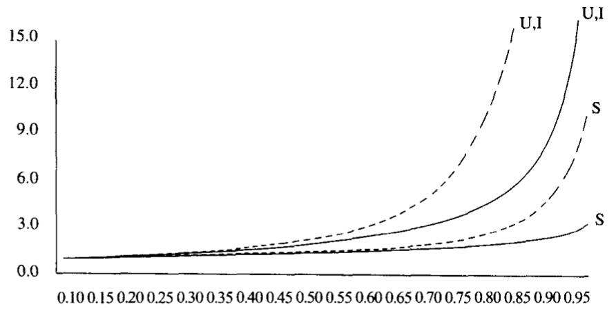
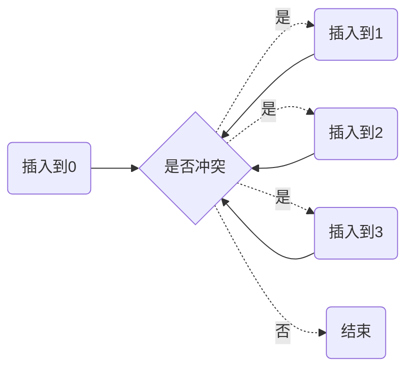
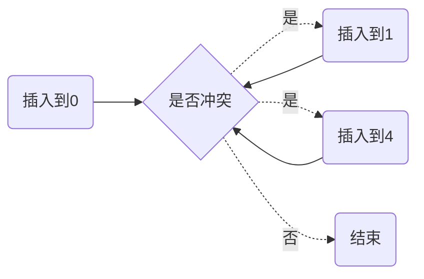

# HASH算法

<!-- vim-markdown-toc GFM -->

* [HASH函数](#hash函数)
    - [示例](#示例)
* [HASH碰撞](#hash碰撞)
    - [线性探测](#线性探测)
    - [二次探测](#二次探测)
    - [分离链接法](#分离链接法)

<!-- vim-markdown-toc -->


## HASH函数

`散列函数（hash function）` 将键映射到散列表中的适当单元（理想情况下它应该运算简单并且应该保证任何两个不同键映射到不同的单元）。

### 示例

```c++
// 一个好的散列函数
int hash(const string& key, int tableSize)
{
    int hashVal = 0;

    for (int i = 0; i < key.length(); i++)
        hashVal = 37 * hashVal + key[i];

    hashVal %= tableSize;
    if (hashVal < 0)
        hashVal += tableSize;

    return hashVal;
}
```


## HASH碰撞

### 线性探测

`线性探测（Linear probing）`：插入时，如果检测到有冲突，即向左/右移动一位再次检测冲突。

通过使用积分计算插入时间平均值的方法来估计平均值，得到：$I(\lambda) = \frac{1}{\lambda} \int^{\lambda}_{0} \frac{1}{1-x} dx = \frac{1}{\lambda} ln \frac{1}{1-\lambda}$



*对线性探测（虚线）和随机方法的装填因子画出的探测次数（S为成功查找，U为不成功查找，而I为插入）*

例:

| 0    | 1    | 2    | 3    | 4    | 5    | 6    | 7    | 8    | 9    |
| ---- | ---- | ---- | ---- | ---- | ---- | ---- | ---- | ---- | ---- |
| 49   | 18   | 29   |      |      |      |      |      | 38   | 79   |



### 二次探测

`二次探测/平方探测`：插入时发生碰撞向左/右移动$H+1^2$,$H+2^2$,$H+3^2$..个位置。

**定理5-1** 如果使用平方探测，且表的大小是素数，那么当表至少有一半是空的时候，总能够插入一个新的元素。

**证明** 令表的大小`TableSize`是一个大于3的（奇）素数。我们证明，前$\lceil TableSize/2 \rceil$个备选位置（包括初始位置$h_0(x)$）是互异的。其中的两个位置是$h(x) + i^2 (mod TableSize)$和$h(x) + j^2 (mod\ TableSize)$，其中$0 \leqslant i, j \leqslant \lfloor TableSize/2 \rfloor$。为推出矛盾，假设这两个位置相同，但$i \neq j$。有

$h(x) + i^2 = h(x) + j^2\ (mod\ TableSize)$

$i^2 = j^2\ (mod\ TableSize)$

$i^2 - j^2 = 0\ (mod\ TableSize)$

$(i-j)(i+j)=0 (mod TableSize)$

例：

| 0    | 1    | 2    | 3    | 4    | 5    | 6    | 7    | 8    | 9    |
| ---- | ---- | ---- | ---- | ---- | ---- | ---- | ---- | ---- | ---- |
| 49   | 18   | 29   |      |      |      |      |      | 38   | 79   |



### 分离链接法

`分离链接法（separate chaining）` 将散列到同一个值的所有元素保留到一个链表中。

插入时发生碰撞，把发生碰撞的值存到链表中

例：

| 0    | 1    | 2    | 3    | 4    | 5    | 6    | 7    | 8    | 9    |
| ---- | ---- | ---- | ---- | ---- | ---- | ---- | ---- | ---- | ---- |
| 链表 | 链表 | 链表 |      |      |      |      |      | 链表 | 链表 |
| 49   | 18   | 29   |      |      |      |      |      | 38   | 79   |
|      |      |      |      |      |      |      |      |      |      |

插入 32到1，与18发生冲突

| 0    | 1    | 2    | 3    | 4    | 5    | 6    | 7    | 8    | 9    |
| ---- | ---- | ---- | ---- | ---- | ---- | ---- | ---- | ---- | ---- |
| 链表 | 链表 | 链表 |      |      |      |      |      | 链表 | 链表 |
| 49   | 18   | 29   |      |      |      |      |      | 38   | 79   |
|      | 32   |      |      |      |      |      |      |      |      |
