[中文版](heap_zh.md) | English

# Heap

[TOC]


## Binary Heap

`Binary heap`

### Structural Properties

It is easy to prove that a complete binary tree of height $h$ has $2^h$ to $2^{h+1} - 1$ nodes; this means the height of a complete binary tree is $\lfloor logN \rfloor$, which is obviously $O(logN)$. 

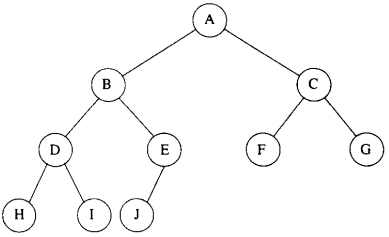

*A complete binary tree*

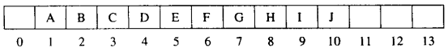

*Array implementation of a complete binary tree*

**Theorem 6.1** The sum of the heights of the nodes in a perfect binary tree with $2^{h+1} - 1$ nodes and height $h$ is $2^{h+1} - 1 - (h + 1)$.

**Proof** It is easy to see that the tree consists of 1 node at height $h$, 2 nodes at height $h-1$, $2^2$ nodes at height $h-2$, and in general, $2^i$ nodes at height $h-i$. The sum of the heights of all nodes is:

$S = \sum_{i = 0}^{h} 2^i(h - i)$

$= h + 2(h - 1) + 4(h - 2) + 8(h - 3) + 16(h - 4) + ... + 2^{h - 1}(1) \qquad (6.1)$

Multiply both sides by $2$ to get:

$2S = 2h + 4(h - 1) + 8(h - 2) + 16(h - 3) + ... + 2^h(1) \qquad (6.2)$

Subtracting these two equations gives equation $(6.3)$. We find that almost all non-constant terms cancel out, e.g., $2h - 2(h - 1) = 2$, $4(h - 1) - 4(h - 2) = 4$, etc. The last term $2^h$ in equation $(6.2)$ does not appear in equation $(6.1)$; therefore, it appears in equation $(6.3)$. The first term $h$ in equation $(6.1)$ does not appear in equation $(6.2)$; therefore, $-h$ appears in equation $(6.3)$. We get:

$S = -h + 2 + 4 + 8 + ... + 2^{h - 1} + 2^h = (2^{h + 1} - 1) - (h + 1) \qquad (6.3)$

The theorem is proved.

### Heap Order Property

According to the heap order property, the minimum element can always be found at the root. Therefore, we can get the additional operation `findMin` in constant time.

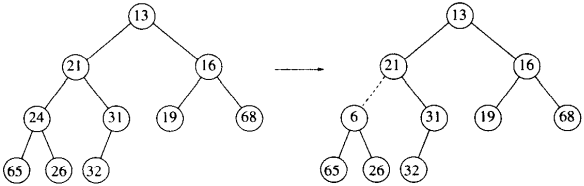

*Two complete trees (only the left one is a heap)*

### Basic Heap Operations

#### insert

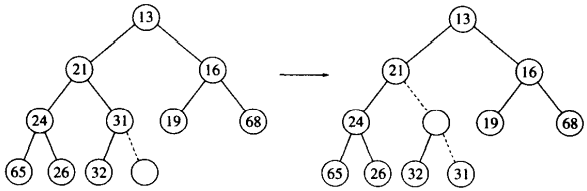

*Trying to insert 14: create a hole, then percolate the hole up*

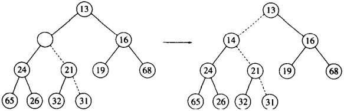

*The last two steps of inserting 14 into the previous heap*

#### deleteMin

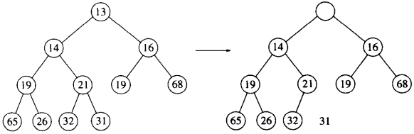

*Create a hole at the root*

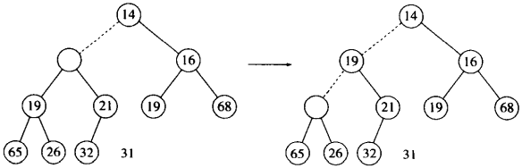

*The next two steps in deleteMin*

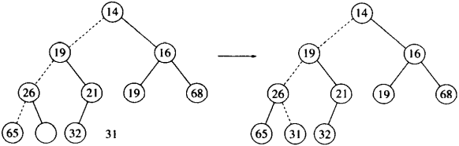

*The last two steps in deleteMin*

#### decreaseKey

$decreaseKey(p, \Delta)$ operation decreases the value of the element at position $p$ by a positive amount $\Delta$. Since this may violate the heap order property, the heap must be adjusted by percolating up. This operation is useful for system administrators: the system management program can make their programs run with the highest priority.

#### increaseKey

$increaseKey(p, \Delta)$ operation increases the value of the element at position $p$ by a positive amount $\Delta$. This can be done by percolating down. Many schedulers automatically lower the priority of processes that consume too much CPU time.

#### remove

$remove(p)$ operation deletes the node at position $p$ in the heap. This is done by first performing $decreaseKey(p, \infty)$ and then `deleteMin()`. When a process is aborted by the user (rather than terminating normally), it must be removed from the priority queue.

#### buildHeap

Constructed from the original collection of items, this constructor takes $N$ items as input and puts them into a heap.

### Implementation

```c++
#include <vector>
#include <exception>

template <typename Comparable>
class BinaryHeap
{
public:
	explicit BinaryHeap(int capacity = 100);
	explicit BinaryHeap(const std::vector<Comparable>& items)
		: array(items.size() + 10), currentSize(items.size()) {
		for (int i = 0; i < items.size(); i++)
			array[i + 1] = items[i];
		buildHeap();
	};

	bool isEmpty() const;
	const Comparable& findMin() const;

	void insert(const Comparable& x) {
		if (currentSize == array.size() - 1)
			array.resize(array.size() * 2);
		int hole = ++currentSize;
		for (; hole > 1 && x < array[hole / 2]; hole /= 2)
			array[hole] = array[hole / 2];
		array[hole] = x;
	}
	void deleteMin() {
		if (isEmpty())
			throw UnderflowException();
		array[1] = array[currentSize--];
		percolateDown(1);
	}
	void deleteMin(Comparable& minItem) {
		if (isEmpty())
			throw UnderflowException();
		minItem = array[1];
		array[1] = array[currentSize--];
		percolateDown(1);
	}
	void makeEmpty();

private:
	int                     currentSize;
	std::vector<Comparable> array;

	void buildHeap() {
		for (int i = currentSize / 2; i > 0; i--)
			percolateDown(i);
	}
	void percolateDown(int hole) {
		int child;
		Comparable tmp = array[hole];
		for (; hole * 2 <= currentSize; hole = child) {
			child = hole * 2;
			if (child != currentSize && array[child + 1] < array[child])
				child++;
			if (array[child] < tmp)
				array[hole] = array[child];
			else
				break;
		}
		array[hole] = tmp;
	}
};
```


## D-ary Heap

d-ary heap is a simple generalization of the binary heap. It is very similar to the binary heap, but all nodes have d children (binary heap is a 2-heap).

### Example

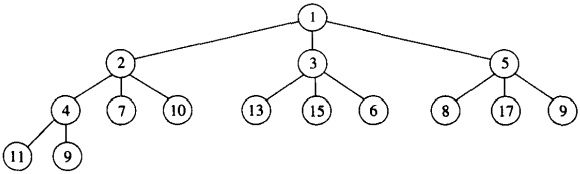

*A 3-heap (d == 3)*


## Leftist Heap

`Leftist heap` is a binary tree with both structural and heap order properties, like a binary heap; as with all heaps, the leftist heap has the same heap order property and is also a binary tree. The only difference between a leftist heap and a binary heap is: a leftist heap is not perfectly balanced, and in fact tends to be very unbalanced.

### Properties

Define the `null path length (npl)` $npl(X)$ of any node $X$ as the length of the shortest path from $X$ to a node with fewer than two children; thus, nodes with 0 or 1 child have $npl$ of 0, and $npl(NULL) = -1$.

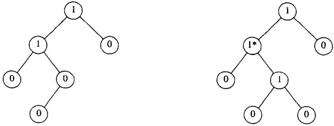

*Null path lengths of two trees; only the left tree is leftist*

Leftist heap property: For every node $X$ in the heap, the null path length of the left child is at least as large as that of the right child.

**Theorem 6.2** A leftist tree with $r$ nodes on the right path must have at least $2^r - 1$ nodes.

**Proof** By mathematical induction. If $r = 1$, there must be at least one tree node. Next, suppose the theorem holds for $1, 2, ..., r$ nodes. Consider a leftist tree with $r + 1$ nodes on the right path. At this point, the root has a right subtree with $r$ nodes on the right path, and a left subtree with at least $r$ nodes on the right path (otherwise it is not leftist). Applying the induction hypothesis to these two subtrees, each has at least $2^r - 1$ nodes, plus the root node, so the tree has at least $2^{r+1} - 1$ nodes, and the theorem is proved.

From the above theorem: a leftist tree with $N$ nodes has at most $\lfloor log(N + 1) \rfloor$ nodes on the right path.

### Operations

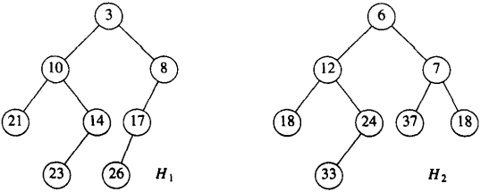

*Two leftist heaps $H_1$ and $H_2$*

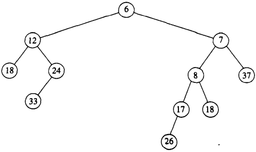

*Result of merging $H_2$ with the right subheap of $H_1$*

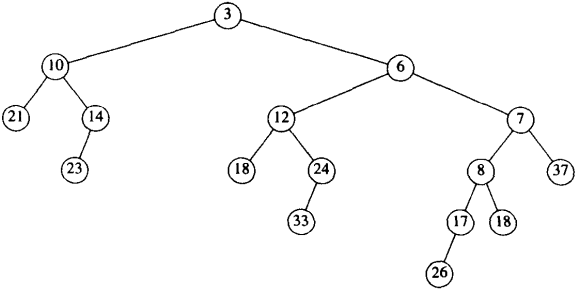

*Result of attaching the leftist heap from the previous figure as the right child of $H_1$*

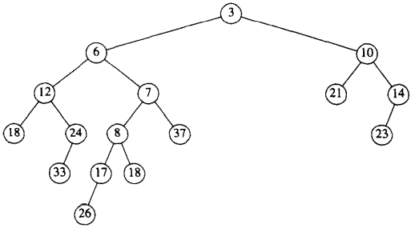

*Result of swapping the children of the root of $H_1$*

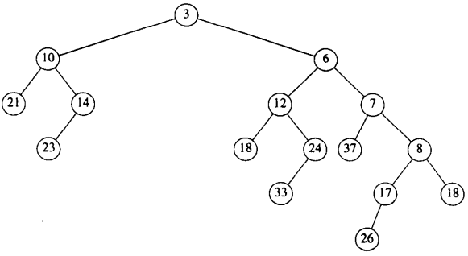

*Result of merging the right paths of $H_1$ and $H_2$*

### Implementation

```c++
template <typename Comparable>
class LeftistHeap
{
public:
	LeftistHeap();
	LeftistHeap(const LeftistHeap& rhs);
	~LeftistHeap();

	bool isEmpty() const;
	const Comparable& findMin() const;
	void insert(const Comparable& x) { root = merge(new LeftistNode(x), root); };
	void deleteMin() {
		if (isEmpty())
			throw UnderflowException();
		LeftistNode *oldRoot = root;
		root = merge(root->left, root->right);
		delete oldRoot;
	};
	void deleteMin(Comparable& minItem) {
		minItem = findMin(); deleteMin();
	};
	void makeEmpty();
	void merge(LeftistHeap& rhs) {
		if (this == &rhs)
			return;
		root = merge(root, rhs.root);
		rhs.root = NULL;
	};
	const LeftistHeap& operator=(const LeftistHeap& rhs);

private:
	struct LeftistNode
	{
		Comparable   element;
		LeftistNode *left;
		LeftistNode *right;
		int          npl;

		LeftistNode(const Comparable& theElement, LeftistNode *lt = NULL, 
					LeftistNode *rt = NULL, int np = 0)
			: element(theElement), left(lt), right(rt), npl(np) {}
	};

	LeftistNode *root;

	LeftistNode *merge(LeftistNode *h1, LeftistNode *h2) {
		if (h1 == NULL)
			return h2;
		if (h2 == NULL)
			return h1;
		if (h1->element < h2->element)
			return merge1(h1, h2);
		else
			return merge1(h2, h1);
	};
	LeftistNode *merge1(LeftistNode *h1, LeftistNode *h2) {
		if (h1->left == NULL)
			h1->left = h2;
		else {
			h1->right = merge(h1->right, h2);
			if (h1->left->npl < h1->right->npl)
				swapChildren(h1);
			h1->npl = h1->right->npl + 1;
		}
		return h1;
	};
	void swapChildren(LeftistNode *t);
	void reclaimMemory(LeftistNode *t);
	LeftistNode *clone(LeftistNode *t) const;
};
```


## Skew Heap

`Skew heap` is a binary tree with heap order, but there are no restrictions on the structure of the tree.

### Operations

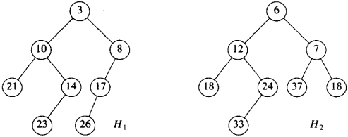

*Two skew heaps $H_1$ and $H_2$*

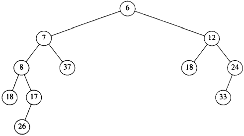

*Result of merging $H_2$ with the right subheap of $H_1$*

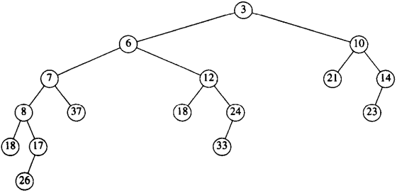

*Result of merging skew heaps $H_1$ and $H_2$*


## Binomial Queue

### Structure

`Binomial queue` is not a heap-ordered tree, but a collection of heap-ordered trees, called a **forest**.

Binomial tree $B_k$ consists of a root with children $B_0, B_1, ..., B_{k - 1}$. A binomial tree of height $k$ has exactly $2^k$ nodes, and the number of nodes at depth $d$ is the binomial coefficient ${k \choose d}$. If we impose the heap order on the binomial tree and allow at most one binomial tree of any height, we can uniquely represent any size priority queue with a collection of binomial trees.

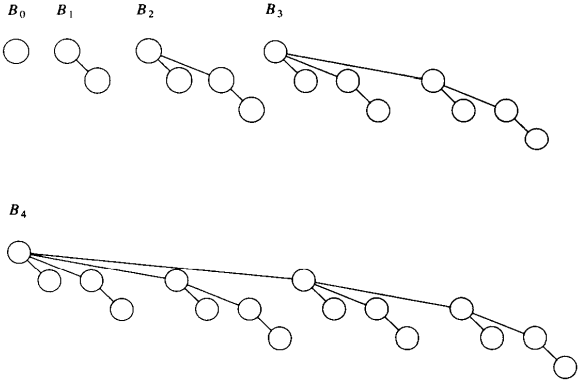

*Binomial trees $B_0, B_1, B_2, B_3$ and $B_4$*

### Operations

The minimum element can be found by searching all tree roots. Since there are at most $logN$ different trees, the minimum element can be found in $O(logN)$ time.

### Merge

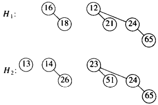

*Two binomial queues $H_1$ and $H_2$*

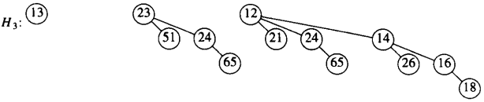

*Binomial queue $H_3$: result of merging $H_1$ and $H_2$*

### Insert

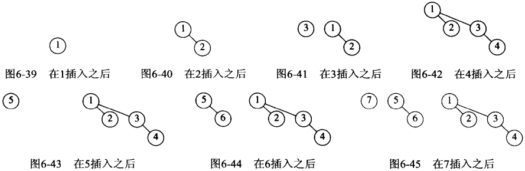

*Insert 1~7 in order to form a binomial queue*

### Remove

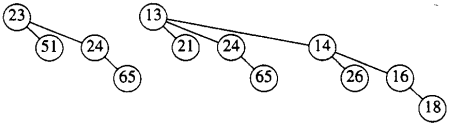

*Result of deleteMin applied to $H_3$*

### Implementation

```c++
template <typename Comparable>
class BinomialQueue
{
public:
	BinomialQueue();
	BinomialQueue(const Comparable& item);
	BinomialQueue(const BinomialQueue& rhs);
	~BinomialQueue();

	bool isEmpty() const;
	const Comparable& findMin() const;
	void insert(const Comparable& x);
	void deleteMin();
	void deleteMin(Comparable& minItem) {
		if (isEmpty())
			throw UnderflowException();
		int minIndex = findMinIndex();
		minItem = theTrees[minIndex]->element;
        
		BinomialNode* oldRoot = theTrees[minIndex];
		BinomialNode* deletedTree = oldRoot->leftChild;
		delete oldRoot;

		// Construct H''
		BinomialQueue deletedQueue;
		deletedQueue.theTrees.resize(minIndex + 1);
		deletedQueue.currentSize = (1 << minIndex) - 1;
		for (int j = minIndex - 1; j >= 0; j--) {
			deletedQueue.theTrees[j] = deletedTree;
			deletedTree = deletedTree->nextsibling;
			deletedQueue.theTrees[j]->nextSibling = NULL;
		}

		// Construct H'
		theTrees[minIndex] = NULL;
		currentSize -= deletedQueue.currentSize + 1;

		merge(deletedQueue);
	};
	void makeEmpty();
	void merge(BinomialQueue& rhs) {
		if (this == &rhs)
			return;
		currentSize += rhs.currentSize;
		if (currentSize > capacity()) {
			int oldNumTrees = theTrees.size();
			int newNumTrees = max(theTrees.size(), rhs.theTrees.size()) + 1;
			theTrees.resize(newNumTrees);
			for (int i = oldNumTrees; i < newNumTrees; i++)
				theTrees[i] = NULL;
		}
		BinomialNode* carry = NULL:
		for (int i = 0, j = 1; j < = currentSize; i++, j *= 2) {
			BinomialNode* t1 = theTrees[i];
			BinomialNode* t2 = i < rhs.theTrees.size() ? rhs.theTrees[i] : NULL;
			int whichCase = t1 == NULL ? 0 : 1;
			whichCase += t2 == NULL ? 0 : 2;
			whichCase += carry = NULL ? 0 : 4;
			switch (whichCase)
			{
				case 0:
				case 1:
					break;
				case 2:
					theTrees[i] = t2;
					rhs.theTrees[i] = NULL;
					break;
				case 4:
					theTrees[i] = carry;
					carry = NULL;
					break;
				case 3:
					carry = combineTrees(t1, t2);
					theTrees[i] = rhs.theTrees[i] = NULL;
					break;
				case 5:
					carry = combineTrees(t1, carry);
					theTrees[i] = NULL;
					break;
				case 6:
					carry = combineTrees(t2, carry);
					rhs.theTrees[i] = NULL;
					break;
				case 7:
					theTrees[i] = carry;
					carry = combineTrees(t1, t2);
					rhs.theTrees[i] = NULL;
					break;
			}
		}
		for (int k = 0; k < rhs.theTrees.size(); k++)
			rhs.theTrees[k] = NULL;
		rhs.currentSize = 0;
	};
	const BinomialQueue& operator=(const BinomialQueue& rhs);

private:
	struct BinomialNode
	{
		Comparable   element;
		BinomialNode *leftChild;
		BinomialNode *nextSibling;
		BinomialNode(const Comparable& theElement, BinomialNode *lt, BinomialNode *rt)
			: element(theElement), leftChild(lt), nextSibling(rt) {}
	};
	enum { DEFAULT_TREES = 1 };

	int currentSize;
	std::vector<BinomialNode*> theTrees;

	int findMinIndex() const {
		int i;
		int minIndex;
		for (i = 0; theTrees[i] == NULL; i++) {}
		for (minIndex = i; i < theTrees.size(); i++)
			if (theTrees[i] != NULL && 
				theTrees[i]->element < theTrees[minIndex]->element)
				minIndex = i;
		return minIndex;
	};
	int capacity() const;
	BinomialNode* combineTrees(BinomialNode *t1, BinomialNode *t2) {
		if (t2->element < t1->element)
			return combineTrees(t2, t1);
		t2->nextSibling = t1->leftChild;
		t1->leftChild = t2;
		return t1;
	};
	void makeEmpty(BinomialNode * & t);
	BinomialNode* clone(BinomialNode* t) const;
};
```


## References

- [Wikipedia - Heap](https://en.wikipedia.org/wiki/Heap_(data_structure))
- [Baidu Baike - Heap](https://baike.baidu.com/item/%E5%A0%86/20606834?fr=aladdin)
- [Heap in Data Structures](https://blog.csdn.net/qq_34270874/article/details/113091364)
- [Mark Allen Weiss. Data Structures and Algorithm Analysis in C++. 3ED]
