[中文版](heap_zh.md) | English

# Heap

[TOC]


Heap data structure is a complete binary tree that satisfies **the heap property**, where any given node is

- always greater than its child node/s and the key of the root node is the largest among all other nodes. This property is also called **max heap property**.
- always smaller than the child node/s and the key of the root node is the smallest among all other nodes. This property is also called **min heap property**.

## Properties

- In a heap, the minimum or maximum element is always at the root, allowing constant-time access.
- Since a heap is a complete binary tree, all levels are fully filled except possibly the last, which is filled from left to right.
- When inserting an element, it is added at the last available position, and then the nodes are rearranged to maintain the heap property.
- When removing an element, the root is swapped with the last node to remove either the maximum or minimum value. The remaining nodes are then rearranged to ensure the heap property is preserved.


## Types

- Binary Heap

  A binary heap is the fundamental type of heap that forms the basis for many other heap structures. It is a complete binary tree with a unique property – the value of each node is either greater than or equal to (max-heap) or less than or equal to (min-heap) the values of its children.

- Min Heap

  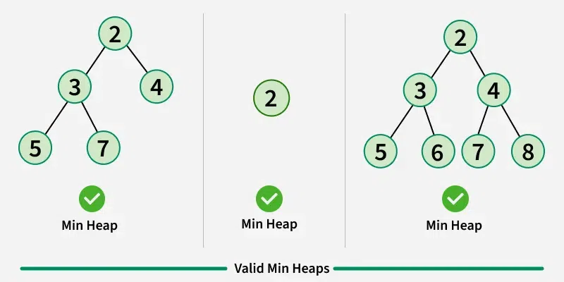

  Min heap is a specific instance of a binary heap where the value of each node is less than or equal to the values of its children.

- Max Heap

  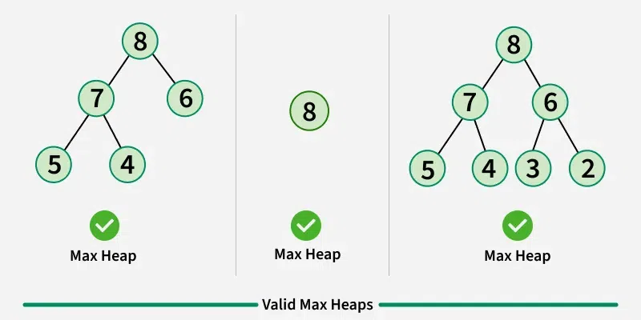

  Max heap, on the other hand, is a binary heap where the value of each node is greater than or equal to the values of its children. Max heaps are valuable when the objective is to efficiently find and extract the maximum element from a collection.

- D-ary Heap

  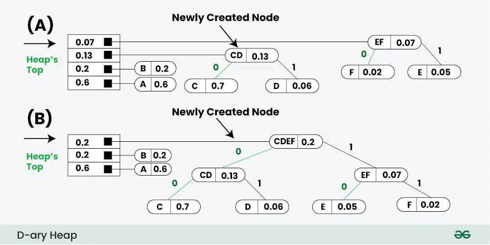

  d-ary heap is a simple generalization of the binary heap. It is very similar to the binary heap, but all nodes have d children (binary heap is a 2-heap).

- Fibonacci Heap

  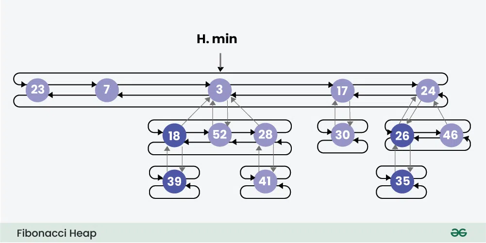

  A Fibonacci heap is a more advanced data structure that boasts better amortized time complexity for certain operations compared to traditional binary and binomial heaps. It comprises a collection of trees with a specific structure and excels in decrease key and merge operations.

- Pairing Heap

  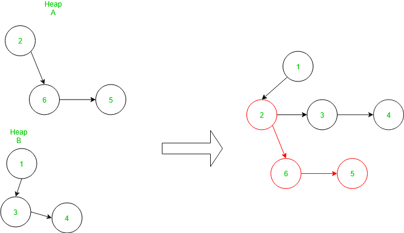

  Pairing heap is a simpler alternative to Fibonacci heap while still maintaining efficient time bounds for key operations. Its structure is based on a pairing mechanism, making it a suitable choice for various applications.

- B-Heap

  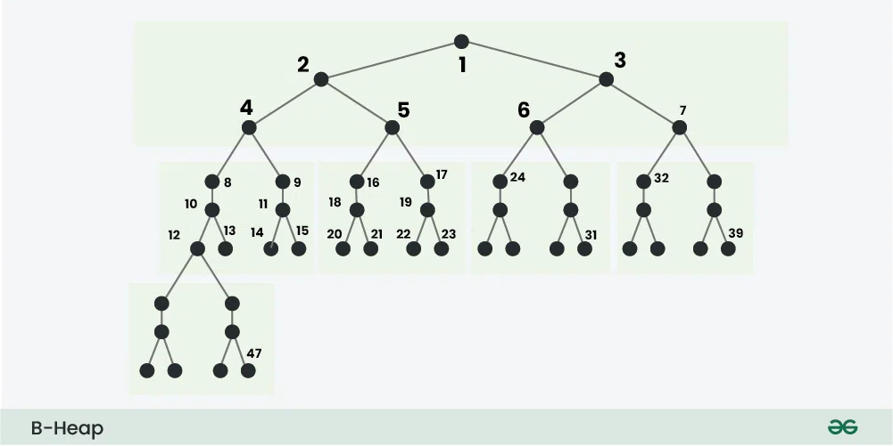

  B-heap is a generalization of the binary heap, allowing for trees with more than two children at each node. This flexibility in the number of children can be advantageous in certain scenarios.

- Leftist Heap

  `Leftist heap` is a binary tree with both structural and heap order properties, like a binary heap; as with all heaps, the leftist heap has the same heap order property and is also a binary tree. The only difference between a leftist heap and a binary heap is: a leftist heap is not perfectly balanced, and in fact tends to be very unbalanced.
  
- Skew Heap

  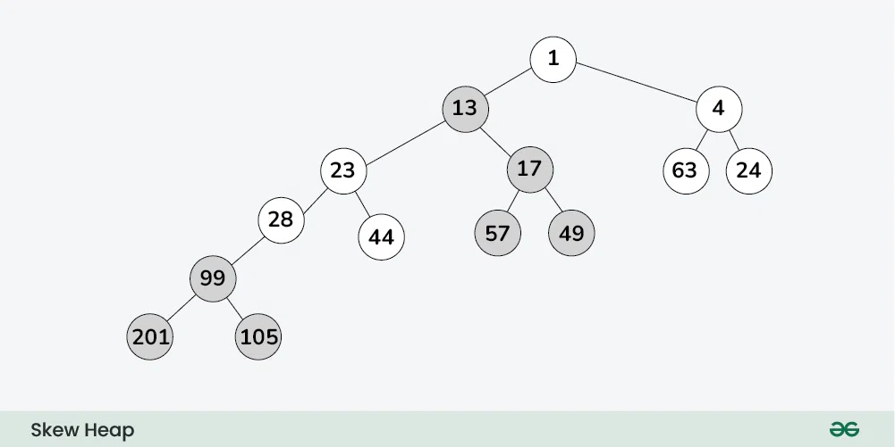
  
  `Skew heap` is a binary tree with heap order, but there are no restrictions on the structure of the tree.

---


## Operations

### Heapify

Heapify is the process of rearranging elements to maintain the heap property. It is performed in two main scenarios:

- **When the root is removed:** The root is replaced with the last node, and then heapify is called to restore the heap property.
- **When building a heap:** Heapify is applied from the last internal node up to the root to ensure the entire tree satisfies the heap property.

Algorithm:

1. Initialize the largest node as the current node $i$.
2. Calculate the left child index as $2 * i + 1$.
3. Calculate the right child index as $2 * i + 2$.
4. Check if the left child exists (is within the array bounds) and is greater than the current largest node.
   - If true, update the largest node to the left child.
5. Check if the right child exists (is within the array bounds) and is greater than the current largest node.
   - If true, update the largest node to the right child.
6. If the largest node is not the current node i, swap the current node with the largest node using the std::swap function.
7. Recursively apply the heapify operation to the subtree rooted at the largest node.

Implement:

```c++
void heapify(vector<int> &hT, int i) 
{
    int size = hT.size();
    int largest = i;
    int l = 2 * i + 1;
    int r = 2 * i + 2;
    if (l < size && hT[l] > hT[largest])
        largest = l;
    if (r < size && hT[r] > hT[largest])
        largest = r;

    if (largest != i) 
    {
        swap(&hT[i], &hT[largest]);
        heapify(hT, largest);
    }
}
```

Complexity:

| Scenario     | Time Complexity | Space Complexity |
| :----------- | :-------------- | :--------------- |
| Best Case    | $O(1)$          | $O(1)$           |
| Average Case | $O(\log n)$     | $O(\log n)$      |
| Worst Case   | $O(\log n)$     | $O(\log n)$      |

### Insert

When a new element is inserted into a heap, it may violate the heap property. To restore the heap structure, a heapify operation is performed, which ensures the heap properties are maintained.

Algorithm:

1. Append the new key to the end of the array.
2. Initialize the index i as the index of the newly inserted key (last element of the array).
3. While the key at index i is greater than its parent and i is not the root:
   - Swap the key with its parent.
   - Update i to the parent index.
4. Continue this process until the heap property is restored.

Implement:

```c++
void insert(vector<int> &hT, int newNum) 
{
    hT.push_back(newNum);
    int current = hT.size() - 1;

    // Bubble up
    while (current > 0) 
    {
        int parent = (current - 1) / 2;
        if (hT[current] > hT[parent]) 
        {
            swap(&hT[current], &hT[parent]);
            current = parent;
        } 
        else 
        {
            break;
        }
    }
}
```

Complexity:

| Scenario     | Time Complexity | Space Complexity |
| :----------- | :-------------- | :--------------- |
| Best Case    | $O(1)$          | $O(1)$           |
| Average Case | $O(\log n)$     | $O(1)$           |
| Worst Case   | $O(\log n)$     | $O(1)$           |

### Delete Key

Deleting an element from a heap means removing the root node, replacing it with the last node in the heap, and then performing heapify to restore the heap’s order.

Algorithm:

1. Check if the index i is valid (within the array bounds). If not, throw an out_of_range exception.
2. Replace the key at index i with the last element in the array.
3. Remove the last element from the array.
4. Apply the heapify operation on the subtree rooted at index i to restore the heap property.

Implement:

```c++
// Function to delete a key at a given index
void delete_key(vector<int> &hT, int i)
{
    if (i >= hT.size()) {
        throw out_of_range("Invalid index");
    }

    hT[i] = hT.back();
    hT.pop_back();
    heapify(hT, i);
}
```

Complexity:

| Scenario     | Time Complexity | Space Complexity |
| :----------- | :-------------- | :--------------- |
| Best Case    | $O(1)$          | $O(1)$           |
| Average Case | $O(\log n)$     | $O(\log n)$      |
| Worst Case   | $O(\log n)$     | $O(\log n)$      |

### Increase Key

Algorithm:

1. Check if the index i is valid and the new value is greater than the current value. If not, throw an invalid_argument exception.
2. Update the value at index i to the new value.
3. While the key at index i is greater than its parent and i is not the root:
   - Swap the key with its parent.
   - Update i to the parent index.
4. Continue this process until the heap property is restored.

Implement:

```c++
void increase_key(vector<int> &hT, int i, int newValue)
{
    if (i >= hT.size() || hT[i] >= newValue)
        throw invalid_argument(
            "Invalid index or new value is not greater");

    hT[i] = newValue;
    while (i != 0 && hT[(i - 1) / 2] < hT[i]) 
    {
        swap(&hT[i], &hT[(i - 1) / 2]);
        i = (i - 1) / 2;
    }
}
```

Complexity:

| Scenario     | Time Complexity | Space Complexity |
| :----------- | :-------------- | :--------------- |
| Best Case    | $O(1)$          | $O(1)$           |
| Average Case | $O(\log n)$     | $O(1)$           |
| Worst Case   | $O(\log n)$     | $O(1)$           |

### Extract-Max/Min

Extract-Max returns the node with maximum value after removing it from a Max Heap whereas Extract-Min returns the node with minimum after removing it from Min Heap.

Algorithm:

1. Check if the heap is empty. If true, throw an underflow_error.
2. If the heap has only one element, remove and return that element.
3. Store the maximum value (root of the heap) in a temporary variable.
4. Replace the root of the heap with the last element in the array.
5. Remove the last element from the array.
6. Apply the heapify operation on the root to restore the heap property.
7. Return the stored maximum value.

Implement:

```c++
// Function to extract the maximum element from the heap
int extract_max(vector<int> &hT)
{
    if (hT.size() <= 0)
        throw underflow_error("Heap underflow");

    if (hT.size() == 1) 
    {
        int root = hT[0];
        hT.pop_back();
        return root;
    }

    int root = hT[0];
    hT[0] = hT.back();
    hT.pop_back();
    heapify(hT, 0);

    return root;
}
```

Complexity:

| Scenario     | Time Complexity | Space Complexity |
| :----------- | :-------------- | :--------------- |
| Best Case    | $O(1)$          | $O(1)$           |
| Average Case | $O(\log n)$     | $O(\log n)$      |
| Worst Case   | $O(\log n)$     | $O(\log n)$      |

### Get Max

Algorithm:

1. Check if the heap is empty. If true, throw an underflow_error.
2. Return the root of the heap, which is the maximum value.

Implement:

```c++
int getMax(const vector<int> &hT)
{
    if (hT.size() <= 0)
        throw underflow_error("Heap is empty");
    
    return hT[0];
}
```

Complexity:

| Scenario     | Time Complexity | Space Complexity |
| :----------- | :-------------- | :--------------- |
| Best Case    | $O(1)$          | $O(1)$           |
| Average Case | $O(1)$          | $O(1)$           |
| Worst Case   | $O(1)$          | $O(1)$           |

---


## Binary Heap

A binary heap is the fundamental type of heap that forms the basis for many other heap structures. It is a complete binary tree with a unique property – the value of each node is either greater than or equal to (max-heap) or less than or equal to (min-heap) the values of its children.

### Binary Heap Properties

It is easy to prove that a complete binary tree of height $h$ has $2^h$ to $2^{h+1} - 1$ nodes; this means the height of a complete binary tree is $\lfloor \log N \rfloor$, which is obviously $O(\log N)$. 

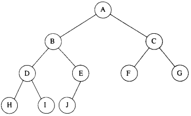

*A complete binary tree*

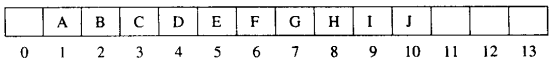

*Array implementation of a complete binary tree*

**Theorem** The sum of the heights of the nodes in a perfect binary tree with $2^{h+1} - 1$ nodes and height $h$ is $2^{h+1} - 1 - (h + 1)$.

**Proof** It is easy to see that the tree consists of 1 node at height $h$, 2 nodes at height $h-1$, $2^2$ nodes at height $h-2$, and in general, $2^i$ nodes at height $h-i$. The sum of the heights of all nodes is:

$S = \sum_{i = 0}^{h} 2^i(h - i)$

$= h + 2(h - 1) + 4(h - 2) + 8(h - 3) + 16(h - 4) + ... + 2^{h - 1}(1) \qquad (6.1)$

Multiply both sides by $2$ to get:

$2S = 2h + 4(h - 1) + 8(h - 2) + 16(h - 3) + ... + 2^h(1) \qquad (6.2)$

Subtracting these two equations gives equation $(6.3)$. We find that almost all non-constant terms cancel out, e.g., $2h - 2(h - 1) = 2$, $4(h - 1) - 4(h - 2) = 4$, etc. The last term $2^h$ in equation $(6.2)$ does not appear in equation $(6.1)$; therefore, it appears in equation $(6.3)$. The first term $h$ in equation $(6.1)$ does not appear in equation $(6.2)$; therefore, $-h$ appears in equation $(6.3)$. We get:

$S = -h + 2 + 4 + 8 + ... + 2^{h - 1} + 2^h = (2^{h + 1} - 1) - (h + 1) \qquad (6.3)$

The theorem is proved.

### Binary Heap Representation

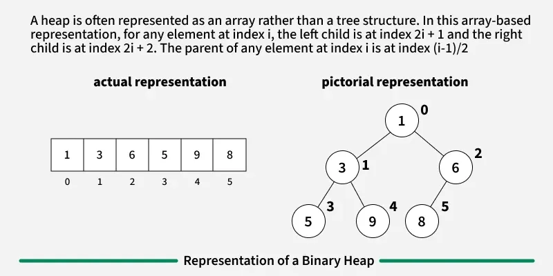

A Binary Heap is a Complete Binary Tree. A binary heap is typically represented as an array.

- The root element will be at arr[0].
- The below table shows indices of other nodes for the ith node, i.e., arr[i]:

| arr[(i-1)/2] | Returns the parent node      |
| ------------ | ---------------------------- |
| arr[(2*i)+1] | Returns the left child node  |
| arr[(2*i)+2] | Returns the right child node |

### Binary Heap Order Property

According to the heap order property, the minimum element can always be found at the root. Therefore, we can get the additional operation `findMin` in constant time.

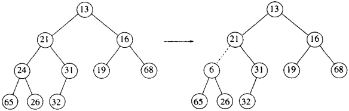

*Two complete trees (only the left one is a heap)*

### Binary Heap Operations

- Insert

  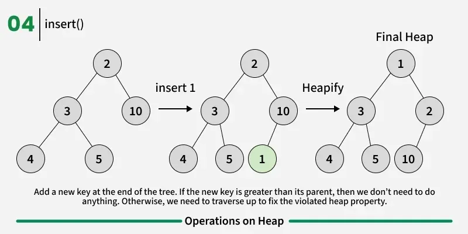

- Delete

  

- Get Min

  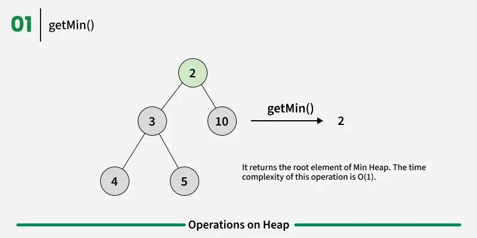

- Extract Min

  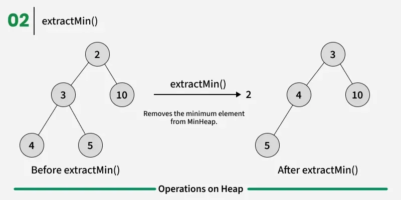

- Decrease Key

  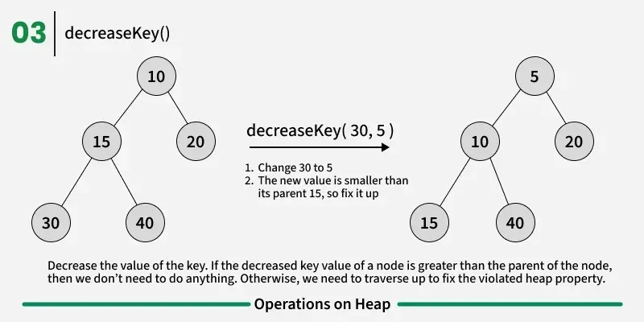

  $decreaseKey(p, \Delta)$ operation decreases the value of the element at position $p$ by a positive amount $\Delta$. Since this may violate the heap order property, the heap must be adjusted by percolating up. This operation is useful for system administrators: the system management program can make their programs run with the highest priority.

- Increase Key

  $increaseKey(p, \Delta)$ operation increases the value of the element at position $p$ by a positive amount $\Delta$. This can be done by percolating down. Many schedulers automatically lower the priority of processes that consume too much CPU time.

- Remove

  $remove(p)$ operation deletes the node at position $p$ in the heap. This is done by first performing $decreaseKey(p, \infty)$ and then `deleteMin()`. When a process is aborted by the user (rather than terminating normally), it must be removed from the priority queue.

- Build Heap

  Constructed from the original collection of items, this constructor takes $N$ items as input and puts them into a heap.

### Binary Heap Implementation

```c++
#include <vector>
#include <exception>

template <typename Comparable>
class BinaryHeap
{
public:
	explicit BinaryHeap(int capacity = 100);
	explicit BinaryHeap(const std::vector<Comparable>& items)
		: array(items.size() + 10), currentSize(items.size()) 
  {
		for (int i = 0; i < items.size(); i++)
			array[i + 1] = items[i];
      
		buildHeap();
	};

	bool isEmpty() const;
	const Comparable& findMin() const;

	void insert(const Comparable& x) 
  {
		if (currentSize == array.size() - 1)
			array.resize(array.size() * 2);
    
		int hole = ++currentSize;
		for (; hole > 1 && x < array[hole / 2]; hole /= 2)
			array[hole] = array[hole / 2];
    
		array[hole] = x;
	}
  
	void deleteMin() 
  {
		if (isEmpty())
			throw UnderflowException();
    
		array[1] = array[currentSize--];
		percolateDown(1);
	}
  
	void deleteMin(Comparable& minItem) 
  {
		if (isEmpty())
			throw UnderflowException();
    
		minItem = array[1];
		array[1] = array[currentSize--];
		percolateDown(1);
	}
	void makeEmpty();

private:
	int                     currentSize;
	std::vector<Comparable> array;

	void buildHeap() 
  {
		for (int i = currentSize / 2; i > 0; i--)
			percolateDown(i);
	}
  
	void percolateDown(int hole) 
  {
		int child;
		Comparable tmp = array[hole];
		for (; hole * 2 <= currentSize; hole = child) 
    {
			child = hole * 2;
			if (child != currentSize && array[child + 1] < array[child])
				child++;
      
			if (array[child] < tmp)
				array[hole] = array[child];
			else
				break;
		}
		array[hole] = tmp;
	}
};
```

---


## Leftist Heap

`Leftist heap` is a binary tree with both structural and heap order properties, like a binary heap; as with all heaps, the leftist heap has the same heap order property and is also a binary tree. The only difference between a leftist heap and a binary heap is: a leftist heap is not perfectly balanced, and in fact tends to be very unbalanced.

### Leftist Heap Properties

Define the `null path length (npl)` $npl(X)$ of any node $X$ as the length of the shortest path from $X$ to a node with fewer than two children; thus, nodes with 0 or 1 child have $npl$ of 0, and $npl(NULL) = -1$.

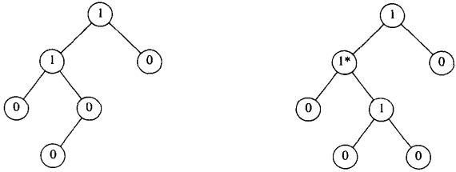

*Null path lengths of two trees; only the left tree is leftist*

Leftist heap property: For every node $X$ in the heap, the null path length of the left child is at least as large as that of the right child.

**Theorem** A leftist tree with $r$ nodes on the right path must have at least $2^r - 1$ nodes.

**Proof** By mathematical induction. If $r = 1$, there must be at least one tree node. Next, suppose the theorem holds for $1, 2, ..., r$ nodes. Consider a leftist tree with $r + 1$ nodes on the right path. At this point, the root has a right subtree with $r$ nodes on the right path, and a left subtree with at least $r$ nodes on the right path (otherwise it is not leftist). Applying the induction hypothesis to these two subtrees, each has at least $2^r - 1$ nodes, plus the root node, so the tree has at least $2^{r+1} - 1$ nodes, and the theorem is proved.

From the above theorem: a leftist tree with $N$ nodes has at most $\lfloor log(N + 1) \rfloor$ nodes on the right path.

### Leftist Heap Nodes

Implement:

```c++
class LeftistNode
{
public:
    int element;
    LeftistNode *left;
    LeftistNode *right;
    int dist;
    LeftistNode(int & element, LeftistNode *lt = NULL,
                LeftistNode *rt = NULL, int np = 0)
    {
        this->element = element;
        right = rt;
        left = lt,
        dist = np;
    }
};
```

### Leftist Heap Operations

- Merge

  Algorithm:

  1. Compare the roots of two heaps.
  2. Push the smaller key into an empty stack, and move to the right child of smaller key.
  3. Recursively compare two keys and go on pushing the smaller key onto the stack and move to its right child.
  4. Repeat until a null node is reached.
  5. Take the last node processed and make it the right child of the node at top of the stack, and convert it to leftist heap if the properties of leftist heap are violated.
  6. Recursively go on popping the elements from the stack and making them the right child of new stack top.

  Example:

  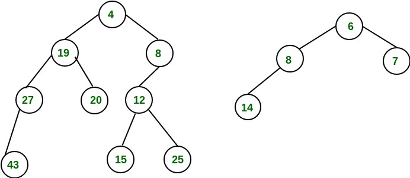

  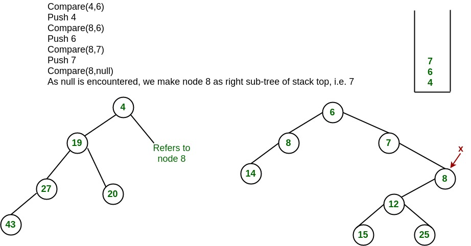

  Implement:

  ```c++
  /* Merge rhs into the priority queue.
  rhs becomes empty. rhs must be different
  from this.*/
  void LeftistHeap::Merge(LeftistHeap &rhs)
  {
      if (this == &rhs)
          return;
      root = Merge(root, rhs.root);
      rhs.root = NULL;
  }
  
  /* Internal method to merge two roots.
  Deals with deviant cases and calls recursive Merge1.*/
  LeftistNode *LeftistHeap::Merge(LeftistNode * h1,
                                  LeftistNode * h2)
  {
      if (h1 == NULL)
          return h2;
      if (h2 == NULL)
          return h1;
      if (h1->element < h2->element)
          return Merge1(h1, h2);
      else
          return Merge1(h2, h1);
  }
  
  /* Internal method to merge two roots.
  Assumes trees are not empty, and h1's root contains
  smallest item.*/
  LeftistNode *LeftistHeap::Merge1(LeftistNode * h1,
                                  LeftistNode * h2)
  {
      if (h1->left == NULL)
          h1->left = h2;
      else
      {
          h1->right = Merge(h1->right, h2);
          if (h1->left->dist < h1->right->dist)
              swapChildren(h1);
          h1->dist = h1->right->dist + 1;
      }
      return h1;
  }
  ```

- Delete Min

  Implement:

  ```c++
  /* Remove the smallest item from the priority queue.
  Throws Underflow if empty.*/
  void LeftistHeap::deleteMin()
  {
      LeftistNode *oldRoot = root;
      root = Merge(root->left, root->right);
      delete oldRoot;
  }
  
  /* Remove the smallest item from the priority queue.
  Pass back the smallest item, or throw Underflow if empty.*/
  void LeftistHeap::deleteMin(int &minItem)
  {
      if (isEmpty())
      {
          cout<<"Heap is Empty"<<endl;
          return;
      }
      minItem = findMin();
      deleteMin();
  }
  ```

- Insert

  Implement:

  ```c++
  /* Insert item x into the priority queue, maintaining
  heap order.*/
  void LeftistHeap::Insert(int &x)
  {
      root = Merge(new LeftistNode(x), root);
  }
  ```


---


## Binomial Heap

`Binomial queue` is not a heap-ordered tree, but a collection of heap-ordered trees, called a **forest**.

Binomial tree $B_k$ consists of a root with children $B_0, B_1, ..., B_{k - 1}$. A binomial tree of height $k$ has exactly $2^k$ nodes, and the number of nodes at depth $d$ is the binomial coefficient ${k \choose d}$. If we impose the heap order on the binomial tree and allow at most one binomial tree of any height, we can uniquely represent any size priority queue with a collection of binomial trees.

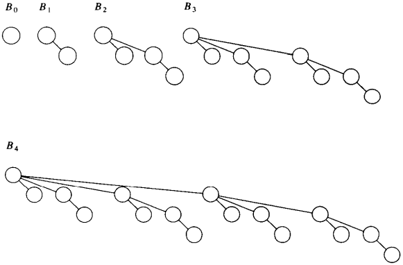

*Binomial trees $B_0, B_1, B_2, B_3$ and $B_4$*

### Binomial Heap Operations

- Merge

  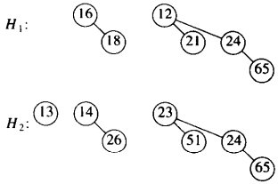

  *Two binomial queues $H_1$ and $H_2$*

  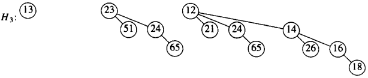

  *Binomial queue $H_3$: result of merging $H_1$ and $H_2$*

- Insert

	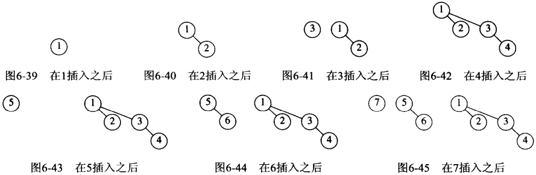
	
	*Insert 1~7 in order to form a binomial queue*
	
- Remove

	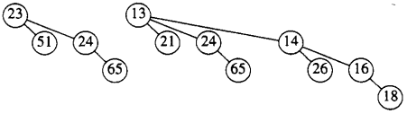

	*Result of deleteMin applied to $H_3$*

### Binomial Heap Implementation

```c++
template <typename Comparable>
class BinomialQueue
{
public:
	BinomialQueue();
	BinomialQueue(const Comparable& item);
	BinomialQueue(const BinomialQueue& rhs);
	~BinomialQueue();

	bool isEmpty() const;
	const Comparable& findMin() const;
	void insert(const Comparable& x);
	void deleteMin();
	void deleteMin(Comparable& minItem) {
		if (isEmpty())
			throw UnderflowException();
		int minIndex = findMinIndex();
		minItem = theTrees[minIndex]->element;
        
		BinomialNode* oldRoot = theTrees[minIndex];
		BinomialNode* deletedTree = oldRoot->leftChild;
		delete oldRoot;

		// Construct H''
		BinomialQueue deletedQueue;
		deletedQueue.theTrees.resize(minIndex + 1);
		deletedQueue.currentSize = (1 << minIndex) - 1;
		for (int j = minIndex - 1; j >= 0; j--) {
			deletedQueue.theTrees[j] = deletedTree;
			deletedTree = deletedTree->nextsibling;
			deletedQueue.theTrees[j]->nextSibling = NULL;
		}

		// Construct H'
		theTrees[minIndex] = NULL;
		currentSize -= deletedQueue.currentSize + 1;

		merge(deletedQueue);
	};
	void makeEmpty();
	void merge(BinomialQueue& rhs) {
		if (this == &rhs)
			return;
		currentSize += rhs.currentSize;
		if (currentSize > capacity()) {
			int oldNumTrees = theTrees.size();
			int newNumTrees = max(theTrees.size(), rhs.theTrees.size()) + 1;
			theTrees.resize(newNumTrees);
			for (int i = oldNumTrees; i < newNumTrees; i++)
				theTrees[i] = NULL;
		}
		BinomialNode* carry = NULL:
		for (int i = 0, j = 1; j < = currentSize; i++, j *= 2) {
			BinomialNode* t1 = theTrees[i];
			BinomialNode* t2 = i < rhs.theTrees.size() ? rhs.theTrees[i] : NULL;
			int whichCase = t1 == NULL ? 0 : 1;
			whichCase += t2 == NULL ? 0 : 2;
			whichCase += carry = NULL ? 0 : 4;
			switch (whichCase)
			{
				case 0:
				case 1:
					break;
				case 2:
					theTrees[i] = t2;
					rhs.theTrees[i] = NULL;
					break;
				case 4:
					theTrees[i] = carry;
					carry = NULL;
					break;
				case 3:
					carry = combineTrees(t1, t2);
					theTrees[i] = rhs.theTrees[i] = NULL;
					break;
				case 5:
					carry = combineTrees(t1, carry);
					theTrees[i] = NULL;
					break;
				case 6:
					carry = combineTrees(t2, carry);
					rhs.theTrees[i] = NULL;
					break;
				case 7:
					theTrees[i] = carry;
					carry = combineTrees(t1, t2);
					rhs.theTrees[i] = NULL;
					break;
			}
		}
		for (int k = 0; k < rhs.theTrees.size(); k++)
			rhs.theTrees[k] = NULL;
		rhs.currentSize = 0;
	};
	const BinomialQueue& operator=(const BinomialQueue& rhs);

private:
	struct BinomialNode
	{
		Comparable   element;
		BinomialNode *leftChild;
		BinomialNode *nextSibling;
		BinomialNode(const Comparable& theElement, BinomialNode *lt, BinomialNode *rt)
			: element(theElement), leftChild(lt), nextSibling(rt) {}
	};
	enum { DEFAULT_TREES = 1 };

	int currentSize;
	std::vector<BinomialNode*> theTrees;

	int findMinIndex() const {
		int i;
		int minIndex;
		for (i = 0; theTrees[i] == NULL; i++) {}
		for (minIndex = i; i < theTrees.size(); i++)
			if (theTrees[i] != NULL && 
				theTrees[i]->element < theTrees[minIndex]->element)
				minIndex = i;
		return minIndex;
	};
	int capacity() const;
	BinomialNode* combineTrees(BinomialNode *t1, BinomialNode *t2) {
		if (t2->element < t1->element)
			return combineTrees(t2, t1);
		t2->nextSibling = t1->leftChild;
		t1->leftChild = t2;
		return t1;
	};
	void makeEmpty(BinomialNode * & t);
	BinomialNode* clone(BinomialNode* t) const;
};
```

---


## Summary

### Advantage and Disadvantage

Advantages:

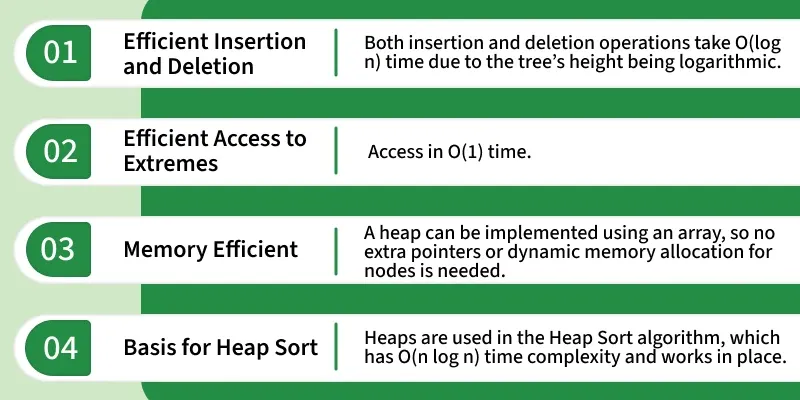

### Heap vs Stack

|                            Stack                             |                             Heap                             |
| :----------------------------------------------------------: | :----------------------------------------------------------: |
| It is a linear data structure, which implies that elements are kept in a linear order, one after the other. | Because it is a hierarchical data structure, the components are stored in the form of a tree. |
| Stack data structure works on the **LIFO** (Last in First Out) property. | Heap data structure follows the min-heap or max-heap property. |
|            The access time in the stack is faster            |            The access time in the heap is slower             |
| Stacks may be implemented in two ways: array or a linked list. | The implementation of a heap can be done using arrays or trees |

### Comparison Between Different Types Of Heap

|   types of Heap    |  Property  |        Structure         |  Merge Operation   | Decrease Key Operation | Amortized Time Complexity |
| :----------------: | :--------: | :----------------------: | :----------------: | :--------------------: | :-----------------------: |
|  **Binary Heap**   | Min or Max |   Complete Binary Tree   |    $O(\log n)$     |      $O(\log n)$       |    $O(1)$ (for insert)    |
|    **Min Heap**    |    Min     |   Complete Binary Tree   |    $O(\log n)$     |      $O(\log n)$       |    $O(1)$ (for insert)    |
|    **Max Heap**    |    Max     |   Complete Binary Tree   |    $O(\log n)$     |      $O(\log n)$       |    $O(1)$ (for insert)    |
| **Binomial Heap**  |    Min     | Forest of Binomial Trees | $O(1)$ (amortized) |      $O(\log n)$       |        $O(\log n)$        |
| **Fibonacci Heap** |    Min     |   Collection of Trees    | $O(1)$ (amortized) |   $O(1)$ (amortized)   |    $O(1)$ (amortized)     |
|   **D-ary Heap**   | Min or Max |   Complete D-ary Tree    |   $O(\log_d n)$    |     $O(\log_d n)$      |    $O(1)$ (for insert)    |
|  **Pairing Heap**  |    Min     |     Pairing of Trees     | $O(1)$ (amortized) |   $O(1)$ (amortized)   |    $O(1)$ (amortized)     |
|  **Leftist Heap**  |    Min     |       Leftist Tree       |    $O(\log n)$     |      $O(\log n)$       |    $O(1)$ (for insert)    |
|   **Skew Heap**    | Min or Max |       Skewed Tree        |    $O(\log n)$     |      $O(\log n)$       |    $O(1)$ (for insert)    |
|     **B-Heap**     | Min or Max |        B-ary Tree        |   $O(\log_b n)$    |     $O(\log_b n)$      |    $O(1)$ (for insert)    |

### Time Complexity Of Binary Heap and Binomial Heap and Fibonacci Heap

| Operations          | Binary Heap   | Binomial Heap | Fibonacci Heap |
| ------------------- | ------------- | ------------- | -------------- |
| Procedure           | Worst-case    | Worst-case    | Amortized      |
| Making Heap         | $Θ(1)$        | $Θ(1)$        | $Θ(1)$         |
| Inserting a node    | $Θ(\log (n))$ | $O(\log (n))$ | $Θ(1)$         |
| Finding Minimum key | $Θ(1)$        | $O(\log (n))$ | $O(1)$         |
| Extract-Minimum key | $Θ(\log (n))$ | $Θ(\log (n))$ | $O(\log (n))$  |
| Union or merging    | $Θ(n)$        | $O(\log (n))$ | $Θ(1)$         |
| Decreasing a Key    | $Θ(\log (n))$ | $Θ(\log (n))$ | $Θ(1)$         |
| Deleting a node     | $Θ(\log (n))$ | $Θ(\log (n))$ | $O(\log (n))$  |

---


## References

[1] Mark Allen Weiss. Data Structures and Algorithm Analysis in C++. 3ED

[2] [Heap Data Structure](https://www.geeksforgeeks.org/dsa/heap-data-structure/)

[3] [Introduction to Heap](https://www.geeksforgeeks.org/dsa/introduction-to-heap/)

[4] [Binary Heap](https://www.geeksforgeeks.org/dsa/binary-heap/)
