# 堆


<!-- vim-markdown-toc GFM -->

* [二叉堆](#二叉堆)
    - [结构性质](#结构性质)
    - [堆序性质](#堆序性质)
    - [基本堆操作](#基本堆操作)
        + [insert](#insert)
        + [deleteMin](#deletemin)
        + [decreaseKey](#decreasekey)
        + [increaseKey](#increasekey)
        + [remove](#remove)
        + [buildHeap](#buildheap)
    - [实现](#实现)
* [D堆](#d堆)
    - [示例](#示例)
* [左式堆](#左式堆)
    - [性质](#性质)
    - [操作](#操作)
    - [实现](#实现-1)
* [斜堆](#斜堆)
    - [操作](#操作-1)
* [二项队列](#二项队列)
    - [结构](#结构)
    - [操作](#操作-2)
    - [合并](#合并)
    - [插入](#插入)
    - [移除](#移除)
    - [实现](#实现-2)
* [参考](#参考)

<!-- vim-markdown-toc -->


## 二叉堆

`二叉堆(binary heap)`

### 结构性质

容易证明，一棵高为$h$的完全二叉树有$2^h$到$2^{h+1} - 1$个结点；这意味着，完全二叉树的高是$\lfloor logN \rfloor$，显然它是$O(logN)$。

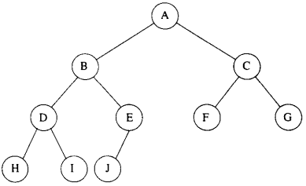

*一棵完全二叉树*

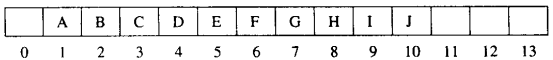

*完全二叉树的数组实现*

**定理6.1** 包含$2^{h+1} - 1$个结点且高为$h$的理想二叉树（perfect binary tree）的结点的高度和为$2^{h+1} - 1 - (h + 1)$。

**证明** 容易看出，该树由高度$h$上的1个结点，高度$h - 1$上的2个结点，高度$h - 2$上的$2^2$个结点以及一般在高度$h - i$上的$2^i$个结点组成。则所有结点的高度和为：

$S = \sum_{i = 0}^{h} 2^i(h - i)$

$= h + 2(h - 1) + 4(h - 2) + 8(h - 3) + 16(h - 4) + ... + 2^{h - 1}(1) \qquad (6.1)$

两边乘以$2$得到方程：

$2S = 2h + 4(h - 1) + 8(h - 2) + 16(h - 3) + ... + 2^h(1) \qquad (6.2)$

将这两个方程相减得到方程$(6.3)$。我们发现，非常数项几乎都消去了，例如我们有$2h - 2(h - 1) = 2$, $4(h - 1) - 4(h - 2) = 4$，等等。方程$(6.2)$的最后一项$2^h$在方程$(6.1)$中不出现；因此，它出现在方程$(6.3)$中。方程$(6.1)$中的第一项$h$在方程$(6.2)$中不出现；因此，$-h$出现在方程$(6.3)$中。我们得到：

$S = -h + 2 + 4 + 8 + ... + 2^{h - 1} + 2^h = (2^{h + 1} - 1) - (h + 1) \qquad (6.3)$

定理得证。

### 堆序性质

根据堆序性质，最小元总可以在根处找到。因此，我们以常数时间得到附加操作`findMin`。

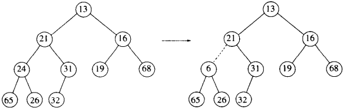

*两棵完全树（只有左边的树是堆）*

### 基本堆操作

#### insert

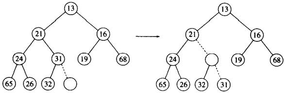

*尝试插入14：创建一个空穴，再将空穴上冒*

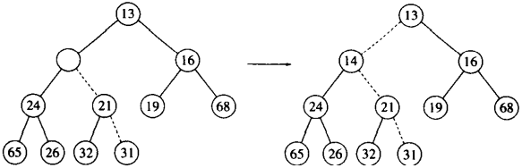

*将14插入到前面的堆中的最后两步*

#### deleteMin


*在根处建立空穴*

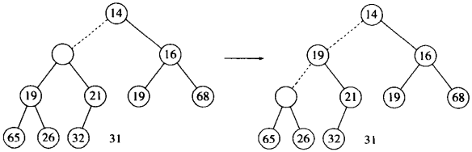

*在deleteMin中的接下来的两步*

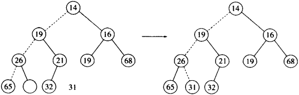

*在deleteMin中的最后两步*

#### decreaseKey

$decreaseKey(p, \Delta)$操作减小在位置$p$处的元素的值，减小的幅度为正的量$\Delta$。由于这可能破坏堆序性质，因此必须通过上滤操作对堆进行调整。该操作对系统管理员是有用的：系统管理程序能够使它们的程序以最高的优先级来运行。

#### increaseKey

$increaseKey(p, \Delta)$操作增加在位置$p$处的元素的值，增加的幅度为正的量$\Delta$。这可以用下滤来完成。许多调度程序自动地降低过多消耗CPU时间的进程的优先级。

#### remove

$remove(p)$操作删除堆中位置$p$上的结点。这通过首先执行$decreaseKey(p, \infty)$然后再执行`delteMin()`来完成。当一个进程由用户中止（而不是正常终止）时，必须将其从优先队列中除去。

#### buildHeap

通过项的原始集合来构造，这个构造函数将$N$项作为输入并把它们放入一个堆中。

### 实现

```c++
#include <vector>
#include <exception>

template <typename Comparable>
class BinaryHeap
{
public:
    explicit BinaryHeap(int capacity = 100);
    explicit BinaryHeap(const std::vector<Comparable>& items)
        : array(items.size() + 10), currentSize(items.size()) {
        for (int i = 0; i < items.size(); i++)
            array[i + 1] = items[i];
        buildHeap();
    };

    bool isEmpty() const;
    const Comparable& findMin() const;

    void insert(const Comparable& x) {
        if (currentSize == array.size() - 1)
            array.resize(array.size() * 2);
        int hole = ++currentSize;
        for (; hole > 1 && x < array[hole / 2]; hole /= 2)
            array[hole] = array[hole / 2];
        array[hole] = x;
    }
    void deleteMin() {
        if (isEmpty())
            throw UnderflowException();
        array[1] = array[currentSize--];
        percolateDown(1);
    }
    void deleteMin(Comparable& minItem) {
        if (isEmpty())
            throw UnderflowException();
        minItem = array[1];
        array[1] = array[currentSize--];
        percolateDown(1);
    }
    void makeEmpty();

private:
    int                     currentSize;
    std::vector<Comparable> array;

    void buildHeap() {
        for (int i = currentSize / 2; i > 0; i--)
            percolateDown(i);
    }
    void percolateDown(int hole) {
        int child;
        Comparable tmp = array[hole];
        for (; hole * 2 <= currentSize; hole = child) {
            child = hole * 2;
            if (child != currentSize && array[child + 1] < array[child])
                child++;
            if (array[child] < tmp)
                array[hole] = array[child];
            else
                break;
        }
        array[hole] = tmp;
    }
};
```


## D堆

d堆是二叉堆的简单推广，它与二叉堆很像，但其所有的结点都有d个儿子（二叉堆是2堆）。

### 示例

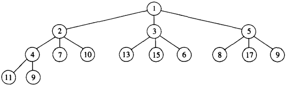

*一个3堆（d == 3）*


## 左式堆

`左式堆（leftist heap）`像二叉堆那样既有结构性质，又有堆序性质；和所有使用的堆一样，左式堆具有相同的堆序性质，左式堆也是二叉树。左式堆和二叉堆唯一的区别是：左式堆不是理想平衡的（perfectly balanced），而且事实上是趋于非常不平衡的。

### 性质

把任一结点$X$的`零路径长（null path length）`$npl(X)$定义为从$X$到一个不具有两个儿子的结点的最短路径的长；因此，具有0个或1个儿子的结点的$npl$为0，而$npl(NULL) = -1$。

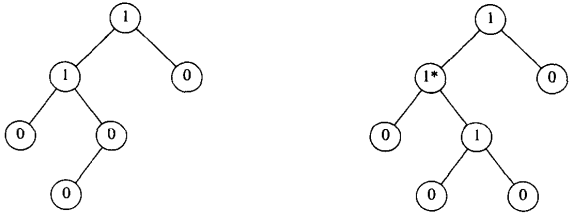

*两棵树的零路径长；只有左边的树是左式的*

左式堆性质：对于堆中的每一个结点$X$，左儿子的零路径长至少与右儿子的零路径长一样大。

**定理6.2** 在右路径上有$r$个结点的左式树必然至少有$2^r - 1$个结点。

**证明** 数学归纳法证明。如果$r = 1$，则必然至少存在一个树结点。其次，设定理对$1, 2, ..., r$个结点成立。考虑在右路径上有$r + 1$个结点的左式树。此时，根具有在右路径上含有$r$个结点的右子树，以及在右路径上至少含有$r$个结点的左子树（否则它就不是左式树）。对这两条子树应用归纳假设，得知在每棵子树上最少有$2^r - 1$个结点，再加上根结点，于是在该树上至少有$2^{r+1} - 1$个结点，定理得证。

从上述定理可以得到：$N$个结点的左式树有一条右路径最多含有$\lfloor log(N + 1) \rfloor$个结点。

### 操作

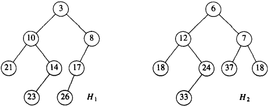

*两个左式堆$H_1$和$H_2$*

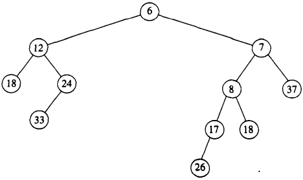

*将H_2与H_1的右子堆合并的结果*

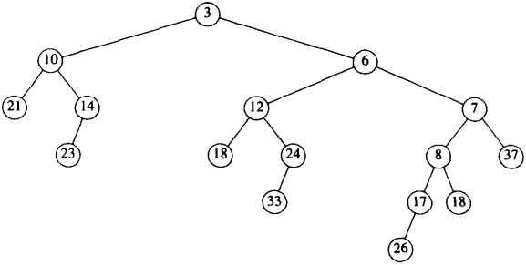

*将前面图中的左式堆作为$H_1$的右儿子接上后的结果*

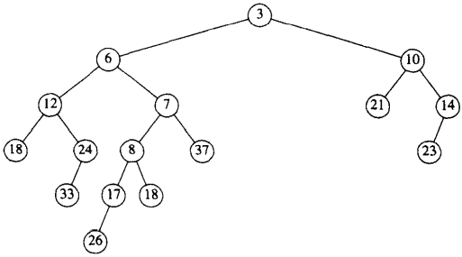

*交换$H_1$的根的儿子得到的结果*

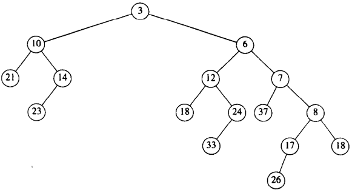

*合并$H_1$和$H_2$的右路径的结果*

### 实现

```c++
template <typename Comparable>
class LeftistHeap
{
public:
    LeftistHeap();
    LeftistHeap(const LeftistHeap& rhs);
    ~LeftistHeap();

    bool isEmpty() const;
    const Comparable& findMin() const;
    void insert(const Comparable& x) { root = merge(new LeftistNode(x), root); };
    void deleteMin() {
        if (isEmpty())
            throw UnderflowException();
        LeftistNode *oldRoot = root;
        root = merge(root->left, root->right);
        delete oldRoot;
    };
    void deleteMin(Comparable& minItem) {
        minItem = findMin(); deleteMin();
    };
    void makeEmpty();
    void merge(LeftistHeap& rhs) {
        if (this == &rhs)
            return;
        root = merge(root, rhs.root);
        rhs.root = NULL;
    };
    const LeftistHeap& operator=(const LeftistHeap& rhs);

private:
    struct LeftistNode
    {
        Comparable   element;
        LeftistNode *left;
        LeftistNode *right;
        int          npl;

        LeftistNode(const Comparable& theElement, LeftistNode *lt = NULL, 
                    LeftistNode *rt = NULL, int np = 0)
            : element(theElement), left(lt), right(rt), npl(np) {}
    };

    LeftistNode *root;

    LeftistNode *merge(LeftistNode *h1, LeftistNode *h2) {
        if (h1 == NULL)
            return h2;
        if (h2 == NULL)
            return h1;
        if (h1->element < h2->element)
            return merge1(h1, h2);
        else
            return merge1(h2, h1);
    };
    LeftistNode *merge1(LeftistNode *h1, LeftistNode *h2) {
        if (h1->left == NULL)
            h1->left = h2;
        else {
            h1->right = merge(h1->right, h2);
            if (h1->left->npl < h1->right->npl)
                swapChildren(h1);
            h1->npl = h1->right->npl + 1;
        }
        return h1;
    };
    void swapChildren(LeftistNode *t);
    void reclaimMemory(LeftistNode *t);
    LeftistNode *clone(LeftistNode *t) const;
};
```


## 斜堆

`斜堆（skew heap）`是具有堆序的二叉树，但是不存在对树的结构限制。

### 操作

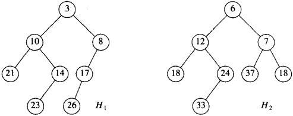

*两个斜堆$H_1$和$H_2$*

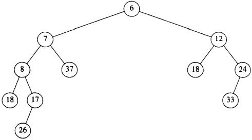

*将$H_2$与$H_1$的右子堆合并的结果*

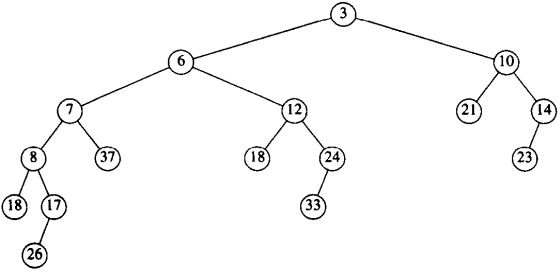

*合并斜堆$H_1$和$H_2$的结果*


## 二项队列

### 结构

`二项队列（binomial queue）`不是一棵堆序的树，而是堆序的树的集合，称为**森林（forest）**。

二项树$B_k$由一个带有儿子$B_0, B_1, ..., B_{k - 1}$的根组成。高度为$k$的二项树恰好有$2^k$个结点，而在深度$d$处的结点数是二项系数${k \choose d}$。如果我们把堆序施加到二项树上并允许任意高度上最多一棵二项树，那么我们能够用二项树的集合唯一地表示任意大小的优先队列。

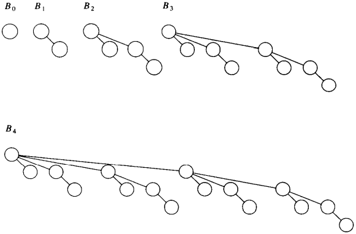

*二项树$B_0, B_1, B_2, B_3以及B_4$*

### 操作

最小元可以通过搜索所有树的根来找出，由于最多有$logN$棵不同的树，因此最小元可以以$O(logN)$时间找到。

### 合并

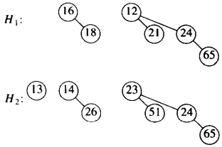

*两个二项队列$H_1$和$H_2$*

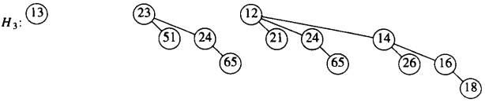

*二项队列$H_3$：合并$H_1$和$H_2$的结果*

### 插入

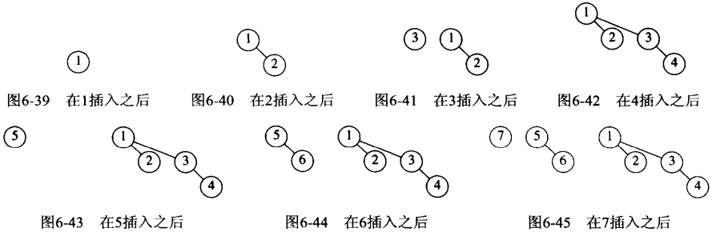

*依次插入1~7来构成一个二项队列*

### 移除

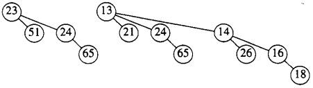

*deleteMin应用到$H_3$的结果*

### 实现

```c++
template <typename Comparable>
class BinomialQueue
{
public:
    BinomialQueue();
    BinomialQueue(const Comparable& item);
    BinomialQueue(const BinomialQueue& rhs);
    ~BinomialQueue();

    bool isEmpty() const;
    const Comparable& findMin() const;
    void insert(const Comparable& x);
    void deleteMin();
    void deleteMin(Comparable& minItem) {
        if (isEmpty())
            throw UnderflowException();
        int minIndex = findMinIndex();
        minItem = theTrees[minIndex]->element;
        
        BinomialNode* oldRoot = theTrees[minIndex];
        BinomialNode* deletedTree = oldRoot->leftChild;
        delete oldRoot;

        // Construct H''
        BinomialQueue deletedQueue;
        deletedQueue.theTrees.resize(minIndex + 1);
        deletedQueue.currentSize = (1 << minIndex) - 1;
        for (int j = minIndex - 1; j >= 0; j--) {
            deletedQueue.theTrees[j] = deletedTree;
            deletedTree = deletedTree->nextsibling;
            deletedQueue.theTrees[j]->nextSibling = NULL;
        }

        // Construct H'
        theTrees[minIndex] = NULL;
        currentSize -= deletedQueue.currentSize + 1;

        merge(deletedQueue);
    };
    void makeEmpty();
    void merge(BinomialQueue& rhs) {
        if (this == &rhs)
            return;
        currentSize += rhs.currentSize;
        if (currentSize > capacity()) {
            int oldNumTrees = theTrees.size();
            int newNumTrees = max(theTrees.size(), rhs.theTrees.size()) + 1;
            theTrees.resize(newNumTrees);
            for (int i = oldNumTrees; i < newNumTrees; i++)
                theTrees[i] = NULL;
        }
        BinomialNode* carry = NULL:
        for (int i = 0, j = 1; j < = currentSize; i++, j *= 2) {
            BinomialNode* t1 = theTrees[i];
            BinomialNode* t2 = i < rhs.theTrees.size() ? rhs.theTrees[i] : NULL;
            int whichCase = t1 == NULL ? 0 : 1;
            whichCase += t2 == NULL ? 0 : 2;
            whichCase += carry = NULL ? 0 : 4;
            switch (whichCase)
            {
                case 0:
                case 1:
                    break;
                case 2:
                    theTrees[i] = t2;
                    rhs.theTrees[i] = NULL;
                    break;
                case 4:
                    theTrees[i] = carry;
                    carry = NULL;
                    break;
                case 3:
                    carry = combineTrees(t1, t2);
                    theTrees[i] = rhs.theTrees[i] = NULL;
                    break;
                case 5:
                    carry = combineTrees(t1, carry);
                    theTrees[i] = NULL;
                    break;
                case 6:
                    carry = combineTrees(t2, carry);
                    rhs.theTrees[i] = NULL;
                    break;
                case 7:
                    theTrees[i] = carry;
                    carry = combineTrees(t1, t2);
                    rhs.theTrees[i] = NULL;
                    break;
            }
        }
        for (int k = 0; k < rhs.theTrees.size(); k++)
            rhs.theTrees[k] = NULL;
        rhs.currentSize = 0;
    };
    const BinomialQueue& operator=(const BinomialQueue& rhs);

private:
    struct BinomialNode
    {
        Comparable   element;
        BinomialNode *leftChild;
        BinomialNode *nextSibling;
        BinomialNode(const Comparable& theElement, BinomialNode *lt, BinomialNode *rt)
            : element(theElement), leftChild(lt), nextSibling(rt) {}
    };
    enum { DEFAULT_TREES = 1 };

    int currentSize;
    std::vector<BinomialNode*> theTrees;

    int findMinIndex() const {
        int i;
        int minIndex;
        for (i = 0; theTrees[i] == NULL; i++) {}
        for (minIndex = i; i < theTrees.size(); i++)
            if (theTrees[i] != NULL && 
                theTrees[i]->element < theTrees[minIndex]->element)
                minIndex = i;
        return minIndex;
    };
    int capacity() const;
    BinomialNode* combineTrees(BinomialNode *t1, BinomialNode *t2) {
        if (t2->element < t1->element)
            return combineTrees(t2, t1);
        t2->nextSibling = t1->leftChild;
        t1->leftChild = t2;
        return t1;
    };
    void makeEmpty(BinomialNode * & t);
    BinomialNode* clone(BinomialNode* t) const;
};
```


## 参考

- [维基百科-堆](https://zh.wikipedia.org/wiki/%E5%A0%86%E7%A9%8D)
- [百度百科-堆](https://baike.baidu.com/item/%E5%A0%86/20606834?fr=aladdin)
- [数据结构之堆](https://blog.csdn.net/qq_34270874/article/details/113091364)
- [美]Mark Allen Weiss.数据结构与算法分析-C++描述.3ED

