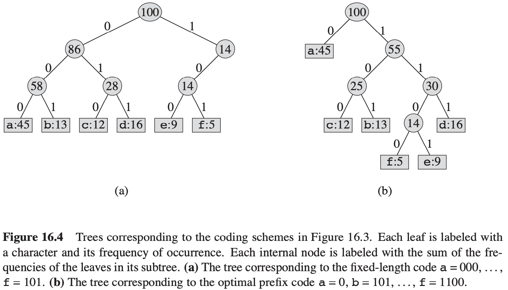
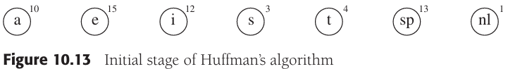
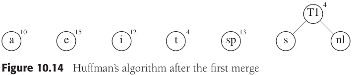
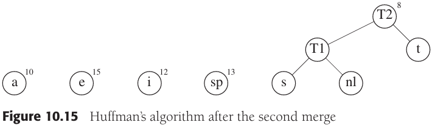
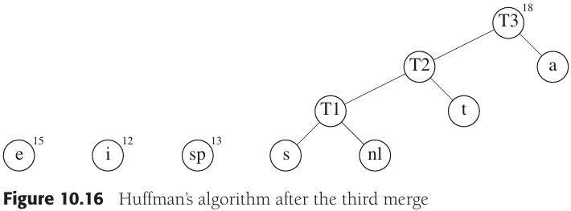
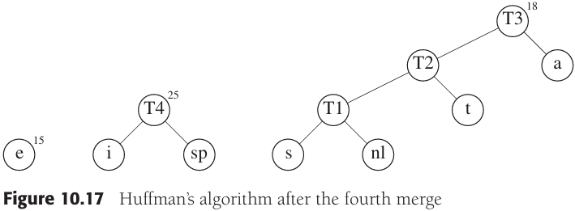
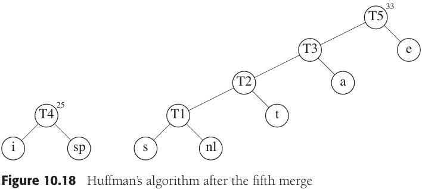
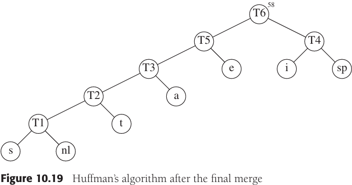

# Huffman Coding

[TOC]

Huffman coding is a classic algorithm for lossless prefix coding that produces an optimal variable-length code for a known set of symbol frequencies. Given a set of symbols and their weights (frequencies or probabilities), Huffman's greedy algorithm constructs a prefix-free binary code that minimizes the expected codeword length. Huffman codes are widely used in compression systems (DEFLATE, JPEG Huffman stage, various file formats) and are fundamental in information theory and algorithms courses.

This note summarizes the prefix-code model, the Huffman algorithm, its correctness and complexity, canonical Huffman codes (useful in practice), a short example, and common variants.

## Prefix codes

For each character $c$ in the alphabet $C$, let the attribute $c.freq$ denote the frequency of $c$ in the file and let $d_T(c)$ denote the depth of c's leaf in the tree. Note that $d_T(c)$ is also the length of the codeword for character $c$. The number of bits required to encode a file is thus $B(T) = \sum_{c \in C} c \cdot freq \cdot d_T(c)$, which we define as the **cost** of the tree $T$.

## Huffman's greedy algorithm

Huffman's algorithm can be described as follows: We maintain a forest of trees. The `weight` of a tree is equal to the sum of the frequencies of its leaves. $C - 1$ times, select the two trees, $T_1$ and $T_2$, of smallest weight, breaking ties arbitrarily, and form a new tree with subtrees $T_1$ and $T_2$. At the beginning of the algorithm, there are $C$ single-node trees--one for each character. At the end of the algorithm there is one tree, and this is the optimal Huffman coding tree.

(For more detail, see [Shortest-Path Algorithms#Dijkstra's algorithm ](https://github.com/hanjingo/doc/blob/master/ALGO/shortest_path_problem.md))

## Theory

**Lemma** Let $C$ be an alphabet in which each character $c \in C$ has frequency $c.freq$. Let $x$ and $y$ be two characters in $C$ having the lowest frequencies. Then there exists an optimal prefix code for $C$ in which the codewords for $x$ and $y$ have the same length and differ only in the last bit.

**Lemma** Let $C$ be a given alphabet with frequency $c.freq$ defined for each character $c \in C$. Let $x$ and $y$ be two characters in $C$ with minimum frequency. Let $C'$ be the alphabet $C$ with the characters $x$ and $y$ removed and a new character $z$ added, so that $C' = C - \{x, y\} \cup \{z\}$. Define $f$ for $C'$ as for $C$, except that $z.freq = x.freq + y.freq$. Let $T'$ be any tree representing an optimal prefix code for the alphabet $C'$. Then the tree $T$, obtained from $T'$ by replacing the leaf node for $z$ with an internal node having $x$ and $y$ as children, represents an optimal prefix code for the alphabet $C$.

**Theorem** Procedure HUFFMAN produces an optimal prefix code.

## Complexity Analysis

- Using a binary heap (priority queue) of size $n$ to repeatedly extract and insert weights, Huffman's algorithm runs in $O(n \log n)$ time and $O(n)$ space.
- Special cases: if weights are already sorted, a two-queue method achieves $O(n)$ time.

## Canonical Huffman codes

Canonical Huffman codes are a convenient representation that stores only codeword lengths (not full bit patterns). From the multiset of code lengths, canonical codes are constructed deterministically so that shorter codes have lexicographically smaller binary values and codes of the same length are consecutive. Benefits:

- Compact transmission: only the length for each symbol needs to be transmitted.
- Fast encoder/decoder construction: decoder builds lookup tables from lengths.

Construction sketch: sort symbols by (length, symbol id). Assign the smallest code of each length incrementally so codes of equal length are lexicographically contiguous.

Canonical representations are used in DEFLATE's dynamic Huffman blocks and in many practical compressors.

## Variants and extensions

- Adaptive (online) Huffman coding: updates the code as data arrives (FGK algorithm, Vitter algorithm) — useful when symbol frequencies are not known in advance.
- Extended alphabets / r-ary Huffman: Huffman can be generalized to non-binary alphabets where codewords over an r-ary alphabet are desired.
- Length-limited Huffman: computing an optimal Huffman code subject to a maximum codeword length (solved by the Package-Merge algorithm).
- Arithmetic coding and range coding: often achieve better compression than Huffman for high-precision probability models but are more computationally and implementationally complex; they produce near-optimal fractional bit-per-symbol codes.

## Practical notes

- Huffman is optimal for symbol-by-symbol coding when symbol frequencies are known and codes must be prefix-free.
- For contexts where symbol probabilities vary by context (Markov models), combine Huffman with context modeling or use arithmetic coding.
- In practice, canonical Huffman codes + code-length transmission strikes a good balance between compression and compact representation of the codebook.

## Relation to DEFLATE

DEFLATE uses Huffman coding for the literal/length and distance alphabets. Dynamic DEFLATE blocks transmit code lengths in a compact run-length encoded form; decoders reconstruct canonical Huffman codes from those lengths.

## References

[1] Thomas H. Cormen, Charles E. Leiserson, Ronald L. Rivest, Clifford Stein. Introduction to Algorithms (CLRS) — section on Huffman codes.

[2] D. A. Huffman, "A Method for the Construction of Minimum-Redundancy Codes", Proceedings of the I.R.E., 1952.

[3] Practical notes: RFC 1951 (DEFLATE) and other compressor documentation.
