# Huffman Coding

[TOC]


A **variable-length code** can do considerably better than a fixed-length code by giving frequent characters short codewords and infrequent characters long codewords.

## Prefix codes

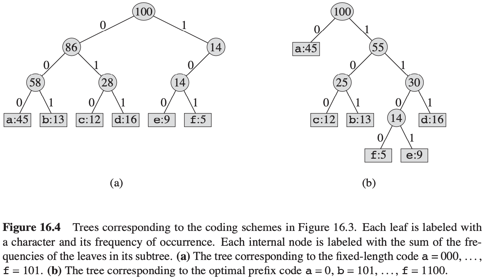

For each character $c$ in the alphabet $C$, let the attribute $c.freq$ denote the frequency of $c$ in the file and let $d_T(c)$ denote the depth of c's leaf in the tree. Note that $d_T(c)$ is also the length of the codeword for character $c$. The number of bits required to encode a file is thus $B(T) = \sum_{c \in C} c \cdot freq \cdot d_T(c)$, which we define as the **cost** of the tree $T$.


## Math Fundamentals 

**Lemma** Let $C$ be an alphabet in which each character $c \in C$ has frequency $c.freq$. Let $x$ and $y$ be two characters in $C$ having the lowest frequencies. Then there exists an optimal prefix code for $C$ in which the codewords for $x$ and $y$ have the same length and differ only in the last bit.

**Lemma** Let $C$ be a given alphabet with frequency $c.freq$ defined for each character $c \in C$. Let $x$ and $y$ be two characters in $C$ with minimum frequency. Let $C'$ be the alphabet $C$ with the characters $x$ and $y$ removed and a new character $z$ added, so that $C' = C - \{x, y\} \cup \{z\}$. Define $f$ for $C'$ as for $C$, except that $z.freq = x.freq + y.freq$. Let $T'$ be any tree representing an optimal prefix code for the alphabet $C'$. Then the tree $T$, obtained from $T'$ by replacing the leaf node for $z$ with an internal node having $x$ and $y$ as children, it represents an optimal prefix code for the alphabet $C$.

**Theorem** Procedure HUFFMAN produces an optimal prefix code.

### Complexity

- Using a binary heap (priority queue) of size $n$ to repeatedly extract and insert weights, Huffman's algorithm runs in $O(n \log n)$ time and $O(n)$ space.
- Special cases: if weights are already sorted, a two-queue method achieves $O(n)$ time.


## Operations

There are mainly two major parts in Huffman Coding

1. Build a Huffman Tree from input characters.
2. Traverse the Huffman Tree and assign codes to characters.

### Build a Huffman Tree

Algorithms:

1. Create a leaf node for each unique character and build a min heap of all leaf nodes (Min Heap is used as a priority queue. The value of the frequency field is used to compare two nodes in the min heap. Initially, the least frequent character is at the root)
2. Extract two nodes with the minimum frequency from the min heap. 
3. Create a new internal node with a frequency equal to the sum of the two nodes' frequencies. Make the first extracted node its left child and the other extracted node as its right child. Add this node to the min heap.
4. Repeat steps#2 and #3 until the heap contains only one node. The remaining node is the root node, and the tree is complete.

Examples:

1. Build a min heap that contains 6 nodes, where each node represents the root of a tree with a single node.

2. Extract two minimum frequency nodes from the min heap. Add a new internal node with frequency 5 + 9 = 14. 

   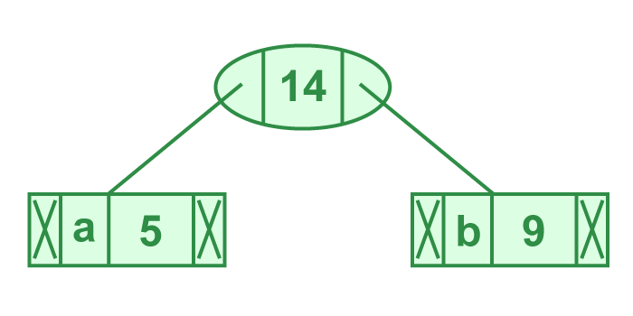

3. Extract two minimum frequency nodes from the heap. Add a new internal node with frequency 12 + 13 = 25

   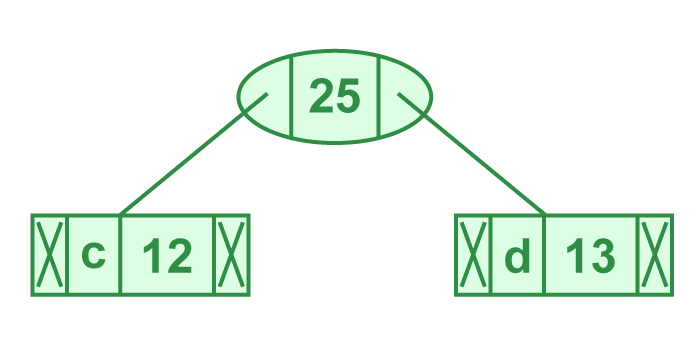

4. Extract two minimum frequency nodes. Add a new internal node with frequency 14 + 16 = 30

   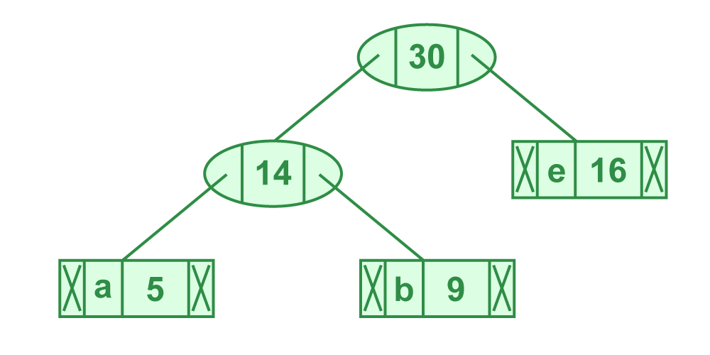

5. Extract two minimum frequency nodes. Add a new internal node with frequency 25 + 30 = 55

   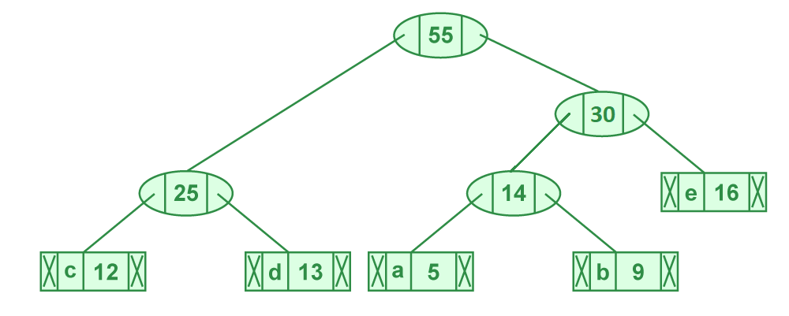

6. Extract two minimum frequency nodes. Add a new internal node with frequency 45 + 55 = 100

   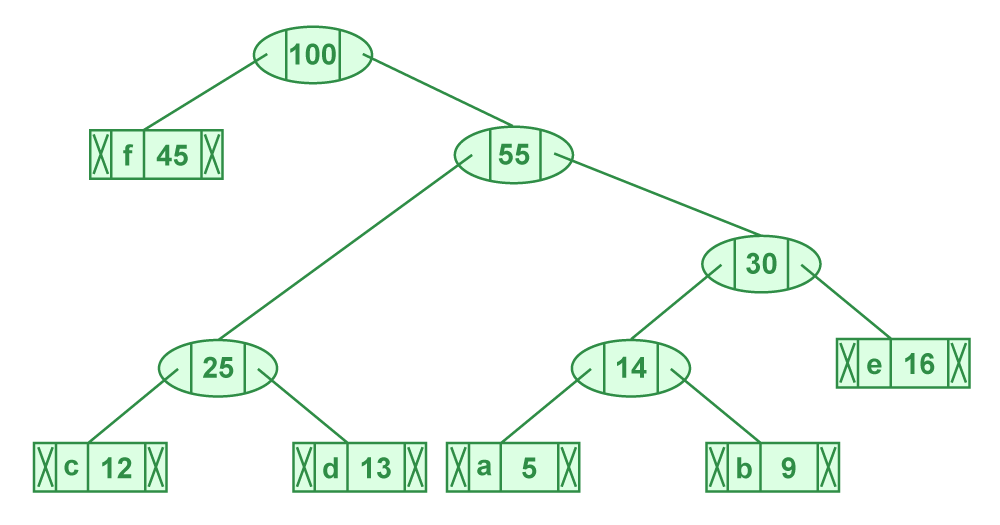

### Traverse a Huffman Tree

Algorithm:

Traverse the tree formed starting from the root. Maintain an auxiliary array. While moving to the left child, write 0 to the array. While moving to the right child, write 1 to the array.

Example:

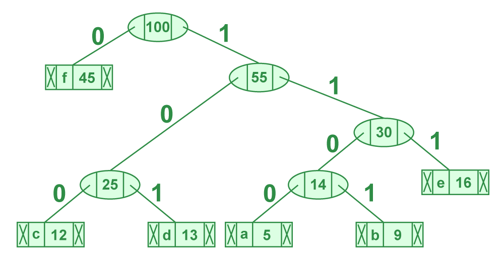

### Implement

```c++
#include <iostream>
#include <vector>
#include <queue>
#include <string>
#include <algorithm>

using namespace std;

// Class to represent Huffman tree node
class Node 
{
public:
    // frequency
    int data;  
    
    // smallest original index in subtree
    int index;  
    
    // smallest original index in subtree
    Node *left, *right;

    // Leaf node
    Node(int d, int i) 
    {
        data = d;
        index = i;
        left = right = nullptr;
    }

    // Internal node
    Node(Node* l, Node* r) 
    {
        data = l->data + r->data;
        
        // important for tie-break
        index = min(l->index, r->index); 
        left = l;
        right = r;
    }
};

// Custom min heap for Node class
class compare 
{
public:
    bool operator() (Node* a, Node* b) 
    {
        // smaller freq first
        if (a->data != b->data)
            return a->data > b->data; 

        // when freq are equal
        return a->index > b->index;    
    }
};

// Function to traverse tree in preorder
// manner and push the Huffman representation
// of each character.
void pre_ordder(Node* root, vector<string> &ans, string curr) 
{
    if (root == nullptr) 
        return;

    // Leaf node represents a character.
    if (root->left == nullptr && root->right == nullptr) 
    {
        // single character case
        if (curr == "") 
            curr = "0"; 

        ans.push_back(curr);
        return;
    }

    pre_ordder(root->left, ans, curr + '0');
    pre_ordder(root->right, ans, curr + '1');
}

vector<string> huffman_code(string &s, vector<int> freq) 
{ 
    int n = s.length();
    // Min heap for Node class.
    priority_queue<Node*, vector<Node*>, compare> pq;
    for (int i = 0; i < n; i++) 
    {
        // include index
        Node* tmp = new Node(freq[i], i); 
        pq.push(tmp);
    }

    // single character
    if (n == 1)
        return {"0"};

    // Construct Huffman tree.
    while (pq.size() >= 2) 
    {
        // Left node
        Node* l = pq.top();
        pq.pop();
        
        // Right node
        Node* r = pq.top();
        pq.pop();
           
        // internal node with freq + index   
        Node* newNode = new Node(l, r); 
        pq.push(newNode);
    }

    Node* root = pq.top();
    vector<string> ans;
    pre_ordder(root, ans, "");
    return ans;
}

int main() 
{
    string s = "abcdef";
    vector<int> freq = {5, 9, 12, 13, 16, 45};
    vector<string> ans = huffman_code(s, freq);
    for (int i = 0; i < ans.size(); i++) 
    {
        cout << ans[i] << " ";
    }

    return 0;
}
```


## Extensions

### Huffman's greedy algorithm

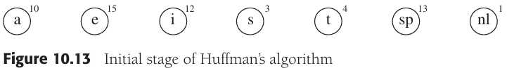

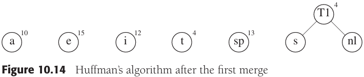

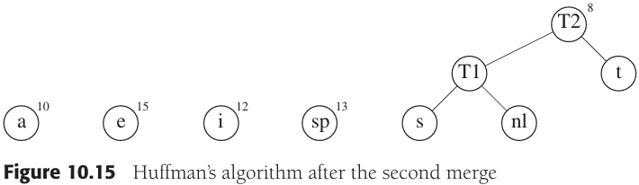

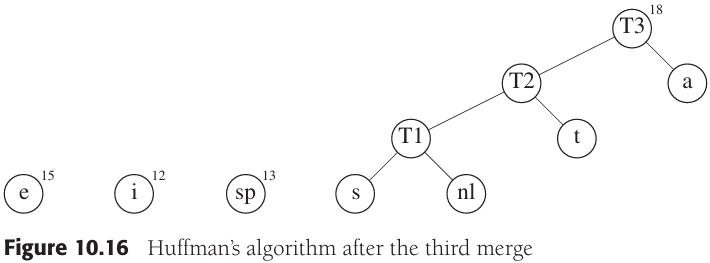

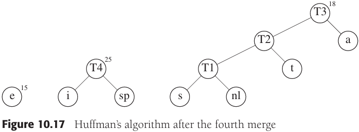

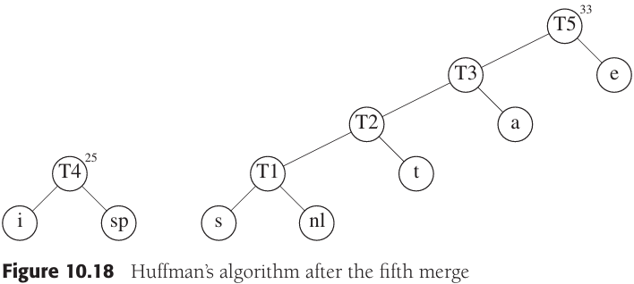

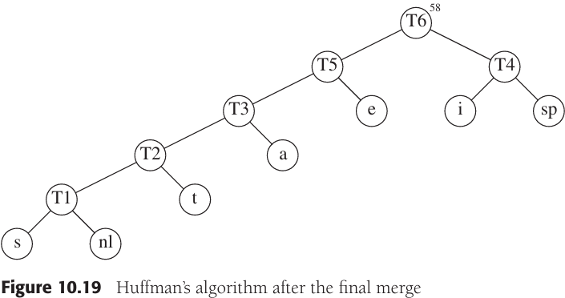

Huffman's algorithm can be described as follows: We maintain a forest of trees. The `weight` of a tree is equal to the sum of the frequencies of its leaves. $C - 1$ times, select the two trees, $T_1$ and $T_2$, of smallest weight, breaking ties arbitrarily, and form a new tree with subtrees $T_1$ and $T_2$. At the beginning of the algorithm, there are $C$ single-node trees--one for each character. At the end of the algorithm there is one tree, and this is the optimal Huffman coding tree.

### Canonical Huffman codes

Canonical Huffman codes are a convenient representation that stores only codeword lengths (not full bit patterns). From the multiset of code lengths, canonical codes are constructed deterministically so that shorter codes have lexicographically smaller binary values and codes of the same length are consecutive. Benefits:

- Compact transmission: only the length for each symbol needs to be transmitted.
- Fast encoder/decoder construction: decoder builds lookup tables from lengths.

Construction sketch: sort symbols by (length, symbol id). Assign the smallest code of each length incrementally so codes of equal length are lexicographically contiguous.

Canonical representations are used in DEFLATE's dynamic Huffman blocks and in many practical compressors.

### Variants and extensions

- Adaptive (online) Huffman coding: updates the code as data arrives (FGK algorithm, Vitter algorithm) — useful when symbol frequencies are not known in advance.
- Extended alphabets / r-ary Huffman: Huffman can be generalized to non-binary alphabets where codewords over an r-ary alphabet are desired.
- Length-limited Huffman: computing an optimal Huffman code subject to a maximum codeword length (solved by the Package-Merge algorithm).
- Arithmetic coding and range coding: often achieve better compression than Huffman for high-precision probability models but are more computationally and implementationally complex; they produce near-optimal fractional bit-per-symbol codes.

### Relation to DEFLATE

DEFLATE uses Huffman coding for the literal/length and distance alphabets. Dynamic DEFLATE blocks transmit code lengths in a compact run-length encoded form; decoders reconstruct canonical Huffman codes from those lengths.


## Summary

### Best Practical

- Huffman is optimal for symbol-by-symbol coding when symbol frequencies are known and codes must be prefix-free.
- For contexts where symbol probabilities vary by context (Markov models), combine Huffman with context modeling or use arithmetic coding.
- In practice, canonical Huffman codes + code-length transmission strikes a good balance between compression and compact representation of the codebook.


## References

[1] Thomas H. Cormen, Charles E. Leiserson, Ronald L. Rivest, Clifford Stein. Introduction to Algorithms (CLRS) — section on Huffman codes.

[2] D. A. Huffman, "A Method for the Construction of Minimum-Redundancy Codes", Proceedings of the I.R.E., 1952.

[3] Practical notes: RFC 1951 (DEFLATE) and other compressor documentation.

[4] [Huffman Coding Algorithm](https://www.geeksforgeeks.org/dsa/huffman-coding-greedy-algo-3/)

[5] [Canonical Huffman Coding](https://www.geeksforgeeks.org/dsa/canonical-huffman-coding/)
