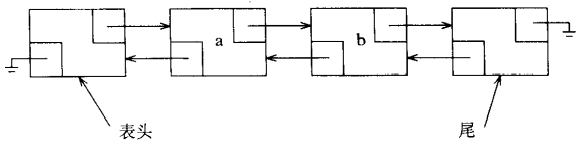

# 链表

[TOC]


## 实现

### 数据结构



*具有表头节点和尾节点的双向链表*

```c++
template <typename Object>
class List
{
private:
    struct Node 
    {
        Object data;
        Node   *prev;
        Node   *next;

        Node(const Object& d = Object(), Node *p = NULL, Node *n = NULL) :
            data(d), prev(p), next(n) {}
    };

public:
    class const_iterator
    {
    public:
        const_iterator() : current(NULL) {}
        const Object& operator* () const { return retrieve(); }
        const_iterator& operator++ () 
        {
            current = current->next;
            return *this;
        }
        const_iterator operator++(int)
        {
            const_iterator old = *this;
            ++(*this);
            return old;
        }
        bool operator== (const const_iterator& rhs) const { return current == rhs.current; }
        bool operator!= (const const_iterator& rhs) const { return !(*this == rhs); }

    protected:
        Node *current;

        Object &retrieve() const { return current->data; }
        const_iterator(Node *p) : current(p) {}
        friend class List<Object>;
    };

    class iterator : public const_iterator 
    {
    public:
        iterator() {}
        Object& operator* () { return this->retrieve(); }
        const Object& operator* () const { return const_iterator::operator*(); }
        iterator& operator++() { this->current = this->current->next; return *this; }   
        iterator operator++(int)
        {
            iterator old = *this;
            ++(*this);
            return old;
        }

    protected:
        iterator(Node *p) : const_iterator(p) {}
        friend class List<Object>;
    };

    List() { init(); }
    List(const List& rhs) 
    {
        init();
        *this = rhs;
    }
    ~List() 
    {
        clear();
        delete head;
        delete tail;
    }
    const List& operator= (const List& rhs) 
    {
        if (this == &rhs)
            return *this;
        clear();
        for (const_iterator itr = rhs.begin(); itr != rhs.end(); ++itr)
            push_back(*itr);
        return *this;
    }

    iterator begin() { return iterator(head->next); }
    const_iterator begin() const { return const_iterator(head->next); }
    iterator end() { return iterator(tail); }
    const iterator end() const { return const_iterator(tail); }
    int size() const { return theSize; }
    bool empty() const { return size() == 0; }
    void clear() { while (!empty()) {pop_front();} }
    Object& front() { return *begin(); }
    const Object& front() const { return *begin(); }
    Object& back() { return *--end(); }
    const Object& back() const { return *--end(); }
    void push_front(const Object& x) { insert(begin(), x); }
    void push_back(const Object& x) { insert(end(), x); }
    void pop_front() { erase(begin()); }
    void pop_back() { erase(--end()); }
private:
    int   theSize;
    Node *head;
    Node *tail;

    void init() 
    {
        theSize = 0;
        head = new Node;
        tail = new Node;
        head->next = tail;
        tail->prev = head;
    }
};
```

### 插入


*将新节点插入双向链表*

```c++
iterator insert(iterator itr, const Object& x) 
{
	Node *p = itr.current;
    theSize++;
    return iterator(p->prev = p->prev->next = new Node(x, p->prev, p));
}
```

### 删除


*从双向链表中删除指定的节点*

```c++
iterator erase(iterator itr)
{
        Node *p = itr.current;
        iterator retVal(p->next);
        p->prev->next = p->next;
        p->next->prev = p->prev;
        delete p;
        theSize--;

        return retVal;
}

iterator erase(iterator start, iterator end)
{
        for (iterator itr = start; itr != end; )
            itr = erase(itr);

        return end;
}
```


## 参考

[1] [美]Mark Allen Weiss.数据结构与算法分析-C++描述.3ED