[中文版](list_zh.md) | English

# Linked List

[TOC]


A linked list is a type of linear data structure where individual items are not necessarily at contiguous locations. The individual items are called nodes and connected with each other using links.

## Types

### Singly Linked List

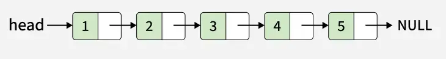

A singly linked list is a fundamental data structure; it consists of nodes where each node contains a data field and a reference to the next node in the linked list. The next of the last node is null, indicating the end of the list.

Node Definition:

```c++
// Definition of a Node in a singly linked list
class Node 
{  
public:
    // Data part of the node
    int data;

    // Pointer to the next node in the list
    Node* next;

    // Constructor to initialize the node with data
    Node(int data) 
    {
        this->data = data;
        this->next = NULL;
    }
};
```

### Doubly Linked List

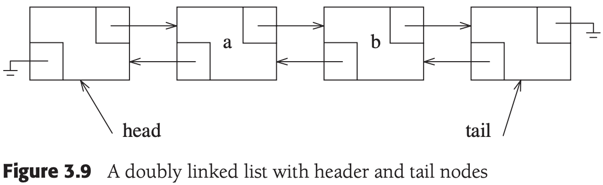

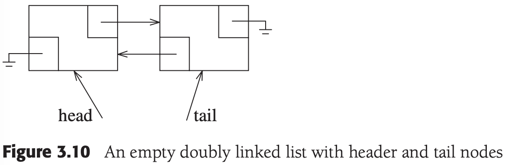

A doubly linked list is a more complex data structure than a singly linked list, but it offers several advantages. The main advantage of a doubly linked list is that it allows for efficient traversal of the list in both directions.

Node Definition:


```c++
#include <iostream>
using namespace std;

class Node 
{
public:
    // To store the Value or data
    int data;

    // Pointer to point the Previous Element
    Node* prev;

    // Pointer to point the Next Element
    Node* next;

    // Constructor
    Node(int d) 
    {
        data = d;
        prev = nullptr;
        next = nullptr;
    }
};
```

### Circular Linked List

A circular linked list is a data structure where the last node points back to the first node, forming a closed loop.

Types of Circular Linked Lists:

- Circular Singly Linked List

  

  In a Circular Singly Linked List, each node has just one pointer called the "next" pointer. The next pointer of the last node points back to the first node, and this results in forming a circle.

- Circular Doubly Linked List

  

  In a circular doubly linked list, each node has two pointers, prev and next, similar to a doubly linked list. The prev pointer points to the previous node, and the next pointer points to the next node. Here, in addition to the last node storing the address of the first node, the first node will also store the address of the last node.

Node Definition:

```c++
class Node 
{
public:
    int data;
    Node* next;

    // Constructor
    Node(int value) 
    {
        data = value;
        next = nullptr;
    }
};
```


## Operation

### Size

Algorithm:

1. Initialize count as 0. 
2. Initialize a node pointer, curr = head.
3. Do the following while curr is not NULL
   - curr = curr -> next
   - Increment count by 1.
4. Return count.

Implement:

```c++
// Counts number of nodes in linked list
int size(Node* head) 
{
    // Initialize count with 0
    int count = 0;
    // Initialize curr with head of Linked List
    Node* curr = head;
    // Traverse till we reach nullptr
    while (curr != nullptr) 
    {
      	// Increment count by 1
        count++;
        
      	// Move pointer to next node
        curr = curr->next;
    }
  	
  	// Return the count of nodes
    return count;
}
```

Complexity:

| Scenario     | Time Complexity | Space Complexity |
| :----------- | :-------------- | :--------------- |
| Best Case    | $O(n)$          | $O(1)$           |
| Average Case | $O(n)$          | $O(1)$           |
| Worst Case   | $O(n)$          | $O(1)$           |

### Insert

Algorithm:

- Insert a node at the front of the linked list

  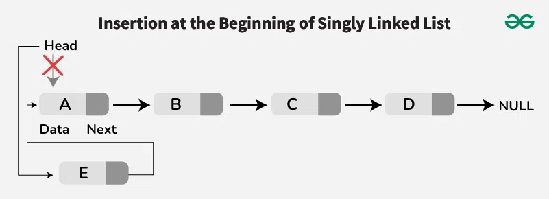

  1. Make the first node of the linked list linked to the new node
  2. Remove the head from the original first node of the Linked List
  3. Make the new node as the Head of the Linked List.

- Insert a node after a given node in a linked list

  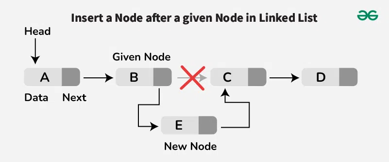

  1. Initialize a pointer, curr, to traverse the list starting from the head.
  2. Loop through the list to find the node with data equal to key.
     - If not found, then return from the function.
  3. Create a new node, say new_node, initialized with the given data.
  4. Make the next pointer of new_node as the next of the given node.
  5. Update the next pointer of the given node to the new_node.

- Insert a node before a given node in a linked list

  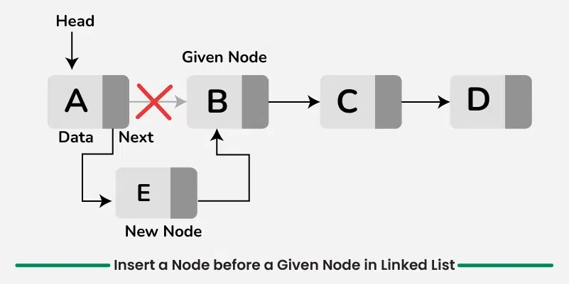

  1. Traverse the linked list while keeping track of the previous node until the given node is reached.
  2. Once a node is found, allocate memory for a new node and set it according to the given data.
  3. Point the next pointer of the new node to the given node.
  4. Point the next pointer of the previous node to the new node.
  5. If the given key is the head, update the head to point to the new node.

- Insert a node at a specific position in a linked list

  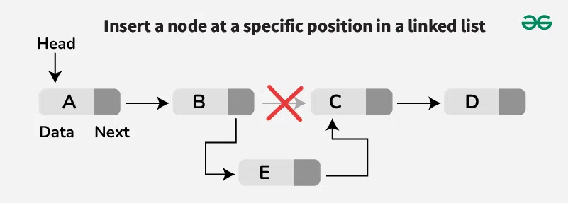
  
  1. Traverse the Linked list up to position-1 nodes.
  2. Once all the position-1 nodes are traversed, allocate memory and the given data to the new node.
  3. Point the next pointer of the new node to the next of the current node.
  4. Point the next pointer of the current node to the new node.
  
- Insert a node at the end of the linked list
  
  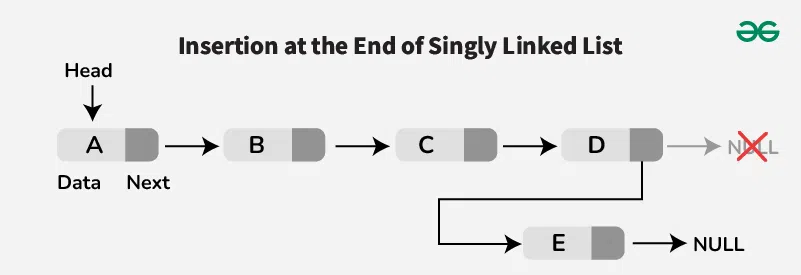
  
  1. Go to the last node of the Linked List.
  2. Change the next pointer of the last node from NULL to the new node.
  3. Make the next pointer of the new node as NULL to show the end of the Linked List.

Implement:

```c++

```

Complexity:

| Scenario     | Time Complexity | Space Complexity |
| :----------- | :-------------- | :--------------- |
| Best Case    | $O(1)$          | $O(1)$           |
| Average Case | $O(n)$          | $O(1)$           |
| Worst Case   | $O(n)$          | $O(1)$           |

### Erase

Algorithm:

- Deletion at the beginning of the linked list

  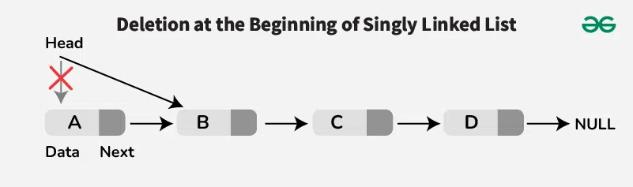

  1. Check if the list is empty: If the head is `NULL`, the list is empty, and there's nothing to delete.
  2. Update the head pointer: Set the `head` to the second node (`head = head->next`).
  3. Delete the original head node: The original head node is now unreferenced, and it can be freed/deleted if necessary

- Deletion at a specific position of the linked list

  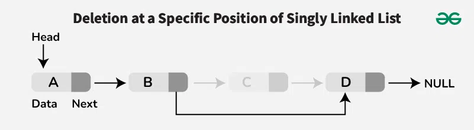

  1. Check if the position is valid: If the position is out of bounds (greater than the length of the list), return an error or handle appropriately.
  2. Traverse the list to find the node just before the one to be deleted: Start from the head and move through the list until reaching the node at position $n - 1$ (one before the target position).
  3. Update the `next pointer`: Set the `next` pointer of the $(n - 1)^{th}$ node to point to the node after the target node (`node_to_delete->next`).
  4. Delete the target node: The node to be deleted is now unreferenced, and in languages like C++ or Java, it can be safely deallocated.

- Deletion at the end of linked list

  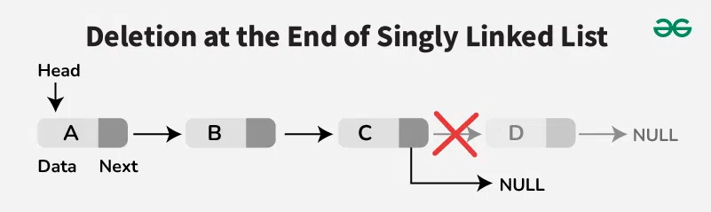

  1. Check if the list is empty: If the head is `NULL`, the list is empty, and there's nothing to delete.
  2. If the list has only one node: Simply set the head to `NULL` (the list becomes empty).
  3. Traverse the list to find the second-last node: Start from the head and iterate through the list until you reach the second-last node (where the `next` of the node is the last node).
  4. Update the `next pointer` of the second-last node: Set the second-last node’s `next` to `NULL` (removing the link to the last node).
  5. Delete the last node: The last node is now unreferenced and can be deleted or freed, depending on the language used.

Implement:

```c++
Node* erase(Node* head, int position) 
{
    Node* temp = head;

    // Head is to be deleted
    if (position == 1) 
    {
        head = temp->next;
        delete temp;
        return head;
    }

    // Traverse to the node before the one to be deleted
    Node* prev = nullptr;
    for (int i = 1; i < position; i++) 
    {
        prev = temp;
        temp = temp->next;
    }

    // Delete the node at the position
    prev->next = temp->next;
    delete temp;
    return head;
}
```

Complexity:

| Scenario     | Time Complexity | Space Complexity |
| :----------- | :-------------- | :--------------- |
| Best Case    | $O(1)$          | $O(1)$           |
| Average Case | $O(n)$          | $O(1)$           |
| Worst Case   | $O(n)$          | $O(1)$           |

### IndexAt

Algorithm:

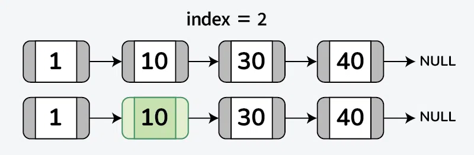

Implement:

```c++
int index_at(struct Node *head, int index) 
{
    // If the list is empty or index is out of bounds
    if (head == NULL)
        return -1;

    // If index equals 1, return node's data
    if (index == 1)
        return head->data;

    // Recursively move to the next node
    return index_at(head->next, index - 1);
}
```

Complexity:

| Scenario     | Time Complexity | Space Complexity |
| :----------- | :-------------- | :--------------- |
| Best Case    | $O(1)$          | $O(1)$           |
| Average Case | $O(n)$          | $O(n)$           |
| Worst Case   | $O(n)$          | $O(n)$           |

### KthFromEnd

Algorithm:

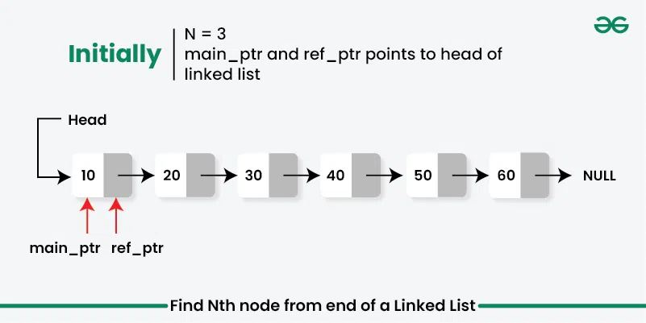

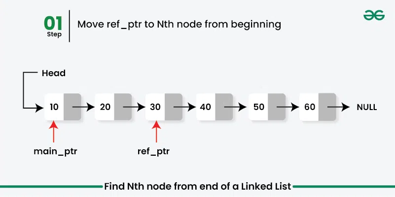

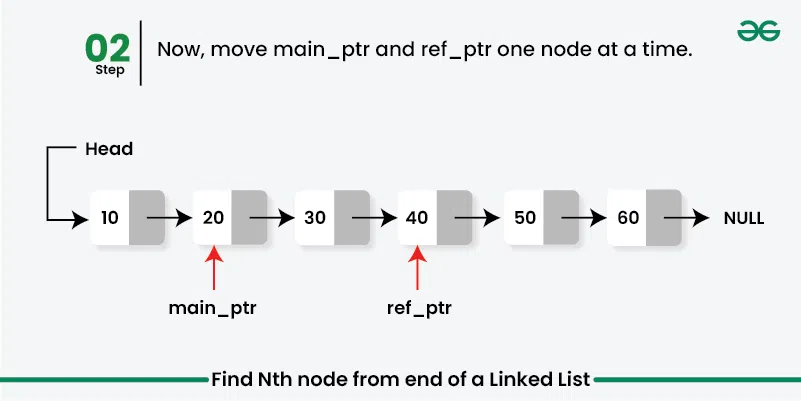

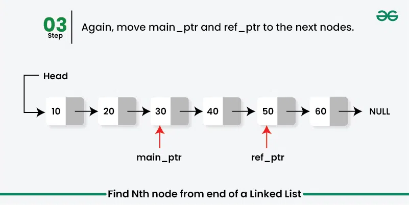

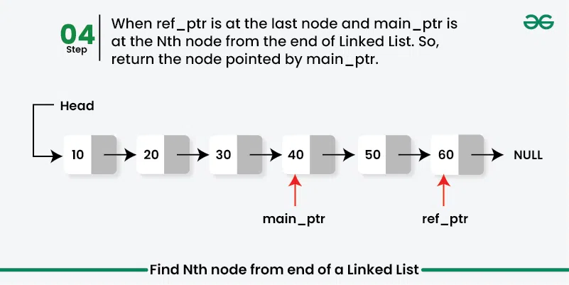

Implement:

```c++
// Function to find kth node from the end of linked list
int kth_from_end(Node* head, int k) 
{
    // Create two pointers main_ptr and ref_ptr initially pointing to head.
    Node* main_ptr = head;
    Node* ref_ptr = head;

    // Move ref_ptr to the k-th node from beginning.
    for (int i = 1; i < k; i++) 
    {
        ref_ptr = ref_ptr->next;
        // If the ref_ptr reaches NULL, then it means k > length of linked list
        if (ref_ptr == NULL)
            return -1;
    }

    // Move ref_ptr and main_ptr by one node until ref_ptr reaches last node of the list.
    while (ref_ptr->next != NULL) 
    {
        ref_ptr = ref_ptr->next;
        main_ptr = main_ptr->next;
    }

    return main_ptr->data;
}
```

### Reverse

Algorithm:

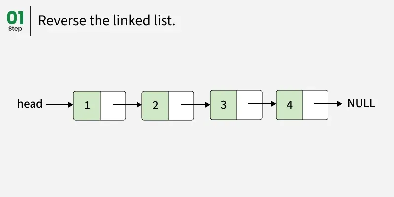

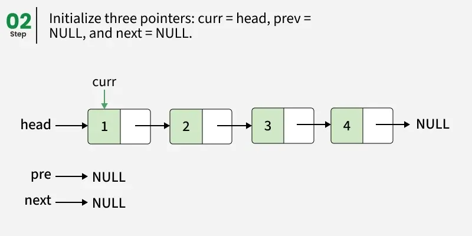

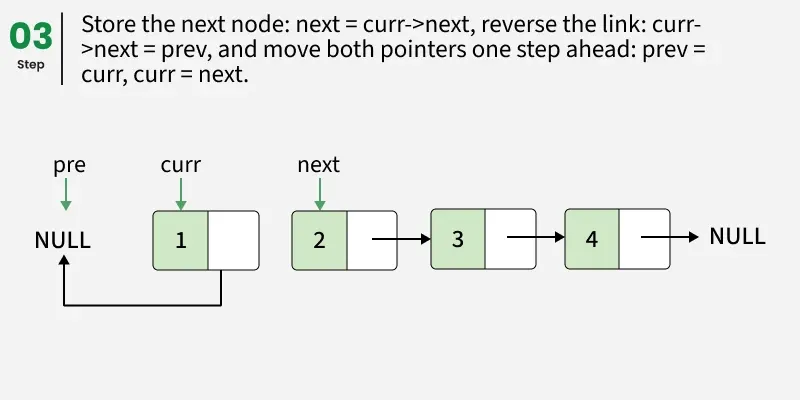

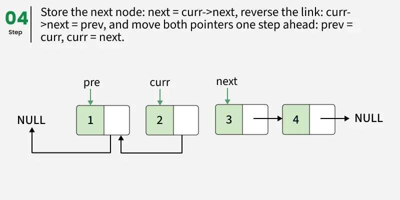

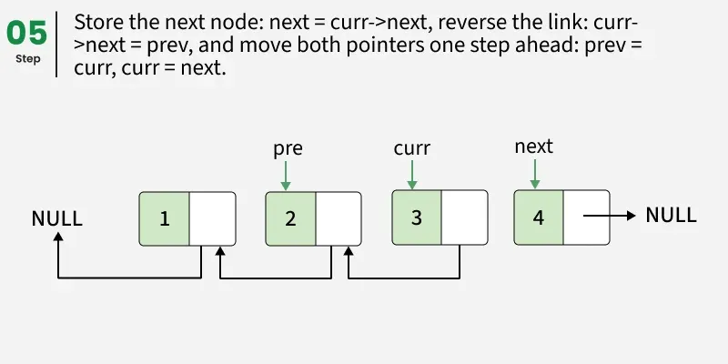

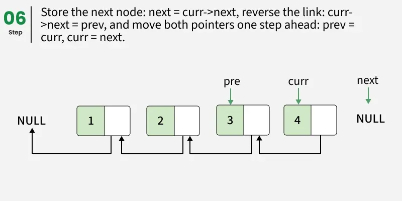

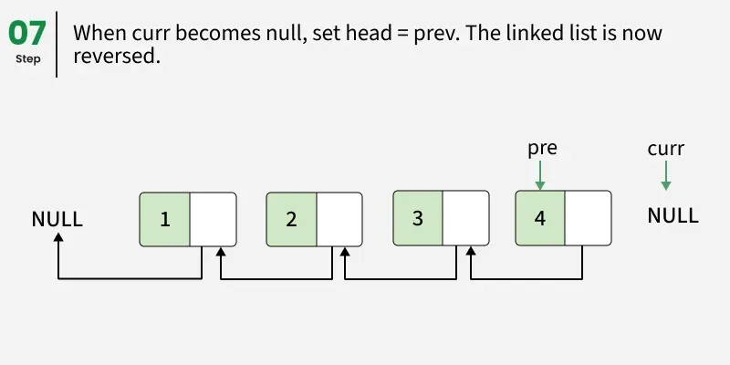

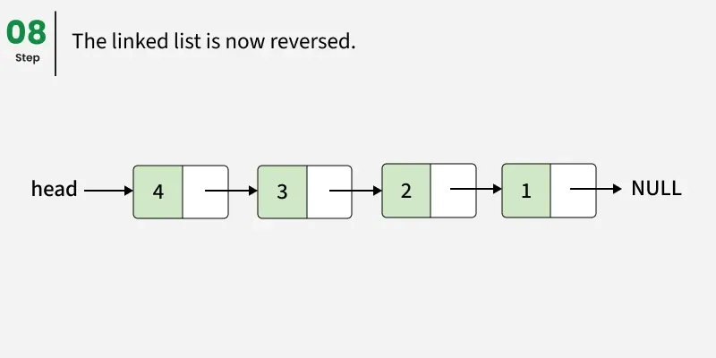

This idea ia to reverse the linke list by changing the direction of links using three pointers: prev, curr, and next. At each step, point the current node to its previous node and then move all three pointers forward until the list is fully reversed.

Implement:

```c++
Node *reverse(Node *head) 
{
    Node *curr = head, *prev = nullptr, *next;
    // Traverse all the nodes of Linked List
    while (curr != nullptr) 
    {
        // Store next
        next = curr->next;
        // Reverse current node's next pointer
        curr->next = prev;
        // Move pointers one position ahead
        prev = curr;
        curr = next;
    }

    return prev;
}
```

Complexity:

| Scenario     | Time Complexity | Space Complexity |
| :----------- | :-------------- | :--------------- |
| Best Case    | $O(n)$          | $O(1)$           |
| Average Case | $O(n)$          | $O(1)$           |
| Worst Case   | $O(n)$          | $O(1)$           |


## Linked List In C++ STL

Member functions and complexities (selected):

| Member                                 |    Complexity | Notes                                                        |
| -------------------------------------- | ------------: | ------------------------------------------------------------ |
| assign                                 |        $O(n)$ | replace contents                                             |
| back                                   |        $O(1)$ | last element reference                                       |
| begin                                  |        $O(1)$ | iterator to first element                                    |
| clear                                  |        $O(n)$ | erase all                                                    |
| emplace / emplace_back / emplace_front |        $O(1)$ | construct in-place                                           |
| empty                                  |        $O(1)$ | empty check                                                  |
| end                                    |        $O(1)$ | past-the-end iterator                                        |
| erase                                  |        $O(n)$ | erase by iterator or range                                   |
| front                                  |        $O(1)$ | first element reference                                      |
| get_allocator                          |        $O(1)$ | Returns the allocator associated with the container.         |
| insert                                 |        $O(n)$ | Inserts an element at the specified position and returns an iterator to the inserted position. |
| max_size                               |        $O(1)$ | Returns the maximum number of elements the container can hold, as limited by system or library implementation; for the largest container, this is `std::distance(begin(), end())`. |
| merge                                  |        $O(n)$ | merge two sorted lists; second becomes empty                 |
| pop_back                               |        $O(1)$ | Removes the last element of the container. Calling `pop_back` on an empty container results in undefined behavior. |
| pop_front                              |        $O(1)$ | Removes the first element of the container. If the container is empty, the behavior is undefined. |
| push_back                              |        $O(1)$ | Adds an element to the end of the container.                 |
| push_front                             |        $O(1)$ | Adds an element to the front of the container.               |
| rbegin                                 |        $O(1)$ | Returns a reverse iterator to the first element of the reversed `list`. It corresponds to the last element of the non-reversed `list`. If the `list` is empty, the returned iterator is equal to `rend()`. |
| remove                                 |        $O(n)$ | Removes all elements equal to the specified value.           |
| remove_if                              |        $O(n)$ | Removes all elements that satisfy the specified condition.   |
| rend                                   |        $O(1)$ | Returns a reverse iterator to the element following the last element of the reversed `list`. It corresponds to the element preceding the first element of the non-reversed `list`. This element acts as a placeholder; attempting to access it results in undefined behavior. |
| resize                                 |        $O(n)$ | Resizes the container to contain `count` elements:<br>+ If the current size > `count`, the container is reduced to its first `count` elements;<br>+ If the current size < `count`, `(count - current size)` default-initialized or specified elements are inserted. |
| reverse                                |        $O(n)$ | reverse list                                                 |
| size                                   |        $O(n)$ | note: some list implementations maintain size O(1), but standard requires O(n) for distance(begin,end()) |
| sort                                   | $O(n \log n)$ | list::sort maintains relative order of equal elements        |
| splice                                 |        $O(n)$ | move elements between lists without copying nodes            |
| unique                                 |        $O(n)$ | remove consecutive duplicates                                |

Example:

```c++
#include <iostream>
#include <list>

int main()
{
    std::list<int> L1;                        // create an empty container
    std::list<int> L2{ 10 };                  // construct a container with 1 element (value 10)
    std::list<int> L3(10, 1);                 // construct a container with 10 elements (value 1)
    std::list<int> L4{ L3 };                  // create a copy of L3
    std::list<int> L5{ L3, 
                      L2.get_allocator() };   // construct from another list and allocator
	std::list<int> L6{ ++L3.cbegin(), 
                      --L3.cend() };          // construct from an element range
    std::list<int> L7(L2.get_allocator());    // provide allocator
    std::list<int> L8{ 
        std::make_move_iterator(L4.begin()), 
        std::make_move_iterator(L4.end())};   // construct with move iterators
    std::list<int> L9{
        std::make_move_iterator(L4.begin()), 
        std::make_move_iterator(L4.end()),
        L8.get_allocator()
    };                                        // construct with move iterators and allocator
    std::list<int> L10({1, 2, 3});            // construct from initializer list


	L1.assign(10, 1);                         // L1: [1,1,1,1,1,1,1,1,1,1]
	L1.assign(
        {1, 2, 3, 4, 5, 6, 7, 8, 9, 10});     // L1: [1,2,3,4,5,6,7,8,9,10]
	L1.assign(L3.cbegin(), L3.cend());        // L1: [1,1,1,1,1,1,1,1,1,1]

	int ret1 = L1.back();                     // ret1: 1

	std::list<int>::iterator ret2 = 
        L1.begin();                           // *ret2: 1

	L1.clear();                               // L1: []

	std::list<int>::iterator ret3 = 
        L1.emplace(L1.end(), 2);              // L1: [2], *ret3: 2

	L1.emplace_back(3);                       // L1: [2,3]

	L1.emplace_front(4);                      // L1: [4,2,3]

	bool ret4 = L1.empty();                   // ret4: false

	std::list<int>::iterator ret5 = L1.end(); // *ret5: 3

    std::list<int>::iterator ret6;
	ret6 = L1.erase(L1.begin());              // L1: [2,3], *ret6: 2
	ret6 = L1.erase(L1.begin(), L1.begin()++);// L1: [2,3], *ret6: 2

	int ret7 = L1.front();                    // ret7: 2

	std::list<int>::allocator_type ret8 = 
        L1.get_allocator();

	std::list<int>::iterator ret9;
    ret9 = L1.insert(L1.cbegin(), 1); // L1: [1,2,3], *ret9: 1
	ret9 = L1.insert(L1.cbegin(), 
                     2, 1);           // L1: [1,1,1,2,3], *ret9: 1
	ret9 = L1.insert(L1.cbegin(), 
                     { 2, 3 });       // L1: [2,3,1,1,1,2,3], *ret9: 2
	ret9 = L1.insert(L1.cbegin(), L2.begin(), 
        L2.end());                    // L1: [10,2,3,1,1,1,2,3], *ret9: 10

	size_t ret10 = L1.max_size();             // ret10: 76861433...

	L1.sort(); L2.sort(); L1.merge(L2);       // L1: [1,1,1,2,2,3,3,10,10]
                                              // L2: []

	L1.pop_back();                            // L1: [1,1,1,2,2,3,3,10]

	L1.pop_front();                           // L1: [1,1,2,2,3,3,10]

	L1.push_back(2);                          // L1: [1,1,2,2,3,3,10,2]

	L1.push_front(3);                         // L1: [3,1,1,2,2,3,3,10,2]

	std::list<int>::reverse_iterator ret11 = 
        L1.rbegin();                          // *ret10: 2

	L1.remove(1);                             // L1: [3,2,2,3,3,10,2]

	L1.remove_if([](int n) { 
        return n % 2 == 0; 
    });                                       // L1: [3,3,3]

	L1.resize(5);                             // L1: [3,3,3,0,0]
	L1.resize(7, 1);                          // L1: [3,3,3,0,0,1,1]

	L1.reverse();                             // L1: [1,1,0,0,3,3,3]

	size_t ret12 = L1.size();                 // ret12: 7

	L1.sort();                                // L1: [0,0,1,1,3,3,3]
	L1.sort(std::greater<int>());             // L1: [3,3,3,1,1,0,0]
    class my_greater { 
        public: 
        bool operator()(const int a, const int b) { return a > b; }; }; 
	L1.sort(my_greater());                    // L1: [3,3,3,1,1,0,0]

	L1.splice(L2.begin(), L1);                // L1: []
                                              // L2: [3,3,3,1,1,0,0]
	L1.splice(L1.begin(), L2, L2.begin());    // L1: [3]
                                              // L2: [3,3,1,1,0,0]        
	L1.splice(L1.begin()++, L2, L2.begin(), 
        L2.end());                            // L1: [3,3,1,1,0,0,3]
                                              // L2: []

	L1.swap(L2);                              // L1: []
                                              // L2: [3,3,1,1,0,0,3]

	L2.unique();                              // L2: [3,1,0,3]
	L2.unique(
        [](int x, int y) { 
            return x == y; 
        });                                   // L2: [3,1,0,3]
}
```


## Reference

[1] Thomas H. Cormen, Charles E. Leiserson, Ronald L. Rivest, Clifford Stein. Introduction to Algorithms. 3rd ed.

[2] [Reverse a Linked List](https://www.geeksforgeeks.org/dsa/reverse-a-linked-list/)

[3] [Linked List Data Structure](https://www.geeksforgeeks.org/dsa/linked-list-data-structure/)

[4] [Singly Linked List Tutorial](https://www.geeksforgeeks.org/dsa/singly-linked-list-tutorial/)

[5] [Doubly Linked List Tutorial](https://www.geeksforgeeks.org/dsa/doubly-linked-list/)

[6] [Introduction to Circular Linked List](https://www.geeksforgeeks.org/dsa/circular-linked-list/)