[中文版](lru_zh.md) | English

# LRU Algorithm

[TOC]


`LRU (Least Recently Used) algorithm` is a cache eviction policy. This algorithm assumes that recently used data is hot data and is likely to be used again soon, while data that has not been used recently is less likely to be used next time. When the cache is full, the least recently used data is evicted first.

## Workflaw

When the cache hits its capacity limit, the Least Recently Used(LRU) cache eviction policy is designed to eliminate the item that has been accessed the least recently. Items that have not been accessed for a longer period of time are assumed to be less likely to be used in the near future.  When the cache is full, LRU evicts the item that hasn't been accessed in the longest time since it keeps track of the order in which items are accessed.

For Example:


## Operations

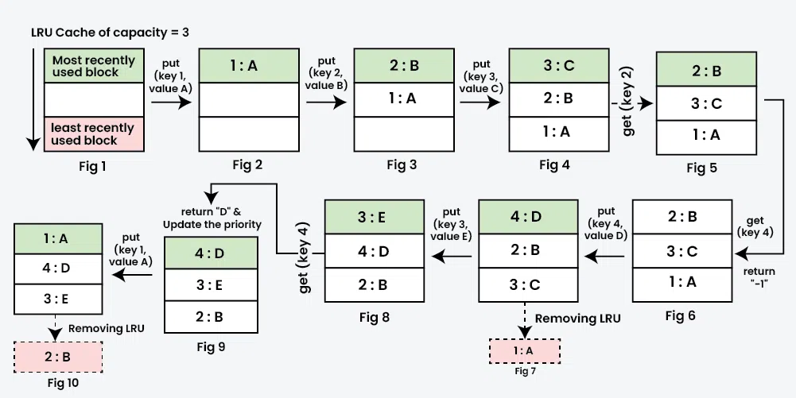

### Initialize

Initialize LRU cache with positive size capacity `c`.

### Get

*Search through the array for the node with the matching key.* 

- If found, update its timestamp and return its value, 
- else return -1.

### Put

- If the cache is full, find the node with the oldest timestamp (least recently used) and replace this node with the new key and value.
- else, simply add the new node to the end of the array with the timestamp of insertion.


## Implementation

### Doubly Linked List

Maintain a doubly linked list to store cached data, placing the most recently used data at the head of the list.

Representation:

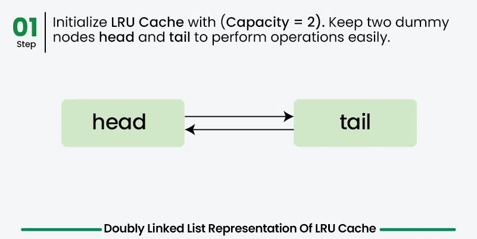

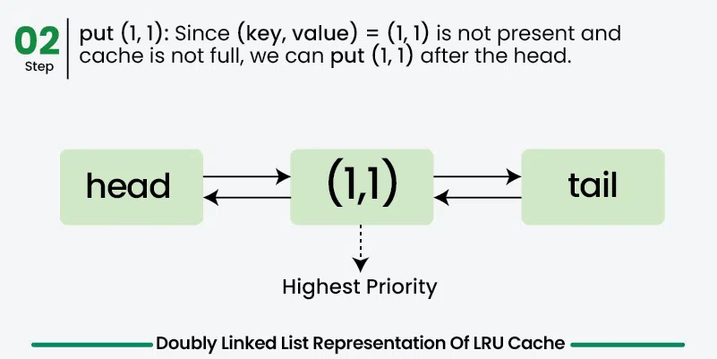

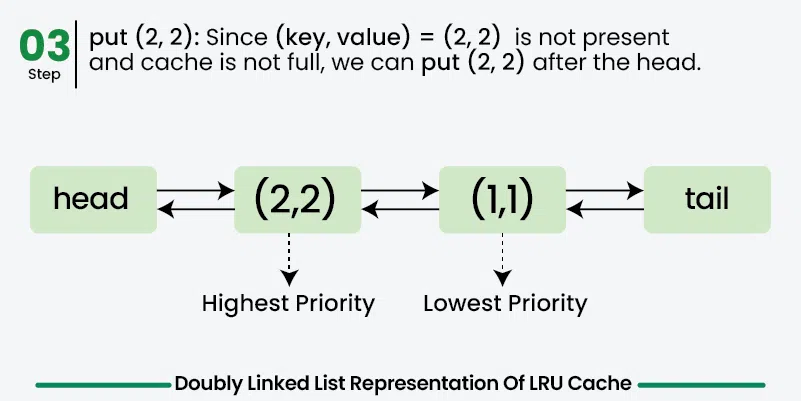

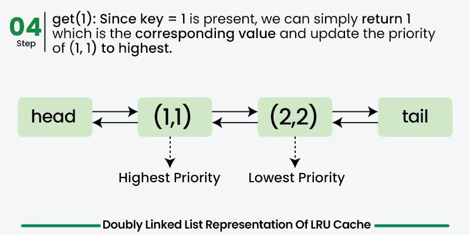

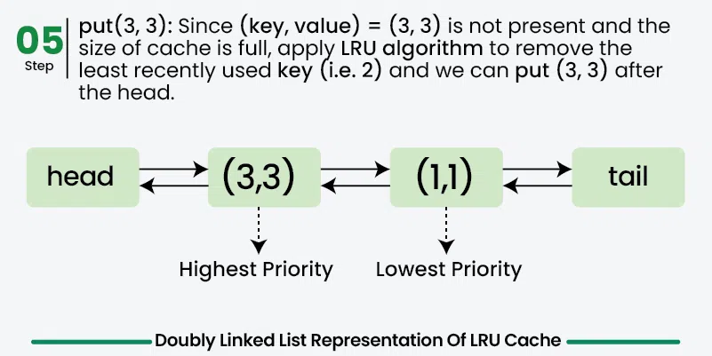

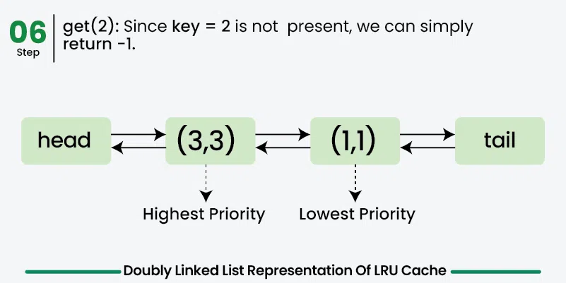

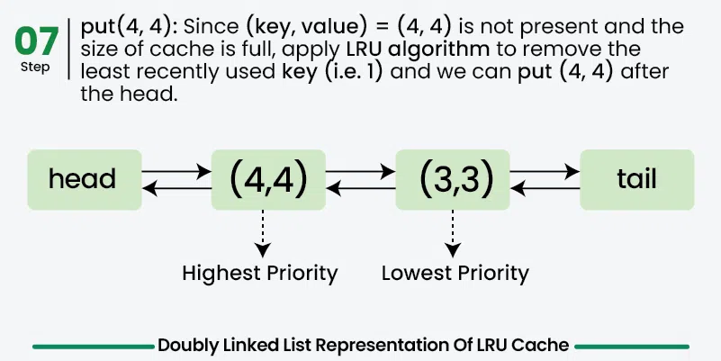

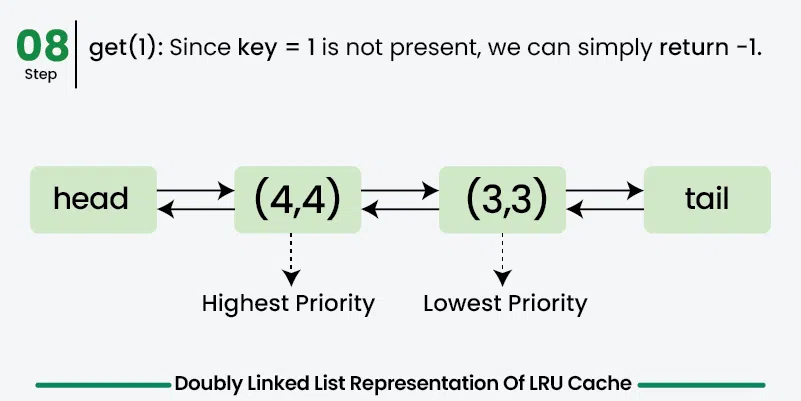

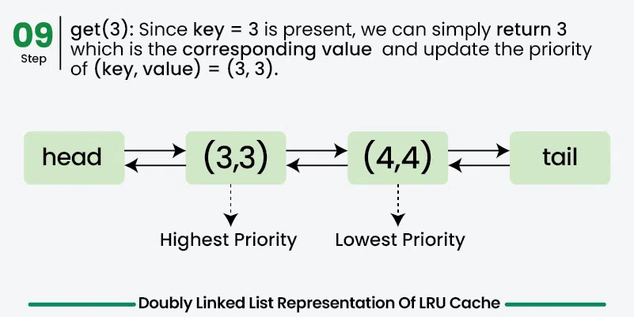

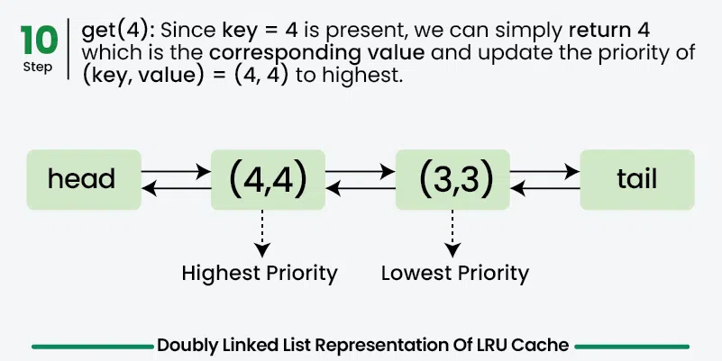

Implement:

```c++
// C++ program to implement LRU Least Recently Used)
#include <iostream>

using namespace std;

struct Node 
{
    int key;
    int value;
    Node *next;
    Node *prev;

    Node(int k, int v) 
    {
        key = k;
        value = v;
        next = nullptr;
        prev = nullptr;
    }
};

// LRU Cache class
class LRUCache
{
  public:
  
    // Constructor to initialize the cache with a given capacity
    int capacity;
    unordered_map<int, Node *> cacheMap;
    Node *head;
    Node *tail;
    LRUCache(int capacity) 
    {
        this->capacity = capacity;
        head = new Node(-1, -1);
        tail = new Node(-1, -1);
        head->next = tail;
        tail->prev = head;
    }

    // Function to get the value for a given key
    int get(int key) 
    {
      
        if (cacheMap.find(key) == cacheMap.end())
            return -1;
  

        Node *node = cacheMap[key];
        remove(node);
        add(node);
        return node->value;
    }

    // Function to put a key-value pair into the cache
    void put(int key, int value) 
    {
        if (cacheMap.find(key) != cacheMap.end()) 
        {
            Node *oldNode = cacheMap[key];
            remove(oldNode);
          	delete oldNode;
          
        }

        Node *node = new Node(key, value);
        cacheMap[key] = node;
        add(node);
       
        if (cacheMap.size() > capacity) 
        {
            Node *nodeToDelete = tail->prev;
            remove(nodeToDelete);
            cacheMap.erase(nodeToDelete->key);
          	delete nodeToDelete;
        }
    }

    // Add a node right after the head 
  	// (most recently used position)
    void add(Node *node) 
    {
        Node *nextNode = head->next;
        head->next = node;
        node->prev = head;
        node->next = nextNode;
        nextNode->prev = node;
    }

    // Remove a node from the list
    void remove(Node *node) 
    {
        Node *prevNode = node->prev;
        Node *nextNode = node->next;
        prevNode->next = nextNode;
        nextNode->prev = prevNode;
    }
};
```

Complexity:

| Operation | Time Complexity | Space Complexity |
| :-------- | :-------------- | :--------------- |
| get       | $O(1)$ average  | $O(1)$           |
| put       | $O(1)$ average  | $O(1)$           |
| add       | $O(1)$          | $O(1)$           |
| remove    | $O(1)$          | $O(1)$           |

The implementation uses an `unordered_map` and a doubly linked list, so `get` and `put` are $O(1)$ on average. The total space used by the cache is $O(c)$, where $c$ is the cache capacity.


## References

[1] [LRU Cache - Complete Tutorial](https://www.geeksforgeeks.org/system-design/lru-cache-implementation/)

[2] [Design LRU Cache](https://www.geeksforgeeks.org/dsa/design-a-data-structure-for-lru-cache/)
