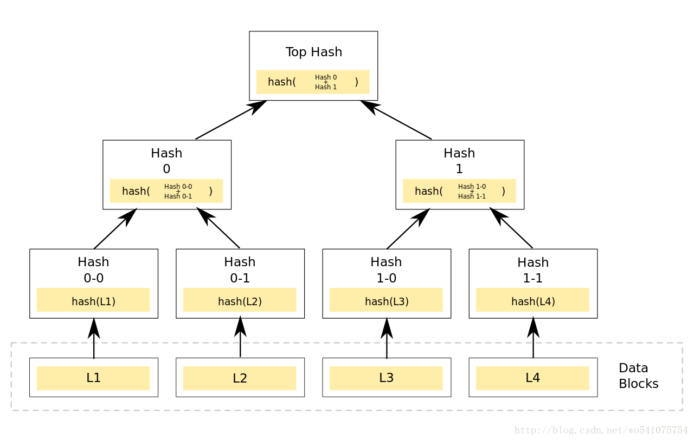
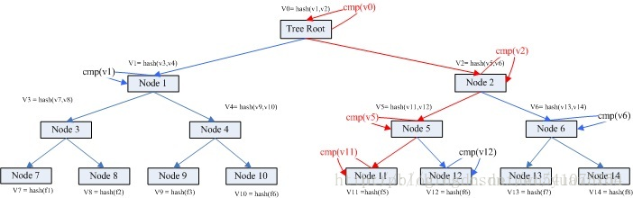

# Merkle树

## 参考

- [Merkle Tree 专利文档（英文）](res/US4309569.pdf)
- [`Merkle Tree（默克尔树）算法解析`](https://blog.csdn.net/wo541075754/article/details/54632929)
- [`区块链技术架构分析（3）-默克尔树（merkle tree）`](https://zhuanlan.zhihu.com/p/39271872)
- [百度百科-梅克尔树](https://baike.baidu.com/item/%E6%A2%85%E5%85%8B%E5%B0%94%E6%A0%91)
- [零知识证明 - 一种新型的Merkle树（Shrubs）](https://learnblockchain.cn/2019/10/15/Shrubs)
- [Merkle Tree and Zero Knowledge Proof](https://www.codenong.com/cs110403770/)

## 概述

Merkle Tree，通常也被称作Hash Tree 哈希树，顾名思义，就是存储hash值的一棵树。Merkle树的叶子是数据块(例如，文件或者文件的集合)的hash值。非叶节点是其对应子节点串联字符串的hash。

2个节点成一对，可以根据任2个同级节点hash合并得到上级节点，最终回溯到root节点；任何底层数据的变动都会传递到其父节点，一直到树根。

## Merkle树结构

### 创建Merkle树

- Merkle树是一种树，大多数是二叉树，也可以多叉树，无论是几叉树，它都具有树结构的所有特点
- Merkle树的叶子节点的value是数据集合的单元数据或者单元数据HASH
- 非叶子节点的value是根据它下面所有的叶子节点值，然后按照Hash算法计算而得出的

### 检索数据块

复杂度：$\log (N)$

### 更新，插入和删除

todo

## 应用

### 零知识证明

