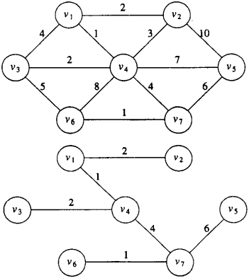
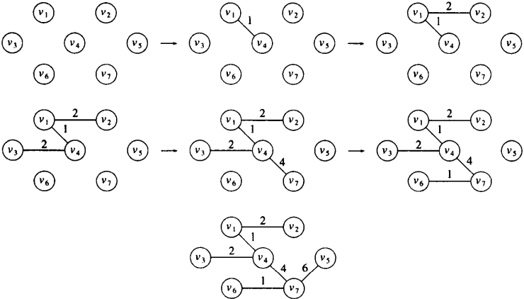
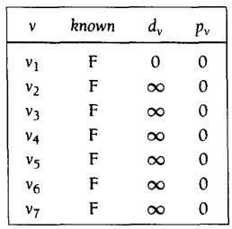
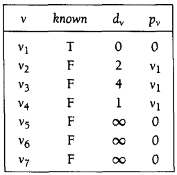
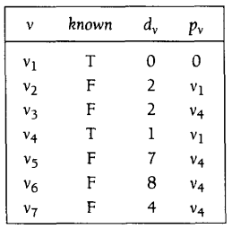
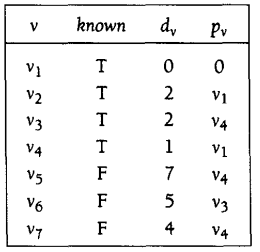
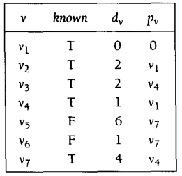
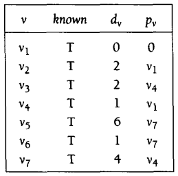
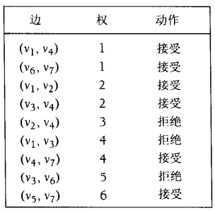
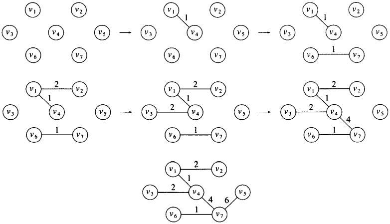

[中文版](minimum_spanning_tree_zh.md) | English

# Mimimum Spanning Tree

[TOC]


Informally, a minimum spanning tree of an undirected graph G is a tree formed from graph edges that connects all the vertices of G at lowest total cost. A minimum spanning tree exists if and only if G is connected.



*graph G and it's mimimum spanning trees*


## Prim's Algorithm

One way to compute a minimum spanning tree is to grow the tree in successive stages. In each stage, one node is picked as the root, and we add an edge, and thus an associated vertex, to the tree.



*在每一步之后的Prim算法*



*Initial configuration of table used in Prim's algorithm*



*The table after $v_1$ is declared known*



*The table after $v_4$* is declared known



*The table after $v_2$ and $v_3$are ceclared known*



*The table after $v_7$* is declared known



*The table after $v_6$ and $v_5$ are selected (Prim's algorithm terminates)*


### Kruskal's Algorithm

A second greedy strategy is to continually select the edges in order of smallest weight and accept an edge if it does not cause a cycle.



*Action of Kruskal's algorithm on G*



Formally, Kruskal's algorithm maintains a forest--a collection of trees. Initially, there are $|V|$ single-node trees. Adding an edge merges two trees into one. When the algorithm terminates, there is only one tree, and this is the minimum spanning tree.

### Example.Pseudocode for Kruskal's algorithm

```c++
void Graph::kruskal()
{
    int edgesAccepted = 0;
    DisjSet ds(NUM_VERTICES);
    PriorityQueue<Edge> pq(getEdges());
    Edge e;
    Vertex u, v;
    
    while (edgesAccepted < NUM_VERTICES - 1)
    {
        pq.deleteMin(e);  // Edge e = (u, v)
        SetType uset = ds.find(u);
        SetType vset = ds.find(v);
        if (uset != vset)
        {
            // Accept the edge
            edgesAccepted++;
            ds.unionSets(uset, vset);
        }
    }
}
```

The worst-case running time of this algorithm is $O(|E|log|E|)$, which is dominated by the heap operations. Notice that since $|E|=O(|V|^2)$, this running time is actually $O(|E|log|V|)$. In practice, the algorithm is much faster than this time bound would indicate.
