[中文版](minimum_spanning_tree_zh.md) | English

# Minimum Spanning Tree

[TOC]


Informally, a minimum spanning tree of an undirected graph G is a tree formed from graph edges that connects all the vertices of G at the lowest total cost. A minimum spanning tree exists if and only if G is connected.

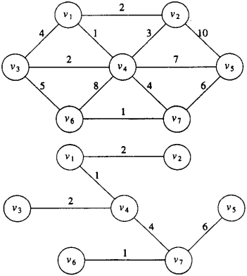

*graph G and it's mimimum spanning trees*

## Prim's Algorithm

Prim’s algorithm is a Greedy algorithm like Kruskal's algorithm. This algorithm always starts with a single node and moves through several adjacent nodes, in order to explore all of the connected edges along the way.

### Implement

Algorithm:

1. The algorithm starts with an empty spanning tree.
2. The idea is to maintain two sets of vertices. The first set contains the vertices already included in the MST, and the other set contains the vertices not yet included.
3. At every step, it considers all the edges that connect the two sets and picks the minimum-weight edge from these edges. After picking the edge, it moves the other endpoint of the edge to the set containing the MST. 

Example:

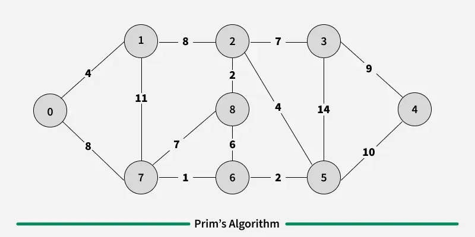

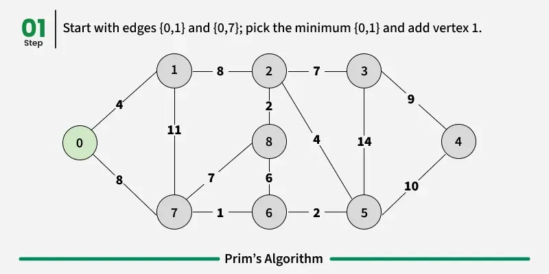

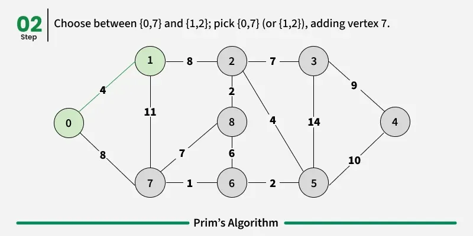

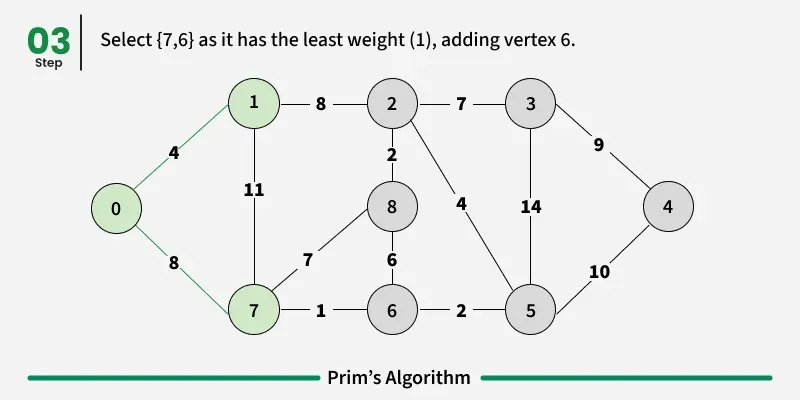

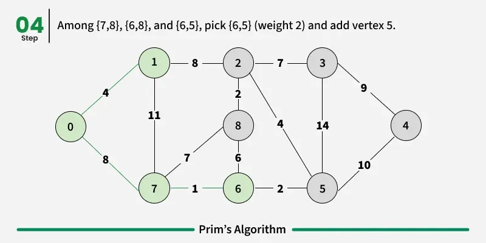

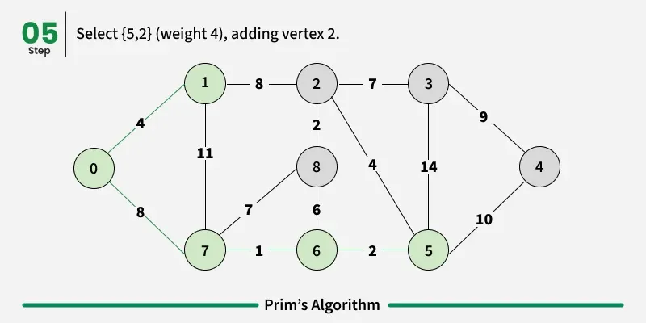

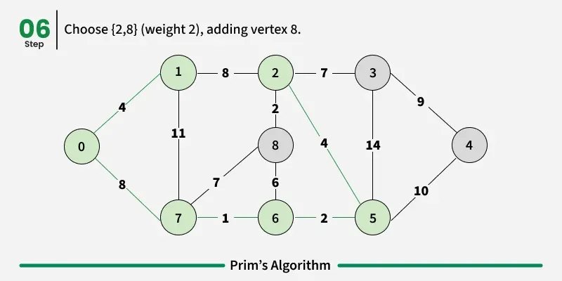

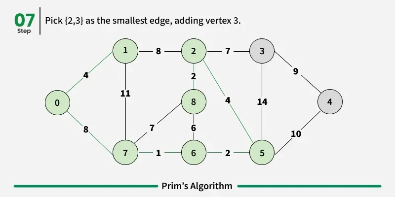

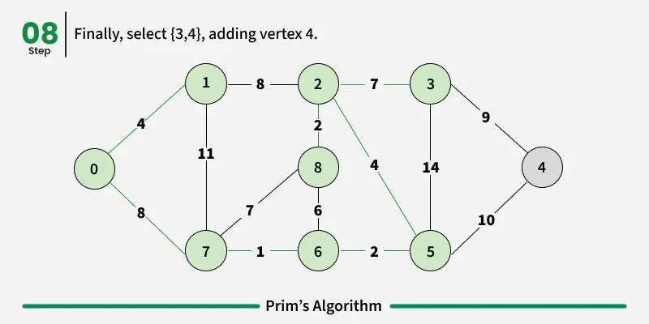

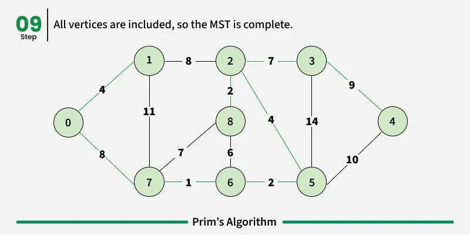

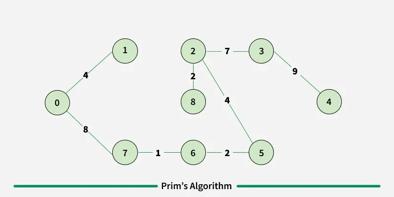

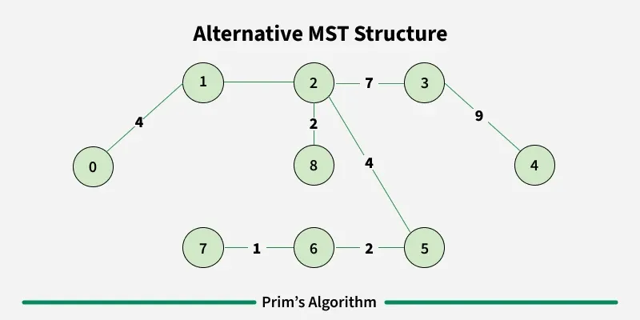


## Reference

[1] [Prim’s Algorithm for Minimum Spanning Tree (MST)](https://www.geeksforgeeks.org/dsa/prims-minimum-spanning-tree-mst-greedy-algo-5/)


---


## Prim's Algorithm

One way to compute a minimum spanning tree is to grow the tree in successive stages. In each stage, one node is picked as the root, and we add an edge, and thus an associated vertex, to the tree.

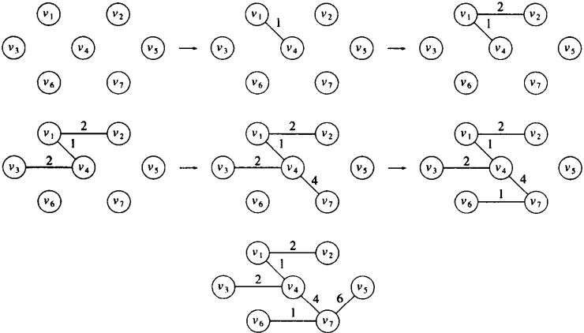

*在每一步之后的Prim算法*

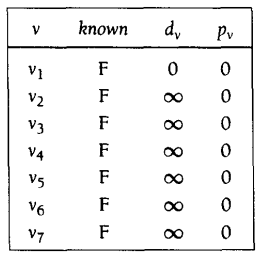

*Initial configuration of table used in Prim's algorithm*

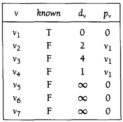

*The table after $v_1$ is declared known*

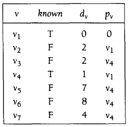

*The table after $v_4$* is declared known

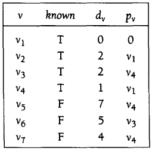

*The table after $v_2$ and $v_3$are ceclared known*

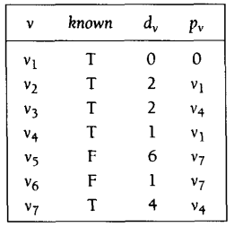

*The table after $v_7$* is declared known

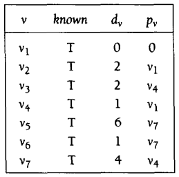

*The table after $v_6$ and $v_5$ are selected (Prim's algorithm terminates)*


### Kruskal's Algorithm

A second greedy strategy is to continually select the edges in order of smallest weight and accept an edge if it does not cause a cycle.

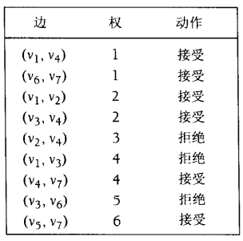

*Action of Kruskal's algorithm on G*

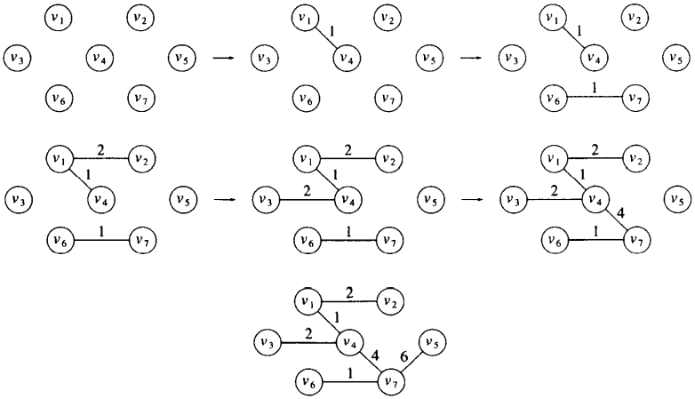

Formally, Kruskal's algorithm maintains a forest--a collection of trees. Initially, there are $|V|$ single-node trees. Adding an edge merges two trees into one. When the algorithm terminates, there is only one tree, and this is the minimum spanning tree.

### Example.Pseudocode for Kruskal's algorithm

```c++
void Graph::kruskal()
{
    int edgesAccepted = 0;
    DisjSet ds(NUM_VERTICES);
    PriorityQueue<Edge> pq(getEdges());
    Edge e;
    Vertex u, v;
    
    while (edgesAccepted < NUM_VERTICES - 1)
    {
        pq.deleteMin(e);  // Edge e = (u, v)
        SetType uset = ds.find(u);
        SetType vset = ds.find(v);
        if (uset != vset)
        {
            // Accept the edge
            edgesAccepted++;
            ds.unionSets(uset, vset);
        }
    }
}
```

The worst-case running time of this algorithm is $O(|E|log|E|)$, which is dominated by the heap operations. Notice that since $|E|=O(|V|^2)$, this running time is actually $O(|E|log|V|)$. In practice, the algorithm is much faster than this time bound would indicate.
