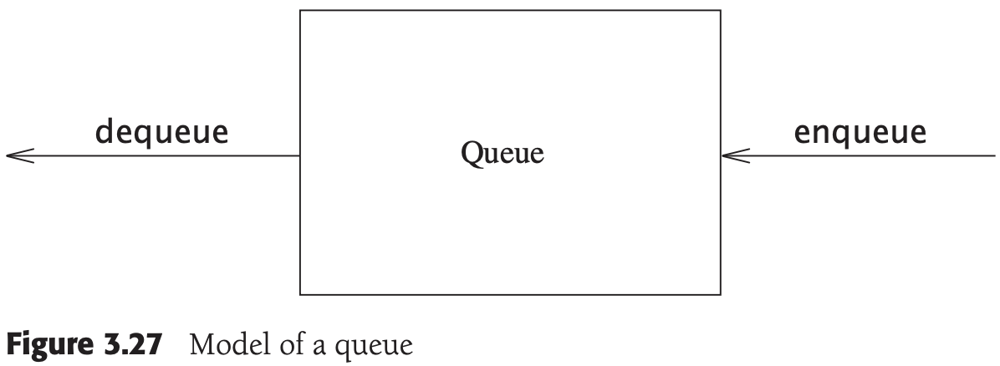

[中文版](queue_zh.md) | English

# Queue

[TOC]

A queue is a collection of entities that are maintained in a sequence and can be modified by the addition of entities at one end of the sequence and the removal of entities from the other end of the sequence.

## Implement

