[中文版](queue_zh.md) | English

# Queue

[TOC]


A queue is a linear data structure that follows the **FIFO** (First In First Out) Principle, so the first element inserted is the first to be popped out.

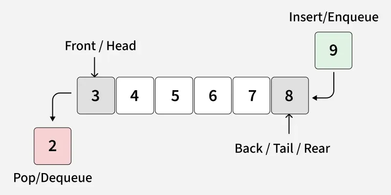

## Types

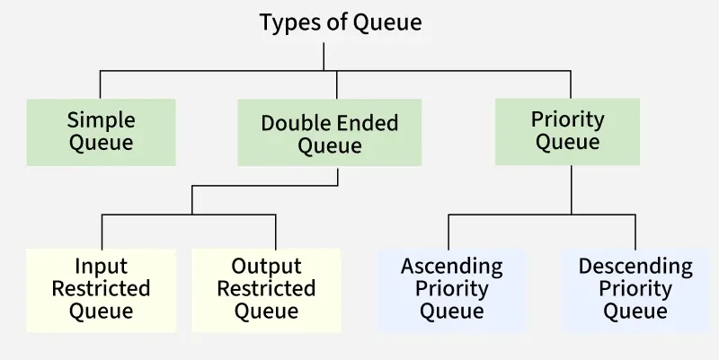

- Simple Queue

  A simple queue follows the FIFO (First In, First Out) principle.

  - Insertion is allowed only at the rear (back).
  - Deletion is allowed only from the front.
  - Can be implemented using a linked list or a circular array.

- Double-Ended Queue (Deque)

  In a deque, insertion and deletion can be performed from both ends.

- Priority Queue

  A queue where each element is assigned a **priority**, and deletion always happens based on priority (not just position).


## Operations

### Enqueue

Examples:

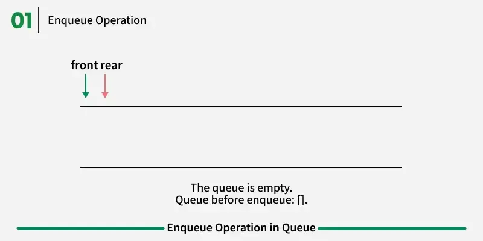

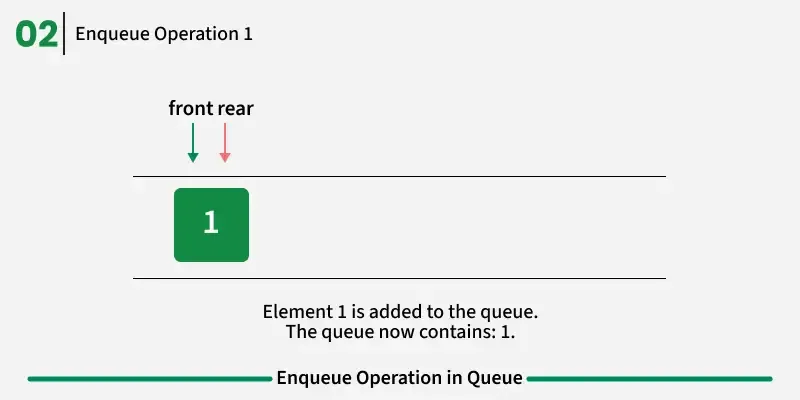

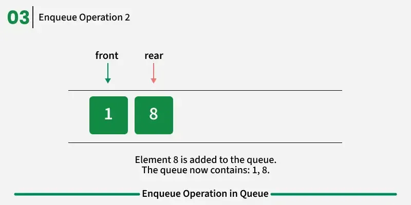

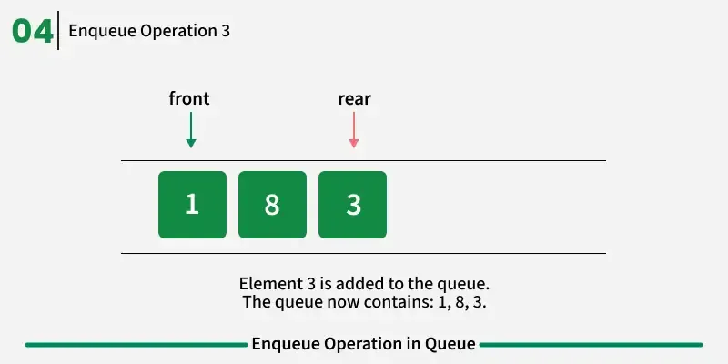

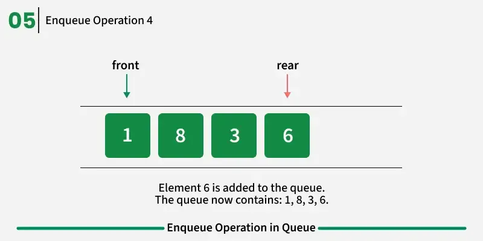

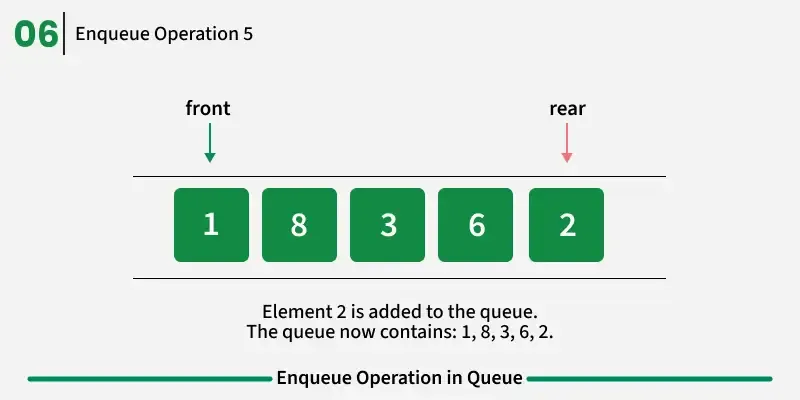

Complexity:

| Scenario     | Time Complexity | Space Complexity |
| :----------- | :-------------- | :--------------- |
| Best Case    | $O(1)$          | $O(1)$           |
| Average Case | $O(1)$          | $O(1)$           |
| Worst Case   | $O(1)$          | $O(1)$           |

### Dequeue

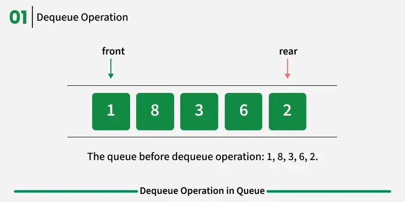

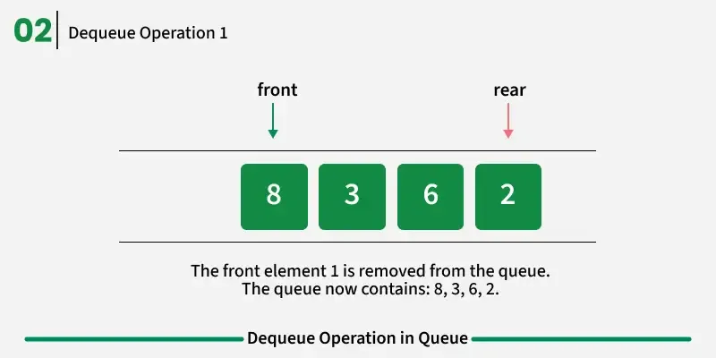

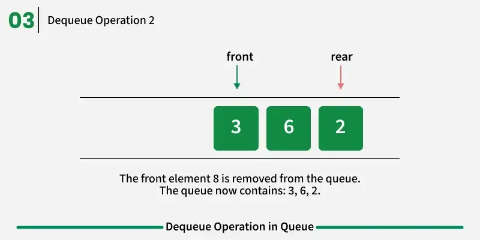

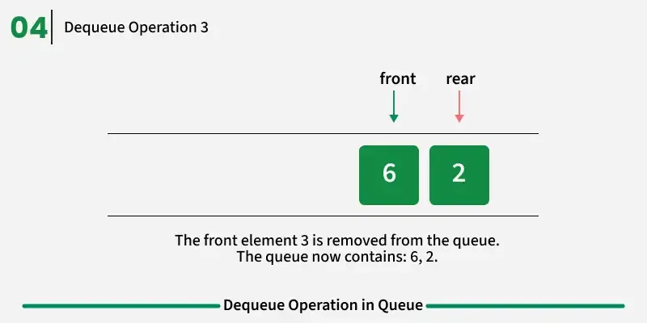

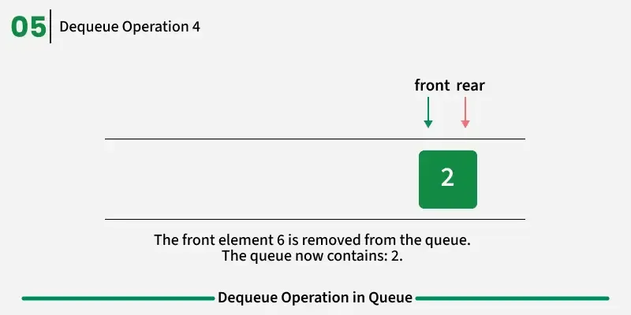

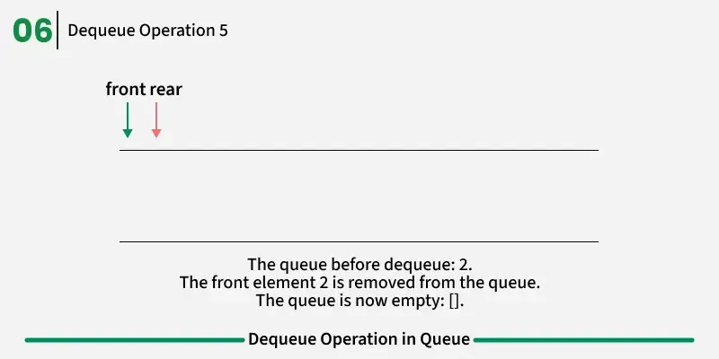

Complexity:

| Scenario     | Time Complexity | Space Complexity |
| :----------- | :-------------- | :--------------- |
| Best Case    | $O(1)$          | $O(1)$           |
| Average Case | $O(1)$          | $O(1)$           |
| Worst Case   | $O(1)$          | $O(1)$           |

### Front

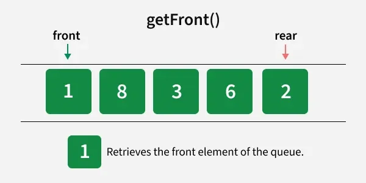

Complexity:

| Scenario     | Time Complexity | Space Complexity |
| :----------- | :-------------- | :--------------- |
| Best Case    | $O(1)$          | $O(1)$           |
| Average Case | $O(1)$          | $O(1)$           |
| Worst Case   | $O(1)$          | $O(1)$           |

### Rear

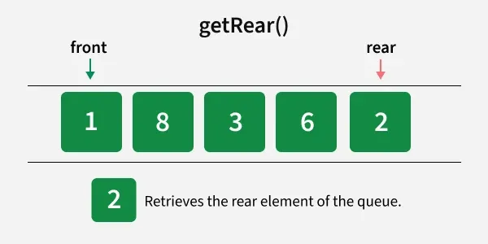

Complexity:

| Scenario     | Time Complexity | Space Complexity |
| :----------- | :-------------- | :--------------- |
| Best Case    | $O(1)$          | $O(1)$           |
| Average Case | $O(1)$          | $O(1)$           |
| Worst Case   | $O(1)$          | $O(1)$           |

### Is Empty

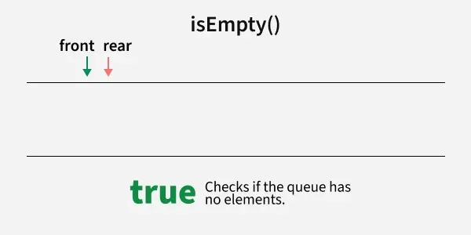

Complexity:

| Scenario     | Time Complexity | Space Complexity |
| :----------- | :-------------- | :--------------- |
| Best Case    | $O(1)$          | $O(1)$           |
| Average Case | $O(1)$          | $O(1)$           |
| Worst Case   | $O(1)$          | $O(1)$           |

### Size

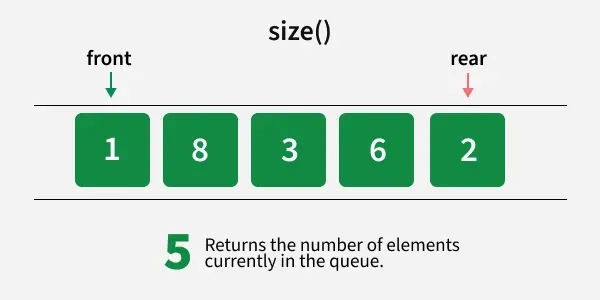

Complexity:

| Scenario     | Time Complexity | Space Complexity |
| :----------- | :-------------- | :--------------- |
| Best Case    | $O(1)$          | $O(1)$           |
| Average Case | $O(1)$          | $O(1)$           |
| Worst Case   | $O(1)$          | $O(1)$           |


## Implement

### Using a fixed-size array

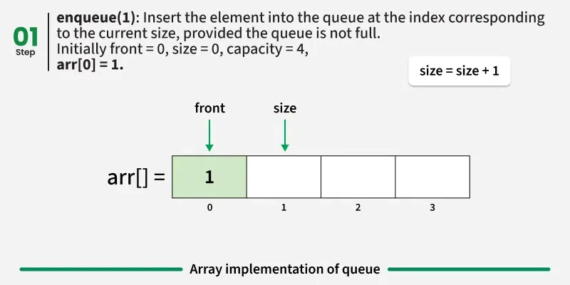

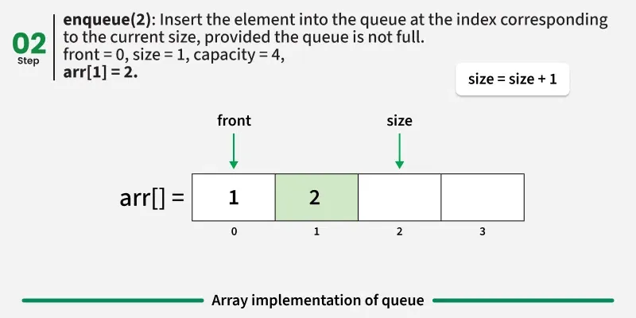

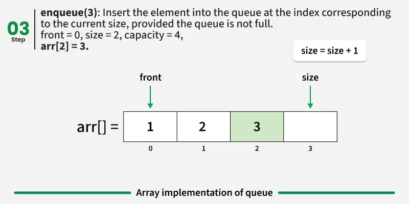

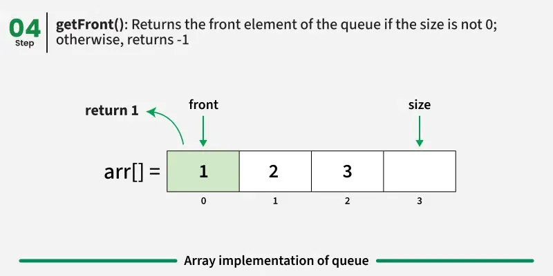

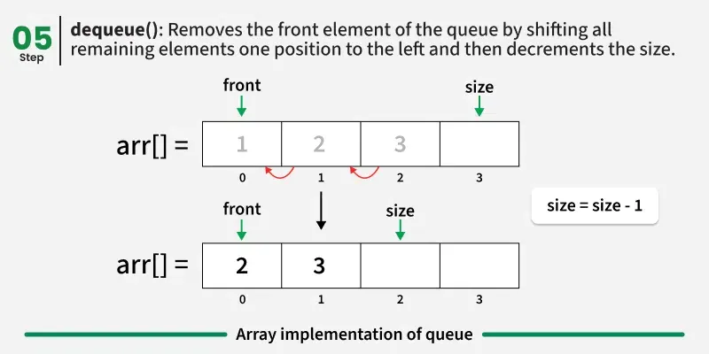

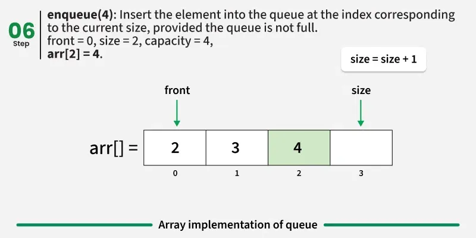

Implement:

```c++
class Queue 
{
    // Array to store queue elements.
    int* arr;
    
    //Maximum number of elements the queue can hold.
    int capacity;
    
    // Current number of elements in the queue.
    int size;
    
public:
    Queue(int c) 
    {
        capacity = c;
        arr = new int[capacity];
        size = 0;
    }

    ~Queue() { delete[] arr; }

    void enqueue(int x) 
    {
        if (size == capacity) 
            return;
    
        arr[size++] = x;
    }

    void dequeue() 
    {
        if (size == 0)
            return;
    
        for (int i = 1; i < size; i++)
            arr[i-1] = arr[i];

        size--;
    }

    int get_front() 
    {
        if (size == 0)
            return -1;
        
        return arr[0];
    }

    int get_rear() 
    {
        if (is_empty())
            return -1;

        return arr[size - 1];
    }

    bool is_empty() { return size == 0; }

    bool is_full() { return size == capacity; }
  
  	void reverse()
    {
        // Base case
        if (is_empty())
            return;

        // Dequeue current item (from front)  
        long long int data = get_front();
        dequeue();

        // Reverse remaining queue  
        reverse();

        // Enqueue current item (to rear)  
        enqueue(data);
    }
};

```

### Using a Linked List

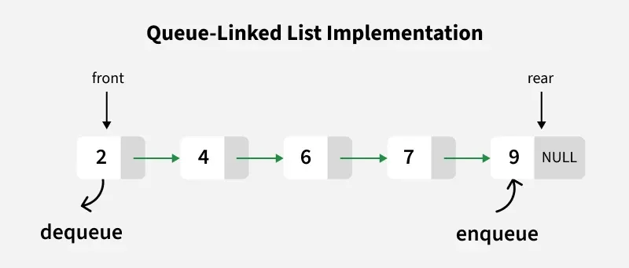

Implement:

```c++
// Node class
class Node 
{
public:
    int data;
    Node* next;
    Node(int new_data) 
    {
        data = new_data;
        next = nullptr;
    }
};

// Queue class
class Queue 
{
private:
    int currSize;
    Node* front;
    Node* rear;

public:
    Queue() 
    {
        currSize = 0;
        front = rear= nullptr;
    }

    // Check if empty
    bool is_empty() { return front == nullptr; }

    // Enqueue
    void enqueue(int new_data) 
    {
        Node* node = new Node(new_data);
        if (is_empty()) 
        {
            front = rear = node;
        } 
        else 
        {
            rear->next = node;
            rear = node;
        }
        
        currSize++;
    }

    // Dequeue
    int dequeue() 
    {
        if (is_empty())
            return -1;
        
        Node* temp = front;
        int removedData = temp->data;
        front = front->next;
        
        if (front == nullptr) 
            rear = nullptr;

        delete temp;
        currSize--;
        return removedData;
    }

    // Get front element
    int get_front() 
    {
        if (is_empty())
            return -1;
            
        return front->data;
    }

    // Get size
    int size() { return currSize; }
  
    void reverse()
    {
        // Base case
        if (is_empty())
            return;

        // Dequeue current item (from front)  
        long long int data = get_front();
        dequeue();

        // Reverse remaining queue  
        reverse();

        // Enqueue current item (to rear)  
        enqueue(data);
    }
};
```


## Circular Queue

A **circular queue** is a linear data structure that overcomes the limitations of a simple queue. In a normal array implementation, dequeue() can be O(n) or we may waste space. Using a circular array, both enqueue() and dequeue() can be done in O(1).

### Implementation of Circular Queue Using an Array

```c++
class Queue 
{
private:
    // Fixed-size array to store queue elements
    int* arr;

    // Index of the front element
    int front;

    // Current number of elements in the queue
    int size;

    // Maximum capacity of the queue
    int capacity;

public:
    // Constructor to initialize the queue with given capacity
    Queue(int cap) 
    {
        capacity = cap;
        arr = new int[capacity]; 
        front = 0;
        size = 0;
    }

    // Destructor to free the allocated memory
    ~Queue() 
    {
        delete[] arr;
    }

    // Insert an element at the rear
    void enqueue(int x) 
    {
        if (size == capacity)
            return;

        int rear = (front + size) % capacity;
        arr[rear] = x;
        size++;
    }

    // Remove an element from the front
    int dequeue() 
    {
        if (size == 0)
            return -1;

        int res = arr[front];
        front = (front + 1) % capacity;
        size--;
        return res;
    }

    // Get the rear element
    int get_rear() 
    {
        if (size == 0)
            return -1;

        int rear = (front + size - 1) % capacity;
        return arr[rear];
    }

    // Get the front element
    int get_front() 
    {
        if (size == 0)
            return -1;

        return arr[front];
    }
};
```


## Queue in C++ STL

Adapter providing FIFO queue semantics.

| Member  | Complexity | Notes                                                        |
| :------ | :--------- | ------------------------------------------------------------ |
| back    | $O(1)$     | Returns a reference to the last element in the container.    |
| emplace | $O(1)$     | (C++11) Constructs and inserts an element at the end of the container. |
| empty   | $O(1)$     | Checks whether the container is empty.                       |
| front   | $O(1)$     | Returns a reference to the first element.                    |
| pop     | $O(1)$     | Removes the first element.                                   |
| push    | $O(1)$     | Adds an element to the end of the container.                 |
| size    | $O(1)$     | Returns the number of elements in the container.             |
| swap    | $O(1)$     | (C++11) Swaps the contents of two containers (no element movement, just swaps internal pointers). |

Example:

```c++
int main()
{
    int a[]{1, 2, 3};
    std::deque<int> values{1, 2, 3};
    std::queue<int> q1(values);                 // initialize from constructed container
    std::queue<int> q2(q1);                     // initialize by copy construction
    std::queue<int> q3(std::move(q2));          // initialize by move construction
    std::queue<int> q4(values.get_allocator()); // initialize with underlying container allocator
    std::queue<int> q5(values, 
        values.get_allocator());                // initialize with specified container and allocator
    std::queue<int> q6(std::move(values), 
        values.get_allocator());                // initialize by moving specified container and allocator
    std::queue<int> q7(q5, 
        values.get_allocator());                // initialize from another container and allocator
    std::queue<int> q8(std::begin(a), 
        std::end(a));                           // initialize from iterators
    std::queue<int> q9(std::begin(a), std::end(a), 
        values.get_allocator());                // initialize with iterators and allocator
    

    int& ret1 = q1.back();  // ret1: 3

    q1.emplace(4);          // q1: [1,2,3,4]

    bool ret2 = q1.empty(); // ret2: false

    int& ret3 = q1.front(); // ret3: 1

    q1.pop();               // q1: [2,3,4]

    q1.push(5);             // q1: [2,3,4,5]

    size_t ret4 = q1.size();// ret4: 4

    q1.swap(q2);            // q1: [], q2: [2,3,4,5]
}
```


## Reference

[1] [Queue Introduction](https://www.geeksforgeeks.org/dsa/introduction-to-queue-data-structure-and-algorithm-tutorials/)

[2] [Basic Operations for Queue Data Structure](https://www.geeksforgeeks.org/dsa/basic-operations-for-queue-in-data-structure/)

[3] [Implementation of Circular Queue Using Array](https://www.geeksforgeeks.org/dsa/introduction-to-circular-queue/)

[4] [Queue - Linked List Implementation](https://www.geeksforgeeks.org/dsa/queue-linked-list-implementation/)