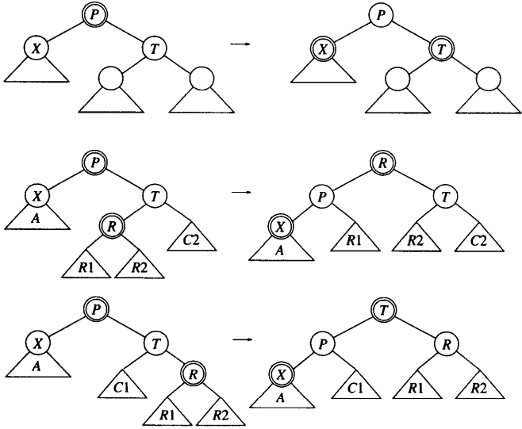

# 红黑树

[TOC]

红黑树是具有下列性质的二叉查找树：

1. 每一个结点或者红色，或者黑色；
2. 根是黑色的；
3. 如果一个结点是红色的，那么它的子结点必须是黑色的；
4. 从一个结点到一个NULL指针的每一条路径都必须包含相同数目的黑色结点。

*红黑树的例子（插入序列为：10, 85, 15, 70, 20, 60, 30, 50, 65, 80, 90, 40, 5, 55）*

## 插入

### 自底向上插入

*如果S是黑色的，则单旋转和之字形旋转有效*

## 删除

### 自顶向下删除

*自顶向下删除*
