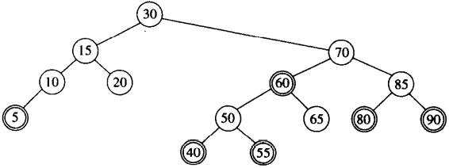
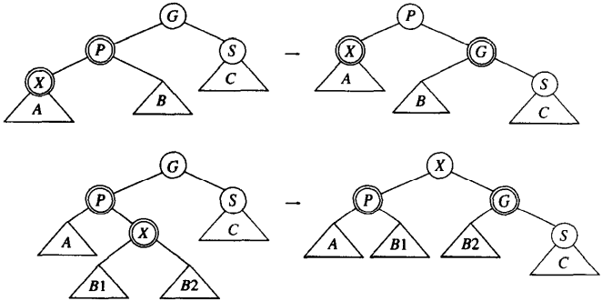

[中文版](rb_tree_zh.md) | English

# Red-Black Tree

[TOC]

A red-black tree is a binary search tree with the following coloring properties:

1. Every node is colored either red or black.
2. The root is black.
3. If a node is red, its children must be black.
4. Every path from a node to a null pointer must contain the same number of black nodes.

*Example of a red-black tree (insertion sequence is: 10, 85, 15, 70, 20, 60, 30, 50, 65, 80, 90, 40, 5, 55)*

## Insert

### Bottom-Up Insertion

*Zig rotation and zig-zag rotation work if S is black*
