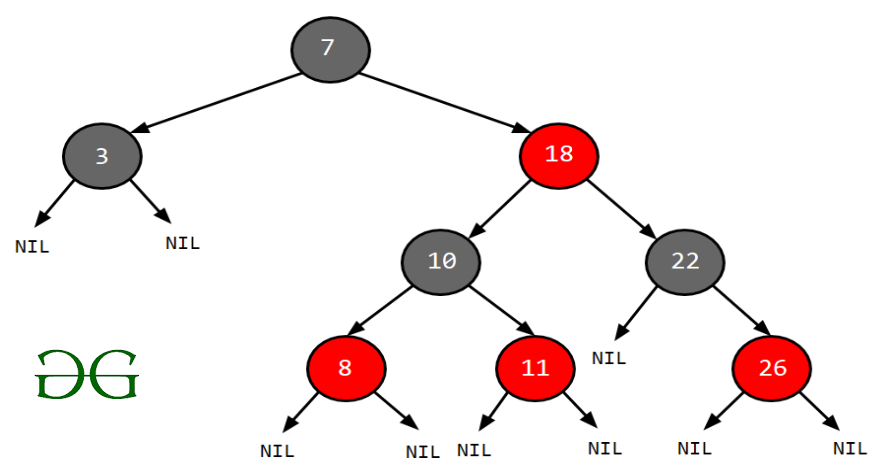
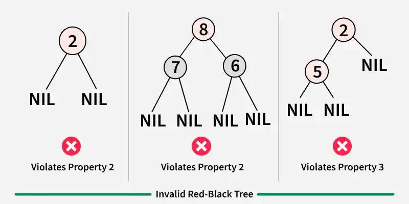
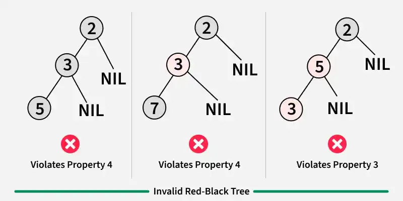
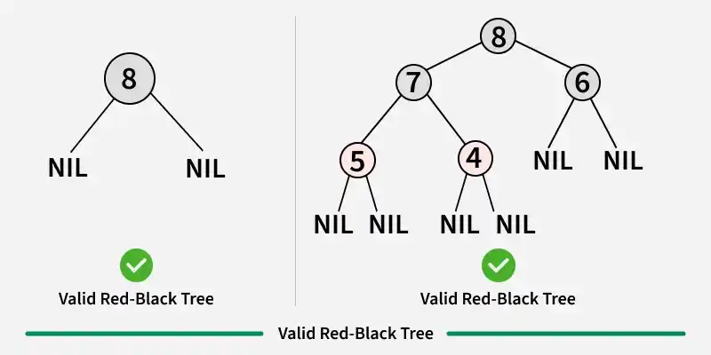
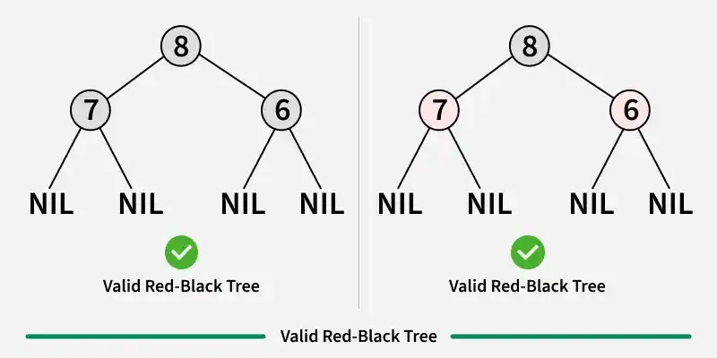
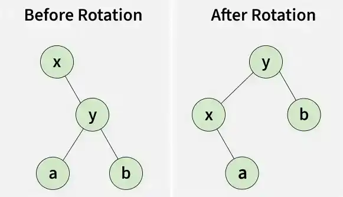
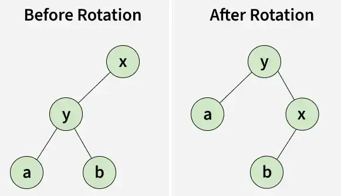
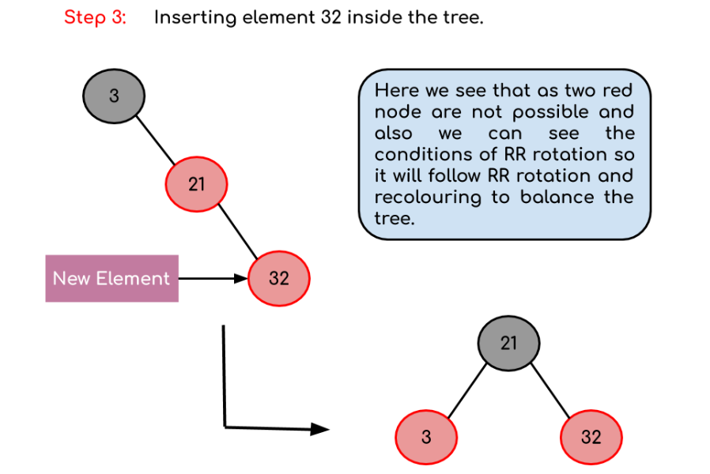
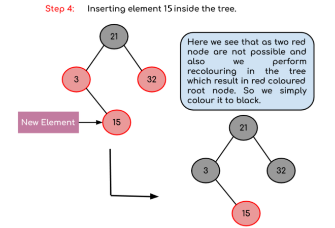

[中文版](rb_tree_zh.md) | English

# Red-Black Tree

[TOC]


A **red-black tree** is a self-balancing binary search tree in which each node of the tree has a color, which can either be red or black.



## Properties

A red-black tree is a binary tree that satisfies the following **red-black properties**:

1. Every node is either red or black.
2. The root is black.
3. Every leaf (NIL) is black.
4. If a node is red, then both its children are black.
5. For each node, all simple paths from the node to descendant leaves contain the same number of black nodes.

**Lemma** A red-black tree with $n$ internal nodes has height at most $2lg(n + 1)$.










## Operations

### Class Define

```c++
// Node creating subclass
struct Node 
{
    int data;
    Node* left;
    Node* right;
    char colour;
    Node* parent;

    Node(int data) : data(data), left(nullptr), right(nullptr), colour('R'), parent(nullptr) {}
};

class RedBlackTree 
{
private:
    Node* root;
    bool ll; // Left-Left Rotation flag
    bool rr; // Right-Right Rotation flag
    bool lr; // Left-Right Rotation flag
    bool rl; // Right-Left Rotation flag

    Node* _insert(Node* target, int data);

public:
    RedBlackTree() : root(nullptr), ll(false), rr(false), lr(false), rl(false) {}

    Node* get_root() { return root; }
    void insert(int data);
    void inorder_traversal(Node* node);
    Node* rotate_left(Node* node);
    Node* rotate_right(Node* node);
    Node* search(int n);
    void remove(int n);
    void remove(Node *v);
    void print(Node* root, int space);
};
```

### Rotation

#### Left Rotate

A left rotation at node x pivots the tree to the left, promoting its right child y to x's former position.

Example:



Implement:

```c++
// Function to perform Left Rotation
Node* RedBlackTree::rotate_left(Node* node) 
{
    Node* x = node->right;
    Node* y = x->left;
    Node* old_parent = node->parent;
    x->left = node;
    node->right = y;
    node->parent = x;
    x->parent = old_parent;
    if (y != nullptr)
        y->parent = node;

    return x;
}
```

Complexity:

| Scenario     | Time Complexity | Space Complexity |
| :----------- | :-------------- | :--------------- |
| Best Case    | $O(1)$            | $O(1)$             |
| Average Case | $O(1)$            | $O(1)$             |
| Worst Case   | $O(1)$            | $O(1)$             |

#### Right Rotate

A right rotation at node x pivots the tree to the right, promoting its left child y to x’s former position. 

Example:



Implement:

```c++
// Function to perform Right Rotation
Node* RedBlackTree::rotate_right(Node* node) 
{
    Node* x = node->left;
    Node* y = x->right;
    Node* old_parent = node->parent;
    x->right = node;
    node->left = y;
    node->parent = x;
    x->parent = old_parent;
    if (y != nullptr)
        y->parent = node;

    return x;
}
```

Complexity:

| Scenario     | Time Complexity | Space Complexity |
| :----------- | :-------------- | :--------------- |
| Best Case    | $O(1)$            | $O(1)$             |
| Average Case | $O(1)$            | $O(1)$             |
| Worst Case   | $O(1)$            | $O(1)$             |

### Insertion

Example:






Implement:

```c++
// Helper function for insertion
Node* RedBlackTree::_insert(Node* target, int data) 
{
    bool f = false; // Flag to check RED-RED conflict
    if (target == nullptr)
        return new Node(data);
    else if (data < target->data) 
    {
        target->left = _insert(target->left, data);
        target->left->parent = target;
        if (target != this->root)
            if (target->colour == 'R' && target->left->colour == 'R')
                f = true;
    } 
    else 
    {
        target->right = _insert(target->right, data);
        target->right->parent = target;
        if (target != this->root)
            if (target->colour == 'R' && target->right->colour == 'R')
                f = true;
    }

    // Perform rotations
    if (ll) 
    {
        target = rotate_left(target);
        target->colour = 'B';
        target->left->colour = 'R';
        ll = false;
    } 
    else if (rr) 
    {
        target = rotate_right(target);
        target->colour = 'B';
        target->right->colour = 'R';
        rr = false;
    } 
    else if (rl) 
    {
        target->right = rotate_right(target->right);
        target->right->parent = target;
        target = rotate_left(target);
        target->colour = 'B';
        target->left->colour = 'R';
        rl = false;
    } 
    else if (lr) 
    {
        target->left = rotate_left(target->left);
        target->left->parent = target;
        target = rotate_right(target);
        target->colour = 'B';
        target->right->colour = 'R';
        lr = false;
    }

    // Handle RED-RED conflicts
    if (f) 
    {
        if (target->parent->right == target) 
        {
            if (target->parent->left == nullptr || target->parent->left->colour == 'B') 
            {
                if (target->left != nullptr && target->left->colour == 'R')
                    rl = true;
                else if (target->right != nullptr && target->right->colour == 'R')
                    ll = true;
            } 
            else 
            {
                target->parent->left->colour = 'B';
                target->colour = 'B';
                if (target->parent != this->root)
                    target->parent->colour = 'R';
            }
        } 
        else 
        {
            if (target->parent->right == nullptr || target->parent->right->colour == 'B') 
            {
                if (target->left != nullptr && target->left->colour == 'R')
                    rr = true;
                else if (target->right != nullptr && target->right->colour == 'R')
                    lr = true;
            } 
            else 
            {
                target->parent->right->colour = 'B';
                target->colour = 'B';
                if (target->parent != this->root)
                    target->parent->colour = 'R';
            }
        }
        f = false;
    }
    return target;
}

// Function to insert data into the tree
void RedBlackTree::insert(int data) 
{
    if (root == nullptr) 
    {
        root = new Node(data);
        root->colour = 'B';
        root->parent = nullptr;
    } 
    else
    {
        root = _insert(root, data);
        root->colour = 'B';
        root->parent = nullptr;
    }
}
```

Complexity:

| Scenario     | Time Complexity | Space Complexity |
| :----------- | :-------------- | :--------------- |
| Best Case    | $O(1)$            | $O(1)$             |
| Average Case | $O(\log n)$        | $O(\log n)$         |
| Worst Case   | $O(\log n)$        | $O(\log n)$         |

### Searching

Implement:

```c++
Node* RedBlackTree::search(int n) 
{
    Node* temp = root;
    while (temp != nullptr) 
    {
        if (n < temp->data)
            temp = temp->left;
        else if (n > temp->data)
            temp = temp->right;
        else
            return temp;
    }
    return nullptr;
}
```

Complexity:

| Scenario     | Time Complexity | Space Complexity |
| :----------- | :-------------- | :--------------- |
| Best Case    | $O(1)$          | $O(1)$           |
| Average Case | $O(\log n)$    | $O(1)$           |
| Worst Case   | $O(\log n)$    | $O(1)$           |

### Remove

Implement:

```c++
void RedBlackTree::remove(int n) 
{
    if(root == NULL)
        // Tree is empty
        return;

    Node *v = search(n), *u;
    if(v->data != n)
        return;

    remove(v);
}

void RedBlackTree::remove(Node *v)
{
    if(v == nullptr) 
        return;

    Node* y = v;
    Node* x = nullptr;
    Node* x_parent = nullptr;
    char y_original_color = y->colour;

    // Find node to splice out (y)
    if(v->left == nullptr) 
    {
        x = v->right;
        x_parent = v->parent;
        if(v->parent == nullptr) 
        {
            root = x;
            if(x) 
                x->parent = nullptr;
        } 
        else if(v == v->parent->left) 
        {
            v->parent->left = x;
            if(x) 
                x->parent = v->parent;
        } else {
            v->parent->right = x;
            if(x) 
                x->parent = v->parent;
        }
    } 
    else if(v->right == nullptr) 
    {
        x = v->left;
        x_parent = v->parent;
        if(v->parent == nullptr) 
        {
            root = x;
            if(x) 
                x->parent = nullptr;
        } 
        else if(v == v->parent->left) 
        {
            v->parent->left = x;
            if(x) 
                x->parent = v->parent;
        } 
        else 
        {
            v->parent->right = x;
            if(x) 
                x->parent = v->parent;
        }
    } 
    else 
    {
        // Find successor
        Node* succ = v->right;
        while (succ->left != nullptr) 
            succ = succ->left;

        y_original_color = succ->colour;
        x = succ->right;
        if(succ->parent == v) 
        {
            if(x) 
                x->parent = succ;

            x_parent = succ;
        } 
        else 
        {
            if(succ->parent) 
                succ->parent->left = x;

            if(x) 
                x->parent = succ->parent;

            succ->right = v->right;
            if(succ->right) 
                succ->right->parent = succ;

            x_parent = succ->parent;
        }
        // Replace v with succ
        if(v->parent == nullptr)
            root = succ;
        else if(v == v->parent->left)
            v->parent->left = succ;
        else
            v->parent->right = succ;

        succ->parent = v->parent;
        succ->left = v->left;
        if(succ->left) 
            succ->left->parent = succ;

        succ->colour = v->colour;
    }

    // Fix-up if needed
    if(y_original_color == 'B') 
    {
        // RB-Delete-Fixup
        Node* cur = x;
        Node* parent = x_parent;
        while ((cur != root) && (cur == nullptr || cur->colour == 'B')) 
        {
            if(parent == nullptr) 
                break;

            if(cur == parent->left) 
            {
                Node* w = parent->right;
                if(w && w->colour == 'R') 
                {
                    w->colour = 'B';
                    parent->colour = 'R';
                    rotate_left(parent);
                    w = parent->right;
                }
                if((w == nullptr || ((w->left == nullptr || w->left->colour == 'B') && (w->right == nullptr || w->right->colour == 'B')))) 
                {
                    if(w) 
                        w->colour = 'R';

                    cur = parent;
                    parent = cur->parent;
                } 
                else 
                {
                    if(w && (w->right == nullptr || w->right->colour == 'B')) 
                    {
                        if(w->left) 
                            w->left->colour = 'B';
                        if(w) 
                            w->colour = 'R';
                        if(w) 
                            rotate_right(w);
                        w = parent->right;
                    }
                    if(w) 
                        w->colour = parent->colour;

                    parent->colour = 'B';
                    if(w && w->right) 
                        w->right->colour = 'B';

                    rotate_left(parent);
                    cur = root;
                    break;
                }
            } 
            else 
            {
                Node* w = parent->left;
                if(w && w->colour == 'R') 
                {
                    w->colour = 'B';
                    parent->colour = 'R';
                    rotate_right(parent);
                    w = parent->left;
                }
                if((w == nullptr || ((w->left == nullptr || w->left->colour == 'B') && (w->right == nullptr || w->right->colour == 'B')))) 
                {
                    if(w) 
                        w->colour = 'R';

                    cur = parent;
                    parent = cur->parent;
                } 
                else 
                {
                    if(w && (w->left == nullptr || w->left->colour == 'B')) 
                    {
                        if(w->right) 
                            w->right->colour = 'B';
                        if(w) 
                            w->colour = 'R';
                        if(w) 
                            rotate_left(w);
                        w = parent->left;
                    }
                    if(w) 
                        w->colour = parent->colour;

                    parent->colour = 'B';
                    if(w && w->left) 
                        w->left->colour = 'B';

                    rotate_right(parent);
                    cur = root;
                    break;
                }
            }
        }
        if(cur) 
            cur->colour = 'B';
    }

    delete v;
}
```

Complexity:

| Scenario     | Time Complexity | Space Complexity |
| :----------- | :-------------- | :--------------- |
| Best Case    | $O(1)$          | $O(1)$           |
| Average Case | $O(\log n)$    | $O(1)$           |
| Worst Case   | $O(\log n)$    | $O(1)$           |


## Summary

### Read-Black Tree vs Heap

|                             Heap                             |                        Red Black Tree                        |
| :----------------------------------------------------------: | :----------------------------------------------------------: |
|  You can't find an arbitrary element in a heap in O(log N).  | 1. You can find an arbitrary element in a Red-Black Tree in O(log N). |
|           Implement using a complete binary tree.            |   2. Implement using a self-balancing binary search tree.    |
| Ordering, parent < children in Min Heap and parent > children in Max Heap. |       3. Ordering, left child < parent < right child.        |
| The structure is implicit, the root is at position 0, and the children of the root are at 1 and 2, so no overhead per element. | 4. Pointers are used to represent the structure of the tree, so overhead per element. |
|         Typical use, priority queue, and heap sort.          | 5. Typical use: TreeSet, TreeMap, and HashMap in the Java Collections Library, and an ordered map in C++ STL. |
|      Heap does not support efficient search operations.      | Red-black tree provides efficient search operations due to its ordered binary search tree data structure. |
|          Requires less space than a red-black tree.          |       Requires more space as it stores data of colour.       |
|                 Specialized data structure.                  |               General-purpose data structure.                |
| Heap has a simpler deletion operation compared to a red-black tree since it only involves removing the root node and then fixing the heap property by swapping nodes. | Red-black tree, on the other hand, requires more complex rotations and color changes to maintain the balance property. |

### Red-Black Tree vs AVL Tree

| Basis of Comparison | Red-Black Tree                                               | AVL Tree                                                     |
| ------------------- | ------------------------------------------------------------ | ------------------------------------------------------------ |
| Balancing           | Relaxed balancing. No path is more than twice as long as any other. | Strict balancing. Height difference between subtrees <= 1.   |
| Search (Lookups)    | Slower than AVL because the tree can be taller.              | Faster than Red-Black because the tree is more compact.      |
| Insertion/Deletion  | Faster. Requires fewer rotations to maintain balance.        | Slower. Requires more frequent and complex rotations.        |
| Storage             | Lower overhead. Needs only 1 bit per node for color.         | Higher overhead. Needs to store the height/balance factor (integer) per node. |
| Rotations           | Max 2 rotations for insertion; Max 3 for deletion.           | Can require up to O(log n) rotations in the worst case.      |


## Reference

[1] Thomas H.Cormen; Charles E.Leiserson; Ronald L. Rivest; Clifford Stein. Introduction to Algorithms. 3th Edition

[2] Mark Allen Weiss.Data Structures and Algorithm Analysis in C++. 4ED

[3] [Introduction to Red-Black Tree](https://www.geeksforgeeks.org/dsa/introduction-to-red-black-tree/)

[4] [What is the difference between Heap and Red-Black Tree](https://www.geeksforgeeks.org/dsa/what-is-the-difference-between-heap-and-red-black-tree/)

[5] [Red-Black Tree definition & meaning in DSA](https://www.geeksforgeeks.org/dsa/red-black-tree-definition-meaning-in-dsa/)

[6] [Red Black Tree vs AVL Tree](https://www.geeksforgeeks.org/dsa/red-black-tree-vs-avl-tree/)

[7] [Red-Black Tree](https://www.programiz.com/dsa/red-black-tree)

[8] [Insertion in Red-Black Tree](https://www.geeksforgeeks.org/dsa/insertion-in-red-black-tree/)
