# Recursion

[TOC]


The process in which a function calls itself directly or indirectly is called **recursion**, and the corresponding function is called a **recursive function**.

## Types

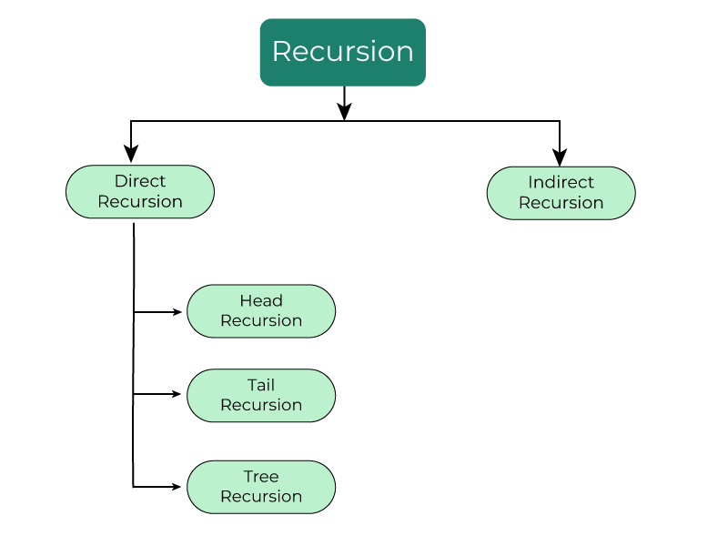

### Direct Recursion

Direct recursion occurs when a function calls itself directly from within its body. 

#### Head Recursion

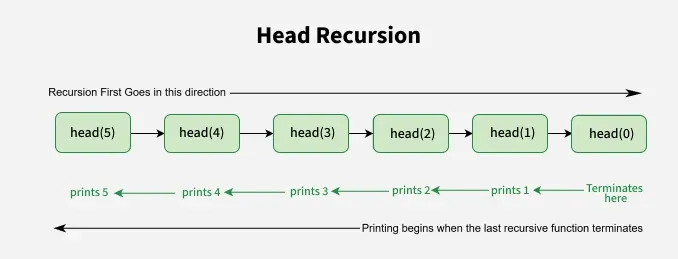

```c++
void head(int n)
{
  if (n != 0)
  	head(n - 1); // Recursive call before processing
  std::cout << n << std::endl;
}

head(5);
```

In head recursion, the recursive call happens before any processing in the function. The function calls itself first and processes later.

#### Tail Recursion

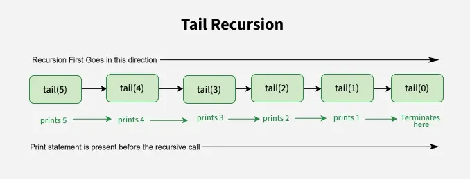

```c++
void tail(int n)
{
  if (n == 0)
    return;
  std::cout << n << std::endl;
  tail(n - 1); // Recursive call after processing
}

tail(5);
```

In tail recursion, the function processes first, and the recursive call is the last operation.

#### Tree Recursion

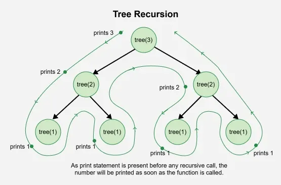

```c++
void tree(int n)
{
  if (n == 0)
    return;
  std::cout << n << std::endl;
  // Two recursive calls
  tree(n - 1); 
  tree(n - 1);
}

tree(3);
```

Tree recursion happens when a function calls itself more than once within its body, forming a tree-like structure.

#### Nested Recursion

```c++
int nested(int n)
{
  if n > 100
    return n - 10;
  
  nested(nested(n + 11)); // Recursive call inside another recursive call
}

nested(95);
```

Nested recursion means the argument to a function is itself a recursive call.

### Indirect Recursion

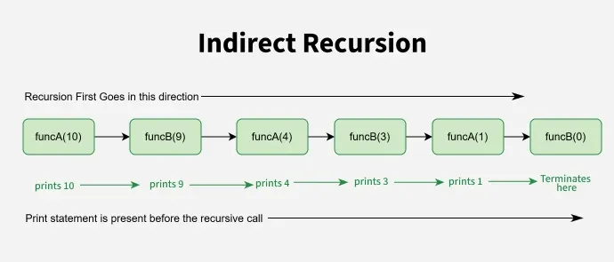

```c++
void fun1(int);
void fun2(int);

void fun1(int n)
{
  if (n > 0)
  {
    std::cout << n << std::endl;
    fun2(n - 1);
  }
}

void fun2(int n)
{
  if (n > 0)
  {
    std::cout << n << std::endl;
    fun1(n / 2);
  }
}

fun1(10);
```

In indirect recursion, a function does not call itself directly. Instead, it calls another function that eventually calls the first one, creating a chain of calls.


## Implement

Steps to implement recursion:

1. **Define a base case:** Identify the simplest (or base) case for which the solution is known or trivial. This is the stopping condition for the recursion, as it prevents the function from infinitely calling itself.
2. **Define a recursive case:** Define the problem in terms of smaller subproblems. Break the problem down into smaller versions of itself, and call the function recursively to solve each subproblem.
3. **Ensure the recursion terminates:** Make sure that the recursive function eventually reaches the base case, and does not enter an infinite loop.
4. **Combine the solutions:** Combine the solutions of the subproblems to solve the original problem.

### Example 1: Sum of Natural Numbers

```c++
#include <iostream>
using namespace std;

int sum(int  n)
{    
    // base condition
    if (n == 1)
     return  1 ;
     
    return n + sum(n - 1); 
}

int main() 
{
    int n = 5 ;
    cout <<  sum(n); 
    return 0;
}
```

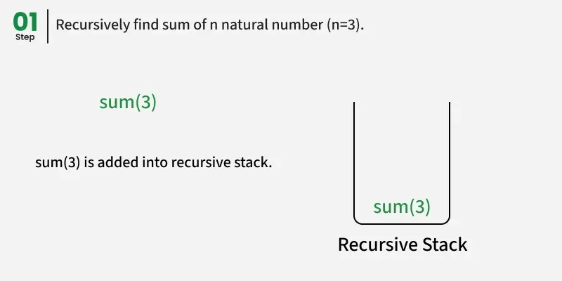


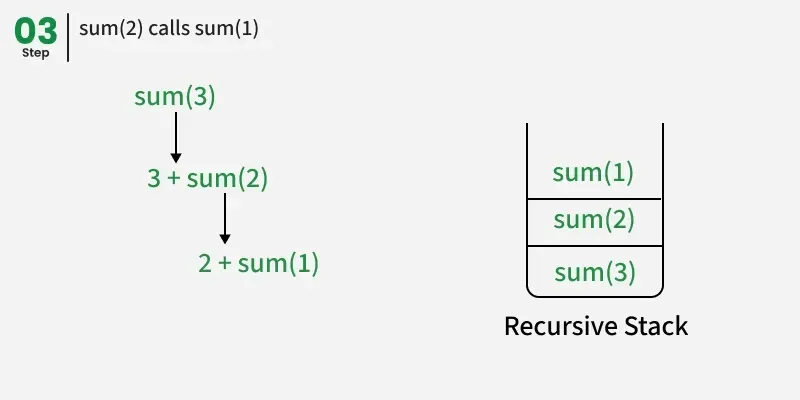

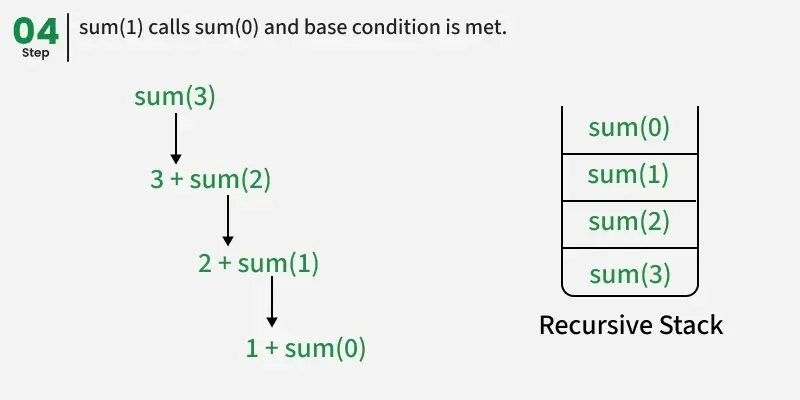

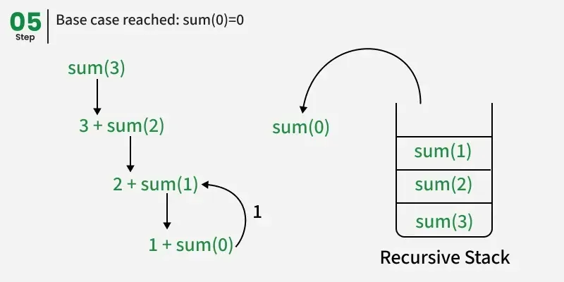

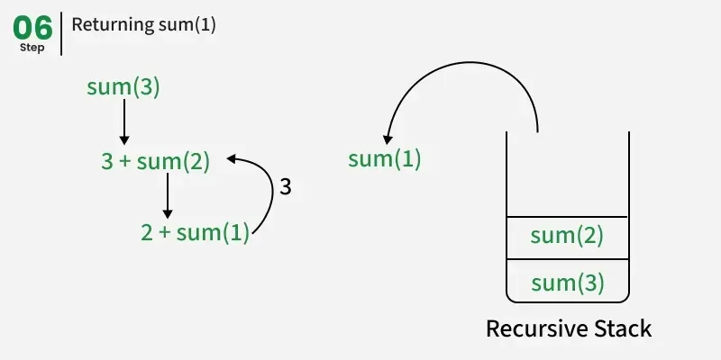

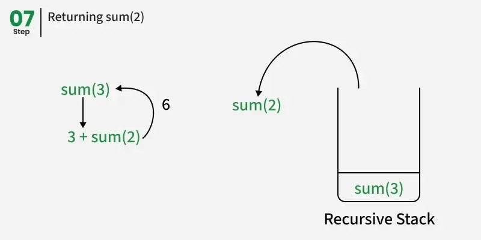

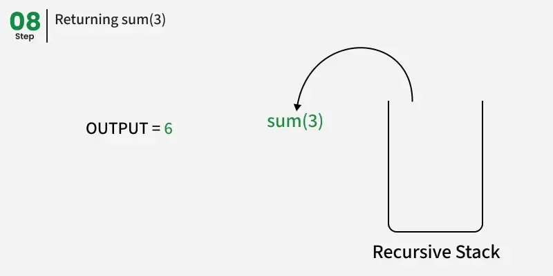

### Example 2: Factorial of a Number

```c++
#include <iostream>
using namespace std;

int fact(int n)
{
    // BASE CONDITION
    if (n == 0)
        return 1;
  
    return n * fact(n - 1);
}

int main()
{
    cout << "Factorial of 5 : " << fact(5);
    return 0;
}
```

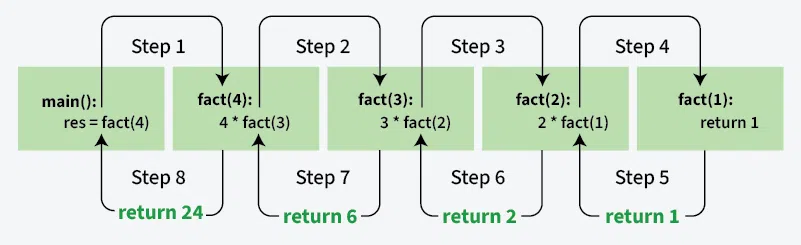


## Challange

### Stack Overflow Error

If the base case is not reached or not defined, then the stack overflow problem may arise. For example:

```c++
int fact(int n)
{
    if(n == 100) // if n < 100 at the first time, n will never reach 100
        return 1;
    else
        return n * fact(n - 1);
}
```

### Memory Allocation

Recursion uses more memory to store data of every recursive call in an internal function call stack.

- Whenever we call a function, its record is added to the stack and remains there until the call is finished.
- The internal systems use a stack because function calling follows LIFO structure, the last called function finishes first.

Example:

```c++
void printFun(int test)
{
    if (test < 1)
        return;
    else {
        cout << test << " ";
        printFun(test - 1); // statement 2
        cout << test << " ";
        return;
    }
}

// Driver Code
int main()
{
    int test = 3;
    printFun(test);
}
```

The memory stack grows with each function call and shrinks as the recursion unwinds, following the LIFO structure:

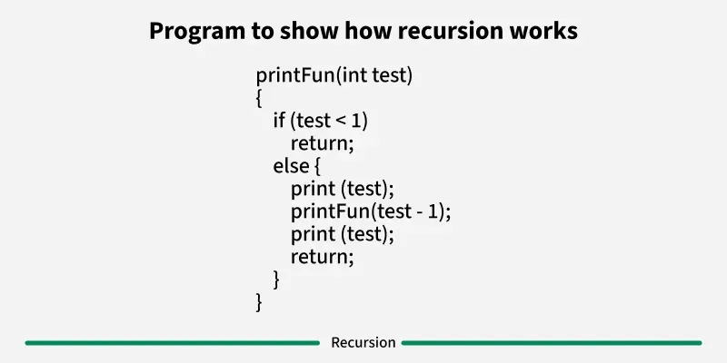

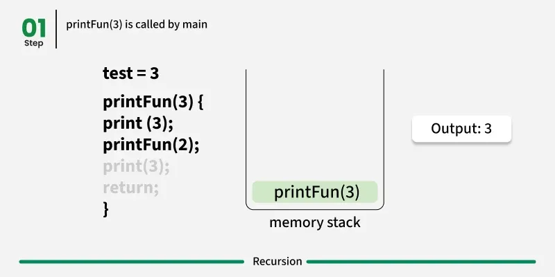

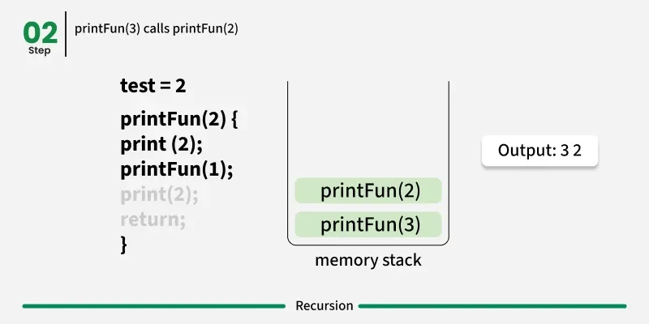

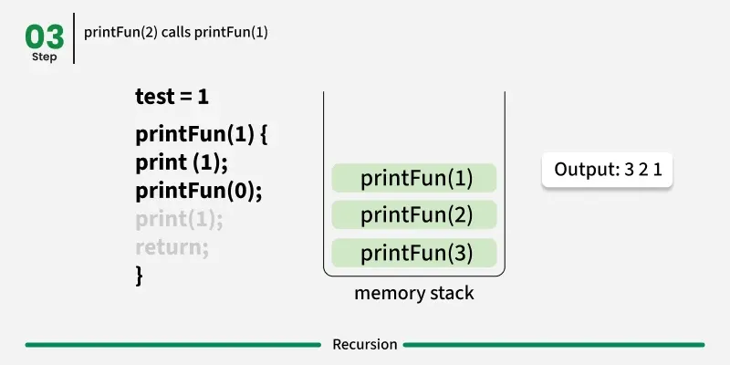

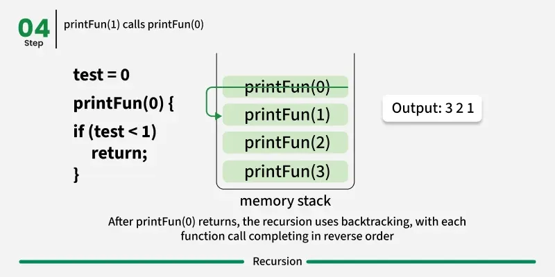

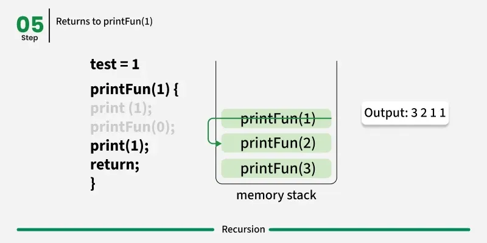

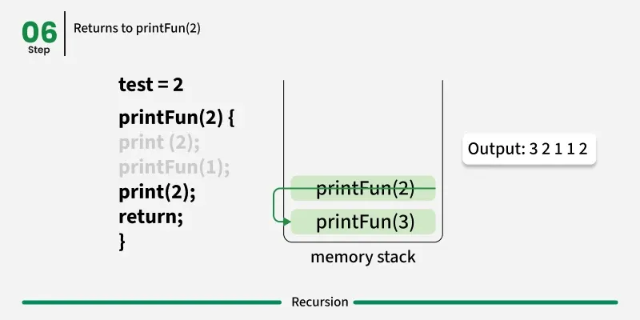

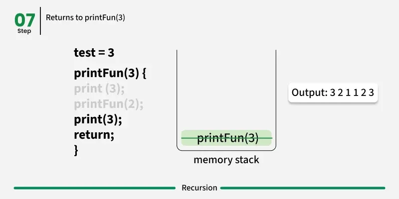


## Summary

### Direct vs Indirect Recursion

A function is called **direct recursive** if it calls itself directly during its execution. In other words, the function makes a recursive call to itself within its own body.

An **indirect recursive function** is one that calls another function, and that other function, in turn, calls the original function either directly or through other functions. This creates a chain of recursive calls involving multiple functions, as opposed to direct recursion, where a function calls itself.

### Recursive vs Iterative Programming

The advantages of recursive programming over iterative programming:

- Recursion provides a clean and simple way to write code.
- Some problems are inherently recursive, like tree traversals, Tower of Hanoi, etc.

The disadvantages of recursive programming over iterative programming:

- Recursive programs typically have more space requirements and also more time to maintain the recursion call stack.
- Recursion can make the code more difficult to understand and debug, since it requires thinking about multiple levels of function calls.


## Reference

[1] [Introduction to Recursion](https://www.geeksforgeeks.org/dsa/introduction-to-recursion-2/)

[2] [Types of Recursion in C++](https://www.geeksforgeeks.org/cpp/types-of-recursion-in-cpp/)