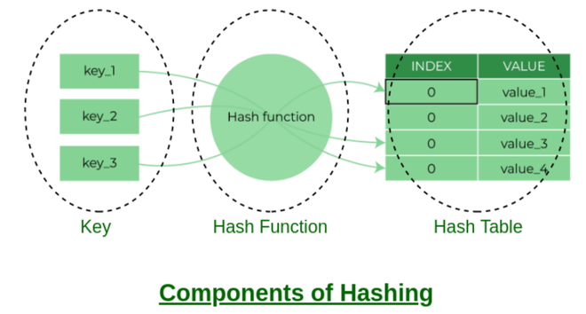
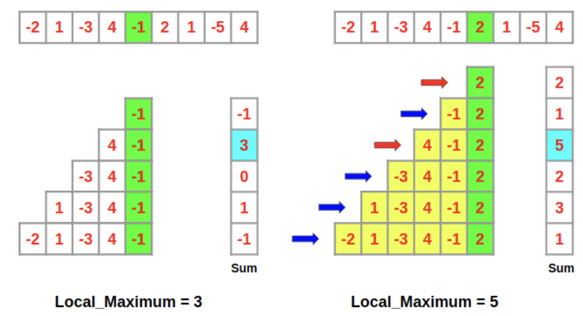

# Search Algorithm Summary

[TOC]


## Linear Search

### Step

Start at the beginning of the data set(usually index 0). Next, perform the following two steps in a loop:

1. Compare the current element with the target value you are searching for:
   - if the current element matches the target: the search is successful, return;
   - if the current element does not match the target: move to the next element in the list;
   - if the end of the list is reached and no match was found: the search is unsuccessful, return.

Repeat above steps until the target is found or you have checked every item in the list.

### Implement

```c++
int linear_search(const std::vector<int>& arr, int target)
{
    for (size_t i = 0; i < arr.size(); ++i)
    {
        if (arr[i] == target)
            return i; // Target found at index i
    }
    return -1; // Target not found
}
```

### Complexity Analysis

Time Complexity:

| Case         | Complexity |
| ------------ | ---------- |
| Best Case    | $O(1)$     |
| Average Case | $O(n)$     |
| Worst Case   | $O(n)$     |


## Binary Search

Binary search is an efficient searching algorithm based on the divide-and-conquer strategy. It leverages the orderliness of data to reduce the search range by half in each round until the target element is found or the search interval becomes empty.

### Step


We first initialize pointers $i = 0$ and $j = n - 1$, pointing to the first and last elements of the array respectively, representing the search interval $[0, n - 1]$. Note that square brackets denote a closed interval, which includes the boundary values themselves.

Next, perform the following two steps in a loop:

1. Calculate the midpoint index $m = \lfloor (i + j) / 2 \rfloor$, where $\lfloor \rfloor$ denotes the floor operation. 

   (to void large number overflow, we typically use the formula $m=\lfloor i + (j - i) / 2 \rfloor$ to calculate the midpoint)

2. Compare $nums[m]$ and $target$, which results in three cases:

   - When $nums[m] < target$, it indicates that $target$ is in the interval $[m + 1, j]$, so execute $i = m + 1$.
   - When $nums[m] > target$, it indicates that $target$ is in the interval $[i, m - 1]$, so execute $j = m - 1$.
   - When $nums[m] = target$, it indicates that $target$ has been found, so return index $m$.

### Implement

```c++
int binary_search(const std::vector<int>& arr, int target)
{
    int left = 0;
    int right = arr.size() - 1;

    while (left <= right) 
    {
        int mid = left + (right - left) / 2;

        if (arr[mid] == target)
            return mid; // Target found at index mid
        else if (arr[mid] < target)
            left = mid + 1; // Search in the right half
        else
            right = mid - 1; // Search in the left half
    }

    return -1; // Target not found
}
```

### Complexity Analysis

Time Complexity:

| Case         | Complexity  |
| ------------ | ----------- |
| Best Case    | $O(1)$      |
| Average Case | $O(\log n)$ |
| Worst Case   | $O(\log n)$ |

Space Complexity(it's refers to the amount of auxiliary memory the algorithm requires):

- Iterative Approach: $O(1)$ (constant space).
- Recursive Approach: $O(\log n)$ (logarithmic space).


## Ternary Search

Ternary search is a divide-and-conquer search algorithm used to find the position of a target value within a monotonically increasing or decreasing function or in a unimodal array.

### Working of Ternary Search

Given an array that first strictly decreases and then strictly increases, we want to find the index of the minimum element. This kind of array is known as a U-shaped or unimodal array; For example:

```markdown
Input: arr[] = [9, 7, 5, 2, 3, 6, 10]
Output: 3
Explanation: The minimum of the given array is 2, which is at index 3.
```

### Implement

```c++
int ternary_search(std::vector<int>& arr)
{
    int low = 0, high = arr.size() - 1, min_index = -1;
    int mid1, mid2;
    while(low <= high)
    {
        mid1 = low + (high - low) / 3;
        mid2 = high - (high - low) / 3;
        if (arr[mid1] == arr[mid2])
        {
            low = mid1 + 1;
            high = mid2 - 1;
            min_index = mid1;
        }
        else if (arr[mid1] < arr[mid2])
        {
            high = mid2 - 1;
            mid_index = mid1;
        }
        else
        {
            low = mid1 + 1;
            min_index = mid2;
        }
    }
    return min_index;
}
```

### Complexity Analysis

Time Complexity:

| Case         | Complexity         |
| ------------ | ------------------ |
| Best Case    | $\Omega (1)$       |
| Average Case | $\Theta(\log_3 n)$ |
| Worst Case   | $O(\log_3 n)$      |


## Tree Search

### Depth-First Search (DFS)

In Depth First Search (DFS) for a graph, we traverse all adjacent vertices one by one. When we traverse an adjacent vertex, we completely finish the traversal of all vertices reachable through that adjacent vertex.

#### WorkFlow

```txt
        A
       /   \
      B     C
     / \   / \
    D   E F   G

DFS Order (Pre-order):  A → B → D → E → C → F → G
DFS Order (In-order):   D → B → E → A → F → C → G
DFS Order (Post-order): D → E → B → F → G → C → A
```

#### Implement

- DFS from a given source of graph

  ```c++
  void dfs(std::vector<std::vector<int>>& arr,
           std::vector<bool>& visited, 
           int s, 
           std::vector<int>& ret)
  {
    visited[s] = true;
    ret.push_back(s);
    for (int i : arr[s])
      if (visited[i] == false)
        dfs(arr, visited, i, ret);
  }
  
  std::vector<int> dfs(std::vector<std::vector<int>>& arr)
  {
    std::vector<bool> visited(arr.size(), false);
    std::vector<int> ret;
    dfs(arr, visited, 0, ret);
    return ret;
  }
  
  std::vector<std::vector<int>> arr = {{1, 2}, {2, 0}, {1, 0, 3, 4}, {2}, {2}};
  auto ret = dfs(arr); // 0 1 2 3 4
  ```

- DFS of a disconnected graph

  ```c++
  void dfs(std::vector<std::vector<int>>& arr,
           std::vector<bool>& visited, 
           int s, 
           std::vector<int>& ret)
  {
    visited[s] = true;
    ret.push_back(s);
    for (int i : arr[s])
      if (visited[i] == false)
        dfs(arr, visited, i, ret);
  }
  
  std::vector<int> dfs(std::vector<std::vector<int>>& arr)
  {
    std::vector<bool> visited(arr.size(), false);
    std::vector<int> ret;
    for (int i = 0; i < arr.size(); i++)
    {
      if (visited[i] == false)
        dfs(arr, visited, i, ret);
    }
    return ret;
  }
  
  std::vector<std::vector<int>> arr = {{3, 2}, {2}, {1, 0}, {0}, {5}, {4}};
  auto ret = dfs(arr); // 0 3 2 1 4 5
  ```

#### Complexity Analysis

1. Time Complexity: $O(V + E)$

   - $V$ is the number of vertices;

   - $E$ is the number of edges in the graph.

2. Auxiliary Space: $O(V + E)$

### Breadth-First Search (BFS)

#### WorkFlow

```txt
         A
       /   \
      B     C
     / \   / \
    D   E F   G
    
    BFS Order (Level-order):  A → B → C → D → E → F → G
```

#### Implement

```c++
std::vector<int> bfs(std::vector<std::vector<int>>& arr)
{
  int v = arr.size();
  std::vector<bool> visited(arr.size(), false);
  std::vector<int> ret;
  std::queue<int> q;
  int src = 0;
  visited[src] = true;
  q.push(src);
  while (!q.empty())
  {
    int curr = q.front();
    q.pop();
    ret.push_back(curr);
    for (int x : arr[curr])
    {
      if (!visited[x])
      {
        visited[x] = true;
        q.push(x);
      }
    }
  }
  return ret;
}

std::vector<std::vector<int>> arr{{1, 2}, {2, 0}, {1, 0, 3, 4}, {2}, {2}};
dfs(arr); // 0 1 2 3 4
```

#### Complexity Analysis

1. Time Complexity: $O(V + E)$

   - $V$ is the number of vertices;

   - $E$ is the number of edges in the graph.

2. Auxiliary Space: $O(w)$, where $w$ = width.

### DFS vs BFS

| Feature            | BFS                    | DFS                        |
| :----------------- | :--------------------- | :------------------------- |
| **Data structure** | Queue (FIFO)           | Stack (LIFO)               |
| **Memory usage**   | O(width) - can be huge | O(depth) - usually smaller |
| **Shortest path**  | ✅ Yes (unweighted)     | ❌ No                       |
| **Completeness**   | ✅ Yes (finite graphs)  | ❌ Not for infinite graphs  |
| **Optimal**        | ✅ Yes (uniform cost)   | ❌ No                       |
| **Better for**     | Closest nodes, levels  | Deep exploration, puzzles  |


## Hash-Based Search

### Step



Check if the $hash(target)$ is in the container

- If so, directly return the index;
- if not, return -1.

### Implement

```c++
const int TABLE_SIZE = 100;

int hash_based_search(const std::vector<std::string>& arr, const std::string& target)
{
    size_t hash_val = std::hash<std::string>{}(target);
    int i = hash_val % TABLE_SIZE;
    if (arr[i] == target)
        return i; // Target found at index i
    return -1; // Target not found
}
```

### Complexity Analysis

| Case         | Complexity |
| ------------ | ---------- |
| Best Case    | $O(1)$     |
| Average Case | $O(1)$     |
| Worst Case   | $O(n)$     |


## Kadane's Algorithm

Kadane's algorithm is an efficient, linear-time method for solving the Maximum Subarray Sum problem, which finds the highest sum of a contiguous subarray within a one-dimensional array. By traversing the array once, it tracks the local maximum sum ending at each position to update the global maximum sum, operating in space.



### Implement

```c++
int kadane(const std::vector<int>& arr)
{
    int ret = 0;
    int sum = 0;
    for (int i = 0; i < arr.size(); ++i)
    {
        sum = 0;
        for (int j = i; j < arr.size(); ++j)
        {
            sum += arr[j];
            ret = (sum > ret) ? sum : ret;
        }
    }
    return ret;
}
```

### Complexity Analysis

| Case         | Time Complexity | Space Complexity |
| ------------ | --------------- | ---------------- |
| Best Case    | $O(n^2)$        | $O(1)$           |
| Average Case | $O(n^2)$        | $O(1)$           |
| Worst Case   | $O(n^2)$        | $O(1)$           |


## Summary

### Complexity Analysis

Comparison of search algorithm efficiency:

|                    | Linear Search | Binary Search         | Tree Search                 | Hash-based Search          | Ternary Search         |
| ------------------ | ------------- | --------------------- | --------------------------- | -------------------------- | ---------------------- |
| Search element     | $O(n)$        | $O(\log n)$           | $O(\log n)$                 | $O(1)$                     | $O(\log_3 n)$         |
| Insert element     | $O(1)$        | $O(n)$                | $O(\log n)$                 | $O(1)$                     | $O(n)$                |
| Delete element     | $O(n)$        | $O(n)$                | $O(\log n)$                 | $O(1)$                     | $O(n)$                |
| Extra space        | $O(1)$        | $O(1)$                | $O(n)$                      | $O(n)$                     | $O(1)$                |
| Data preprocessing | /             | Sorting $O(n \log n)$ | Tree building $O(n \log n)$ | Hash table building $O(n)$ | Sorting $O(n \log n)$ |
| Data ordered       | Unordered     | Ordered               | Ordered                     | Unordered                  | Ordered                |

### Suit Case

Linear search:

- Good generality, requiring no data preprocessing operations;
- Suitable for small data volumes, where time complexity has less impact on efficiency;
- Suitable for scenarios with high data update frequency, as this method does not require any additional data maintenance.

Binary search:

- Suitable for large data volumes with the stable efficiency performance;
- Data volume cannot be too large, as storing arrays requires contiguous memory space;
- Not suitable for scenarios with frequent data insertion and deletion, as maintaining a sorted array has high overhead.

Hash-based search:

- Suitable for scenarios with high query performance requirements;
- Not suitable for scenarios requiring ordered data or range searches, as hash tables cannot maintain data orderliness;
- High dependence on hash functions and hash collision handling strategies, with significant risk of performance degradation;
- Not suitable for excessively large data volumes, as hash tables require extra space to minimize collisions and thus provide good query performance.

Tree search:

- Suitable for massive data, as tree nodes are stored dispersedly in memory;
- Suitable for scenarios requiring maintained ordered data or range searches;
- During continuous node insertion and deletion, binary search trees may become skewed;
- If using AVL trees or red-black trees, all operations can run stably at $O(\log n)$ efficiency, but operations to maintain tree balance add extra overhead.

Ternary search:

- Suitable for finding the maximum or minimum in unimodal functions, where the function first increases and then decreases(or vice versa).
- Also be applied to monotonic functions, but it is generally less efficient than binary search due to its higher number of comparisons.


## Reference

[1] Thomas H.Cormen; Charles E.Leiserson; Ronald L. Rivest; Clifford Stein. Introduction to Algorithms. 3ED

[2] Mark Allen Weiss. Data Structures and Algorithm Analysis in C++. 4ED

[3] [Hello Algo/Chapter 10.  Searching](https://www.hello-algo.com/en/chapter_searching/#chapter-10-searching)

[4] [Ternary Search](https://www.geeksforgeeks.org/dsa/ternary-search/)

[5] [Maximum Subarray Sum - Kadane's Algorithm](https://www.geeksforgeeks.org/dsa/largest-sum-contiguous-subarray/)

[6] [WIKIPEDIA/Maximum subarray problem](https://en.wikipedia.org/wiki/Maximum_subarray_problem)

[7] [Depth First Search or DFS for a Graph](https://www.geeksforgeeks.org/dsa/depth-first-search-or-dfs-for-a-graph/)

[8] [Breadth First Search or BFS for a Graph](https://www.geeksforgeeks.org/dsa/breadth-first-search-or-bfs-for-a-graph/)

