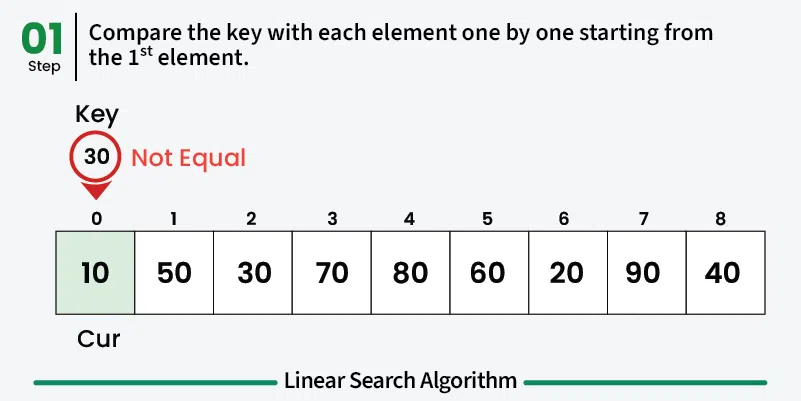
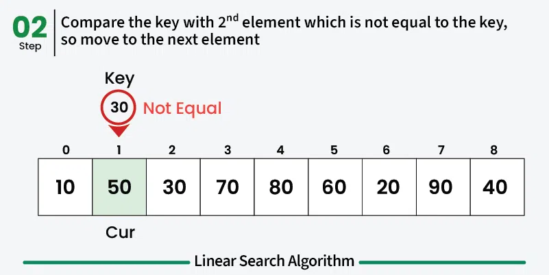
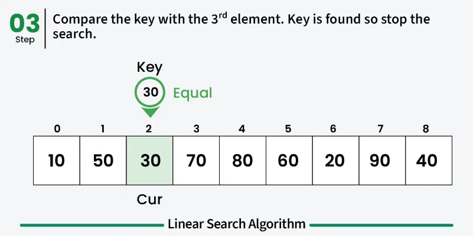
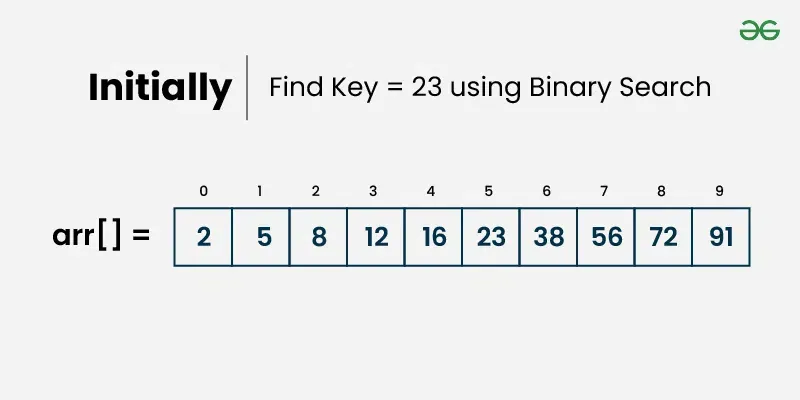
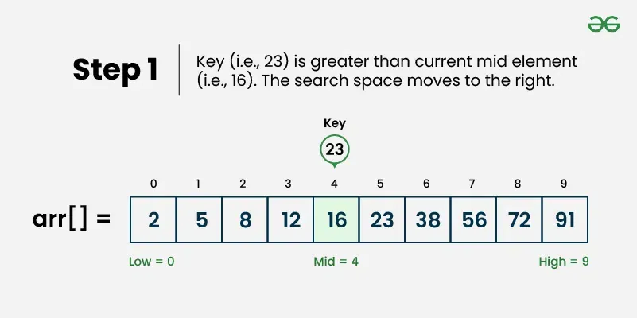
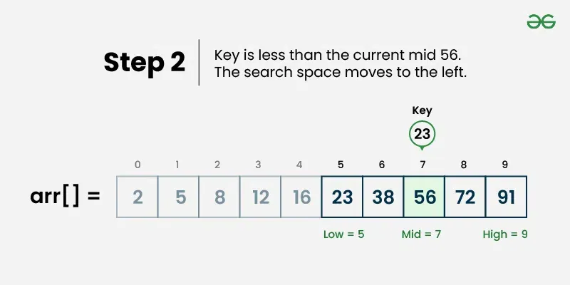
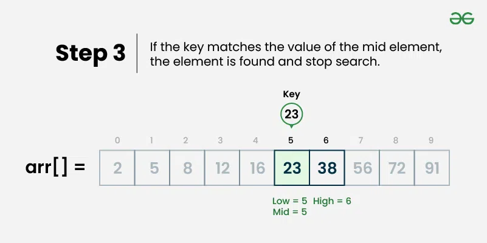
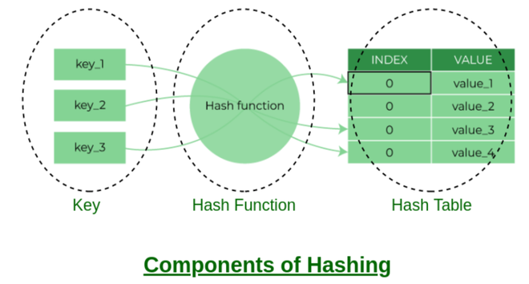
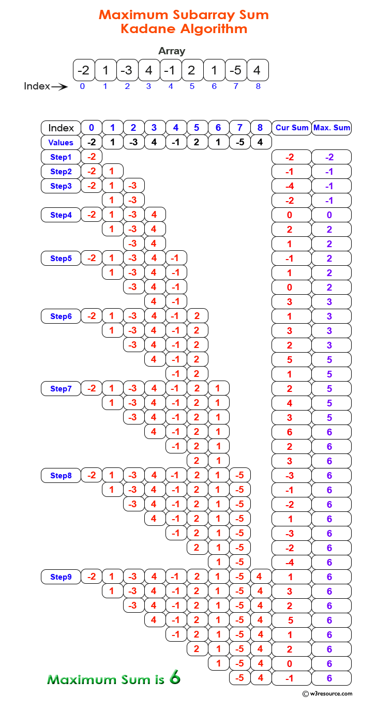

# Search Algorithm Summary

[TOC]


## Linear Search

**Algorithm:**

Start at the beginning of the data set(usually index 0). Next, perform the following two steps in a loop:

1. Compare the current element with the target value you are searching for:
   - If the current element matches the target: the search is successful, return;
   
   - If the current element does not match the target: move to the next element in the list;
   
   - If the end of the list is reached and no match was found, the search is unsuccessful, and return.
   
2. Repeat the above steps until the target is found or you have checked every item in the list.

**Example:**







**Implement:**

```c++
int linear_search(const std::vector<int>& arr, int target)
{
    for (size_t i = 0; i < arr.size(); ++i)
    {
        if (arr[i] == target)
            return i; // Target found at index i
    }
    return -1; // Target not found
}
```

**Complexity:**

| Scenario     | Time Complexity | Space Complexity |
| :----------- | :-------------- | :--------------- |
| Best Case    | $O(1)$          | $O(1)$           |
| Average Case | $O(n)$          | $O(1)$           |
| Worst Case   | $O(n)$          | $O(1)$           |

---


## Binary Search

Binary search is an efficient searching algorithm based on the divide-and-conquer strategy. It leverages the orderliness of data to reduce the search range by half in each round until the target element is found or the search interval becomes empty.

**Algorithm:**

1. Divide the search space into two halves by finding the middle index "mid". 
2. Compare the middle of the search space with the key. 
3. If the key is found in the middle, the process is terminated.
4. If the key is not found in the middle, choose which half will be used as the next search space.
   - If the key is smaller than the middle, then the left side is used for the next search.
   - If the key is larger than the middle, then the right side is used for the next search.
5. This process is continued until the key is found or the total search space is exhausted.

**Example:**









**Implement:**

```c++
int binary_search(const std::vector<int>& arr, int target)
{
    int left = 0;
    int right = arr.size() - 1;

    while (left <= right) 
    {
        int mid = left + (right - left) / 2;

        if (arr[mid] == target)
            return mid; // Target found at index mid
        else if (arr[mid] < target)
            left = mid + 1; // Search in the right half
        else
            right = mid - 1; // Search in the left half
    }

    return -1; // Target not found
}
```

**Complexity:**

| Scenario     | Time Complexity | Space Complexity |
| :----------- | :-------------- | :--------------- |
| Best Case    | $O(1)$          | $O(1)$ (iterative), $O(\log n)$ (recursive) |
| Average Case | $O(\log n)$     | $O(1)$ (iterative), $O(\log n)$ (recursive) |
| Worst Case   | $O(\log n)$     | $O(1)$ (iterative), $O(\log n)$ (recursive) |

---


## Ternary Search

Ternary search is a divide-and-conquer search algorithm used to find the position of a target value within a monotonically increasing or decreasing function or in a unimodal array.

**Algorithm:**

Let mid1 and mid2 be two points dividing the current interval into three equal parts:

- If arr[mid1] < arr[mid2], the minimum lies to the left of mid2
- If arr[mid1] > arr[mid2], the minimum lies to the right of mid1

We continue this until we reduce the search space to a small enough size to directly find the minimum.

**Implement:**

```c++
int ternary_search(std::vector<int>& arr)
{
    int low = 0, high = arr.size() - 1, min_index = -1;
    int mid1, mid2;
    while(low <= high)
    {
        mid1 = low + (high - low) / 3;
        mid2 = high - (high - low) / 3;
        if (arr[mid1] == arr[mid2])
        {
            low = mid1 + 1;
            high = mid2 - 1;
            min_index = mid1;
        }
        else if (arr[mid1] < arr[mid2])
        {
            high = mid2 - 1;
            min_index = mid1;
        }
        else
        {
            low = mid1 + 1;
            min_index = mid2;
        }
    }
    return min_index;
}
```

**Complexity:**

| Scenario     | Time Complexity | Space Complexity |
| :----------- | :-------------- | :--------------- |
| Best Case    | $O(1)$          | $O(1)$ (iterative), $O(\log_3 n)$ (recursive) |
| Average Case | $O(\log_3 n)$   | $O(1)$ (iterative), $O(\log_3 n)$ (recursive) |
| Worst Case   | $O(\log_3 n)$   | $O(1)$ (iterative), $O(\log_3 n)$ (recursive) |

---


## Jump Search

Jump Search is a searching algorithm for sorted arrays. The basic idea is to check fewer elements (than linear search) by jumping ahead by fixed steps or skipping some elements in place of searching all elements.

**Algorithm:**

1. Jump Search is an algorithm for finding a specific value in a sorted array by jumping through certain steps in the array.
2. The steps are determined by the sqrt of the length of the array. 
3. Here is a step-by-step algorithm for the jump search:
4. Determine the step size m by taking the sqrt of the length of the array n.
5. Start at the first element of the array and jump m steps until the value at that position is greater than the target value. Once a value greater than the target is found, perform a linear search starting from the previous step until the target is found or it is clear that the target is not in the array.
   - If the target is found, return its index. 
   - If not, return -1 to indicate that the target was not found in the array. 

**Implement:**

```c++
int jump_search(int arr[], int x, int n)
{
    // Finding block size to be jumped
    int step = std::sqrt(n);

    // Finding the block where element is
    // present (if it is present)
    int prev = 0;
    while (arr[std::min(step, n) - 1] < x)
    {
        prev = step;
        step += std::sqrt(n);
        if (prev >= n)
            return -1;
    }

    // Doing a linear search for x in block
    // beginning with prev.
    while (arr[prev] < x)
    {
        prev++;

        // If we reached next block or end of
        // array, element is not present.
        if (prev == std::min(step, n))
            return -1;
    }
    // If element is found
    if (arr[prev] == x)
        return prev;

    return -1;
}
```

**Complexity:**

| Scenario     | Time Complexity | Space Complexity |
| :----------- | :-------------- | :--------------- |
| Best Case    | $O(1)$          | $O(1)$           |
| Average Case | $O(\sqrt{n})$   | $O(1)$           |
| Worst Case   | $O(\sqrt{n})$   | $O(1)$           |

---


## Interpolation Search

The Interpolation Search is an improvement over [Binary Search](#Binary Search) for instances, where the values in a sorted array are uniformly distributed. Interpolation constructs new data points within the range of a discrete set of known data points. Binary Search always goes to the middle element to check. On the other hand, interpolation search may go to different locations according to the value of the key being searched.

Algorithm:

The rest of the Interpolation algorithm is the same except for the above partition logic. 

- Step1: In a loop, calculate the value of "pos" using the probe position formula. 
- Step2: If it is a match, return the index of the item, and exit. 
- Step3: If the item is less than arr[pos], calculate the probe position of the left sub-array. Otherwise, calculate the same in the right sub-array. 
- Step4: Repeat until a match is found or the sub-array reduces to zero.

Implement:

```c++
// If x is present in arr[0..n-1], then returns
// index of it, else returns -1.
int interpolation_search(int arr[], int lo, int hi, int x)
{
    int pos;

    // Since array is sorted, an element present
    // in array must be in range defined by corner
    if (lo <= hi && x >= arr[lo] && x <= arr[hi]) {

        // Probing the position with keeping
        // uniform distribution in mind.
        pos = lo
              + (((double)(hi - lo) / (arr[hi] - arr[lo]))
                 * (x - arr[lo]));

        // Condition of target found
        if (arr[pos] == x)
            return pos;

        // If x is larger, x is in right sub array
        if (arr[pos] < x)
            return interpolation_search(arr, pos + 1, hi, x);

        // If x is smaller, x is in left sub array
        if (arr[pos] > x)
            return interpolation_search(arr, lo, pos - 1, x);
    }
    return -1;
}
```

**Complexity:**

| Scenario     | Time Complexity | Space Complexity |
| :----------- | :-------------- | :--------------- |
| Best Case    | $O(1)$          | $O(1)$           |
| Average Case | $O(\log \log n)$| $O(1)$           |
| Worst Case   | $O(n)$          | $O(1)$           |

---


## Fibonacci Search

Fibonacci Search is a comparison-based technique that uses Fibonacci numbers to search an element in a sorted array.

Algorithm:

Let arr[0..n-1] be the input array and the element to be searched be x. 

1. Find the smallest Fibonacci Number greater than or equal to n. Let this number be fibM [m’th Fibonacci Number]. Let the two Fibonacci numbers preceding it be fibMm1 [(m-1)’th Fibonacci Number] and fibMm2 [(m-2)’th Fibonacci Number].
2. While the array has elements to be inspected: 
   - Compare x with the last element of the range covered by fibMm2 (variable a in the below code).
   - If x matches, return index
   - Else If x is less than the element, move the three Fibonacci variables two Fibonacci down, indicating elimination of approximately rear two-third of the remaining array.
   - Else x is greater than the element, move the three Fibonacci variables one Fibonacci down. Reset offset to index. Together these indicate the elimination of approximately front one-third of the remaining array.
3. Since there might be a single element remaining for comparison, check if fibMm1 is 1. If Yes, compare x with that remaining element. If match, return index.

Implement:

```c++
// Returns index of x if present, else returns -1
int fibonacci_search(std::vector<int> &arr, int x) {
    int n = arr.size();

    // initialize first three fibonacci numbers
    int a =  0, b = 1, c = 1;

    // iterate while c is smaller than n
    // c stores the smallest Fibonacci 
    // number greater than or equal to n
    while (c < n) 
    {
        a = b;
        b = c;
        c = a + b;
    }
 
    // marks the eliminated range from front
    int offset = -1;
 
    // while there are elements to be inspected
    // Note that we compare arr[a] with x. 
    // When c becomes 1, a becomes 08
    while (c > 1) 
    {
        // check if a is a valid location
        int i = std::min(offset + a, n - 1);
 
        // if x is greater than the value at index a,
        // cut the subarray array from offset to i 
        if (arr[i] < x) 
        {
            c = b;
            b = a;
            a = c - b;
            offset = i;
        }
 
        // else if x is greater than the value at index a,
        // cut the subarray after i+1
        else if (arr[i] > x) 
        {
            c = a;
            b = b - a;
            a = c - b;
        }
 
        // else if element found, return index
        else
            return i;
    }
 
    // comparing the last element with x
    if (b && arr[offset + 1] == x)
        return offset + 1;
 
    // element not found, return -1
    return -1;
}
```

**Complexity:**

| Scenario     | Time Complexity | Space Complexity |
| :----------- | :-------------- | :--------------- |
| Best Case    | $O(1)$          | $O(1)$           |
| Average Case | $O(\log n)$     | $O(1)$           |
| Worst Case   | $O(\log n)$     | $O(1)$           |

---


## Exponential Search

Algorithm:

1. Find range of indexes where element is present
2. Do Binary Search in above found range.

Implement:

```c++
// A recursive binary search function. It returns
// location of x in given array arr[l..r] is
// present, otherwise -1
int _exponential_search(std::vector<int>& arr, int l, int r, int x)
{
    if (r >= l)
    {
        int mid = l + (r - l) / 2;

        // If the element is present at the middle
        // itself
        if (arr[mid] == x)
            return mid;

        // If element is smaller than mid, then it
        // can only be present n left subarray
        if (arr[mid] > x)
            return _exponential_search(arr, l, mid - 1, x);

        // Else the element can only be present
        // in right subarray
        return _exponential_search(arr, mid + 1, r, x);
    }

    // We reach here when element is not present
    // in array
    return -1;
}

// Returns position of first occurrence of x in array
int exponential_search(std::vector<int>& arr, int n, int x)
{
    // If x is present at first location itself
    if (arr[0] == x)
        return 0;

    // Find range for binary search by
    // repeated doubling
    int i = 1;
    while (i < n && arr[i] <= x)
        i = i * 2;

    //  Call binary search for the found range.
    return _exponential_search(arr, i / 2, std::min(i, n - 1), x);
}
```

**Complexity:**

| Scenario     | Time Complexity | Space Complexity |
| :----------- | :-------------- | :--------------- |
| Best Case    | $O(1)$          | $O(1)$           |
| Average Case | $O(\log n)$     | $O(1)$           |
| Worst Case   | $O(\log n)$     | $O(1)$           |

---


## Tree Search

### Depth-First Search (DFS)

In Depth First Search (DFS) for a graph, we traverse all adjacent vertices one by one. When we traverse an adjacent vertex, we completely finish the traversal of all vertices reachable through that adjacent vertex.

**WorkFlow:**

```txt
        A
       /   \
      B     C
     / \   / \
    D   E F   G

DFS Order (Pre-order):  A → B → D → E → C → F → G
DFS Order (In-order):   D → B → E → A → F → C → G
DFS Order (Post-order): D → E → B → F → G → C → A
```

**Implement:**

- DFS from a given source of graph

  ```c++
  void dfs(std::vector<std::vector<int>>& arr,
           std::vector<bool>& visited, 
           int s, 
           std::vector<int>& ret)
  {
    visited[s] = true;
    ret.push_back(s);
    for (int i : arr[s])
      if (visited[i] == false)
        dfs(arr, visited, i, ret);
  }
  
  std::vector<int> dfs(std::vector<std::vector<int>>& arr)
  {
    std::vector<bool> visited(arr.size(), false);
    std::vector<int> ret;
    dfs(arr, visited, 0, ret);
    return ret;
  }
  
  std::vector<std::vector<int>> arr = {{1, 2}, {2, 0}, {1, 0, 3, 4}, {2}, {2}};
  auto ret = dfs(arr); // 0 1 2 3 4
  ```

- DFS of a disconnected graph

  ```c++
  void dfs(std::vector<std::vector<int>>& arr,
           std::vector<bool>& visited, 
           int s, 
           std::vector<int>& ret)
  {
    visited[s] = true;
    ret.push_back(s);
    for (int i : arr[s])
      if (visited[i] == false)
        dfs(arr, visited, i, ret);
  }
  
  std::vector<int> dfs(std::vector<std::vector<int>>& arr)
  {
    std::vector<bool> visited(arr.size(), false);
    std::vector<int> ret;
    for (int i = 0; i < arr.size(); i++)
    {
      if (visited[i] == false)
        dfs(arr, visited, i, ret);
    }
    return ret;
  }
  
  std::vector<std::vector<int>> arr = {{3, 2}, {2}, {1, 0}, {0}, {5}, {4}};
  auto ret = dfs(arr); // 0 3 2 1 4 5
  ```

**Complexity:**

| Scenario     | Time Complexity | Space Complexity |
| :----------- | :-------------- | :--------------- |
| Best Case    | $O(V + E)$      | $O(V + E)$       |
| Average Case | $O(V + E)$      | $O(V + E)$       |
| Worst Case   | $O(V + E)$      | $O(V + E)$       |

### Breadth-First Search (BFS)

**WorkFlow:**

```txt
         A
       /   \
      B     C
     / \   / \
    D   E F   G
    
    BFS Order (Level-order):  A → B → C → D → E → F → G
```

**Implement:**

```c++
std::vector<int> bfs(std::vector<std::vector<int>>& arr)
{
  int v = arr.size();
  std::vector<bool> visited(arr.size(), false);
  std::vector<int> ret;
  std::queue<int> q;
  int src = 0;
  visited[src] = true;
  q.push(src);
  while (!q.empty())
  {
    int curr = q.front();
    q.pop();
    ret.push_back(curr);
    for (int x : arr[curr])
    {
      if (!visited[x])
      {
        visited[x] = true;
        q.push(x);
      }
    }
  }
  return ret;
}

std::vector<std::vector<int>> arr{{1, 2}, {2, 0}, {1, 0, 3, 4}, {2}, {2}};
dfs(arr); // 0 1 2 3 4
```

**Complexity:**

| Scenario     | Time Complexity | Space Complexity |
| :----------- | :-------------- | :--------------- |
| Best Case    | $O(V + E)$      | $O(w)$           |
| Average Case | $O(V + E)$      | $O(w)$           |
| Worst Case   | $O(V + E)$      | $O(w)$           |


## Hash-Based Search

**Algorithm:**



Check if the $hash(target)$ is in the container

- If so, directly return the index;
- if not, return -1.

**Implement:**

```c++
const int TABLE_SIZE = 100;

int hash_based_search(const std::vector<std::string>& arr, const std::string& target)
{
    size_t hash_val = std::hash<std::string>{}(target);
    int i = hash_val % TABLE_SIZE;
    if (arr[i] == target)
        return i; // Target found at index i
    return -1; // Target not found
}
```

**Complexity:**

| Scenario     | Time Complexity | Space Complexity |
| :----------- | :-------------- | :--------------- |
| Best Case    | $O(1)$          | $O(n)$           |
| Average Case | $O(1)$          | $O(n)$           |
| Worst Case   | $O(n)$          | $O(n)$           |

---


## Kadane's Algorithm

Kadane's algorithm is an efficient, linear-time method for solving the Maximum Subarray Sum problem, which finds the highest sum of a contiguous subarray within a one-dimensional array. By traversing the array once, it tracks the local maximum sum ending at each position to update the global maximum sum, operating in space.

**Example:**



**Implement:**

```c++
int kadane(const std::vector<int>& arr)
{
    int ret = 0;
    int sum = 0;
    for (int i = 0; i < arr.size(); ++i)
    {
        sum = 0;
        for (int j = i; j < arr.size(); ++j)
        {
            sum += arr[j];
            ret = (sum > ret) ? sum : ret;
        }
    }
    return ret;
}
```

**Complexity:**

| Case         | Time Complexity | Space Complexity |
| ------------ | --------------- | ---------------- |
| Best Case    | $O(n^2)$        | $O(1)$           |
| Average Case | $O(n^2)$        | $O(1)$           |
| Worst Case   | $O(n^2)$        | $O(1)$           |


## Summary

### Complexity Analysis

Comparison of search algorithm efficiency:

|    **Algorithm**     | **Best Case** | **Average Case** | **Worst Case** | **Space** |          **Requirement**          |
| :------------------: | :-----------: | :--------------: | :------------: | :-------: | :-------------------------------: |
|    Linear Search     |    $O(1)$     |      $O(N)$      |     $O(N)$     |  $O(1)$   |                 /                 |
|    Binary Search     |    $O(1)$     |   $O(\log N)$    |  $O(\log N)$   |  $O(1)$   | Sorted array needed $O(n \log n)$ |
|    Ternary Search    |    $O(1)$     |   $O(\log_3 N)$  | $O(\log_3 N)$  |  $O(1)$   |    Unimodal data $O(n \log n)$    |
|     Jump Search      |    $O(1)$     |  $O(\sqrt{N})$   | $O(\sqrt{N})$  |  $O(1)$   |            Sorted data            |
| Interpolation Search |    $O(1)$     | $O(\log \log N)$ |     $O(N)$     |  $O(1)$   |           Uniform data            |
|   Fibonacci Search   |    $O(1)$     |   $O(\log N)$    |  $O(\log N)$   |  $O(1)$   |            Sorted data            |
|  Exponential Search  |    $O(1)$     |    $O(\log N)$   |  $O(\log N)$   |  $O(1)$   |            Sorted data            |
|     Tree Search      |    $O(1)$     |   $O(\log N)$    |  $O(N)$        |  $O(n)$   | Tree building $O(n \log n)$       |
|  Hash-Based Search   |    $O(1)$     |    $O(1)$        |  $O(n)$        |  $O(n)$   | Hash table building $O(n)$         |

### DFS vs BFS


| Feature            | BFS                    | DFS                        |
| :----------------- | :--------------------- | :------------------------- |
| **Data structure** | Queue (FIFO)           | Stack (LIFO)               |
| **Memory usage**   | O(width) - can be huge | O(depth) - usually smaller |
| **Shortest path**  | ✅ Yes (unweighted)     | ❌ No                       |
| **Completeness**   | ✅ Yes (finite graphs)  | ❌ Not for infinite graphs  |
| **Optimal**        | ✅ Yes (uniform cost)   | ❌ No                       |
| **Better for**     | Closest nodes, levels  | Deep exploration, puzzles  |

### Usage

Linear Search:

- Good generality, requiring no data preprocessing operations;
- Suitable for small data volumes, where time complexity has less impact on efficiency;
- Suitable for scenarios with high data update frequency, as this method does not require any additional data maintenance.

Binary Search:

- Suitable for large data volumes with the stable efficiency performance;
- Data volume cannot be too large, as storing arrays requires contiguous memory space;
- Not suitable for scenarios with frequent data insertion and deletion, as maintaining a sorted array has high overhead.

Ternary Search:

- Suitable for finding the maximum or minimum in unimodal functions, where the function first increases and then decreases(or vice versa).
- Also be applied to monotonic functions, but it is generally less efficient than binary search due to its higher number of comparisons.

Jump Search:

- TODO


Fibonacci Search:

- TODO

Exponential Search:

- TODO

Tree Search:

- Suitable for massive data, as tree nodes are stored dispersedly in memory;
- Suitable for scenarios requiring maintained ordered data or range searches;
- During continuous node insertion and deletion, binary search trees may become skewed;
- If using AVL trees or red-black trees, all operations can run stably at $O(\log n)$ efficiency, but operations to maintain tree balance add extra overhead.

Hash-Based Search:

- Suitable for scenarios with high query performance requirements;
- Not suitable for scenarios requiring ordered data or range searches, as hash tables cannot maintain data orderliness;
- High dependence on hash functions and hash collision handling strategies, with significant risk of performance degradation;
- Not suitable for excessively large data volumes, as hash tables require extra space to minimize collisions and thus provide good query performance.


## Reference

[1] Thomas H.Cormen; Charles E.Leiserson; Ronald L. Rivest; Clifford Stein. Introduction to Algorithms. 3ED

[2] Mark Allen Weiss. Data Structures and Algorithm Analysis in C++. 4ED

[3] [Hello Algo/Chapter 10.  Searching](https://www.hello-algo.com/en/chapter_searching/#chapter-10-searching)

[4] [Ternary Search](https://www.geeksforgeeks.org/dsa/ternary-search/)

[5] [Maximum Subarray Sum - Kadane's Algorithm](https://www.geeksforgeeks.org/dsa/largest-sum-contiguous-subarray/)

[6] [WIKIPEDIA/Maximum subarray problem](https://en.wikipedia.org/wiki/Maximum_subarray_problem)

[7] [Depth First Search or DFS for a Graph](https://www.geeksforgeeks.org/dsa/depth-first-search-or-dfs-for-a-graph/)

[8] [Breadth First Search or BFS for a Graph](https://www.geeksforgeeks.org/dsa/breadth-first-search-or-bfs-for-a-graph/)

[9] [Introduction to Searching](https://www.geeksforgeeks.org/dsa/introduction-to-searching-algorithms-2/)

[10] [Linear Search Algorithm](https://www.geeksforgeeks.org/dsa/linear-search/)

[11] [Binary Search](https://www.geeksforgeeks.org/dsa/binary-search/)

[12] [Jump Search](https://www.geeksforgeeks.org/dsa/jump-search/)

[13] [Interpolation Search](https://www.geeksforgeeks.org/dsa/interpolation-search/)

[14] [Fibonacci Search](https://www.geeksforgeeks.org/dsa/fibonacci-search/)

[15] [Exponential Search](https://www.geeksforgeeks.org/dsa/exponential-search/)

