[中文版](shortest_path_problem_zh.md) | English

# Shortest-Path Algorithms

[TOC]


The shortest path algorithms are the ones that focus on calculating the minimum travelling cost from the **source node** *to* the **destination node** of a graph in optimal time and space complexities.

## Shortest Path Problem

The shortest path problem is the problem of finding a path between two vertices (or nodes) in a graph such that the sum of the weights of its constituent edges is minimized. The shortest path between any two nodes of the graph can be found using many algorithms. There are some properties of finding the shortest paths, based on which the algorithm to find the shortest path works:

1. Optimal Substructure Property

   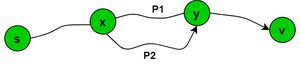

   - All the sub-paths of the shortest path must also be the shortest paths.
   - If there exists a shortest path length between two nodes **U** and **V**, then greedily choosing the edge with the minimum length between **V** to **S** will give the shortest path length between **U** and **S**.
   - All the algorithms listed above work based on this property.
   - For example, let **P1** be a sub-path from **(X** ***→ Y)*** of the shortest path **(S →X →Y → V)** of graph **G**. And let **P2** be any other path **(X** ***→*** **Y)** in graph **G**. Then, **the** ***cost of P1 must be less than or*** **equal** ***to*** **the** ***cost of P2**. Otherwise*, the path **(S →X →Y → V)** will not be the shortest path between nodes **S** and **V**.

2. Triangle Inequality

   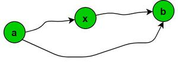

   - Let ***d(a, b)*** be the length of the shortest path from ***a*** to ***b** in graph **G1***. Then,
     - ***d(a, b) ≤ d(a, x) + d(x, b)***

---


## Types

1. Single Source Shortest Path Algorithms
   - Depth-First Search (DFS)
   - Breadth-First Search (BFS)
   - Multi-Source BFS
   - Dijkstra's algorithm
   - Bellman-Ford algorithm
   - Topological Sort
   - A* search algorithm
2. All Pair Shortest Path Algorithms
   - Floyd-Warshall algorithm
   - Johnson's algorithm

---


## Depth First Search (DFS) Algorithm

In an in-depth first search (or DFS) for a graph, we traverse all adjacent vertices one by one. When we traverse an adjacent vertex, we completely finish the traversal of all vertices reachable through that adjacent vertex.

**Algorithm:**

- DFS from a Given Source of Graph

  Depth First Search (DFS) starts from a given source vertex and explores one path as deeply as possible. When it reaches a vertex with no unvisited neighbors, it backtracks to the previous vertex to explore other unvisited paths. This continues until all vertices reachable from the source are visited.

  In a graph, there might be loops. So we use an extra visited array to make sure that we do not process a vertex again.

- DFS of a Disconnected Graph

  In a disconnected graph, some vertices may not be reachable from a single source. To ensure all vertices are visited in DFS traversal, we iterate through each vertex, and if a vertex is unvisited, we perform a DFS starting from that vertex as the source. This way, DFS explores every connected component of the graph.

**Examples:**

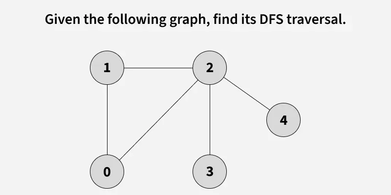

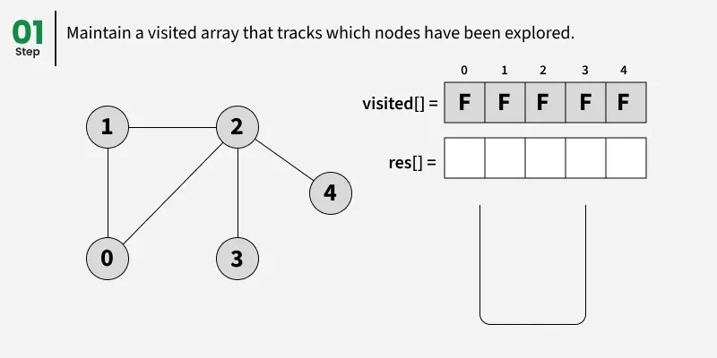

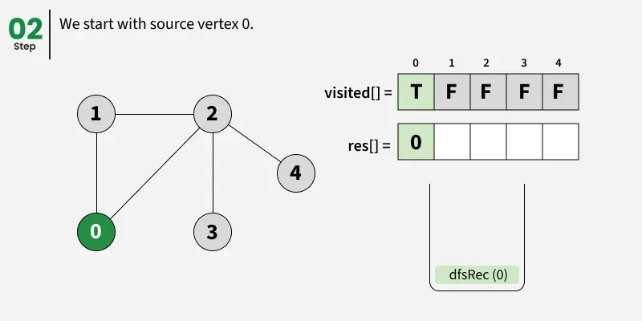

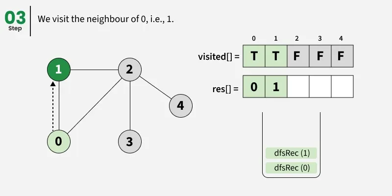


**Implement:**

(DFS from a Given Source of Graph)

```c++
void _dfs(
    std::vector<std::vector<int>> &adj, 
    std::vector<bool> &visited, 
    int s, 
    std::vector<int> &res) 
{
    visited[s] = true;
    res.push_back(s);

    // Recursively visit all adjacent vertices
    // that are not visited yet
    for (int i : adj[s])
        if (visited[i] == false)
            _dfs(adj, visited, i, res);
}

std::vector<int> dfs(std::vector<std::vector<int>> &adj) 
{
    std::vector<bool> visited(adj.size(), false);
    std::vector<int> res;
    _dfs(adj, visited, 0, res);
    return res;
}
```

**Complexity:**

| Case         | Time Complexity | Space Complexity |
| ------------ | --------------- | ---------------- |
| Best Case    | $O(V + E)$      | $O(V)$           |
| Average Case | $O(V + E)$      | $O(V)$           |
| Worst Case   | $O(V + E)$      | $O(V)$           |

For more info, see: [Search Algorithm Summary#Depth-First Search (DFS)](search.md)

---


## Breadth-First Search (BFS) Algorithm

Breadth First Search (BFS) is a graph traversal algorithm that starts from a source node and explores the graph level by level. First, it visits all nodes directly adjacent to the source. Then, it moves on to visit the adjacent nodes of those nodes, and this process continues until all reachable nodes are visited.

BFS computes shortest path distances (in number of edges) from a source vertex s in an unweighted graph (directed or undirected). It explores the graph in layers: first all vertices at distance 0 (s), then distance 1, then distance 2, and so on.

**Key properties:**

- Correctness: BFS finds shortest paths in unweighted graphs.
- Complexity: O(V + E) time using adjacency lists and O(V) space for the queue and distance array.

**Algorithm:**

The algorithm starts from a given source vertex and explores all vertices reachable from that source, visiting nodes in increasing order of their distance from the source, level by level, using a queue. Since graphs may contain cycles, a vertex could be visited multiple times. To prevent revisiting a vertex, a visited array is used.

**Example:**

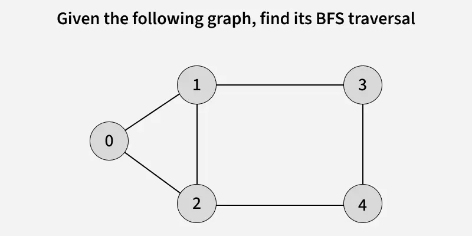

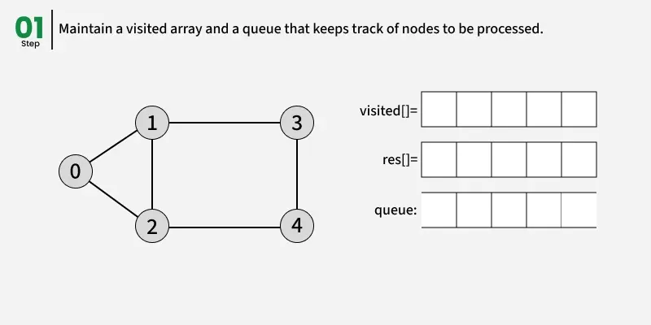


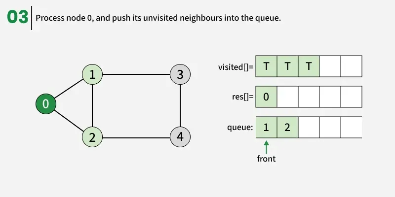

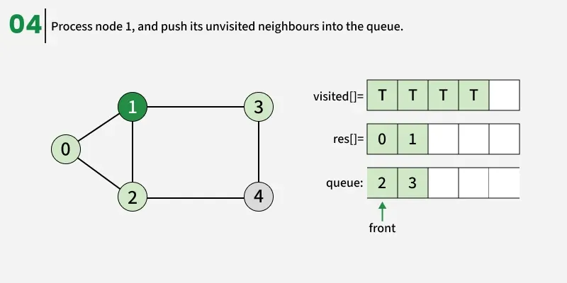

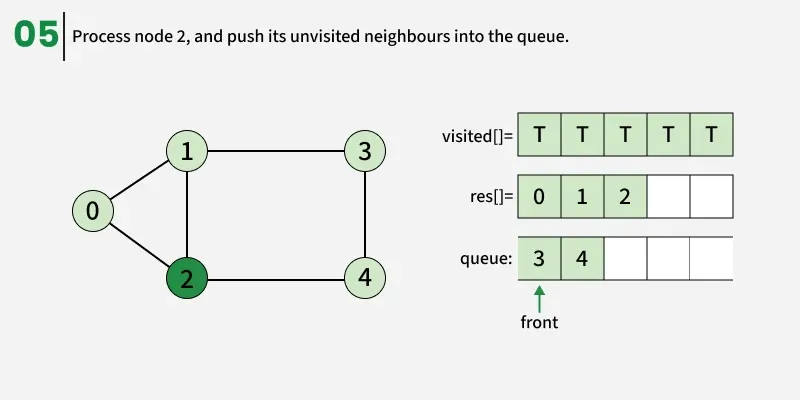


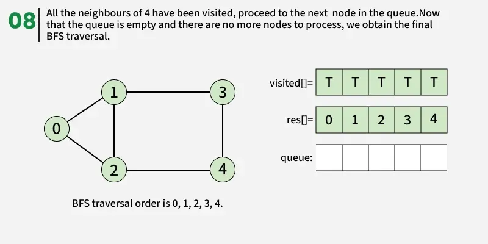

**Implement:**

```c++
// BFS for single connected component
vector<int> bfs(vector<vector<int>>& adj) 
{
    int V = adj.size();
    vector<bool> visited(V, false);
    vector<int> res;
    
    queue<int> q;
    
    int src = 0;
    visited[src] = true;
    q.push(src);

    while (!q.empty()) 
    {
        int curr = q.front();
        q.pop();
        res.push_back(curr);

        // visit all the unvisited
        // neighbours of current node
        for (int x : adj[curr]) 
        {
            if (visited[x])
                continue;

            visited[x] = true;
            q.push(x);
        }
    }
    
    return res;
}
```

**Complexity:**

| Case         | Time Complexity | Space Complexity |
| ------------ | --------------- | ---------------- |
| Best Case    | $O(V + E)$      | $O(V)$           |
| Average Case | $O(V + E)$      | $O(V)$           |
| Worst Case   | $O(V + E)$      | $O(V)$           |

For more info, see: [Search Algorithm Summary#Breadth-First Search (BFS)](search.md)

---


## Dijkstra's algorithm 

Dijkstra's algorithm computes shortest paths from a single source in graphs with nonnegative edge weights. It is a generalization of the unweighted layered approach: the algorithm repeatedly selects the vertex with the smallest tentative distance and relaxes its outgoing edges.

Correctness relies on the nonnegativity of edge weights (once the smallest tentative distance vertex is selected, its distance is final).

**Math Fundamentals:**

**Theorem** Dijkstra's algorithm finds the length of the shortest path between two vertices in a connected simple undirected weighted graph.

**Theorem** Dijkstra's algorithm uses $O(n^2)$ operations (additions and comparisons) to find the length of the shortest path between two vertices in a connected, simple undirected weighted graph with $n$ vertices.

**Theorem (Correctness of Dijkstra's algorithm)** Dijkstra's algorithm, run on a weighted, directed graph $G = (V, E)$ with a non-negative weight function $w$ and source $s$, terminates with $u.d = \delta(s, u)$ for all vertices $u \in V$.

### Dijkstra's algorithm by using priority queue

**Algorithm:**

1. Create a distance array dist[] of size V and initialize all values to infinity (∞) since no paths are known yet.
2. Set the distance of the source vertex to 0 and insert it into the priority queue.
3. While the priority queue is not empty, remove the vertex with the smallest distance value.
4. Check: if the popped distance is greater than the recorded distance for this vertex(dist[u]), it means this vertex has already been processed with a smaller distance, so skip it and continue to the next iteration.
5. For each neighbor v of u, check if the path through u gives a smaller distance than the current dist[v].
   If it does, update dist[v] = dist[u] + edge weight(d) and push (dist[v], v) into the priority queue.
6. Continue this process until the priority queue becomes empty.
7. Once done, the dist[] array will contain the shortest distance from the source to every vertex in the graph.

**Examples:**

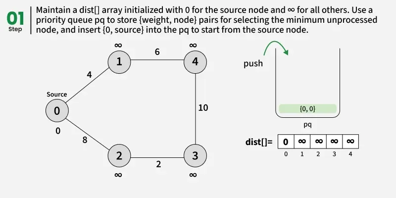

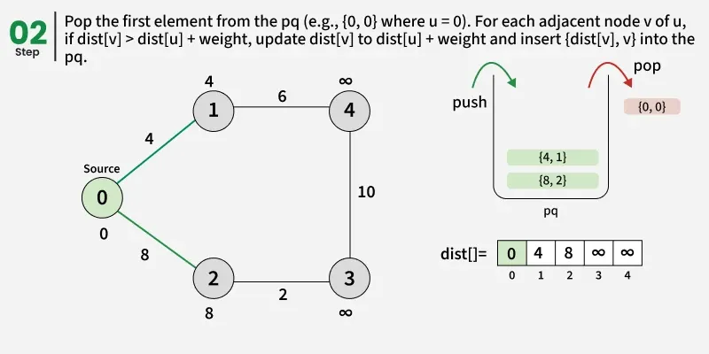

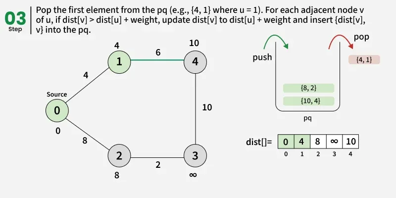

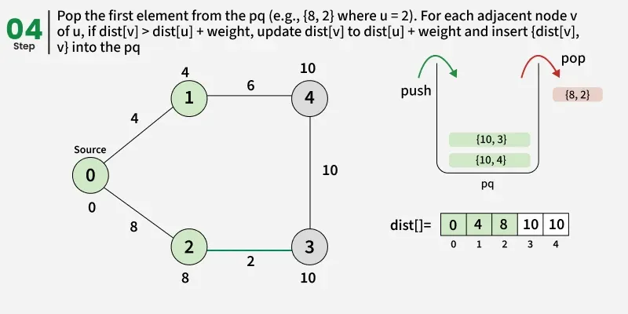

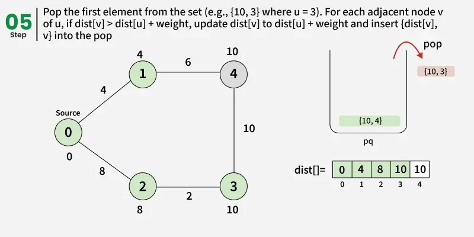

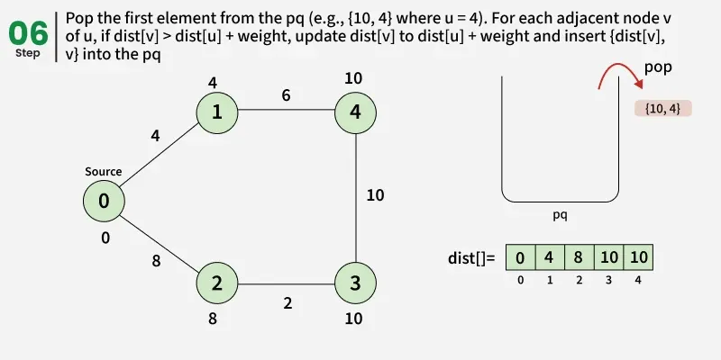

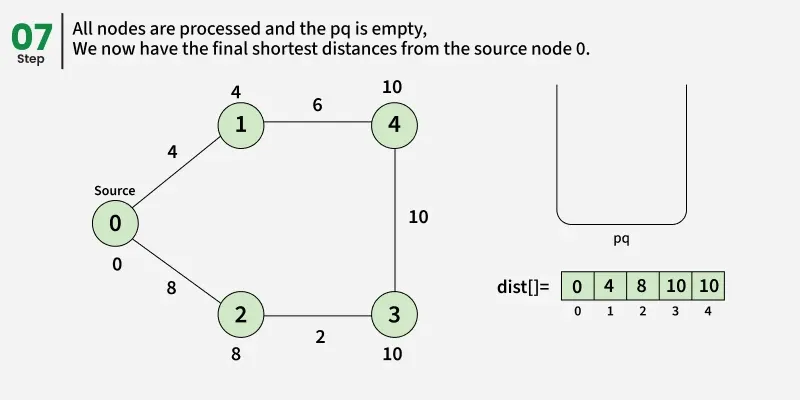

**Implement:**

```c++
std::vector<int> dijkstra_pq(std::vector<std::vector<std::pair<int,int>>>& adj, int src) 
{
    int V = adj.size();

    // Min-heap (priority queue) storing pairs of (distance, node)
    std::priority_queue<
        std::pair<int, int>, 
        std::vector<std::pair<int, int>>, 
        std::greater<std::pair<int, int>>> pq;

    std::vector<int> dist(V, INT_MAX);

    // Distance from source to itself is 0
    dist[src] = 0;
    pq.emplace(0, src);

    // Process the queue until all reachable vertices are finalized
    while (!pq.empty()) 
    {
        auto top = pq.top();
        pq.pop();

        int d = top.first;  
        int u = top.second; 

        // If this distance not the latest shortest one, skip it
        if (d > dist[u])
            continue;

        // Explore all neighbors of the current vertex
        for (auto &p : adj[u]) 
        {
            int v = p.first; 
            int w = p.second; 

            // If we found a shorter path to v through u, update it
            if (dist[u] + w < dist[v]) 
            {
                dist[v] = dist[u] + w;   
                pq.emplace(dist[v], v);
            }
        }
    }

    // Return the final shortest distances from the source
    return dist;
}
```

**Complexity:**

| Case         | Time Complexity | Space Complexity |
| ------------ | --------------- | ---------------- |
| Best Case    | $O(E * \log(V))$ | $O(V)$         |
| Average Case | $O(E * \log(V))$ | $O(V)$         |
| Worst Case   | $O(E * \log(V))$ | $O(V)$         |

---


## Bellman–Ford  Algorithm

Bellman–Ford computes single-source shortest paths even when some edges have negative weights, and it detects negative-weight cycles reachable from the source.

**Algorithm:**

1. Initialize distances: dist[s] = 0, others = INF.
2. Repeat V-1 times: relax every edge (u, v) with weight w: if dist[u] + w < dist[v], set dist[v] = dist[u] + w and parent[v] = u.
3. Check for negative cycles: if any edge can still be relaxed, report a negative cycle.

**Example:**

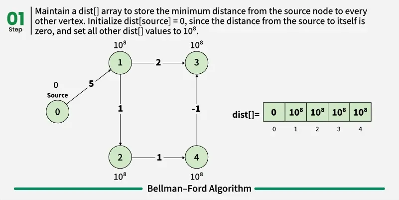

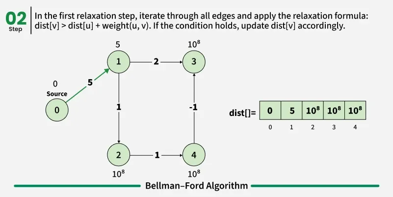

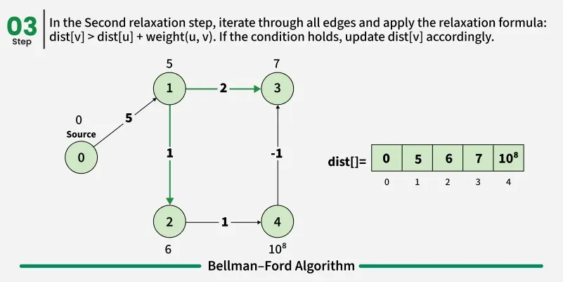

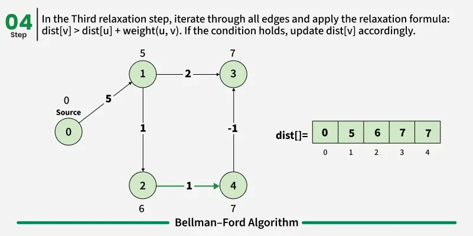

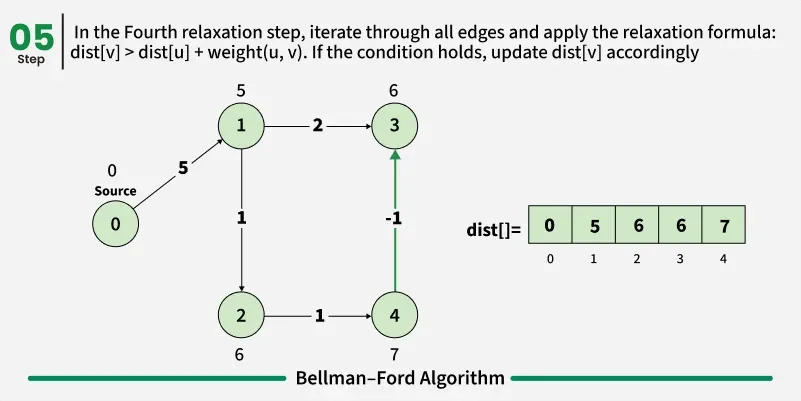

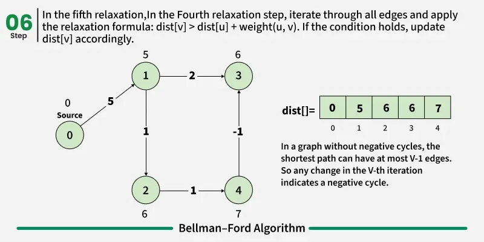

**Implement:**

```c++
std::vector<int> bellman_ford(int V, std::vector<std::vector<int>>& edges, int src) 
{
	std::vector<int> dist(V, 1e8);
	dist[src] = 0;
	for (int i = 0; i < V; i++) 
  {
		for (std::vector<int> edge : edges) 
    {
			int u = edge[0];
			int v = edge[1];
			int wt = edge[2];
			if (dist[u] != 1e8 && dist[u] + wt < dist[v]) 
      {
        if(i == V - 1)
          return {-1};

        dist[v] = dist[u] + wt;
      }
		}
	}
	return dist;
}
```

**Complexity:**

| Case         | Time Complexity | Space Complexity |
| ------------ | --------------- | ---------------- |
| Best Case    | $O(V * E)$      | $O(V)$           |
| Average Case | $O(V * E)$      | $O(V)$           |
| Worst Case   | $O(V * E)$      | $O(V)$           |

---


## Topological Sorting Algorithm

Topological sorting for a Directed Acyclic Graph (DAG) is a linear ordering of vertices such that for every directed edge u→v, vertex u comes before v in the ordering.

**Complexity:**

| Case         | Time Complexity | Space Complexity |
| ------------ | --------------- | ---------------- |
| Best Case    | $O(V + E)$      | $O(V)$           |
| Average Case | $O(V + E)$      | $O(V)$           |
| Worst Case   | $O(V + E)$      | $O(V)$           |

For more info, see: [Graph Algorithm#Topological Sort](graph.md)

---


## A* Search Algorithm

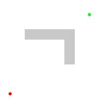

A* is used to find shortest paths when a heuristic estimate $h(v)$ approximating the remaining distance to the target is available. A* expands nodes in order of $f(v) = g(v) + h(v)$, where $g(v)$ is the distance from the start to v. If h is admissible (never overestimates), A* is guaranteed to find an optimal path.

**Algorithm**:

```txt
// A* Search Algorithm
1.  Initialize the open list
2.  Initialize the closed list
    put the starting node on the open 
    list (you can leave its f at zero)
3.  while the open list is not empty
    a) find the node with the least f on 
       the open list, call it "q"
    b) pop q off the open list
  
    c) generate q's 8 successors and set their 
       parents to q
   
    d) for each successor
        i) if successor is the goal, stop search
        
        ii) else, compute both g and h for successor
          successor.g = q.g + distance between 
                              successor and q
          successor.h = distance from goal to 
          successor (This can be done using many 
          ways, we will discuss three heuristics- 
          Manhattan, Diagonal and Euclidean 
          Heuristics)
          
          successor.f = successor.g + successor.h
        iii) if a node with the same position as 
            successor is in the OPEN list which has a 
           lower f than successor, skip this successor
        iV) if a node with the same position as 
            successor  is in the CLOSED list which has
            a lower f than successor, skip this successor
            otherwise, add  the node to the open list
     end (for loop)
  
    e) push q on the closed list
    end (while loop)
```

**Example**:

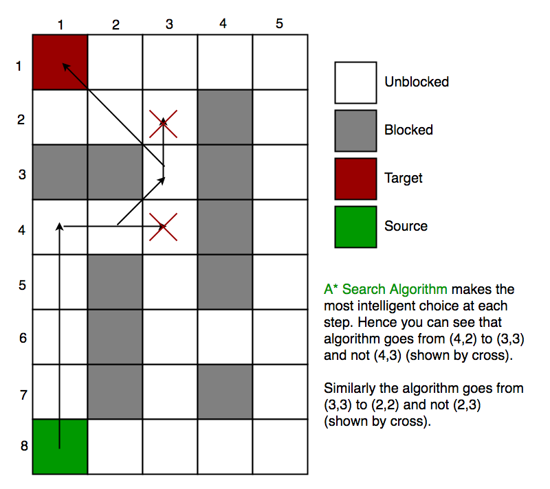

**Implement:**

```c++
// A C++ Program to implement A* Search Algorithm
#include <iostream>
#include <cmath>
#include <stack>
#include <cstring>
#include <set>
#include <cfloat>

#define ROW 9
#define COL 10

// A structure to hold the necessary parameters
struct cell 
{
    // Row and Column index of its parent
    // Note that 0 <= i <= ROW-1 & 0 <= j <= COL-1
    int parent_i, parent_j;
    // f = g + h
    double f, g, h;
};

// A Utility Function to check whether given cell (row, col)
// is a valid cell or not.
bool is_valid(int row, int col)
{
    // Returns true if row number and column number
    // is in range
    return (row >= 0) && (row < ROW) && (col >= 0) && (col < COL);
}

// A Utility Function to check whether the given cell is
// blocked or not
bool is_unblocked(int grid[][COL], int row, int col)
{
    // Returns true if the cell is not blocked else false
    if (grid[row][col] == 1)
        return (true);
    else
        return (false);
}

// A Utility Function to check whether destination cell has
// been reached or not
bool is_destination(int row, int col, std::pair<int, int> dest)
{
    if (row == dest.first && col == dest.second)
        return (true);
    else
        return (false);
}

// A Utility Function to calculate the 'h' heuristics.
double calc_hvalue(int row, int col, std::pair<int, int> dest)
{
    // Return using the distance formula
    return ((double)sqrt(
        (row - dest.first) * (row - dest.first)
        + (col - dest.second) * (col - dest.second)));
}

// A Utility Function to trace the path from the source
// to destination
void trace_path(cell cell_details[][COL], std::pair<int, int> dest)
{
    printf("\nThe Path is ");
    int row = dest.first;
    int col = dest.second;
    std::stack<std::pair<int, int>> Path;
    while (!(cell_details[row][col].parent_i == row
             && cell_details[row][col].parent_j == col)) 
    {
        Path.push(std::make_pair(row, col));
        int temp_row = cell_details[row][col].parent_i;
        int temp_col = cell_details[row][col].parent_j;
        row = temp_row;
        col = temp_col;
    }

    Path.push(std::make_pair(row, col));
    while (!Path.empty()) 
    {
        std::pair<int, int> p = Path.top();
        Path.pop();
        printf("-> (%d,%d) ", p.first, p.second);
    }

    return;
}

// A Function to find the shortest path between
// a given source cell to a destination cell according
// to A* Search Algorithm
void astar_search(int grid[][COL], std::pair<int, int> src, std::pair<int, int> dest)
{
    // If the source is out of range
    if (is_valid(src.first, src.second) == false) 
        return;

    // If the destination is out of range
    if (is_valid(dest.first, dest.second) == false) 
        return;

    // Either the source or the destination is blocked
    if (is_unblocked(grid, src.first, src.second) == false
        || is_unblocked(grid, dest.first, dest.second) == false) 
        return;

    // If the destination cell is the same as source cell
    if (is_destination(src.first, src.second, dest) == true)
        return;

    // Create a closed list and initialise it to false which
    // means that no cell has been included yet This closed
    // list is implemented as a boolean 2D array
    bool closed_list[ROW][COL];
    memset(closed_list, false, sizeof(closed_list));

    // Declare a 2D array of structure to hold the details
    // of that cell
    cell cell_details[ROW][COL];
    int i, j;
    for (i = 0; i < ROW; i++) 
    {
        for (j = 0; j < COL; j++) 
        {
            cell_details[i][j].f = FLT_MAX;
            cell_details[i][j].g = FLT_MAX;
            cell_details[i][j].h = FLT_MAX;
            cell_details[i][j].parent_i = -1;
            cell_details[i][j].parent_j = -1;
        }
    }

    // Initialising the parameters of the starting node
    i = src.first, j = src.second;
    cell_details[i][j].f = 0.0;
    cell_details[i][j].g = 0.0;
    cell_details[i][j].h = 0.0;
    cell_details[i][j].parent_i = i;
    cell_details[i][j].parent_j = j;

    /*
     Create an open list having information as-
     <f, <i, j>>
     where f = g + h,
     and i, j are the row and column index of that cell
     Note that 0 <= i <= ROW-1 & 0 <= j <= COL-1
     This open list is implemented as a set of pair of
     pair.*/
    std::set<std::pair<double, std::pair<int, int> > > open_list;

    // Put the starting cell on the open list and set its
    // 'f' as 0
    open_list.insert(std::make_pair(0.0, std::make_pair(i, j)));

    // We set this boolean value as false as initially
    // the destination is not reached.
    bool foundDest = false;
    while (!open_list.empty()) 
    {
        std::pair<double, std::pair<int, int> >  p = *open_list.begin();

        // Remove this vertex from the open list
        open_list.erase(open_list.begin());

        // Add this vertex to the closed list
        i = p.second.first;
        j = p.second.second;
        closed_list[i][j] = true;

        /*
         Generating all the 8 successor of this cell

             N.W   N   N.E
               \   |   /
                \  |  /
             W----Cell----E
                  / | \
                /   |  \
             S.W    S   S.E

         Cell-->Popped Cell (i, j)
         N -->  North       (i-1, j)
         S -->  South       (i+1, j)
         E -->  East        (i, j+1)
         W -->  West           (i, j-1)
         N.E--> North-East  (i-1, j+1)
         N.W--> North-West  (i-1, j-1)
         S.E--> South-East  (i+1, j+1)
         S.W--> South-West  (i+1, j-1)*/

        // To store the 'g', 'h' and 'f' of the 8 successors
        double gNew, hNew, fNew;

        //----------- 1st Successor (North) ------------

        // Only process this cell if this is a valid one
        if (is_valid(i - 1, j) == true) 
        {
            // If the destination cell is the same as the
            // current successor
            if (is_destination(i - 1, j, dest) == true) 
            {
                // Set the Parent of the destination cell
                cell_details[i - 1][j].parent_i = i;
                cell_details[i - 1][j].parent_j = j;
                printf("The destination cell is found\n");
                trace_path(cell_details, dest);
                foundDest = true;
                return;
            }
            // If the successor is already on the closed
            // list or if it is blocked, then ignore it.
            // Else do the following
            else if (closed_list[i - 1][j] == false
                     && is_unblocked(grid, i - 1, j) == true) 
            {
                gNew = cell_details[i][j].g + 1.0;
                hNew = calc_hvalue(i - 1, j, dest);
                fNew = gNew + hNew;

                // If it isn’t on the open list, add it to
                // the open list. Make the current square
                // the parent of this square. Record the
                // f, g, and h costs of the square cell
                //                OR
                // If it is on the open list already, check
                // to see if this path to that square is
                // better, using 'f' cost as the measure.
                if (cell_details[i - 1][j].f == FLT_MAX
                    || cell_details[i - 1][j].f > fNew) 
                {
                    open_list.insert(std::make_pair(fNew, std::make_pair(i - 1, j)));

                    // Update the details of this cell
                    cell_details[i - 1][j].f = fNew;
                    cell_details[i - 1][j].g = gNew;
                    cell_details[i - 1][j].h = hNew;
                    cell_details[i - 1][j].parent_i = i;
                    cell_details[i - 1][j].parent_j = j;
                }
            }
        }

        //----------- 2nd Successor (South) ------------

        // Only process this cell if this is a valid one
        if (is_valid(i + 1, j) == true) 
        {
            // If the destination cell is the same as the
            // current successor
            if (is_destination(i + 1, j, dest) == true) 
            {
                // Set the Parent of the destination cell
                cell_details[i + 1][j].parent_i = i;
                cell_details[i + 1][j].parent_j = j;
                printf("The destination cell is found\n");
                trace_path(cell_details, dest);
                foundDest = true;
                return;
            }
            // If the successor is already on the closed
            // list or if it is blocked, then ignore it.
            // Else do the following
            else if (closed_list[i + 1][j] == false
                     && is_unblocked(grid, i + 1, j) == true) 
            {
                gNew = cell_details[i][j].g + 1.0;
                hNew = calc_hvalue(i + 1, j, dest);
                fNew = gNew + hNew;

                // If it isn’t on the open list, add it to
                // the open list. Make the current square
                // the parent of this square. Record the
                // f, g, and h costs of the square cell
                //                OR
                // If it is on the open list already, check
                // to see if this path to that square is
                // better, using 'f' cost as the measure.
                if (cell_details[i + 1][j].f == FLT_MAX
                    || cell_details[i + 1][j].f > fNew) 
                {
                    open_list.insert(std::make_pair(fNew, std::make_pair(i + 1, j)));
                    // Update the details of this cell
                    cell_details[i + 1][j].f = fNew;
                    cell_details[i + 1][j].g = gNew;
                    cell_details[i + 1][j].h = hNew;
                    cell_details[i + 1][j].parent_i = i;
                    cell_details[i + 1][j].parent_j = j;
                }
            }
        }

        //----------- 3rd Successor (East) ------------

        // Only process this cell if this is a valid one
        if (is_valid(i, j + 1) == true) {
            // If the destination cell is the same as the
            // current successor
            if (is_destination(i, j + 1, dest) == true) {
                // Set the Parent of the destination cell
                cell_details[i][j + 1].parent_i = i;
                cell_details[i][j + 1].parent_j = j;
                printf("The destination cell is found\n");
                trace_path(cell_details, dest);
                foundDest = true;
                return;
            }

            // If the successor is already on the closed
            // list or if it is blocked, then ignore it.
            // Else do the following
            else if (closed_list[i][j + 1] == false
                     && is_unblocked(grid, i, j + 1) == true) 
            {
                gNew = cell_details[i][j].g + 1.0;
                hNew = calc_hvalue(i, j + 1, dest);
                fNew = gNew + hNew;

                // If it isn’t on the open list, add it to
                // the open list. Make the current square
                // the parent of this square. Record the
                // f, g, and h costs of the square cell
                //                OR
                // If it is on the open list already, check
                // to see if this path to that square is
                // better, using 'f' cost as the measure.
                if (cell_details[i][j + 1].f == FLT_MAX
                    || cell_details[i][j + 1].f > fNew) 
                {
                    open_list.insert(std::make_pair(fNew, std::make_pair(i, j + 1)));

                    // Update the details of this cell
                    cell_details[i][j + 1].f = fNew;
                    cell_details[i][j + 1].g = gNew;
                    cell_details[i][j + 1].h = hNew;
                    cell_details[i][j + 1].parent_i = i;
                    cell_details[i][j + 1].parent_j = j;
                }
            }
        }

        //----------- 4th Successor (West) ------------

        // Only process this cell if this is a valid one
        if (is_valid(i, j - 1) == true) 
        {
            // If the destination cell is the same as the
            // current successor
            if (is_destination(i, j - 1, dest) == true) 
            {
                // Set the Parent of the destination cell
                cell_details[i][j - 1].parent_i = i;
                cell_details[i][j - 1].parent_j = j;
                printf("The destination cell is found\n");
                trace_path(cell_details, dest);
                foundDest = true;
                return;
            }

            // If the successor is already on the closed
            // list or if it is blocked, then ignore it.
            // Else do the following
            else if (closed_list[i][j - 1] == false && is_unblocked(grid, i, j - 1) == true) 
            {
                gNew = cell_details[i][j].g + 1.0;
                hNew = calc_hvalue(i, j - 1, dest);
                fNew = gNew + hNew;

                // If it isn’t on the open list, add it to
                // the open list. Make the current square
                // the parent of this square. Record the
                // f, g, and h costs of the square cell
                //                OR
                // If it is on the open list already, check
                // to see if this path to that square is
                // better, using 'f' cost as the measure.
                if (cell_details[i][j - 1].f == FLT_MAX
                    || cell_details[i][j - 1].f > fNew) 
                {
                    open_list.insert(std::make_pair(fNew, std::make_pair(i, j - 1)));

                    // Update the details of this cell
                    cell_details[i][j - 1].f = fNew;
                    cell_details[i][j - 1].g = gNew;
                    cell_details[i][j - 1].h = hNew;
                    cell_details[i][j - 1].parent_i = i;
                    cell_details[i][j - 1].parent_j = j;
                }
            }
        }

        //----------- 5th Successor (North-East)
        //------------

        // Only process this cell if this is a valid one
        if (is_valid(i - 1, j + 1) == true) 
        {
            // If the destination cell is the same as the
            // current successor
            if (is_destination(i - 1, j + 1, dest) == true) 
            {
                // Set the Parent of the destination cell
                cell_details[i - 1][j + 1].parent_i = i;
                cell_details[i - 1][j + 1].parent_j = j;
                printf("The destination cell is found\n");
                trace_path(cell_details, dest);
                foundDest = true;
                return;
            }

            // If the successor is already on the closed
            // list or if it is blocked, then ignore it.
            // Else do the following
            else if (closed_list[i - 1][j + 1] == false 
                && is_unblocked(grid, i - 1, j + 1) == true) 
            {
                gNew = cell_details[i][j].g + 1.414;
                hNew = calc_hvalue(i - 1, j + 1, dest);
                fNew = gNew + hNew;

                // If it isn’t on the open list, add it to
                // the open list. Make the current square
                // the parent of this square. Record the
                // f, g, and h costs of the square cell
                //                OR
                // If it is on the open list already, check
                // to see if this path to that square is
                // better, using 'f' cost as the measure.
                if (cell_details[i - 1][j + 1].f == FLT_MAX
                    || cell_details[i - 1][j + 1].f > fNew) 
                {
                    open_list.insert(std::make_pair(fNew, std::make_pair(i - 1, j + 1)));

                    // Update the details of this cell
                    cell_details[i - 1][j + 1].f = fNew;
                    cell_details[i - 1][j + 1].g = gNew;
                    cell_details[i - 1][j + 1].h = hNew;
                    cell_details[i - 1][j + 1].parent_i = i;
                    cell_details[i - 1][j + 1].parent_j = j;
                }
            }
        }

        //----------- 6th Successor (North-West)
        //------------

        // Only process this cell if this is a valid one
        if (is_valid(i - 1, j - 1) == true) 
        {
            // If the destination cell is the same as the
            // current successor
            if (is_destination(i - 1, j - 1, dest) == true) 
            {
                // Set the Parent of the destination cell
                cell_details[i - 1][j - 1].parent_i = i;
                cell_details[i - 1][j - 1].parent_j = j;
                printf("The destination cell is found\n");
                trace_path(cell_details, dest);
                foundDest = true;
                return;
            }

            // If the successor is already on the closed
            // list or if it is blocked, then ignore it.
            // Else do the following
            else if (closed_list[i - 1][j - 1] == false
                     && is_unblocked(grid, i - 1, j - 1) == true) 
            {
                gNew = cell_details[i][j].g + 1.414;
                hNew = calc_hvalue(i - 1, j - 1, dest);
                fNew = gNew + hNew;

                // If it isn’t on the open list, add it to
                // the open list. Make the current square
                // the parent of this square. Record the
                // f, g, and h costs of the square cell
                //                OR
                // If it is on the open list already, check
                // to see if this path to that square is
                // better, using 'f' cost as the measure.
                if (cell_details[i - 1][j - 1].f == FLT_MAX
                    || cell_details[i - 1][j - 1].f > fNew) 
                {
                    open_list.insert(std::make_pair(fNew, std::make_pair(i - 1, j - 1)));
                    // Update the details of this cell
                    cell_details[i - 1][j - 1].f = fNew;
                    cell_details[i - 1][j - 1].g = gNew;
                    cell_details[i - 1][j - 1].h = hNew;
                    cell_details[i - 1][j - 1].parent_i = i;
                    cell_details[i - 1][j - 1].parent_j = j;
                }
            }
        }

        //----------- 7th Successor (South-East)
        //------------

        // Only process this cell if this is a valid one
        if (is_valid(i + 1, j + 1) == true) 
        {
            // If the destination cell is the same as the
            // current successor
            if (is_destination(i + 1, j + 1, dest) == true) 
            {
                // Set the Parent of the destination cell
                cell_details[i + 1][j + 1].parent_i = i;
                cell_details[i + 1][j + 1].parent_j = j;
                printf("The destination cell is found\n");
                trace_path(cell_details, dest);
                foundDest = true;
                return;
            }

            // If the successor is already on the closed
            // list or if it is blocked, then ignore it.
            // Else do the following
            else if (closed_list[i + 1][j + 1] == false
                     && is_unblocked(grid, i + 1, j + 1) == true) 
            {
                gNew = cell_details[i][j].g + 1.414;
                hNew = calc_hvalue(i + 1, j + 1, dest);
                fNew = gNew + hNew;

                // If it isn’t on the open list, add it to
                // the open list. Make the current square
                // the parent of this square. Record the
                // f, g, and h costs of the square cell
                //                OR
                // If it is on the open list already, check
                // to see if this path to that square is
                // better, using 'f' cost as the measure.
                if (cell_details[i + 1][j + 1].f == FLT_MAX
                    || cell_details[i + 1][j + 1].f > fNew) 
                {
                    open_list.insert(std::make_pair(fNew, std::make_pair(i + 1, j + 1)));

                    // Update the details of this cell
                    cell_details[i + 1][j + 1].f = fNew;
                    cell_details[i + 1][j + 1].g = gNew;
                    cell_details[i + 1][j + 1].h = hNew;
                    cell_details[i + 1][j + 1].parent_i = i;
                    cell_details[i + 1][j + 1].parent_j = j;
                }
            }
        }

        //----------- 8th Successor (South-West)
        //------------

        // Only process this cell if this is a valid one
        if (is_valid(i + 1, j - 1) == true) 
        {
            // If the destination cell is the same as the
            // current successor
            if (is_destination(i + 1, j - 1, dest) == true) 
            {
                // Set the Parent of the destination cell
                cell_details[i + 1][j - 1].parent_i = i;
                cell_details[i + 1][j - 1].parent_j = j;
                printf("The destination cell is found\n");
                trace_path(cell_details, dest);
                foundDest = true;
                return;
            }

            // If the successor is already on the closed
            // list or if it is blocked, then ignore it.
            // Else do the following
            else if (closed_list[i + 1][j - 1] == false
                     && is_unblocked(grid, i + 1, j - 1) == true) 
            {
                gNew = cell_details[i][j].g + 1.414;
                hNew = calc_hvalue(i + 1, j - 1, dest);
                fNew = gNew + hNew;

                // If it isn’t on the open list, add it to
                // the open list. Make the current square
                // the parent of this square. Record the
                // f, g, and h costs of the square cell
                //                OR
                // If it is on the open list already, check
                // to see if this path to that square is
                // better, using 'f' cost as the measure.
                if (cell_details[i + 1][j - 1].f == FLT_MAX
                    || cell_details[i + 1][j - 1].f > fNew) 
                {
                    open_list.insert(std::make_pair(fNew, std::make_pair(i + 1, j - 1)));

                    // Update the details of this cell
                    cell_details[i + 1][j - 1].f = fNew;
                    cell_details[i + 1][j - 1].g = gNew;
                    cell_details[i + 1][j - 1].h = hNew;
                    cell_details[i + 1][j - 1].parent_i = i;
                    cell_details[i + 1][j - 1].parent_j = j;
                }
            }
        }
    }

    // When the destination cell is not found and the open
    // list is empty, then we conclude that we failed to
    // reach the destination cell. This may happen when the
    // there is no way to destination cell (due to
    // blockages)
    if (foundDest == false)
        printf("Failed to find the Destination Cell\n");

    return;
}

// Driver program to test above function
int main()
{
    /* Description of the Grid-
     1--> The cell is not blocked
     0--> The cell is blocked    */
    int grid[ROW][COL]
        = { { 1, 0, 1, 1, 1, 1, 0, 1, 1, 1 },
            { 1, 1, 1, 0, 1, 1, 1, 0, 1, 1 },
            { 1, 1, 1, 0, 1, 1, 0, 1, 0, 1 },
            { 0, 0, 1, 0, 1, 0, 0, 0, 0, 1 },
            { 1, 1, 1, 0, 1, 1, 1, 0, 1, 0 },
            { 1, 0, 1, 1, 1, 1, 0, 1, 0, 0 },
            { 1, 0, 0, 0, 0, 1, 0, 0, 0, 1 },
            { 1, 0, 1, 1, 1, 1, 0, 1, 1, 1 },
            { 1, 1, 1, 0, 0, 0, 1, 0, 0, 1 } };

    // Source is the left-most bottom-most corner
    std::pair<int, int> src = std::make_pair(8, 0);

    // Destination is the left-most top-most corner
    std::pair<int, int> dest = std::make_pair(0, 0);

    astar_search(grid, src, dest);

    return (0);
}
```

**Complexity:**

| Case         | Time Complexity | Space Complexity |
| ------------ | --------------- | ---------------- |
| Best Case    | $O(E * \log(V))$ | $O(V)$         |
| Average Case | $O(E * \log(V))$ | $O(V)$         |
| Worst Case   | $O(E * \log(V))$ | $O(V)$         |


---


## Floyd Warshall Algorithm

Given a matrix **dist[][]** of size **n x n**, where dist[i][j] represents the weight of the edge from node i to node j.

- If there is no direct edge, dist[i][j] is set to INF (a large value, i.e., 108).
- The diagonal entries dist[i][i] are ***\*0\****, since the distance from a node to itself is zero.
- The graph may contain negative edge weights, but it does not contain any negative-weight cycles.

Determine the shortest path distance between all pairs of nodes in the graph.

**Algorithm**:

1. Start by updating the distance matrix by treating each vertex as a possible intermediate node between all pairs of vertices.
2. Iterate through each vertex, one at a time. For each selected vertex `k`, attempt to improve the shortest paths that pass through it.
3. When we pick vertex number k as an intermediate vertex, we have already considered vertices {0, 1, 2, .. k-1} as intermediate vertices. 
4. For every pair **(i, j)** of the source and destination vertices, respectively, there are two possible cases. 
   - k is not an intermediate vertex in the shortest path from i to j. We keep the value of dist[i][j] as it is. 
   - k is an intermediate vertex in the shortest path from i to j. We update the value of dist[i][j] as dist[i][k] + dist[k][j], if dist[i][j] > dist[i][k] + dist[k][j]
5. Repeat this process for each vertex `k` until all intermediate possibilities have been considered.

**Example:**

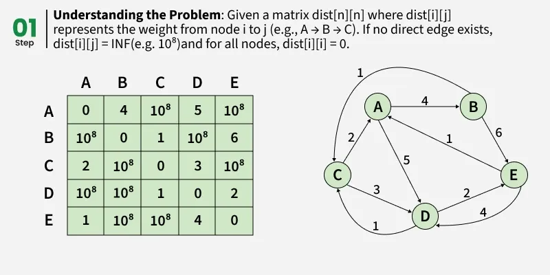

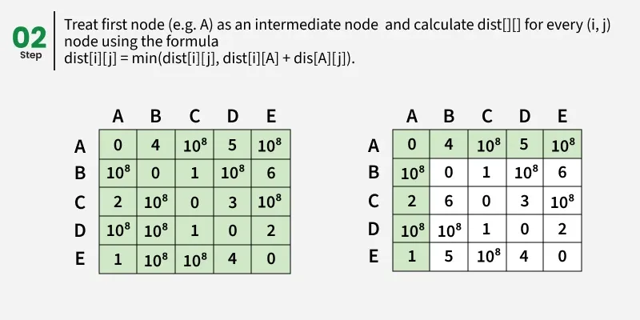

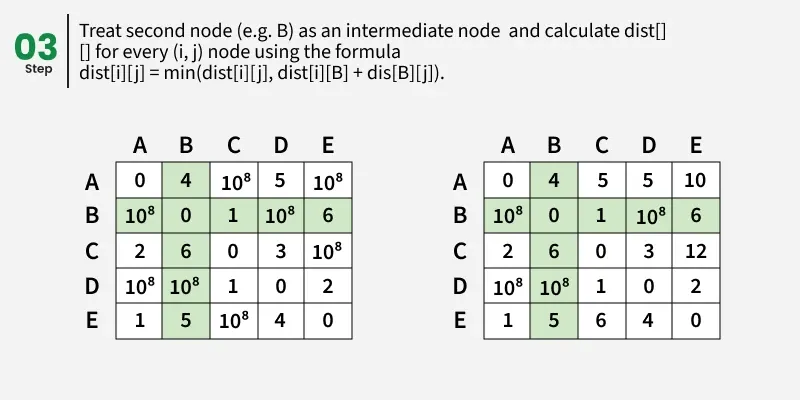

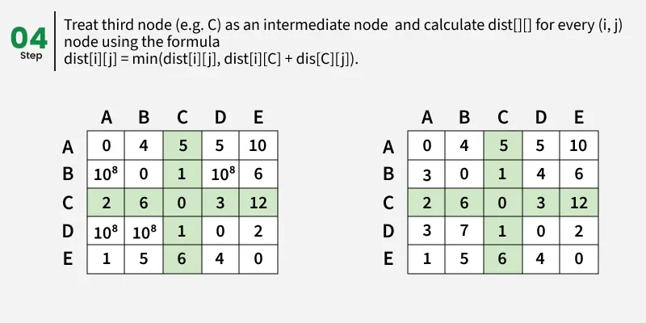

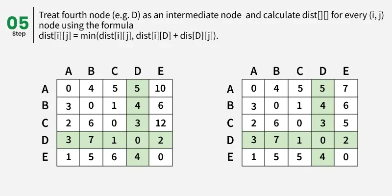

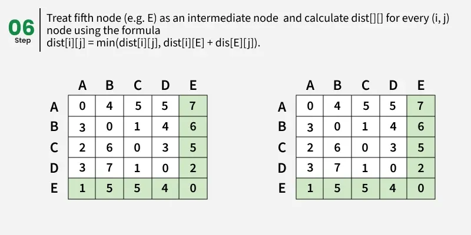

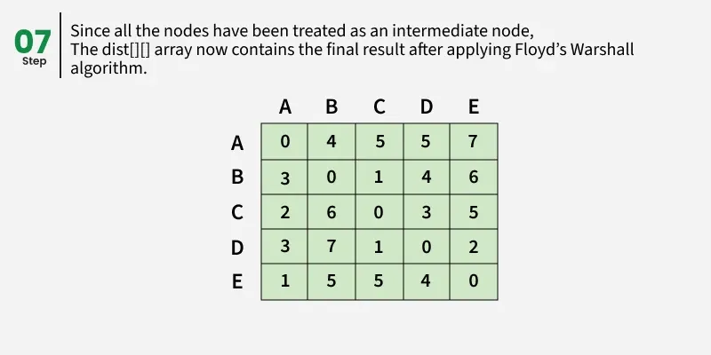

**Implement:**

```c++
void floyd_warshall(std::vector<std::vector<int>> &dist) 
{
    int V = dist.size();
    int INF = 1e8;

    // for each intermediate vertex
    for (int k = 0; k < V; k++) 
    {
        // Pick all vertices as source one by one
        for (int i = 0; i < V; i++) 
        {
            // Pick all vertices as destination
            // for the above picked source
            for (int j = 0; j < V; j++) 
            {
                // shortest path from i to j 
                if(dist[i][k] != INF && dist[k][j]!= INF )
                    dist[i][j] = std::min(dist[i][j], dist[i][k] + dist[k][j]);
            }
        }
    }
}
```

**Complexity:**

| Case         | Time Complexity | Space Complexity |
| ------------ | --------------- | ---------------- |
| Best Case    | $O(V^3)$        | $O(V^2)$         |
| Average Case | $O(V^3)$        | $O(V^2)$         |
| Worst Case   | $O(V^3)$        | $O(V^2)$         |

---


## Johnson's Algorithm

Johnson's Algorithm is an efficient algorithm used to find the shortest paths between all pairs of vertices in a weighted graph. It works even for graphs with negative weights, provided there are no negative weight cycles. This algorithm is particularly useful for sparse graphs and combines both Dijkstra's and Bellman-Ford algorithms to achieve optimal performance.

**Algorithm:**

1. Let the given graph be G. Add a new vertex s to the graph, add edges from new vertex to all vertices of G. Let the modified graph be G'.
2. Run Bellman-Ford algorithm on G' with s as source. Let the distances calculated by Bellman-Ford be h[0], h[1], .. h[V-1]. If we find a negative weight cycle, then return. Note that the negative weight cycle cannot be created by new vertex s as there is no edge to s. All edges are from s.
3. Reweight the edges of original graph. For each edge (u, v), assign the new weight as "original weight + h[u] - h[v]".
4. Remove the added vertex s and run Dijkstra's algorithm for every vertex.

**Example:**

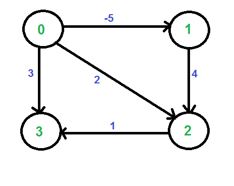

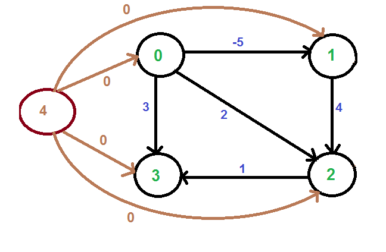

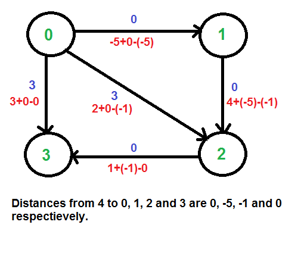

**Implement:**

```c++
#define INF INT_MAX

// Function to find the vertex with minimum distance
int min_distance(std::vector<int> dist, std::vector<bool> visited) 
{
    int minimum = INF, minVertex = 0;
    for (int vertex = 0; vertex < dist.size(); vertex++) 
    {
        if (minimum > dist[vertex] && visited[vertex] == false) 
        {
            minimum = dist[vertex];
            minVertex = vertex;
        }
    }
    return minVertex;
}

// dijkstra Algorithm for Modified Graph
void dijkstra(std::vector<std::vector<int>> graph, std::vector<std::vector<int>> modifiedGraph, int src) 
{
    int num_vertices = graph.size();
    std::vector<bool> sptSet(num_vertices, false);
    std::vector<int> dist(num_vertices, INF);
    dist[src] = 0;
    for (int count = 0; count < num_vertices; count++) 
    {
        int curVertex = min_distance(dist, sptSet);
        sptSet[curVertex] = true;
        for (int vertex = 0; vertex < num_vertices; vertex++) 
        {
            if (!sptSet[vertex] 
                && dist[vertex] > (dist[curVertex] + modifiedGraph[curVertex][vertex]) 
                && graph[curVertex][vertex] != 0) 
                dist[vertex] = dist[curVertex] + modifiedGraph[curVertex][vertex];
        }
    }

    // Print the Shortest distance from the source
    for (int vertex = 0; vertex < num_vertices; vertex++)
        std::cout << "Vertex " << vertex << ": " << dist[vertex] << std::endl;
}

// Function to calculate shortest distances from source to all other vertices using Bellman-Ford algorithm
std::vector<int> bellman_ford(std::vector<std::tuple<int, int, int>> edges, std::vector<std::vector<int>> graph, int num_vertices) {
    std::vector<int> dist(num_vertices + 1, INF);
    dist[num_vertices] = 0;

    for (int i = 0; i < num_vertices; i++) {
        edges.push_back(std::make_tuple(num_vertices, i, 0));
    }

    for (int i = 0; i < num_vertices; i++) {
        for (auto edge : edges) {
            int src, des, weight;
            std::tie(src, des, weight) = edge;
            if (dist[src] != INF && dist[src] + weight < dist[des]) {
                dist[des] = dist[src] + weight;
            }
        }
    }

    // Don't send the value for the source added
    return std::vector<int>(dist.begin(), dist.begin() + num_vertices);
}

// Function to implement Johnson Algorithm
void johnson_algorithm(std::vector<std::vector<int>> graph) {
    std::vector<std::tuple<int, int, int>> edges;

    // Create a list of edges for Bellman-Ford Algorithm
    for (int i = 0; i < graph.size(); i++) 
        for (int j = 0; j < graph[i].size(); j++) 
            if (graph[i][j] != 0) 
                edges.push_back(std::make_tuple(i, j, graph[i][j]));

    // Weights used to modify the original weights
    std::vector<int> modifyWeights = bellman_ford(edges, graph, graph.size());

    std::vector<std::vector<int>> modifiedGraph(graph.size(), std::vector<int>(graph.size(), 0));

    // Modify the weights to get rid of negative weights
    for (int i = 0; i < graph.size(); i++) {
        for (int j = 0; j < graph[i].size(); j++) {
            if (graph[i][j] != 0) {
                modifiedGraph[i][j] = graph[i][j] + modifyWeights[i] - modifyWeights[j];
            }
        }
    }

    std::cout << "Modified Graph: ";
    for (auto row : modifiedGraph)
        for (auto val : row) 
            std::cout << val << " ";
        std::cout << std::endl;

    // Run dijkstra for every vertex as source one by one
    for (int src = 0; src < graph.size(); src++) 
    {
        std::cout << "\nShortest Distance with vertex " << src << " as the source:\n";
        dijkstra(graph, modifiedGraph, src);
    }
}
```

**Complexity:**

| Case         | Time Complexity | Space Complexity |
| ------------ | --------------- | ---------------- |
| Best Case    | $O(V^2 * \log V + V * E)$ | $O(V^2)$ |
| Average Case | $O(V^2 * \log V + V * E)$ | $O(V^2)$ |
| Worst Case   | $O(V^2 * \log V + V * E)$ | $O(V^2)$ |

---


## Summary

### Best Practice

- Choose BFS for unweighted graphs.
- Use Dijkstra with a binary heap (priority_queue) for general nonnegative weighted graphs — it's simple and fast in practice.
- Use Bellman–Ford if negative weights must be supported or if negative-cycle detection is required.
- Use A* when you have a good admissible heuristic and a specific target; it can dramatically reduce explored nodes.
- Watch out for implementation details: use adjacency lists for sparse graphs, and avoid expensive decrease-key operations by pushing duplicates into the heap and skipping visited entries when popped.

### Complexity Analysis

|      **Algorithm**       |    **Time Complexity**    | **Space Complexity** |
| :----------------------: | :-----------------------: | :------------------: |
|           DFS            |        $O(V + E)$         |        $O(V)$        |
|           BFS            |         $O(V+E)$          |        $O(V)$        |
|     MultiSource BFS      |         $O(V+E)$          |        $O(V)$        |
|   Dijkstra's algorithm   |     $O(E * \log(V))$      |        $O(V)$        |
|  Bellman-Ford algorithm  |        $O(V * E)$         |        $O(V)$        |
| Floyd-Warshall algorithm |         $O(V^3)$          |       $O(V^2)$       |
|   A\* search algorithm   |     $O(E * \log(V))$      |        $O(V)$        |
|   Johnson's algorithm    | $O(V^2 * \log V + V * E)$ |       $O(V^2)$       |

### Shortest Path vs Minimum Spanning Tree

| **Minimum spanning tree(MST)**                               | **The Shortest path**                                        |
| ------------------------------------------------------------ | ------------------------------------------------------------ |
| In MST there is no source and no destination, but it is the subset (tree) of the graph(**G**) which connects all the vertices of the graph **G** without any cycles and the minimum possible total edge weight. | There is a source and destination, and one need to find out the shortest path between them |
| Graph **(G)** should be connected, undirected, edge-weighted, labeled. | It is not necessary for the Graph **(G)** to be connected, undirected, edge-weighted, labeled. |
| Here **relaxation of edges** is not performed but here the minimum edge weight is chosen one by one from the set of all edge weights (sorted according to min weight) and the tree is formed by them (i.e. there should not be any cycle). | Here the **relaxation of edges** is performed. <br>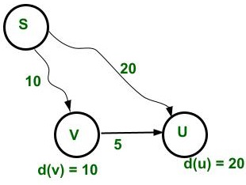. <br>+ Here **d(U)** means the distance of source vertex **S** to vertex where **C(U, V)** is the distance between **U** and **V.**<br>+ If **d(U) > d(V) + C(U, V)** then **d(U) = d(V) + C(U, V).** |
| In this case, a minimum spanning tree can be formed but negative weights edge cycles are not generally used. Using the cycle property of MST, the minimum edge weight among all the edge weights in the negative edge cycle can be selected. | If the graph is connected, and if a negative weight edge cycle present in the graph. Then the shortest path can not be computed, but the negative edge cycle can be detected using the Bellman-Ford algorithm. |
| In the case of a disconnected graph), the minimum spanning tree can not be formed but many spanning-tree forests can be formed. | In the case of a disconnected graph, the distance between two vertices present in two different components is infinity. |
| Here the Greedy approach is used for finding MST for a graph, For example, Prim's algorithm and Kruskal's algorithm. | The Dijkstra algorithm based on the Greedy approach and Bellman ford based on Dynamic programming are generally used for finding the single-source shortest paths. Floyd-War shall algorithm based on the Dynamic programming is used for finding all pairs the shortest path. |
| If there are **N** vertices are present inside graph G then the minimum spanning tree of the graph will contain **N-1** edges and **N** vertices. | If there are **N** vertices present inside graph **G**, then in the shortest path between two vertices there can be at most **N-1** edges, and at most **N** vertices can be present in the shortest path. |
| It is used in network design (computer networks, telecommunication networks, water supply networks) and in circuit design applications, and many more. | It is used to find out direction between physical locations like in Google Maps. |

---


## References

[1] Cormen, Leiserson, Rivest, and Stein. Introduction to Algorithms (CLRS).

[2] Mark Allen Weiss. Data Structures and Algorithm Analysis in C++.

[3] [Dijkstra's Algorithm](https://www.geeksforgeeks.org/dsa/dijkstras-shortest-path-algorithm-greedy-algo-7/)

[4] [Shortest Path Properties](https://www.geeksforgeeks.org/dsa/shortest-path-properties/)

[5] [Difference between Minimum Spanning Tree and Shortest Path](https://www.geeksforgeeks.org/dsa/difference-between-minimum-spanning-tree-and-shortest-path/)

[6] [Bellman–Ford Algorithm](https://www.geeksforgeeks.org/dsa/bellman-ford-algorithm-dp-23/)

[7] [Topological Sorting](https://www.geeksforgeeks.org/dsa/topological-sorting/)

[8] [Floyd Warshall Algorithm](https://www.geeksforgeeks.org/dsa/floyd-warshall-algorithm-dp-16/)

[9] [A* Search Algorithm](https://www.geeksforgeeks.org/dsa/a-search-algorithm/)

[10] [Johnson's algorithm for All-pairs shortest paths](https://www.geeksforgeeks.org/dsa/johnsons-algorithm/)
