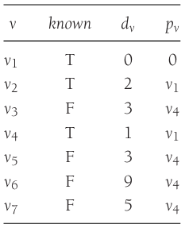

# Shortest-Path Algorithms

[TOC]


## Breadth-first search

**breadth-first search** operates by processing vertices in layers: The vertices closest to the start are evaluated first, and the most distant vertices are evaluated last. This is much the same as a level-order traversal for trees.

Example:


*An unweighted directed graph G*


*Graph after marking the start node as reachable in zero edges*


*Graph after finding all vertices whose path length from s is 1*


*Graph after finding all vertices whose shortest path is 2*


*Final shortest paths*

### Implement

```c++
// BFS (pseudo code)
void Graph::unweighted(Vertex s)
{
	for each Vertex v
  {
  	v.dist = INFINITY;
    v.known = false;
  }
  s.dist = 0;
  for (int currDist = 0; currDist < NUM_VERTICES; currDist++)
    for each Vertex v
      if (!v.known && v.dist == currDist)
      {
      	v.known = true;
        for each Vertex w adjacent to v
          if (w.dist == INFINITY)
          {
          	w.dist = currDist + 1;
            w.path = v;
          }
      }
}
```

```c++
// BFS (linked list)
void Graph::unweighted(Vertex s)
{
	Queue<Vertex> q;
  
  for each Vertex v
    v.dist = INFINITY;
  
  s.dist = 0;
  q.enqueue(s);
  
  while (!q.isEmpty())
  {
  	Vertex v = q.dequeue();
    for each Vertex w adjacent to v
      if (w.dist == INFINITY)
      {
      	w.dist = v.dist + 1;
        w.path = v;
        q.enqueue(w);
      }
  }
}
```


## Dijkstra's Algorithm

Dijkstra's algorithm proceeds in stages, just like the unweighted shortest-path algorithm. At each stage, Dijkstra's algorith selects a vertex, $v$, which has the smallest $d_v$ among all the `unknown` vertices and declares that the shortest path from $s$ to $v$ is `known`. The remainder of a stage consists of updating the values of $d_w$.

In the unweighted case, we set $d_w = d_v + 1$ if $d_w = \infty$. Thus, we essentially lowered the value of $d_w$ if vertex $v$ offered a shorter path. If we apply the same logic to the weighted case, then we should set $d_w = d_v + c_{v,w}$ if this new value for $d_w$ would be an improvement. Put simply, the algorithm decides whether or not it is a good idea to use $v$ on the path to $w$. The original cost, $d_w$, is the cost without using $v$; the cost calculated above is the cheapest path using $v$ (and only `known` vertices).

Example:


*Initial configuration of table used in Dijkstra's algorithm*


*After $v_1$ is declared known*


*After $v_4$ is declared known*



*After $v_2$ is declared known*


*After $v_5$ and then $v_3$ are declared known*


*After $v_7$ is declared known*


*After $v_6$​ is declared known and algorithm terminates*


*Stages of Dijkstra's algorithm*

### Implement

```c++
// Dijkstra pseudo code
struct Vertex
{
	List     adj;
  bool     known;
  DistType dist;
  Vertex   path;
};

void Graph::printPath(Vertex v)
{
	if (v.path != NOT_A_VERTEX)
  {
  	printPath(v.path);
    cout << " to ";
  }
  cout << v;
}

void Graph::dijkstra(Vertex s)
{
	for each Vertex v
  {
  	v.dist = INFINITY;
    v.known = false;
  }
  
  s.dist = 0;
  
  for (;;)
  {
  	Vertex v = smallest unknown distance vertex;
    if (v == NOT_A_VERTEX)
      break;
    v.known = true;
    
    for each Vertex w adjacent to v
      if (!w.known)
        if (v.dist + cvw < w.dist)
        {
        	// Update w
          decrease(w.dist to v.dist + cvw);
          w.path = v;
        }
  }
}
```


## Reference

[1] Mark Allen Weiss.Data Structures and Algorithm Analysis in C++.4ED
