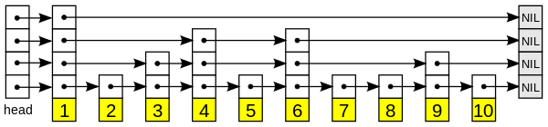
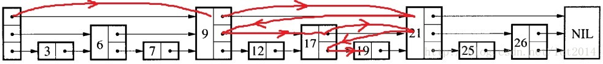
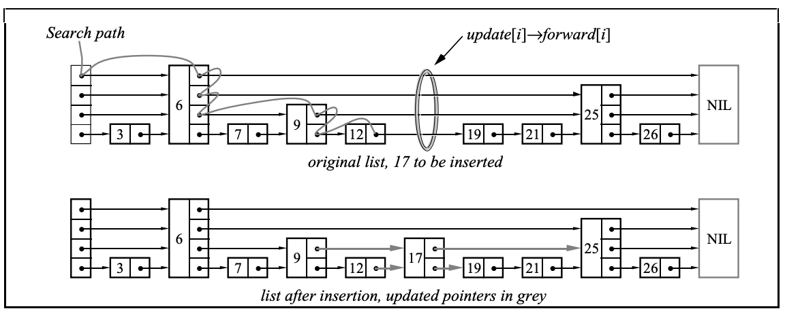
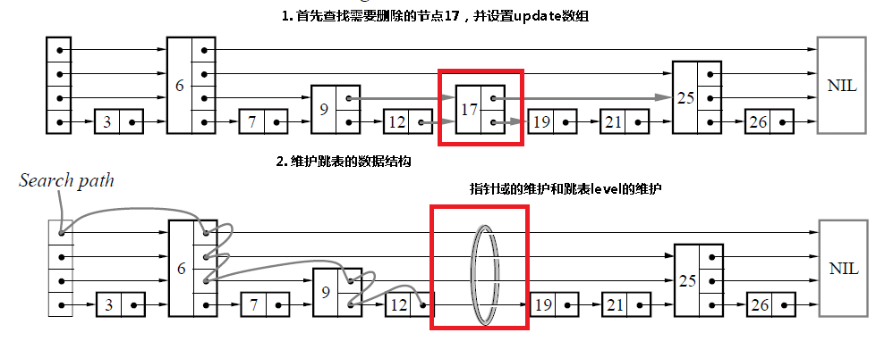
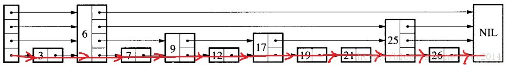

[TOC]

# 跳表

跳表是一种有序的数据结构，使得包含n个元素的有序序列的查找和插入操作的平均时间复杂度都是$O(\log n)$，优于数组的$O(n)$复杂度。


## 结构

例：跳表结构如图所示：



- head：表头，负责维护跳表的节点指针
- 节点：图中的列，保存着元素值（黄色部分）以及多个层
- 层：保存指向其他元素的指针，程序总是先从高层(最上面)开始访问，然后到底层（接近黄色部分）。
- 表尾：全部为NULL，表示跳表结束


## 查询

从头元素起步，沿着每层搜索，直到找到一个大于或等于目标的元素。

流程如下：

- 如果等于目标元素，表明已找到
- 如果大于目标元素或已到达链表末尾，退回当前层的上一个元素，进入下一层搜索

例，查找数字19：




## 插入

跳表无法对最坏情况做性能保证，因为用来建造跳表而采用随机选取元素进入更高层的方法，在小概率情况下会生成一个不平衡的跳表；**因此跳表复杂度的影响因子在随机算法这一块**。

流程如下：

- 将待插入值和各层索引节点比较，确定插入位置
- 申请新节点并插入
- 调整层级（随机算法）

伪代码：

```txt
Insert(list, searchKey, newValue)
	local update[1..MaxLevel]
	x := list→header
	for i := list→level downto 1 do
		while x→forward[i]→key < searchKey do
			x := x→forward[i]
		-- x→key < searchKey ≤ x→forward[i]→key
		update[i] := x
	x := x→forward[1]
	if x→key = searchKey then x→value := newValue
	else
		lvl := randomLevel()
		if lvl > list→level then
			for i := list→level + 1 to lvl do
				update[i] := list→header
			list→level := lvl
		x := makeNode(lvl, searchKey, value)
		for i := 1 to level do
			x→forward[i] := update[i]→forward[i]
			update[i]→forward[i] := x
```

例，插入17:




## 删除

删除节点需要进行层级更新。

流程如下：

- 确定要删除的节点
- 删除节点
- 更新层级

伪代码：

```txt
Delete(list, searchKey)
	local update[1..MaxLevel]
	x := list→header
	for i := list→level downto 1 do
		while x→forward[i]→key < searchKey do
			x := x→forward[i]
		update[i] := x
	x := x→forward[1]
	if x→key = searchKey then
		for i := 1 to list→level do
			if update[i]→forward[i] ≠ x then break
			update[i]→forward[i] := x→forward[i]
		free(x)
		while list→level > 1 and list→header→forward[list→level] = NIL do
			list→level := list→level – 1
```

例，删除17:




## 释放表

例，释放表：




## 随机算法

伪代码：

```txt
randomLevel()
	lvl := 1
	-- random() that returns a random value in [0...1)
	while random() < p and lvl < MaxLevel do
		lvl := lvl + 1
	return lvl
```


## 复杂度

|      | 平均        | 最差          |
| ---- | ----------- | ------------- |
| 空间 | $o(n)$      | $o(n \log n)$ |
| 搜索 | $o(\log n)$ | $o(n)$        |
| 插入 | $o(\log n)$ | $o(n)$        |
| 删除 | $o(\log n)$ | $o(n)$        |


## 优缺点

### 优点

- 实现简单
- 插入/删除时不用对数据结构进行全局的重新平衡，在多并发情况下，加锁的范围更小，性能更好
- 范围查找时，比平衡树简单
- 内存占用比平衡树小

### 缺点

- 进行查找时哈希表的效率基本是最高的，跳表的效率要差一点；所以Redis使用`hash table`来做查找


## 参考

- [Skip Lists: A Probabilistic Alternative to Balanced Trees](res/skiplists.pdf)
- [维基百科-跳跃列表](https://zh.wikipedia.org/wiki/%E8%B7%B3%E8%B7%83%E5%88%97%E8%A1%A8)
- [Redis设计与实现-跳跃表](https://redisbook.readthedocs.io/en/latest/internal-datastruct/skiplist.html)
- [why redis use skiplist](https://news.ycombinator.com/item?id=1171423)

