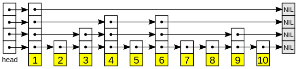
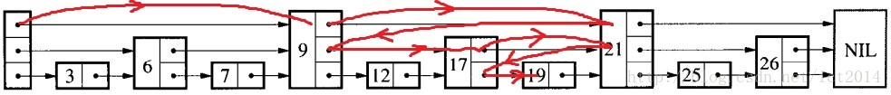
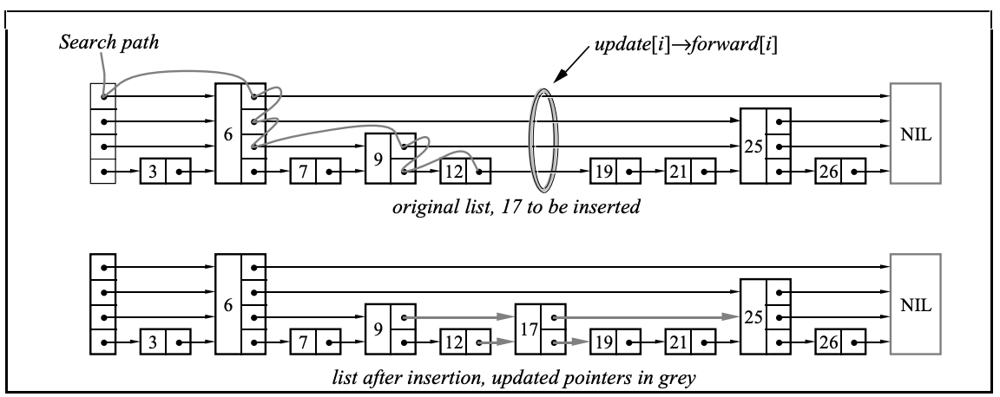
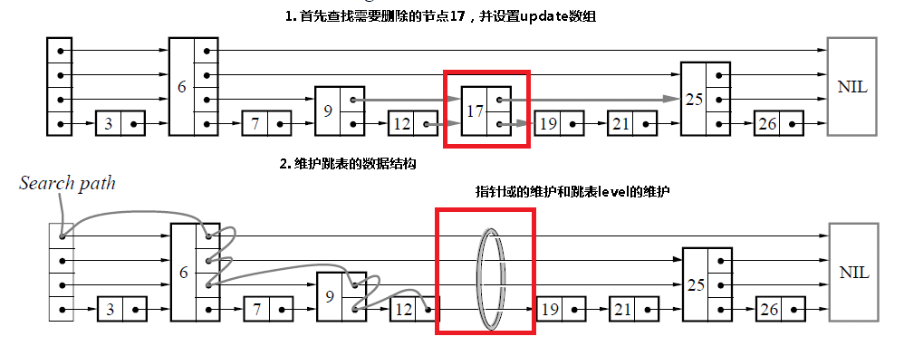
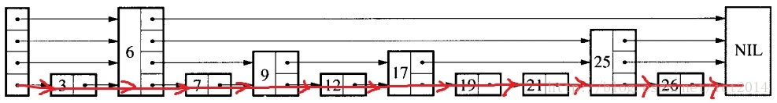

[中文版](skiplist_zh.md) | English

# Skip List

[TOC]


A skip list is an ordered data structure that allows search and insert operations in an ordered sequence of n elements with average time complexity $O(\log n)$, better than the $O(n)$ complexity of arrays.

## Definition

**Definition 1** Two elements are said to be `linked` if there is at least one chain from one element to another.

**Definition 2** The `gap size` between two elements linked at height $h$ is the number of elements between them at height $h - 1$.


## Structure

Example: The structure of a skip list is shown below:



- head: The head, responsible for maintaining node pointers of the skip list
- Node: The columns in the figure, storing element values (yellow part) and multiple levels
- Level: Stores pointers to other elements; the program always starts from the top level and then goes down to the bottom (close to the yellow part).
- Tail: All NULL, indicating the end of the skip list

```c++
template <typename Comparable>
class DSL
{
public:
	explicit DSL(const Comparable &inf) : INFINITY(inf)
	{
		bottom = new SkipNode();
		bottom->right = bottom->down = bottom;
		tail = new SkipNode(INFINITY);
		tail->right = tail;
		header = new SkipNode(INFINITY, tail, bottom);
	}

	bool contains(const Comparable &x) const;
	void insert(const Comparable &x);

private:
	struct SkipNode
	{
		Comparable element;
		SkipNode   *right;
		SkipNode   *down;

		SkipNode(const Comparable &theElement = Comparable(),
				 SkipNode *rt = NULL, SkipNode *dt = NULL)
			: element(theElement), right(rt), down(dt) {}
	};

	Comparable INFINITY;
	SkipNode   *header;
	SkipNode   *bottom;
	SkipNode   *tail;
};

template <typename Comparable>
bool DSL<Comparable>::contains(const Comparable &x) const
{
	SkipNode *current = header;

	bottom->element = x;
	for (; ;)
		if (x < current->element)
			current = current->down;
		else if (current->element < x)
			current = current->right;
		else
			return current != bottom;
}


```


## Search

Start from the head element, search along each level until you find an element greater than or equal to the target.

Process:

- If equal to the target element, it is found
- If greater than the target element or at the end of the list, go back to the previous element at the current level and enter the next level to search

Example, searching for number 19:




## Insert

Skip lists cannot guarantee worst-case performance, because the method of randomly selecting elements to enter higher levels when building the skip list may, with small probability, generate an unbalanced skip list; **thus, the complexity of skip lists is affected by the random algorithm**.

Process:

- Compare the value to be inserted with the index nodes at each level to determine the insertion position
- Allocate a new node and insert it
- Adjust levels (random algorithm)

```c++
template <typename Comparable>
void DSL<Comparable>::insert(const Comparable &x)
{
	SkipNode *current = header;
	bottom->element = x;
	while (current != bottom)
	{
		while (current->element < x)
			current = current->right;

		if (current->down->right->right->element < current->element)
		{
			current->right = new SkipNode(current->element, current->right, 
				currernt->down->right->right);
			current->element = current->down->right->element;
		}
		else
			current = current->down;
	}

	if (header->right != tail)
		header = new SkipNode(INFINITY, tail, header);
}
```

Example, inserting 17:




## Delete

Deleting a node requires updating the levels.

Process:

- Determine the node to delete
- Delete the node
- Update levels

Pseudocode:

```txt
Delete(list, searchKey)
	local update[1..MaxLevel]
	x := list→header
	for i := list→level downto 1 do
		while x→forward[i]→key < searchKey do
			x := x→forward[i]
		update[i] := x
	x := x→forward[1]
	if x→key = searchKey then
		for i := 1 to list→level do
			if update[i]→forward[i] ≠ x then break
			update[i]→forward[i] := x→forward[i]
		free(x)
		while list→level > 1 and list→header→forward[list→level] = NIL do
			list→level := list→level – 1
```

Example, deleting 17:




## Release List

Example, releasing the list:




## Random Algorithm

Pseudocode:

```txt
randomLevel()
	lvl := 1
	-- random() that returns a random value in [0...1)
	while random() < p and lvl < MaxLevel do
		lvl := lvl + 1
	return lvl
```


## Complexity

|      | Average      | Worst         |
| ---- | ------------ | ------------- |
| Space| $o(n)$       | $o(n \log n)$ |
| Search| $o(\log n)$ | $o(n)$        |
| Insert| $o(\log n)$ | $o(n)$        |
| Delete| $o(\log n)$ | $o(n)$        |


## Pros and Cons

### Pros

- Simple implementation
- No need to globally rebalance the data structure during insert/delete, so in concurrent scenarios, the lock scope is smaller and performance is better
- Range queries are simpler than in balanced trees
- Uses less memory than balanced trees

### Cons

- For lookups, hash tables are generally the most efficient; skip lists are a bit less efficient, so Redis uses `hash table` for lookups


## References

- [Skip Lists: A Probabilistic Alternative to Balanced Trees](res/skiplists.pdf)
- [Wikipedia - Skip list](https://en.wikipedia.org/wiki/Skip_list)
- [Redis Design and Implementation - Skip list](https://redisbook.readthedocs.io/en/latest/internal-datastruct/skiplist.html)
- [why redis use skiplist](https://news.ycombinator.com/item?id=1171423)
