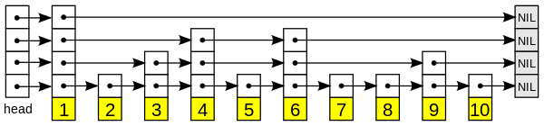
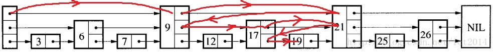
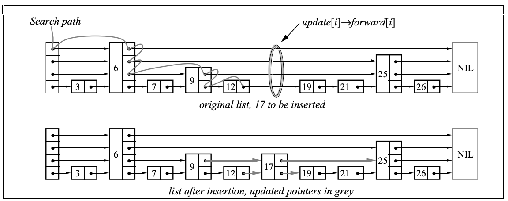
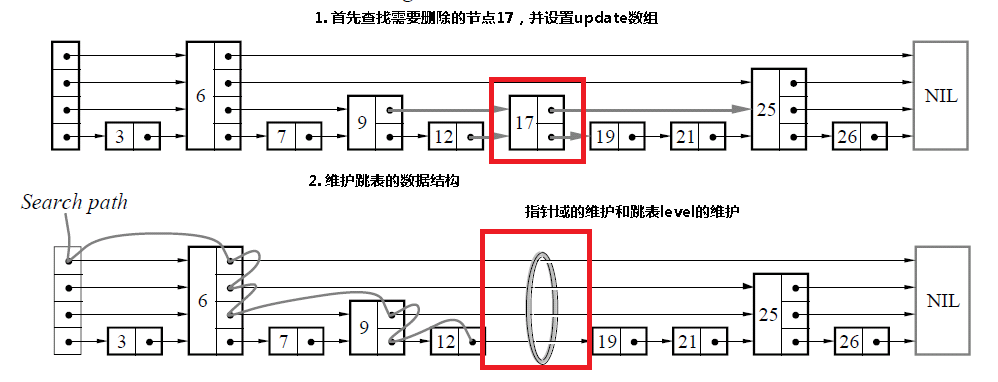
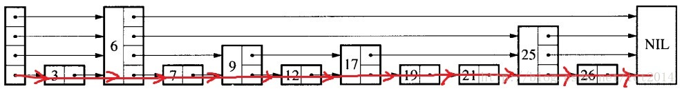

[中文版](skiplist_zh.md) | English

# Skip List

[TOC]


A skip list is a data structure that allows for efficient search, insertion and deletion of elements in a sorted list. It is a probabilistic data structure, meaning that its average time complexity is determined through a probabilistic analysis.

## Definition

**Definition 1** Two elements are said to be `linked` if there is at least one chain from one element to another.

**Definition 2** The `gap size` between two elements linked at height $h$ is the number of elements between them at height $h - 1$.


## Structure

The structure of a skip list is shown below:



- head: The head, responsible for maintaining node pointers of the skip list
- Node: The columns in the figure, storing element values (yellow part) and multiple levels
- Level: Stores pointers to other elements; the program always starts from the top level and then goes down to the bottom (close to the yellow part).
- Tail: All NULL, indicating the end of the skip list

**Implement**:

```c++
#define MAX_LEVEL 6

// Node structure
struct Node 
{
   int key;
   struct Node *forward[MAX_LEVEL];
};

// SkipList structure
struct SkipList 
{
   struct Node *header;
   int level;
};

// Create a node
struct Node* create_node(int key, int level) 
{
   struct Node *newNode = (struct Node*)malloc(sizeof(struct Node));
   if (newNode == NULL)
      return NULL;

   newNode->key = key;
   for (int i = 0; i < MAX_LEVEL; i++)
      newNode->forward[i] = NULL;

   return newNode;
}

// Create a SkipList
struct SkipList* create_skip_list() 
{
   struct SkipList *list = (struct SkipList*)malloc(sizeof(struct SkipList));
   list->header = create_node(INT_MIN, MAX_LEVEL);
   list->level = 0;
   return list;
}
```


## Operations

### Search

Start from the head element, search along each level until you find an element greater than or equal to the target.

**Algorithm:**

- If equal to the target element, it is found
- If greater than the target element or at the end of the list, go back to the previous element at the current level and enter the next level to search

**Example:** 

searching for number 19:



**Implement:**

```c++
// Search for a key
struct Node* search_node(struct SkipList *list, int key) 
{
   struct Node *current = list->header;
   for (int i = list->level; i >= 0; i--)
      while (current->forward[i] != NULL && current->forward[i]->key < key)
         current = current->forward[i];

   current = current->forward[0];
   if (current != NULL && current->key == key)
      return current;

   return NULL;
}
```

**Complexity:**

| Scenario     | Time Complexity | Space Complexity |
| :----------- | :-------------- | :--------------- |
| Best Case    | $O(1)$          | $O(1)$           |
| Average Case | $O(\log n)$     | $O(1)$           |
| Worst Case   | $O(n)$          | $O(1)$           |

For a single search operation, only a constant number of pointers/variables are used, so extra space is $O(1)$. Time is probabilistic: expected $O(\log n)$ with balanced random levels, but it can degrade to $O(n)$ in an unlucky/unbalanced layout.

### Insert

Skip lists cannot guarantee worst-case performance, because the method of randomly selecting elements to enter higher levels when building the skip list may, with small probability, generate an unbalanced skip list; **thus, the complexity of skip lists is affected by the random algorithm**.

**Algorithm:**

- Compare the value to be inserted with the index nodes at each level to determine the insertion position
- Allocate a new node and insert it
- Adjust levels (random algorithm)

**Example:**

inserting 17



**Implement:**

```c++
// Insert a node
void insert_node(struct SkipList *list, int key) 
{
   struct Node *current = list->header;
   struct Node *update[MAX_LEVEL];
   for (int i = list->level; i >= 0; i--) 
   {
      while (current->forward[i] != NULL && current->forward[i]->key < key)
         current = current->forward[i];

      update[i] = current;
   }
   current = current->forward[0];
   if (current == NULL || current->key != key) 
   {
      int rlevel = 0;
      while (rand() < RAND_MAX / 2 && rlevel < MAX_LEVEL - 1)
         rlevel++;

      if (rlevel > list->level) 
      {
         for (int i = list->level + 1; i <= rlevel; i++)
            update[i] = list->header;

         list->level = rlevel;
      }
      struct Node *newNode = create_node(key, rlevel);
      if (newNode == NULL)
         return;

      for (int i = 0; i <= rlevel; i++) 
      {
         newNode->forward[i] = update[i]->forward[i];
         update[i]->forward[i] = newNode;
      }
   }
}
```

**Complexity:**

| Scenario     | Time Complexity | Space Complexity |
| :----------- | :-------------- | :--------------- |
| Best Case    | $O(1)$          | $O(\log n)$      |
| Average Case | $O(\log n)$     | $O(\log n)$      |
| Worst Case   | $O(n)$          | $O(\log n)$      |

Insertion first performs a search-like traversal, then rewires forward pointers up to the chosen random level. The temporary `update[]` array stores predecessor nodes per level, so auxiliary space is proportional to the number of levels (typically $O(\log n)$, or $O(\text{MAX\_LEVEL})$ in fixed-level implementations).

### Delete

Deleting a node requires updating the levels.

**Algorithm:**

- Determine the node to delete
- Delete the node
- Update levels

**Example:**

deleting 17.



**Implement:**

```c++
// Delete a key
void delete_node(struct SkipList *list, int key) 
{
   struct Node *current = list->header;
   struct Node *update[MAX_LEVEL];
   for (int i = list->level; i >= 0; i--) 
   {
      while (current->forward[i] != NULL && current->forward[i]->key < key)
        current = current->forward[i];

      update[i] = current;
   }

   current = current->forward[0];
   if (current != NULL && current->key == key) 
   {
      for (int i = 0; i <= list->level; i++) 
      {
         if (update[i]->forward[i] != current)
            break;

         update[i]->forward[i] = current->forward[i];
      }

      free(current);
      while (list->level > 0 && list->header->forward[list->level] == NULL)
         list->level--;
   }
}
```

**Complexity:**

| Scenario     | Time Complexity | Space Complexity |
| :----------- | :-------------- | :--------------- |
| Best Case    | $O(1)$          | $O(\log n)$      |
| Average Case | $O(\log n)$     | $O(\log n)$      |
| Worst Case   | $O(n)$          | $O(\log n)$      |

Deletion performs a search-like traversal to locate predecessor nodes at each level, then rewires pointers and possibly decreases the current top level. The temporary `update[]` array dominates auxiliary space, so space is proportional to level count (typically $O(\log n)$, or $O(\text{MAX\_LEVEL})$ in fixed-level implementations).

### Release List

**Example:**

releasing the list:




## Summary

### Pros and Cons

Pros:

- Simple implementation
- No need to globally rebalance the data structure during insert/delete, so in concurrent scenarios, the lock scope is smaller and performance is better
- Range queries are simpler than in balanced trees
- Uses less memory than balanced trees

Cons:

- For lookups, hash tables are generally the most efficient; skip lists are a bit less efficient, so Redis uses `hash table` for lookups


## References

[1] [Skip Lists: A Probabilistic Alternative to Balanced Trees](res/skiplists.pdf)

[2] [Wikipedia - Skip list](https://en.wikipedia.org/wiki/Skip_list)

[3] [Redis Design and Implementation - Skip list](https://redisbook.readthedocs.io/en/latest/internal-datastruct/skiplist.html)

[4] [why redis use skiplist](https://news.ycombinator.com/item?id=1171423)

[5] [Skip List - Efficient Search, Insert and Delete in Linked List](https://www.geeksforgeeks.org/dsa/skip-list/)

[6] [Skip List | Set 2 (Insertion)](https://www.geeksforgeeks.org/dsa/skip-list-set-2-insertion/)

[7] [Skip List | Set 3 (Searching and Deletion)](https://www.geeksforgeeks.org/dsa/skip-list-set-3-searching-deletion/)
