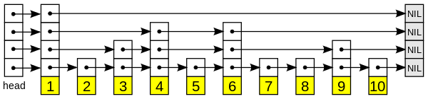
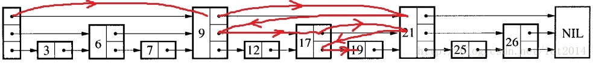
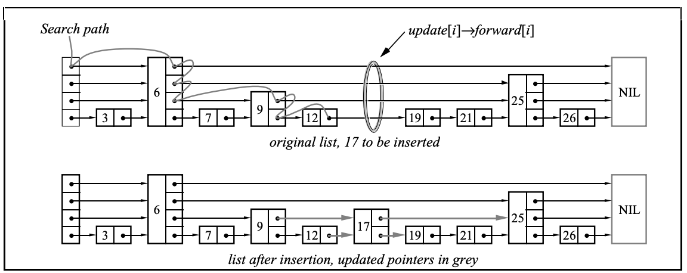
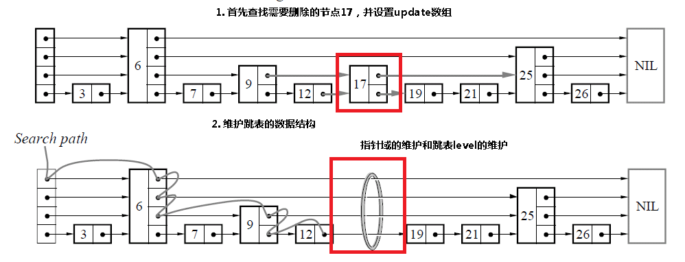
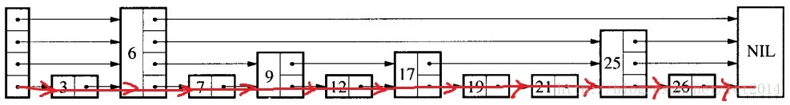

# 跳表

[TOC]


跳表是一种有序的数据结构，使得包含n个元素的有序序列的查找和插入操作的平均时间复杂度都是$O(\log n)$，优于数组的$O(n)$复杂度。

## 定义

**定义1** 两个元素称为是`链接的（linked）`，如果至少存在一个链从一个元素指向另一个元素。

**定义2** 两个在高度$h$链接的元素间的`间隙容量（gap size）`等于它们之间高度为$h - 1$的元素的个数。


## 结构

例：跳表结构如图所示：



- head：表头，负责维护跳表的节点指针
- 节点：图中的列，保存着元素值（黄色部分）以及多个层
- 层：保存指向其他元素的指针，程序总是先从高层(最上面)开始访问，然后到底层（接近黄色部分）。
- 表尾：全部为NULL，表示跳表结束

```c++
template <typename Comparable>
class DSL
{
public:
    explicit DSL(const Comparable &inf) : INFINITY(inf)
    {
        bottom = new SkipNode();
        bottom->right = bottom->down = bottom;
        tail = new SkipNode(INFINITY);
        tail->right = tail;
        header = new SkipNode(INFINITY, tail, bottom);
    }

    bool contains(const Comparable &x) const;
    void insert(const Comparable &x);

private:
    struct SkipNode
    {
        Comparable element;
        SkipNode   *right;
        SkipNode   *down;

        SkipNode(const Comparable &theElement = Comparable(),
                 SkipNode *rt = NULL, SkipNode *dt = NULL)
            : element(theElement), right(rt), down(dt) {}
    };

    Comparable INFINITY;
    SkipNode   *header;
    SkipNode   *bottom;
    SkipNode   *tail;
};

template <typename Comparable>
bool DSL<Comparable>::contains(const Comparable &x) const
{
    SkipNode *current = header;

    bottom->element = x;
    for (; ;)
        if (x < current->element)
            current = current->down;
        else if (current->element < x)
            current = current->right;
        else
            return current != bottom;
}


```


## 查询

从头元素起步，沿着每层搜索，直到找到一个大于或等于目标的元素。

流程如下：

- 如果等于目标元素，表明已找到
- 如果大于目标元素或已到达链表末尾，退回当前层的上一个元素，进入下一层搜索

例，查找数字19：




## 插入

跳表无法对最坏情况做性能保证，因为用来建造跳表而采用随机选取元素进入更高层的方法，在小概率情况下会生成一个不平衡的跳表；**因此跳表复杂度的影响因子在随机算法这一块**。

流程如下：

- 将待插入值和各层索引节点比较，确定插入位置
- 申请新节点并插入
- 调整层级（随机算法）

```c++
template <typename Comparable>
void DSL<Comparable>::insert(const Comparable &x)
{
    SkipNode *current = header;
    bottom->element = x;
    while (current != bottom)
    {
        while (current->element < x)
            current = current->right;

        if (current->down->right->right->element < current->element)
        {
            current->right = new SkipNode(current->element, current->right, 
                currernt->down->right->right);
            current->element = current->down->right->element;
        }
        else
            current = current->down;
    }

    if (header->right != tail)
        header = new SkipNode(INFINITY, tail, header);
}
```

例，插入17:




## 删除

删除节点需要进行层级更新。

流程如下：

- 确定要删除的节点
- 删除节点
- 更新层级

伪代码：

```txt
Delete(list, searchKey)
	local update[1..MaxLevel]
	x := list→header
	for i := list→level downto 1 do
		while x→forward[i]→key < searchKey do
			x := x→forward[i]
		update[i] := x
	x := x→forward[1]
	if x→key = searchKey then
		for i := 1 to list→level do
			if update[i]→forward[i] ≠ x then break
			update[i]→forward[i] := x→forward[i]
		free(x)
		while list→level > 1 and list→header→forward[list→level] = NIL do
			list→level := list→level – 1
```

例，删除17:




## 释放表

例，释放表：




## 随机算法

伪代码：

```txt
randomLevel()
	lvl := 1
	-- random() that returns a random value in [0...1)
	while random() < p and lvl < MaxLevel do
		lvl := lvl + 1
	return lvl
```


## 复杂度

|      | 平均        | 最差          |
| ---- | ----------- | ------------- |
| 空间 | $o(n)$      | $o(n \log n)$ |
| 搜索 | $o(\log n)$ | $o(n)$        |
| 插入 | $o(\log n)$ | $o(n)$        |
| 删除 | $o(\log n)$ | $o(n)$        |


## 优缺点

### 优点

- 实现简单
- 插入/删除时不用对数据结构进行全局的重新平衡，在多并发情况下，加锁的范围更小，性能更好
- 范围查找时，比平衡树简单
- 内存占用比平衡树小

### 缺点

- 进行查找时哈希表的效率基本是最高的，跳表的效率要差一点；所以Redis使用`hash table`来做查找


## 参考

- [Skip Lists: A Probabilistic Alternative to Balanced Trees](res/skiplists.pdf)
- [维基百科-跳跃列表](https://zh.wikipedia.org/wiki/%E8%B7%B3%E8%B7%83%E5%88%97%E8%A1%A8)
- [Redis设计与实现-跳跃表](https://redisbook.readthedocs.io/en/latest/internal-datastruct/skiplist.html)
- [why redis use skiplist](https://news.ycombinator.com/item?id=1171423)

