[中文版](sort_zh.md) | English

# Sorting Algorithm Summary

[TOC]


## Insertion Sort

Insertion sort is a simple sorting algorithm that works by iteratively inserting each element of an unsorted list into its correct position in a sorted portion of the list.

**Algorithm:**

1. Start with the second element as the first element is assumed to be sorted.
2. Compare the second element with the first if the second is smaller then swap them.
3. Move to the third element, compare it with the first two, and put it in its correct position
4. Repeat until the entire array is sorted.

**Example:**

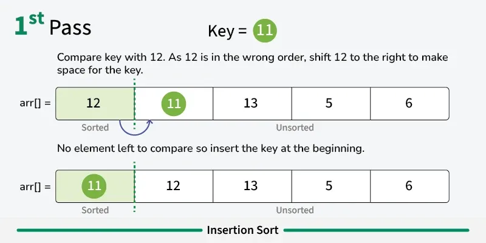

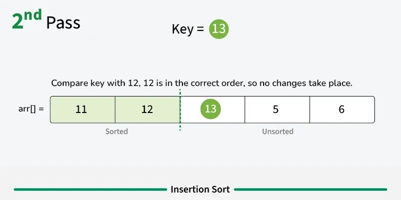

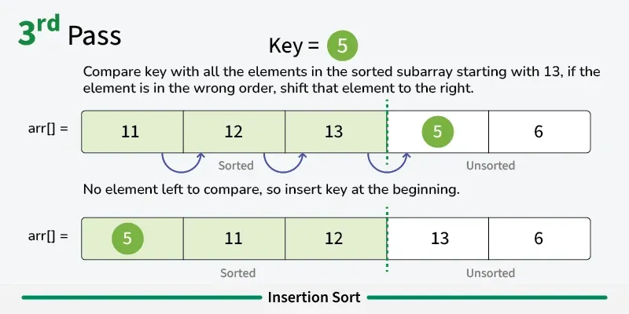

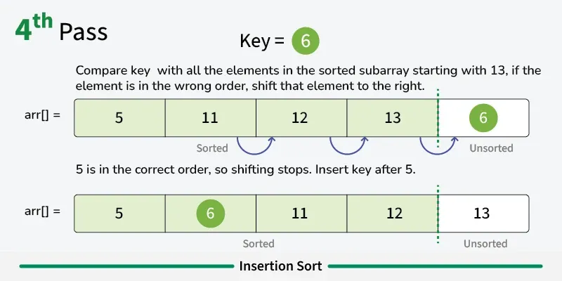

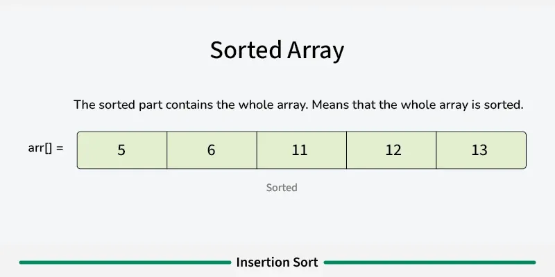

**Implement:**

```c++
void insertion_sort(int arr[], int n)
{
    for (int i = 1; i < n; ++i) 
    {
        int key = arr[i];
        int j = i - 1;

        while (j >= 0 && arr[j] > key) 
        {
            arr[j + 1] = arr[j];
            j = j - 1;
        }
        arr[j + 1] = key;
    }
}
```

**Complexity:**

| Scenario     | Time Complexity | Space Complexity |
| :----------- | :-------------- | :--------------- |
| Best Case    | $O(n)$          | $O(1)$           |
| Average Case | $O(n^2)$        | $O(1)$           |
| Worst Case   | $O(n^2)$        | $O(1)$           |

---


## Selection Sort

**Selection Sort** is a comparison-based sorting algorithm. It sorts by repeatedly selecting the **smallest (or largest)** element from the unsorted portion and swapping it with the first unsorted element

**Algorithm**:

1. Find the smallest element and swap it with the first element. This way, we get the smallest element at its correct position.
2. Then find the smallest among the remaining elements (or second smallest) and swap it with the second element.
3. We keep doing this until we get all elements moved to the correct position.

**Example:**

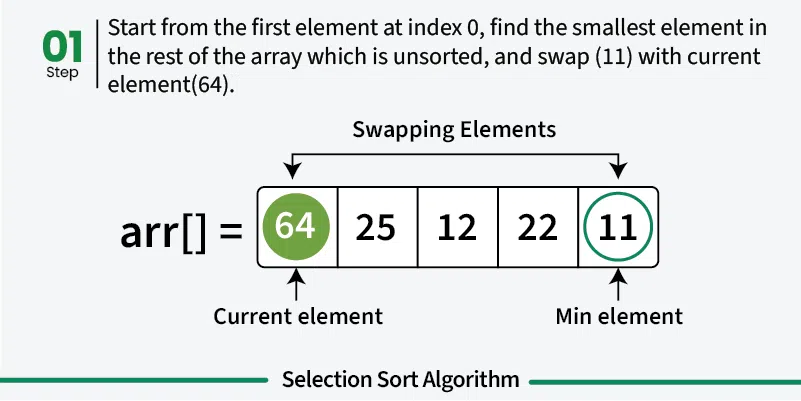

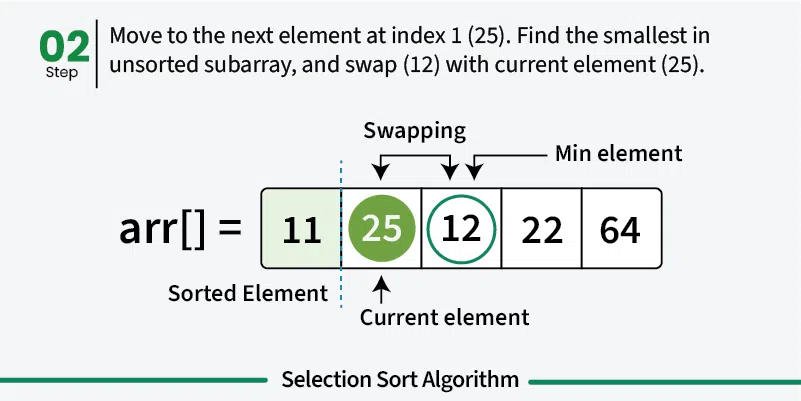

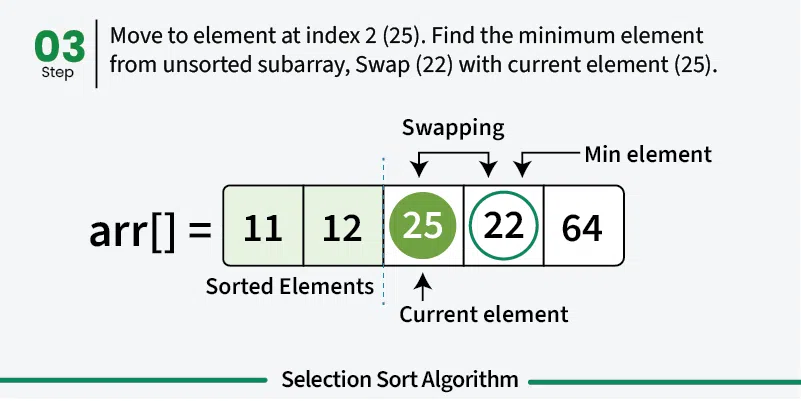

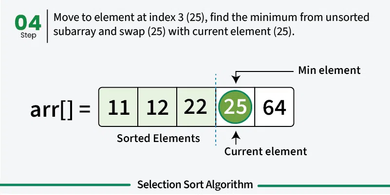

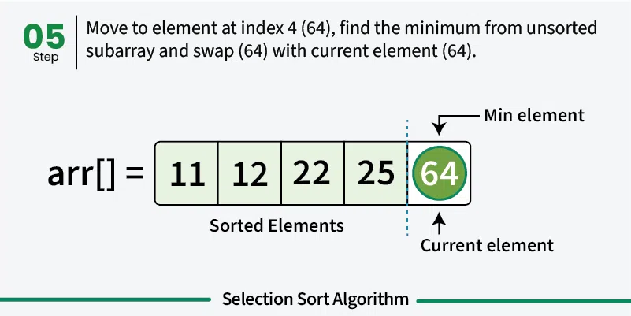

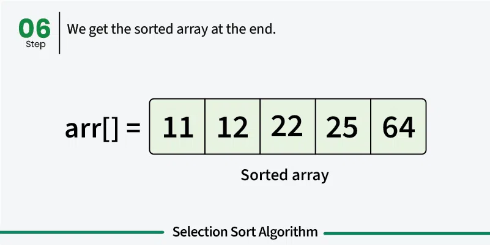

**Implement:**

```c++
void selection_sort(int arr[], int n) 
{
    for (int i = 0; i < n - 1; i++) 
    {
        int min_idx = i;
        for (int j = i + 1; j < n; j++) 
        {
            if (arr[j] < arr[min_idx])
                min_idx = j;
        }
        
        int temp = arr[i];
        arr[i] = arr[min_idx];
        arr[min_idx] = temp;
    }
}

```

**Complexity:**

| Scenario     | Time Complexity | Space Complexity |
| :----------- | :-------------- | :--------------- |
| Best Case    | $O(n^2)$        | $O(1)$           |
| Average Case | $O(n^2)$        | $O(1)$           |
| Worst Case   | $O(n^2)$        | $O(1)$           |

---


## Bubble Sort

**Bubble Sort** is the simplest sorting algorithm that works by repeatedly swapping the adjacent elements if they are in the wrong order. This algorithm is not efficient for large data sets as its average and worst-case time complexity are quite high.

**Algorithm:**

1. Sorts the array using multiple passes. After the first pass, the maximum goes to the end (it's in the correct position). In the same way, after the second pass, the second largest goes to the second last position, and so on.
2. In every pass, process only those that have not already moved to the correct position. After k passes, the largest k must have been moved to the last k positions.
3. In a pass, we consider the remaining elements and compare all adjacent elements and swap if a larger element is before a smaller element. If we keep doing this, we get the largest (among the remaining elements) at its correct position.

**Example:**

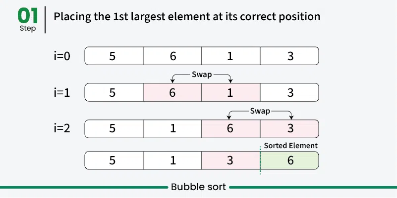

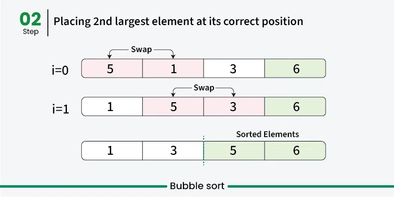

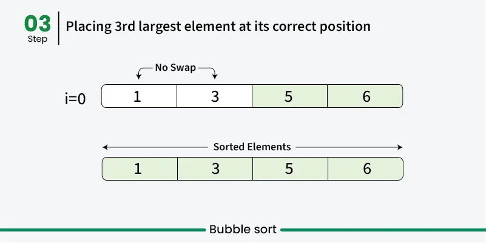

**Implement:**

```c++
// An optimized version of Bubble Sort
void bubble_sort(int arr[], int n)
{
    int i, j;
    bool swapped;
    for (i = 0; i < n - 1; i++) 
    {
        swapped = false;
        for (j = 0; j < n - i - 1; j++) 
        {
            if (arr[j] > arr[j + 1]) 
            {
                int tmp = arr[j];
                arr[j] = arr[j + 1];
                arr[j + 1] = tmp;
                swapped = true;
            }
        }

        // If no two elements were swapped by inner loop,
        // then break
        if (swapped == false)
            break;
    }
}
```

**Complexity:**

| Scenario     | Time Complexity | Space Complexity |
| :----------- | :-------------- | :--------------- |
| Best Case    | $O(n)$          | $O(1)$           |
| Average Case | $O(n^2)$        | $O(1)$           |
| Worst Case   | $O(n^2)$        | $O(1)$           |

---


## Merge Sort

**Merge sort** is a popular sorting algorithm known for its efficiency and stability. It follows the Divide and Conquer approach. It works by recursively dividing the input array into two halves, recursively sorting the two halves, and finally merging them back together to obtain the sorted array.

**Algorithm:**

1. **Divide:** Divide the list or array recursively into two halves until it can no longer be divided.
2. **Conquer:** Each subarray is sorted individually using the merge sort algorithm.
3. **Merge:** The sorted subarrays are merged back together in sorted order. The process continues until all elements from both subarrays have been merged.

**Example:**

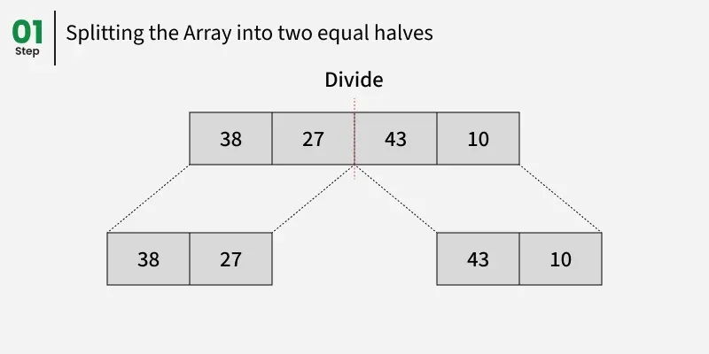

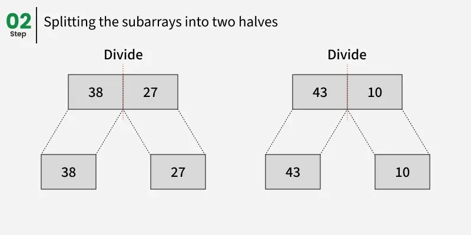

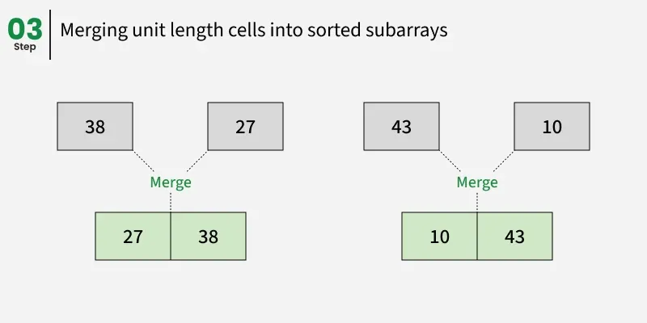

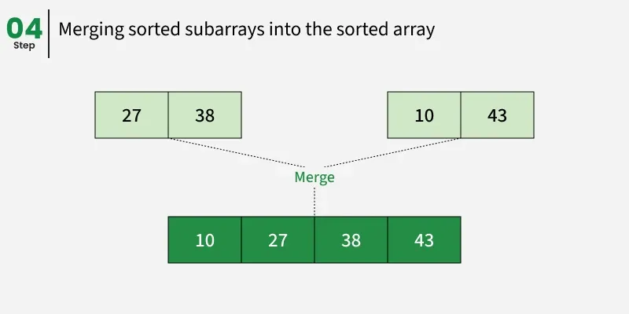

**Implement:**

```c++
void merge(int arr[], int l, int m, int r)
{
    int i, j, k;
    int n1 = m - l + 1;
    int n2 = r - m;
    int L[n1], R[n2];

    // Copy data to temp arrays L[] and R[]
    for (i = 0; i < n1; i++)
        L[i] = arr[l + i];
    for (j = 0; j < n2; j++)
        R[j] = arr[m + 1 + j];

    // Merge the temp arrays back into arr[l..r]
    i = 0;
    j = 0;
    k = l;
    while (i < n1 && j < n2) 
    {
        if (L[i] <= R[j]) 
        {
            arr[k] = L[i];
            i++;
        }
        else 
        {
            arr[k] = R[j];
            j++;
        }
        k++;
    }

    // Copy the remaining elements of L[],
    // if there are any
    while (i < n1) 
    {
        arr[k] = L[i];
        i++;
        k++;
    }

    // Copy the remaining elements of R[],
    // if there are any
    while (j < n2) 
    {
        arr[k] = R[j];
        j++;
        k++;
    }
}

// l is for left index and r is right index of the
// sub-array of arr to be sorted
void merge_sort(int arr[], int l, int r)
{ 
    if (l < r) 
    {
        int m = l + (r - l) / 2;

        // Sort first and second halves
        merge_sort(arr, l, m);
        merge_sort(arr, m + 1, r);

        merge(arr, l, m, r);
    }
}
```

**Complexity:**

| Scenario     | Time Complexity | Space Complexity |
| :----------- | :-------------- | :--------------- |
| Best Case    | $O(n \log n)$   | $O(n)$           |
| Average Case | $O(n \log n)$   | $O(n)$           |
| Worst Case   | $O(n \log n)$   | $O(n)$           |

---


## Quick Sort

**QuickSort** is a sorting algorithm based on the Divide and Conquer that picks an element as a pivot and partitions the given array around the picked pivot by placing the pivot in its correct position in the sorted array.

**Algorithm:**

1. **Choose a Pivot:** Select an element from the array as the pivot. The choice of pivot can vary (e.g., first element, last element, random element, or median).
2. **Partition the Array:** Re-arrange the array around the pivot. After partitioning, all elements smaller than the pivot will be on its left, and all elements greater than the pivot will be on its right.
3. **Recursively Call:** Recursively apply the same process to the two partitioned sub-arrays.
4. **Base Case:** The recursion stops when there is only one element left in the sub-array, as a single element is already sorted.

**Example:**

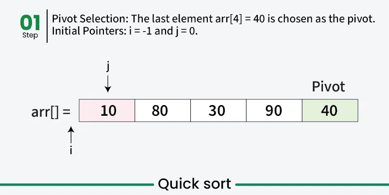

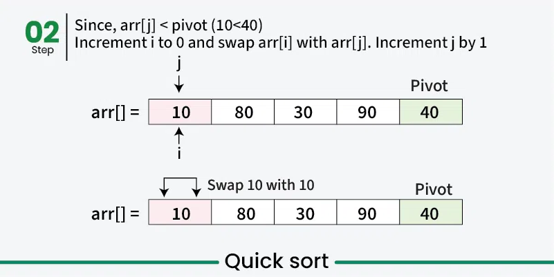

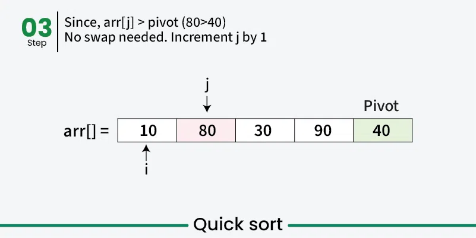

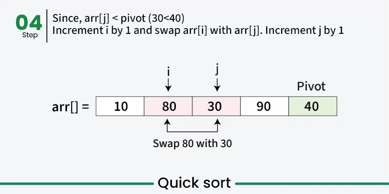

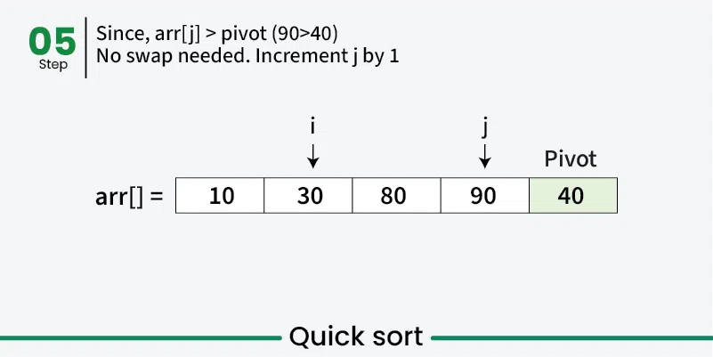

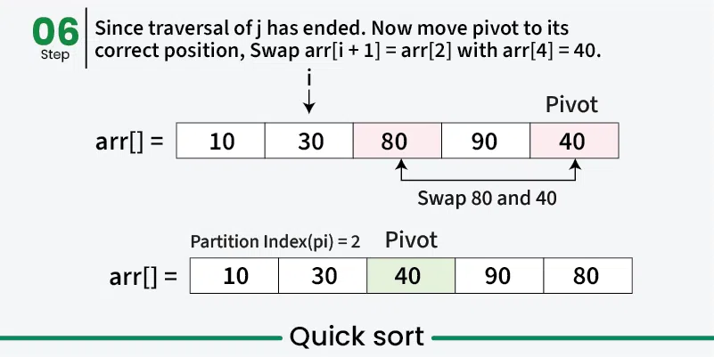

```c++
void quick_sort(int a[], int low, int high)
{
    if(low >= high)
        return;

    int first = low;
    int last  = high;
    int key   = a[first];
    while(first < last)
    {
        while(first < last && a[last] >= key) { --last; }
        a[first] = a[last];
      
        while(first < last && a[first] <= key) { ++first; }
        a[last] = a[first];
    }
    a[first] = key;
    quick_sort(a, low, first-1);
    quick_sort(a, first+1, high);
}
```

**Complexity:**

| Scenario     | Time Complexity | Space Complexity |
| :----------- | :-------------- | :--------------- |
| Best Case    | $O(n \log n)$   | $O(\log n)$      |
| Average Case | $O(n \log n)$   | $O(\log n)$      |
| Worst Case   | $O(n^2)$        | $O(n)$           |


---


## Bucket Sort

**Bucket sort** is a sorting technique that involves dividing elements into various groups, or buckets. These buckets are formed by uniformly distributing the elements. Once the elements are divided into buckets, they can be sorted using any other sorting algorithm. Finally, the sorted elements are gathered together in an ordered fashion.

**Algorithm:**

Create **n** empty buckets (Or lists) and do the following for every array element arr[i].

1. Insert $arr[i]$ into the bucket $[n \times array[i]]$
2. Sort individual buckets using insertion sort.
3. Concatenate all sorted buckets.

**Example:**

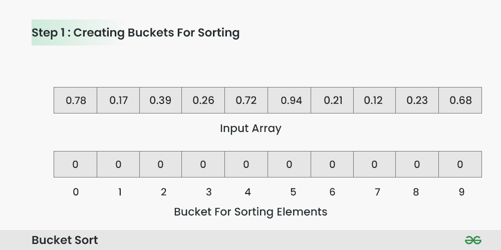

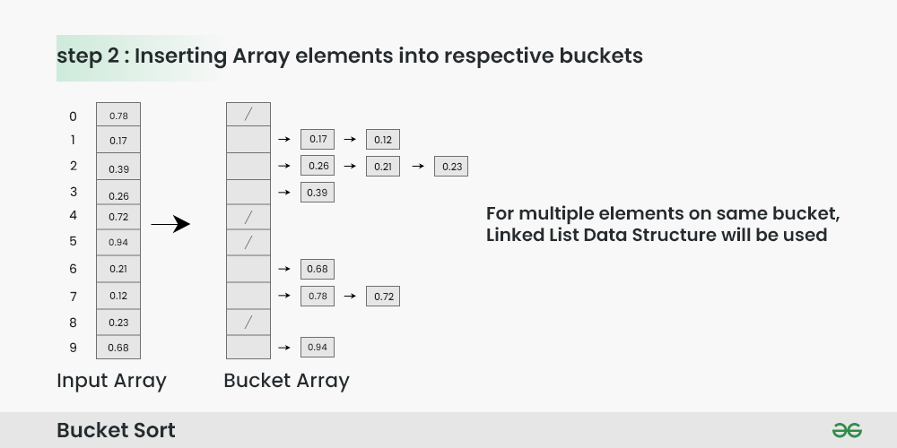

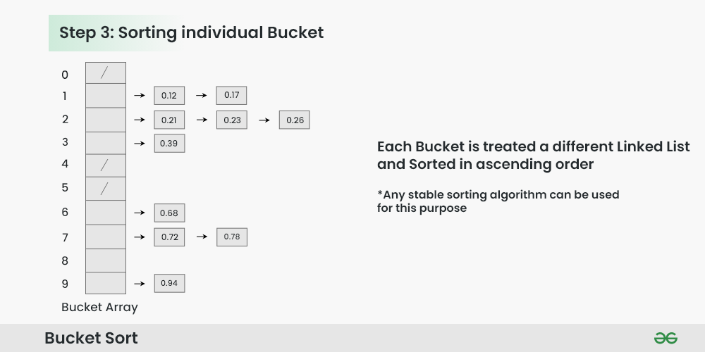

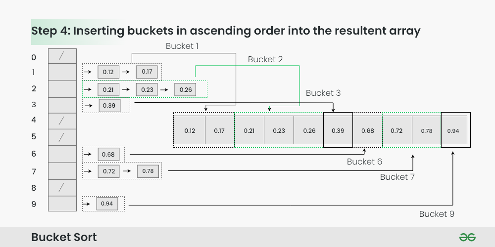

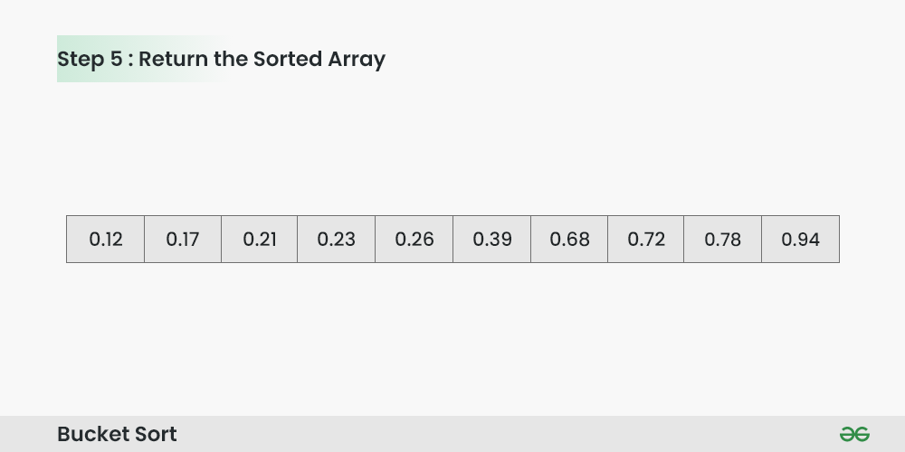

**Implement:**

```c++
void bucket_sort(float arr[], int n) 
{
    std::vector<float> b[n];
    for (int i = 0; i < n; i++) 
    {
        int bi = n * arr[i];
        b[bi].push_back(arr[i]);
    }

    for (int i = 0; i < n; i++) 
    {
        // Insertion sort function to sort individual buckets
        for (int i = 1; i < b[i].size(); ++i) 
        {
            float key = b[i][i];
            int j = i - 1;
            while (j >= 0 && b[i][j] > key) 
            {
                b[i][j + 1] = b[i][j];
                j--;
            }
            b[i][j + 1] = key;
        }
    }

    int index = 0;
    for (int i = 0; i < n; i++)
        for (int j = 0; j < b[i].size(); j++)
            arr[index++] = b[i][j];
}
```

**Complexity:**

| Scenario     | Time Complexity | Space Complexity |
| :----------- | :-------------- | :--------------- |
| Best Case    | $O(n)$          | $O(n)$           |
| Average Case | $O(n)$          | $O(n)$           |
| Worst Case   | $O(n^2)$        | $O(n)$           |

---


## Heap Sort

**Heap Sort** is a comparison-based sorting algorithm based on the **Binary Heap** data structure. It is an optimized version of selection sort. The algorithm repeatedly finds the maximum (or minimum) element and swaps it with the last (or first) element. Using a binary heap allows efficient access to the max (or min) element in $O(\log n)$ time instead of $O(n)$. The process is repeated for the remaining elements until the array is sorted.

**Algorithm:**

1. Treat the Array as a Complete Binary Tree

   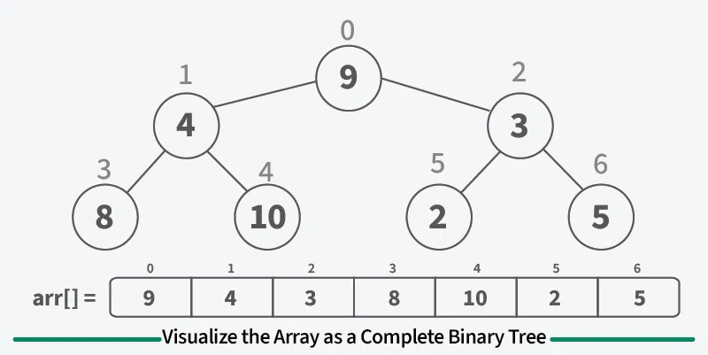

2. Build a Max Heap

   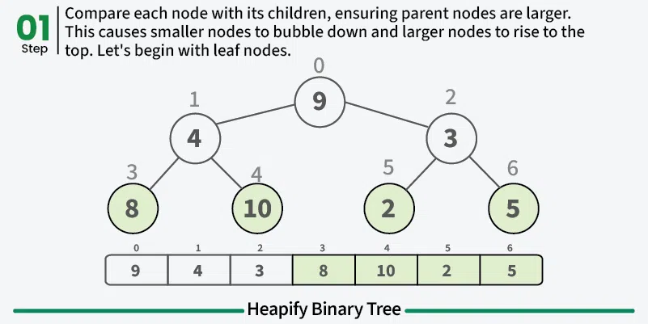

   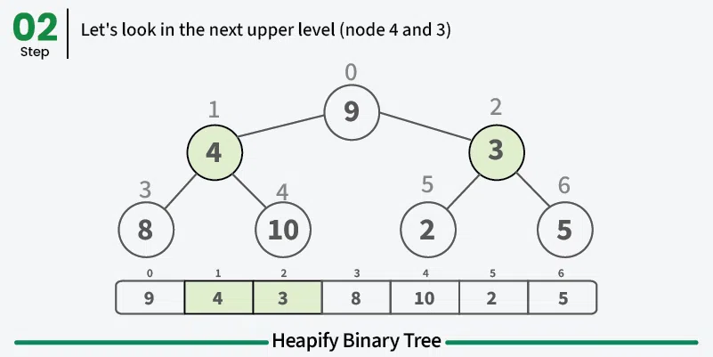

   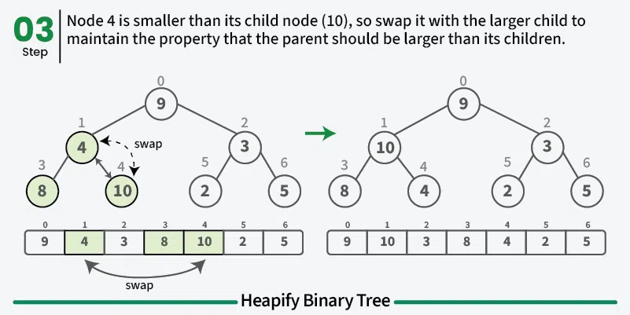

   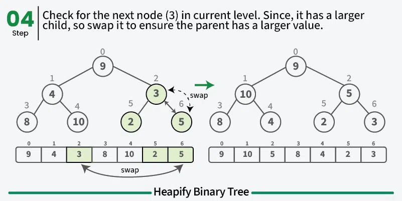

   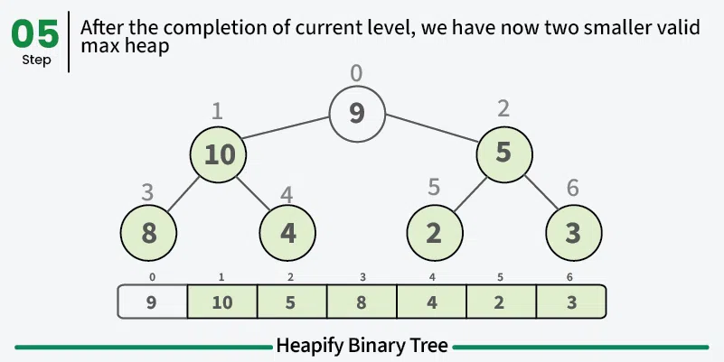

   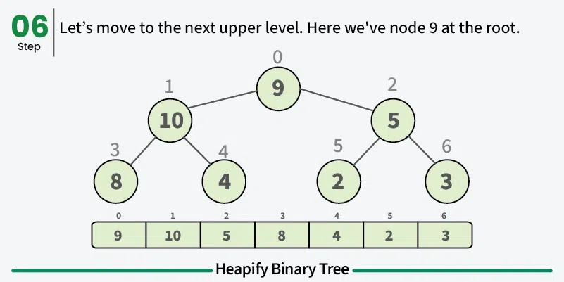

   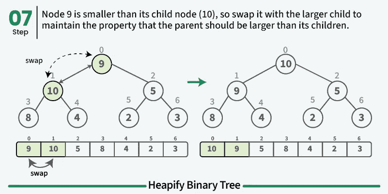

3. Sort the array by placing the largest element at the end of the unsorted array.

   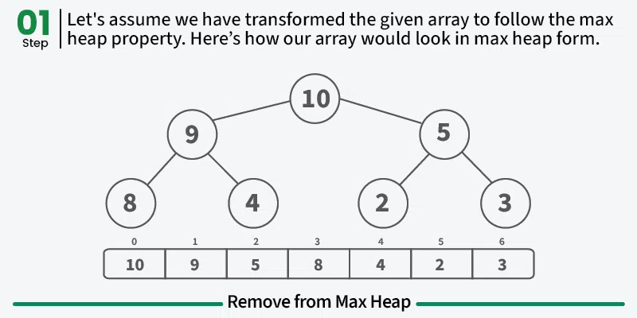

   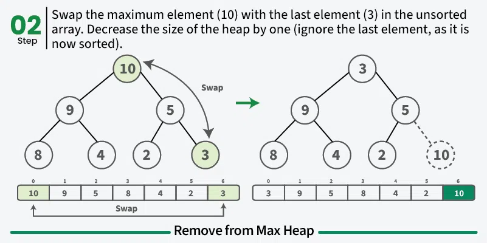

   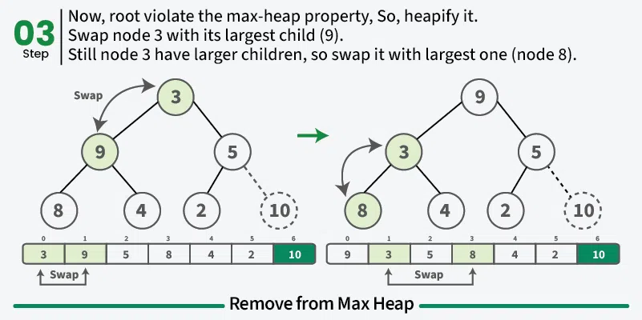

   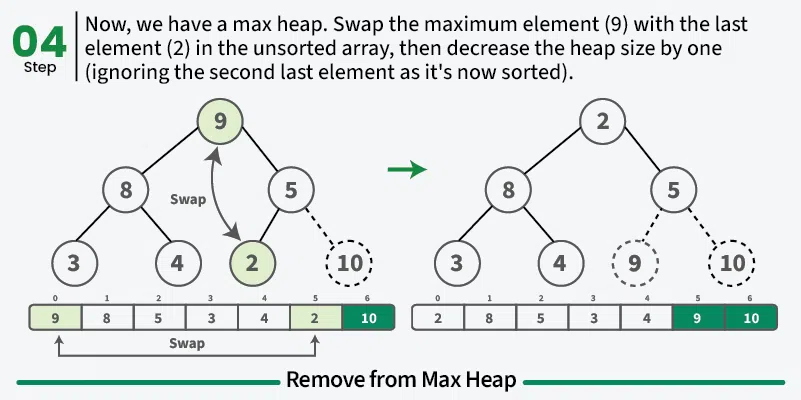

   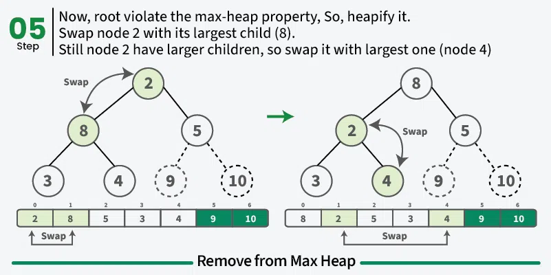

   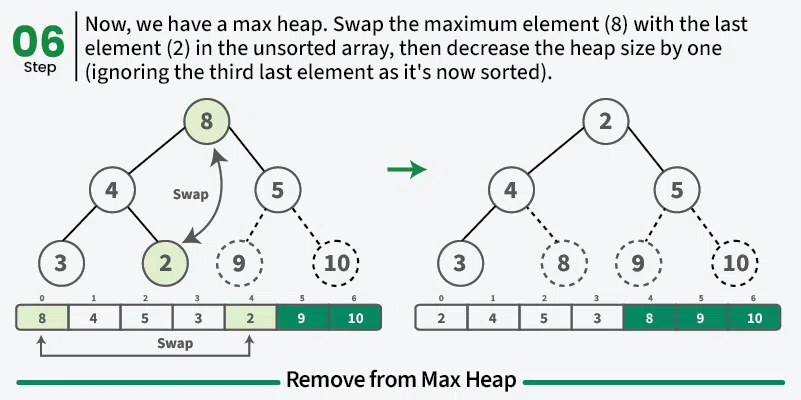

**Implement:**

```c++
void heapify(int arr[], int n, int i)
{
    int largest = i;
    int l = 2 * i + 1;
    int r = 2 * i + 2;
    if (l < n && arr[l] > arr[largest])
        largest = l;

    if (r < n && arr[r] > arr[largest])
        largest = r;

    if (largest != i) 
    {
        int temp = arr[i];
        arr[i] = arr[largest];
        arr[largest] = temp;

        heapify(arr, n, largest);
    }
}

void heap_sort(int arr[], int n)
{
    for (int i = n / 2 - 1; i >= 0; i--)
        heapify(arr, n, i);

    for (int i = n - 1; i > 0; i--) 
    {
        int temp = arr[0];
        arr[0] = arr[i];
        arr[i] = temp;

        heapify(arr, i, 0);
    }
}
```

**Complexity:**

| Scenario     | Time Complexity | Space Complexity |
| :----------- | :-------------- | :--------------- |
| Best Case    | $O(n \log n)$   | $O(1)$           |
| Average Case | $O(n \log n)$   | $O(1)$           |
| Worst Case   | $O(n \log n)$   | $O(1)$           |

---


## Shell Sort

**Shell Sort**, also known as Shell's method, is an in-place comparison sort and an optimization of Insertion Sort. It improves upon the efficiency of Insertion Sort by allowing elements to be moved over larger distances in the initial stages, which significantly reduces the number of swaps required, especially for larger datasets. 

**Algorithm:**

1. Choose a gap sequence (commonly `n/2, n/4, ... , 1`).
2. Sort elements at each gap using Insertion Sort.
3. Reduce the gap and repeat until the gap becomes 1.

**Example:**

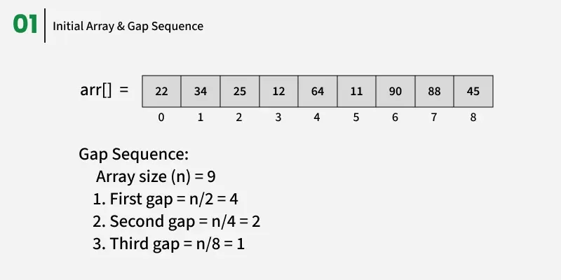

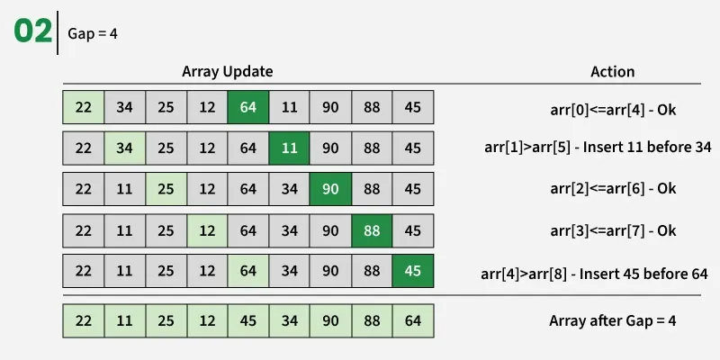

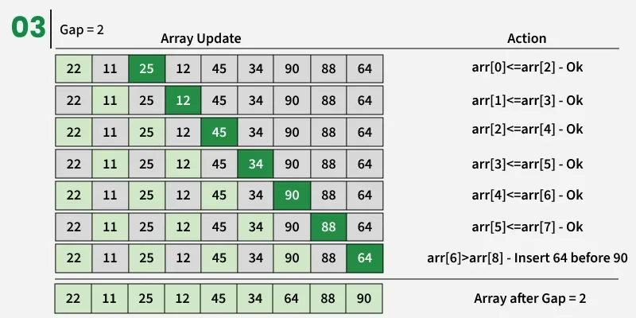

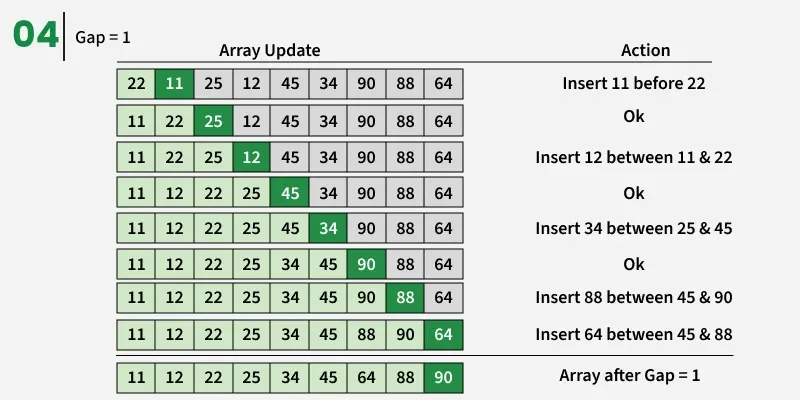

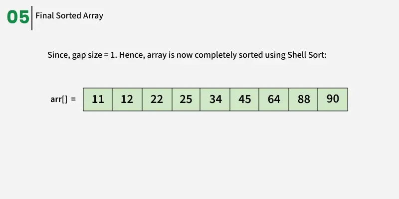

**Implement:**

```c++
void shell_sort(std::vector<int>& arr) 
{
    int n = arr.size();
    for (int gap = n / 2; gap > 0; gap /= 2) 
    {
        for (int i = gap; i < n; i++) 
        {
            int temp = arr[i];  
            int j = i;
            while (j >= gap && arr[j - gap] > temp) 
            {
                arr[j] = arr[j - gap];
                j -= gap;
            }
            arr[j] = temp;
        }
    }
}
```

**Complexity:**

| Scenario     | Time Complexity | Space Complexity |
| :----------- | :-------------- | :--------------- |
| Best Case    | $O(n)$          | $O(1)$           |
| Average Case | $O(n^{1.3})$    | $O(1)$           |
| Worst Case   | $O(n^2)$        | $O(1)$           |

---


## Summary

### Complexity

There is a summary of sorting algorithms:

| Sort Algorithm | Average Case   | Best Case      | Worst Case     | Space Complexity | Stability |
| -------------- | -------------- | -------------- | -------------- | ---------------- | --------- |
| Insertion Sort | $O(n^2)$       | $O(n)$         | $O(n^2)$       | $O(1)$           | Stable    |
| Shell Sort     | $O(n^{1.3})$   | $O(n)$         | $O(n^2)$       | $O(1)$           | Unstable  |
| Selection Sort | $O(n^2)$       | $O(n^2)$       | $O(n^2)$       | $O(1)$           | Unstable  |
| Heap Sort      | $O(n \log  n)$ | $O(n \log  n)$ | $O(n \log  n)$ | $O(1)$           | Unstable  |
| Bubble Sort    | $O(n^2)$       | $O(n)$         | $O(n^2)$       | $O(1)$           | Stable    |
| Quick Sort     | $O(n \log  n)$ | $O(n \log  n)$ | $O(n^2)$       | $O(n \log  n)$   | Unstable  |
| Merge Sort     | $O(n \log  n)$ | $O(n \log  n)$ | $O(n \log  n)$ | $O(n)$           | Stable    |
| Radix Sort     | $O(d(r+n))$    | $O(d(n+rd))$   | $O(d(r+n))$    | $O(rd+n)$        | Stable    |
| Bucket Sort    | $O(n)$         | $O(n)$         | $O(n^2)$       | $O(n)$           | Stable    |

---


## Reference

[1] Thomas H.Cormen; Charles E.Leiserson; Ronald L. Rivest; Clifford Stein. Introduction to Algorithms . 3ED

[2] Mark Allen Weiss. Data Structures and Algorithm Analysis in C++ . 4ED

[3] [Insertion Sort Algorithm](https://www.geeksforgeeks.org/dsa/insertion-sort-algorithm/)

[4] [Selection Sort](https://www.geeksforgeeks.org/dsa/selection-sort-algorithm-2/)

[5] [Merge Sort](https://www.geeksforgeeks.org/dsa/merge-sort/)

[6] [Quick Sort](https://www.geeksforgeeks.org/dsa/quick-sort-algorithm/)

[7] [Bucket Sort](https://www.geeksforgeeks.org/dsa/bucket-sort-2/)
