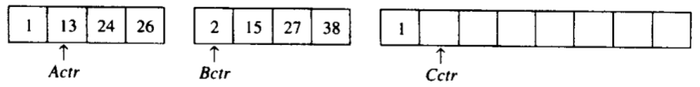
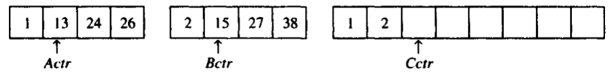
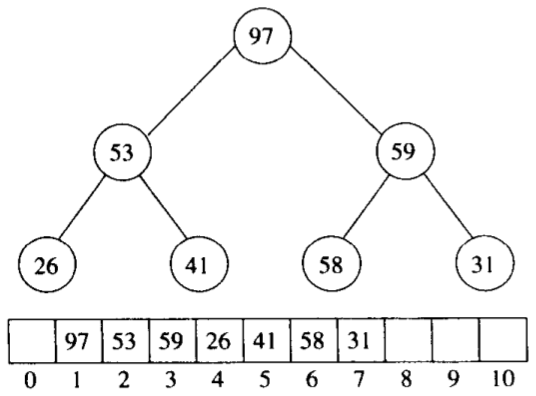
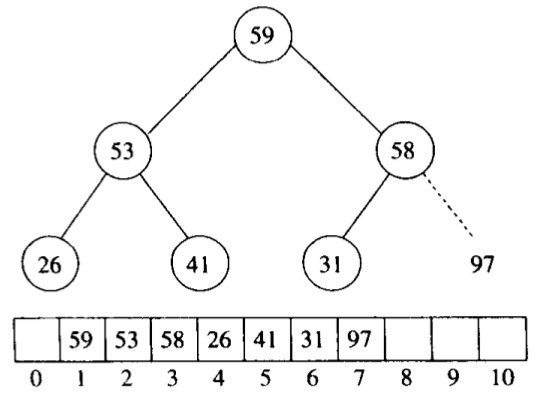

# 排序算法总结


<!-- vim-markdown-toc GFM -->

* [插入排序](#插入排序)
    - [算法步骤](#算法步骤)
    - [代码实现](#代码实现)
    - [复杂度分析](#复杂度分析)
* [shell排序](#shell排序)
    - [算法步骤](#算法步骤-1)
    - [代码实现](#代码实现-1)
    - [分析](#分析)
* [选择排序](#选择排序)
    - [算法步骤](#算法步骤-2)
    - [代码实现](#代码实现-2)
* [冒泡排序](#冒泡排序)
    - [算法步骤](#算法步骤-3)
    - [代码实现](#代码实现-3)
    - [算法分析](#算法分析)
* [归并排序](#归并排序)
    - [算法步骤](#算法步骤-4)
    - [代码实现](#代码实现-4)
    - [算法分析](#算法分析-1)
* [快速排序](#快速排序)
    - [算法步骤](#算法步骤-5)
    - [选取枢纽元(基准)](#选取枢纽元基准)
    - [分割策略](#分割策略)
    - [代码实现](#代码实现-5)
    - [算法分析](#算法分析-2)
* [堆排序](#堆排序)
    - [算法步骤](#算法步骤-6)
    - [代码实现](#代码实现-6)
    - [算法分析](#算法分析-3)
* [基数排序](#基数排序)
    - [代码实现:](#代码实现-7)
* [数学基础](#数学基础)
* [总结](#总结)
* [参考](#参考)

<!-- vim-markdown-toc -->


排序算法可以分为内部排序和外部排序，内部排序是数据记录在内存中进行排序，而外部排序是因排序的数据很大，一次不能容纳全部的排序记录，在排序过程中需要访问外存。


## 插入排序

插入排序是一种最简单直观的排序算法，它的工作原理是通过构建有序序列，对于未排序数据，在已排序序列中从后向前扫描，找到相应位置并插入。

### 算法步骤

1. 将第一待排序序列第一个元素看做一个有序序列，把第二个元素到最后一个元素当成是未排序序列。
2. 从头到尾依次扫描未排序序列，将扫描到的每个元素插入有序序列的适当位置（如果待插入的元素与有序序列中的某个元素相等，则将待插入元素插入到相等元素的后面）。

例：

| 步骤 | 5     | 6     | 3    | 1     | 8     | 7    | 2    | 4    |
| ---- | ----- | ----- | ---- | ----- | ----- | ---- | ---- | ---- |
| 一   | **3** | 5     | 6    | 1     | 8     | 7    | 2    | 4    |
| 二   | **1** | 3     | 5    | 6     | 8     | 7    | 2    | 4    |
| 三   | 1     | 3     | 5    | 6     | **7** | 8    | 2    | 4    |
| 四   | 1     | **2** | 3    | 5     | 6     | 7    | 8    | 4    |
| 五   | 1     | 2     | 3    | **4** | 5     | 6    | 7    | 8    |

### 代码实现

```c++
void insert_sort(int array[], unsignedint n)
{
    int i,j;
    int temp;
    for(i = 1;i < n;i++)
    {
        temp = array[i];
        for(j = i;j > 0&& array[j - 1] > temp;j--)
        {
            array[j]= array[j - 1];
        }
        array[j] = temp;
    }
}
```

### 复杂度分析

$\sum_{i=2}^{N} i=2+3+4+...+N = \Theta(N^2)$

- 最差情况/平均情况：

  由于每一个嵌套循环都花费$N$次迭代，因此插入排序为$O(N^2)$。

  $\sum_{i=2}^{N} i=2+3+4+...+N = \Theta(N^2)$

- 最好情况：

   $O(N)$


## shell排序

`希尔排序（shell sort）` 又叫缩减增量排序（diminishing increment sort），是插入排序的一种更高效的改进版本，但shell排序是非稳定排序算法。

shell排序的基本思想是：先将整个待排序的记录序列分割成为若干子序列，分别进行直接插入排序，待整个序列中的记录“基本有序”时，再对全体记录进行依次直接插入排序。

shell排序是基于插入排序的以下两点性质而提出改进方法的：
- 插入排序在对几乎已经排好序的数据操作时， 效率高， 即可以达到线性排序的效率。
- 但插入排序一般来说是低效的， 因为插入排序每次只能将数据移动1位。
### 算法步骤

1. 选择一个增量序列$t_1, t_2, ..., t_k$其中$t_i>t_j, t_k = 1$；
2. 按增量序列个数k，对序列进行k趟排序；
3. 每趟排序，根据对应的增量$t_i$，将待排序列分割成若干长度为m的子序列，分别对各子表进行直接插入排序。仅增量因子为1 时，整个序列作为一个表来处理，表长度即为整个序列的长度。

例：

| 步骤      | 81   | 94   | 11   | 96   | 12   | 35   | 17   | 95   | 28   | 58   | 41   | 75   | 15   |
| --------- | ---- | ---- | ---- | ---- | ---- | ---- | ---- | ---- | ---- | ---- | ---- | ---- | ---- |
| 5排序之后 | 35   | 17   | 11   | 28   | 12   | 41   | 75   | 15   | 96   | 58   | 81   | 94   | 95   |
| 3排序之后 | 28   | 12   | 11   | 35   | 15   | 41   | 58   | 17   | 94   | 75   | 81   | 96   | 95   |
| 1排序之后 | 11   | 12   | 15   | 17   | 28   | 35   | 41   | 58   | 75   | 81   | 94   | 95   | 96   |

### 代码实现

```c++
#include<stdio.h>
#include<math.h>
 
#define MAXNUM 10
 
void main()
{
    void shellSort(int array[],int n,int t);                    //t为排序趟数
    int array[MAXNUM],i;
    for(i = 0;i < MAXNUM;i++)
        scanf("%d",&array[i]);
    shellSort(array,MAXNUM,int(log(MAXNUM + 1) / log(2)));      //排序趟数应为log2(n+1)的整数部分
    for(i = 0;i < MAXNUM;i++)
        printf("%d ",array[i]);
    printf("\n");
}
 
//根据当前增量进行插入排序
void shellInsert(int array[],int n,int dk)
{
    int i,j,temp;
    for(i = dk;i < n;i++)                                       //分别向每组的有序区域插入
    {
        temp = array[i];
        for(j = i-dk;(j >= i % dk) && array[j] > temp;j -= dk)  //比较与记录后移同时进行
            array[j + dk] = array[j];
        if(j != i - dk)
            array[j + dk] = temp;                               //插入
    }
}
 
//计算Hibbard增量
int dkHibbard(int t,int k)
{
    return int(pow(2,t - k + 1) - 1);
}
 
//希尔排序
void shellSort(int array[],int n,int t)
{
    void shellInsert(int array[],int n,int dk);
    int i;
    for(i = 1;i <= t;i++)
        shellInsert(array,n,dkHibbard(t,i));
}
 
//此写法便于理解，实际应用时应将上述三个函数写成一个函数。
```

### 分析

- 最坏情况：

  使用shell增量时shell排序的最坏情形运行时间为$\Theta(N^2)$；

  使用Hibbard增量的shell排序的最坏情形运行时间为$\Theta(N^{3/2})$。


## 选择排序

选择排序(Selection sort)也是一种简单直观的排序算法。

### 算法步骤

1. 首先在未排序序列中找到最小（大）元素，存放到排序序列的起始位置
2. 再从剩余未排序元素中继续寻找最小（大）元素，然后放到已排序序列的末尾。
3. 重复第二步，直到所有元素均排序完毕。

### 代码实现

```c++
void select_sort(int *a,int n)
{
    register int i,j,min,t;
    for(i = 0;i < n-1;i++)
    {
        min = i;            //查找最小值
        for(j = i + 1;j < n;j++)
            if(a[min] > a[j])
                min = j;    //交换
        if(min != i)
        {
            t = a[min];
            a[min] = a[i];
            a[i] = t;
        }
    }
}
```


## 冒泡排序

`冒泡排序（Bubble Sort）` 是一种简单直观的排序算法。它重复地走访过要排序的数列，一次比较两个元素，如果他们的顺序错误就把他们交换过来。走访数列的工作是重复地进行直到没有再需要交换，也就是说该数列已经排序完成。

### 算法步骤

1. 比较相邻的元素。如果第一个比第二个大，就交换他们两个。
2. 对每一对相邻元素作同样的工作，从开始第一对到结尾的最后一对。这步做完后，最后的元素会是最大的数。
3. 针对所有的元素重复以上的步骤，除了最后一个。
4. 持续每次对越来越少的元素重复上面的步骤，直到没有任何一对数字需要比较。

### 代码实现

```c++
#include <stdio.h>
#define SIZE 8void bubble_sort(int a[], int n)
{
    int i, j, temp;
    for (j = 0;j < n - 1;j++)
        for (i = 0;i < n - 1 - j;i++)
        {
            if(a[i] > a[i + 1])
            {
                temp = a[i];
                a[i] = a[i + 1];
                a[i + 1] = temp;
            }
        }
}
 
int main()
{
    int number[SIZE] = {95, 45, 15, 78, 84, 51, 24, 12};
    int i;
    bubble_sort(number, SIZE);
    for (i = 0; i < SIZE; i++)
    {
        printf("%d", number[i]);
    }
    printf("\n");
}
```

### 算法分析

TODO


## 归并排序

`归并排序（Merge sort）` 是建立在归并操作上的一种有效的排序算法；通过合并两个已排序的表来进行排序。

### 算法步骤

1. 申请空间，使其大小为两个已经排序序列之和，该空间用来存放合并后的序列
2. 设定两个指针，最初位置分别为两个已经排序序列的起始位置
3. 比较两个指针所指向的元素，选择相对小的元素放入到合并空间，并移动指针到下一位置
4. 重复步骤3直到某一指针达到序列尾
5. 将另一序列剩下的所有元素直接复制到合并序列尾

例：

1. 准备好2个已排序的数组A，B

   

2. 比较1，2；由于1 < 2，将1放入数组C中

   

3. 比较13, 2；由于2 < 13，将2放入数组C中

   

4. 以此类推

   

5. 直到26，27进行比较；26 < 27，将26添加到C中

   

6. 将数组B的其余部分复制到C中

   

### 代码实现

```c++
#include <stdlib.h>
#include <stdio.h>
 
void Merge(int sourceArr[],int tempArr[], int startIndex, int midIndex, int endIndex)
{
    int i = startIndex, j=midIndex+1, k = startIndex;
    while(i != midIndex + 1 && j != endIndex + 1)
    {
        if(sourceArr[i] >= sourceArr[j])
            tempArr[k++] = sourceArr[j++];
        else
            tempArr[k++] = sourceArr[i++];
    }
    while(i != midIndex+1)
        tempArr[k++] = sourceArr[i++];
    while(j != endIndex+1)
        tempArr[k++] = sourceArr[j++];
    for(i = startIndex; i <= endIndex; i++)
        sourceArr[i] = tempArr[i];
}
 
//内部使用递归
void MergeSort(int sourceArr[], int tempArr[], int startIndex, int endIndex)
{
    int midIndex;
    if(startIndex < endIndex)
    {
        midIndex = (startIndex + endIndex) / 2;
        MergeSort(sourceArr, tempArr, startIndex, midIndex);
        MergeSort(sourceArr, tempArr, midIndex+1, endIndex);
        Merge(sourceArr, tempArr, startIndex, midIndex, endIndex);
    }
}
 
int main(int argc, char * argv[])
{
    int a[8] = {50, 10, 20, 30, 70, 40, 80, 60};
    int i, b[8];
    MergeSort(a, b, 0, 7);
    for(i=0; i<8; i++)
        printf("%d ", a[i]);
    printf("\n");
    return 0;
}
```

### 算法分析

- 最坏情况

  归并排序以复杂度为$O(NlogN)$的最坏情形运行。

**注意：对于归并排序，当对象很大时，复制对象的代价很大。**


## 快速排序

在平均状况下，排序 n 个项目要$Ο(n log n)$次比较。在最坏状况下则需要$$Ο(n^2)$$次比较（这种状况并不常见）。快速排序通常明显比其他$Ο(n log n)$算法更快，因为它的`内部循环（inner loop）`可以在大部分的架构上很有效率地被实现出来。
`快速排序（quick sort）` 使用`分治法（Divide and conquer）`策略来把一个`串行（list）`分为两个`子串行（sub-lists）`。

### 算法步骤

1. 从数列中挑出一个元素，称为`“基准”（pivot）`。
2. 将所有元素比基准值小的放在基准一侧，所有元素比基准值大的放在基准的另一侧（相同的数可以到任一边）；在这个分区退出之后，该基准就处于数列的中间位置；这个称为`分区（partition）操作`。
3. `递归地（recursive）`把小于基准值元素的子数列和大于基准值元素的子数列排序，递归的最底部情形，直到数列的大小是0或1，也就是永远都已经被排序好了；虽然一直递归下去，但是这个算法总会退出，因为在每次的`迭代（iteration）`中，它至少会把一个元素摆到它最后的位置去。

例：

1. 选取基准值69：

   | 0    | 1    | 2    | 3    | 4    | 5    | 6    | 7    | 8    | 9    |
   | ---- | ---- | ---- | ---- | ---- | ---- | ---- | ---- | ---- | ---- |
   | 69   | 81   | 30   | 38   | 9    | 2    | 47   | 61   | 32   | 79   |
   
2. 对数据进行分区：

   | 0    | 1    | 2    | 3    | 4    | 5    | 6    | 7    | 8    | 9    |
   | ---- | ---- | ---- | ---- | ---- | ---- | ---- | ---- | ---- | ---- |
   | 2    | 61   | 30   | 38   | 9    | 61   | 47   | 69   | 81   | 79   |

3. 递归排序：

   | 0    | 1    | 2    | 3    | 4    | 5    | 6    | 7    | 8    | 9    |
   | ---- | ---- | ---- | ---- | ---- | ---- | ---- | ---- | ---- | ---- |
   |2|9|30|32|38|47|61|69|79|81|

### 选取枢纽元(基准)

- 一种安全的做法

  随机选取枢纽元。

- 三数中值分割法

  使用左端，右端和中心位置上的三个元素的中值作为枢纽元。

### 分割策略

TODO

### 代码实现

```c++
void quick_sort(int a[], int low, int high)
{
    if(low >= high)
        return;

    int first = low;
    int last  = high;
    int key   = a[first]; // 用第一个位置作为基准
    while(first < last)
    {
        while(first < last && a[last] >= key) { --last; }
        a[first] = a[last];
      
        while(first < last && a[first] <= key) { ++first; }
        a[last] = a[first];
    }
    a[first] = key; // 还原基准
    quick_sort(a, low, first-1);
    quick_sort(a, first+1, high);
}
```

### 算法分析

- 最坏情况

  枢纽元始终是最小元素。此时$i = 0$，如果我们忽略无关紧要的$T(0) = 1$，那么递推关系为：

  $T(N) = T(N-1) + cN, N>1$

  得到：

  $T(N-1) = T(N-2)+c(N-1)$

  $T(N-2) = T(N-3)+c(N-2)$

  ...

  $T(2) = T(1) + c(2)$

  将这些方程相加，得到：

  $T(N) = T(1) + c \sum_{i=2}^{N} = O(N^2)$

- 最好情况

  枢纽元正好位于中间。两个子数组刚好为原数组的一半，那么递推关系为：

  $T(N) = 2T(N/2) + cN$

  用$N$去除以上面的方程得到：

  $\frac{T(N)}{N} = \frac{T(N/2)}{N/2} + c$

  反复套用这个方程得到：

  $\frac{T(N/2)}{N/2} = \frac{T(N/4)}{N/4} + c$

  $\frac{T(N/4)}{N/4} = \frac{T(N/8)}{N/8} + c$

  ...

  $\frac{T(2)}{2} = \frac{T(1)}{1} + c$

  将以上$log\ N$个方程加起来得到：

  $\frac{T(N)}{N} = \frac{T(1)}{1} + clog\ N$

  从而得到：

  $T(N) = cNlog\ N + N = O(Nlog\ N)$

- 平均情况

  假设对于$S_1$，每一个文件的大小都是等可能的，因此每个大小均有概率$1/N$。

  由该假设可知，$T(i)$（从而$T(N-i-1)$）的平均值为：

  $(1/N) \sum_{j=0}^{N-1} T(j)$。

  此时公式$T(N) = T(i) + T(N-i-1) + cN$变为：

  $T(N) = \frac{2}{N} \left[ \sum_{j=0}^{N-1} T(j) \right] + cN$。

  如果用$N$乘以上面的方程，则有：

  $NT(N) = 2 \left[ \sum_{j=0}^{N-1} T(j) \right] + cN^2$。

  我们需要除去求和符号以简化计算，得到：

  $(N-1)T(N-1) = 2 \left[ \sum_{j=0}^{N-2} T(j) \right] + c(N-1)^2$。

  上面两个公式相减，得到：

  $NT(N) - (N-1)T(N-1) = 2T(N-1) + 2cN -c$

  移项，合并并除去右边无关紧要的项$-c$，得到：

  $NT(N) - (N-1)T(N-1) = 2T(N-1) + 2cN$

  用$N(N+1)$除式：

  $\frac{T(N)}{N+1} = \frac{T(N-1)}{N} + \frac{2c}{N+1}$

  进行叠缩：

  $\frac{T(N-1)}{N} = \frac{T(N-2)}{N-1} + \frac{2c}{N}$

  $\frac{T(N-2)}{N-1} = \frac{T(N-3)}{N-2} + \frac{2c}{N-1}$

  ...

  $\frac{T(2)}{3} = \frac{T(1)}{2} + \frac{2c}{3}$

  将以上公式相加，得到：

  $\frac{T(N)}{N+1} = \frac{T(1)}{2} + 2c \sum_{i=3}^{N+1} \frac{1}{i}$

  该和大约为$log_e(N+1) + \gamma - 3/2$，其中$\gamma \approx 0.577$，叫做`欧拉常数（Euler's constant）`，于是：

  $\frac{T(N)}{N+1} = O(log\ N)$

  从而

  $T(N) = O(N\ log\ N)$


## 堆排序

`堆排序（heap sort）` 是指利用二叉堆这种数据结构所设计的一种排序算法。堆积是一个近似完全二叉树的结构，并同时满足堆积的性质：即子结点的键值或索引总是小于（或者大于）它的父节点。

### 算法步骤

1. 创建一个堆$H[0..n-1]$
2. 把堆首（最大值）和堆尾互换
3. 把堆的尺寸缩小1，并调用`shift_down(0)`,目的是把新的数组顶端数据调整到相应位置
4. 重复步骤2，直到堆的尺寸为1

例：

1. 创建一个堆

   

2. 将堆首与堆尾互换

   

3. 以此类推，直到堆的尺寸为1

### 代码实现

```c++
//array是待调整的堆数组，i是待调整的数组元素的位置，nlength是数组的长度
//本函数功能是：根据数组array构建大根堆
void HeapAdjust(int array[],int i,int nLength)
{
    int nChild;
    int nTemp;
    for(; 2 * i + 1 < nLength;i = nChild)
    {
        //子结点的位置=2*（父结点位置）+1
        nChild = 2 * i + 1;
        //得到子结点中较大的结点
        if(nChild < nLength - 1 && array[nChild + 1] > array[nChild]) ++nChild;
        //如果较大的子结点大于父结点那么把较大的子结点往上移动，替换它的父结点
        if(array[i] < array[nChild])
        {
            nTemp = array[i];
            array[i] = array[nChild];
            array[nChild] = nTemp; 
        }
        else break; //否则退出循环
    }
}
//堆排序算法
void HeapSort(int array[],int length)
{
    int i;
    //调整序列的前半部分元素，调整完之后第一个元素是序列的最大的元素
    //length/2-1是最后一个非叶节点，此处"/"为整除
    for(i = length / 2 - 1;i >= 0;--i)
    HeapAdjust(array,i,length);
    //从最后一个元素开始对序列进行调整，不断的缩小调整的范围直到第一个元素
    for(i = length - 1;i > 0;--i)
    {
        //把第一个元素和当前的最后一个元素交换，
        //保证当前的最后一个位置的元素都是在现在的这个序列之中最大的
        array[i] = array[0] ^ array[i];
        array[0] = array[0] ^ array[i];
        array[i] = array[0] ^ array[i];
        //不断缩小调整heap的范围，每一次调整完毕保证第一个元素是当前序列的最大值
        HeapAdjust(array,0,i);
    }
}
int main()
{
    int i;
    int num[]={9,8,7,6,5,4,3,2,1,0};
    HeapSort(num,sizeof(num)/sizeof(int));
    for(i = 0;i < sizeof(num) / sizeof(int);i++)
    {
        printf("%d ",num[i]);
    }
    printf("\nok\n");
    return 0;
}
```

### 算法分析

- 最坏情况

  堆排序最多使用$2NlogN - O(N)$次比较。


## 基数排序

基数排序是一种非比较型整数排序算法，其原理是将整数按位数切割成不同的数字，然后按每个位数分别比较。由于整数也可以表达字符串（比如名字或日期）和特定格式的浮点数，所以基数排序也不是只能使用于整数。

说基数排序之前，我们简单介绍桶排序：

算法思想：是将阵列分到有限数量的桶子里。每个桶子再个别排序（有可能再使用别的排序算法或是以递回方式继续使用桶排序进行排序）。桶排序是鸽巢排序的一种归纳结果。当要被排序的阵列内的数值是均匀分配的时候，桶排序使用线性时间（Θ（n））。但桶排序并不是 比较排序，他不受到 O(n log n) 下限的影响。

简单来说，就是把数据分组，放在一个个的桶中，然后对每个桶里面的在进行排序。

例如要对大小为[1..1000]范围内的n个整数A[1..n]排序

首先，可以把桶设为大小为10的范围，具体而言，设集合B[1]存储[1..10]的整数，集合B[2]存储   (10..20]的整数，……集合B[i]存储`( (i-1)*10, i*10 ]`的整数，i   =   1,2,..100。总共有  100个桶。

然后，对A[1..n]从头到尾扫描一遍，把每个A[i]放入对应的桶B[j]中。  再对这100个桶中每个桶里的数字排序，这时可用冒泡，选择，乃至快排，一般来说任  何排序法都可以。

最后，依次输出每个桶里面的数字，且每个桶中的数字从小到大输出，这  样就得到所有数字排好序的一个序列了。

假设有n个数字，有m个桶，如果数字是平均分布的，则每个桶里面平均有n/m个数字。如果对每个桶中的数字采用快速排序，那么整个算法的复杂度是O(n   +   m   *   n/m*log(n/m))   =   O(n   +   nlogn   –   nlogm)

从上式看出，当m接近n的时候，桶排序复杂度接近O(n)

当然，以上复杂度的计算是基于输入的n个数字是平均分布这个假设的。这个假设是很强的  ，实际应用中效果并没有这么好。如果所有的数字都落在同一个桶中，那就退化成一般的排序了。

前面说的几大排序算法 ，大部分时间复杂度都是O（n2），也有部分排序算法时间复杂度是O(nlogn)。而桶式排序却能实现O（n）的时间复杂度。但桶排序的缺点是：

1. 首先是空间复杂度比较高，需要的额外开销大。排序有两个数组的空间开销，一个存放待排序数组，一个就是所谓的桶，比如待排序值是从0到m-1，那就需要m个桶，这个桶数组就要至少m个空间。
2. 其次待排序的元素都要在一定的范围内等等。

### 代码实现:

```c++
int maxbit(int data[], int n) //辅助函数，求数据的最大位数
{
    int d = 1; //保存最大的位数
    int p = 10;
    for(int i = 0; i < n; ++i)
    {
        while(data[i] >= p)
        {
            p *= 10;
            ++d;
        }
    }
    return d;
}
void radixsort(int data[], int n)                   //基数排序
{
    int d = maxbit(data, n);
    int *tmp = newint[n];
    int *count = newint[10];                        //计数器
    int i, j, k;
    int radix = 1;
    for(i = 1; i <= d; i++)                         //进行d次排序
    {
        for(j = 0; j < 10; j++)
            count[j] = 0;                           //每次分配前清空计数器
        for(j = 0; j < n; j++)
        {
            k = (data[j] / radix) % 10;             //统计每个桶中的记录数
            count[k]++;
        }
        for(j = 1; j < 10; j++)
            count[j] = count[j - 1] + count[j];     //将tmp中的位置依次分配给每个桶
        for(j = n - 1; j >= 0; j--)                 //将所有桶中记录依次收集到tmp中
        {
            k = (data[j] / radix) % 10;
            tmp[count[k] - 1] = data[j];
            count[k]--;
        }
        for(j = 0; j < n; j++)                      //将临时数组的内容复制到data中
            data[j] = tmp[j];
        radix = radix * 10;
    }
    delete[]tmp;
    delete[]count;
}
```


## 数学基础

**定理 1** $N$个互异元素的数组的平均逆序数是$N(N-1)/4$。

**证明** 对于任意的元素的表$L$，考虑其反序表$L_r$。上例中的反序表是21，32，51，64，8，34。考虑该表中任一两个元素的序偶$(x, y)$，且$y > x$。显然，恰好是$L$和$L_r$中的一个，该序偶对应一个逆序。在表$L$和它的反序表$L_r$中，这样的序偶的总个数为$N(N-1)/2$。因此，平均表有该量的一半，即$N(N-1)/4$个逆序。

**定理2** 通过交换相邻元素进行排序的任何算法平均需要$\Omega(N^2)$时间。

**证明** 初始的平均逆序数是$N(N-1)/4=\Omega(N^2)$，而每次交换只减少一个逆序，因此需要$\Omega(N^2)$次交换。

**定理3** 使用shell增量时shell排序的最坏情形运行时间为$\Theta(N^2)$。

**证明** 我们首先选择$N$是2的幂，这使得除最后一个增量是1外所有的增量都是偶数。现在，给出一个数组作为输入，它的偶数位置上有$N/2$个同是最大的数，而在奇数位置上有$N/2$个同为最小的数（对该证明，第一个位置是位置1）。由于除最后一个增量外所有的增量都是偶数，因此，当我们进行最后一趟排序前，$N/2$个最大的元素仍然在偶数位置上，而$N/2$个最小的元素也还是在奇数位置上。于是，在最后一趟排序开始之前第$i$个最小的数$(i \leqslant N/2)$在位置$2i - 1$上。将第$i$个元素恢复到其正确位置需要在数组中移动$i-1$个间隔。这样，仅仅将$N/2$个最小的元素放到正确的位置上就需要至少$\sum_{i=1}^{N/2} i - 1 = \Omega(N^2)$的工作。

​        带有增量$h_k$的一趟排序由$h_k$个关于$N/h_k$个元素的插入排序组成。由于插入排序是二次的，因此一趟排序总的开销是$O(h_k(N/h_k)^2) = O(N^2/h_k)$。对所有各趟排序求和则给出总的界为$O(\sum_{i=1}^{t} N^2/h_i) = O(N^2\sum_{i=1}{t} 1/h_i)$。因为这些增量形成一个几何级数，其公比为2，而该级数中的最大项是$h_1 = 1$，因此，$\sum_{i=1}^{t} 1/h_i < 2$。于是，我们得到总的界$O(N^2)$。

**定理4** 使用Hibbard增量的shell排序的最坏情形运行时间为$\Theta(N^{3/2})$。

**证明** 当对输入数组进行$h_k$排序时，我们知道它已经是$h_{k+1}$和$h_{k+2}$排序的了。在$h_k$排序以前，考虑位置$p$和$p-i$上的两个元素，其中$i \leqslant p$。如果$i$是$h_{k+1}$或$h_{k+2}$的倍数，那么显然$a[p-i] < a[p]$。不仅如此，如果$i$可以表示为$h_{k+1}$和$h_{k+2}$的线性组合（以非负整数的形式），那么也有$a[p - i] < a[p]$。

​        现在，$h_{k+2} = 2h_{k+1}$，因此$h_{k+1}$和$h_{k+2}$没有公因子。在这种情形下，可以证明，至少和$(h_{k+1} - 1)(h_{k+2} - ) = 8h_k^2 + 4h_k$一样大的所有整数都可以表示为$h_{k+1}$和$h_{k+2}$的线性组合。

​        这就告诉我们，最内层for循环体对于这些$N - h_k$位置上的每一个位置最多执行$8h_k + 4 = O(h_k)$次，于是我们得到每趟的界为$O(Nh_k)$。

​        利用大约一半的增量满足$h_k < \sqrt{N}$的事实并假设$t$是偶数，那么总的运行时间为：

$O\left(\sum_{k=1}^{t/2}\right) + \sum_{k=t/2+1}{t} N^2/h_k = O\left( N\sum_{k=1}^{t/2} h_k + N^2 \sum_{k=t/2+1}^{t} 1/h_k \right)$

因为两个和都是几何级数，并且$h_{t/2} = \Theta(\sqrt{N})$，所以上式简化为：

$= O(Nh_{t/2}) + O \left( \frac{N^2}{h_{t/2}} \right) = O \left(N^{3/2}\right)$

**定理5** 对$N$个互异项的随机排列进行堆排序，所用的比较平均次数为$2NlogN-O(Nlog\ logN)$。

**证明** 设有${1, 2, ..., N}$的一个排列；设第$i$次deleteMax将根元素向下推了$d_i$层。此时它使用了$2d_i$次比较。对于任意的输入数据的堆排序，存在一个`开销序列（const sequence）`$D: d_1, d_2, ..., d_N$，它确定了第二阶段的开销，该开销由$M_D = \sum_{i=1}^{N} d_i$给出：因此所使用的比较次数是$2M_D$。

​        令$f(N)$是$N$项的堆的个数。可以证明$f(N) > (N/(4e))^N$（其中，e=2.71828...）。只有这些堆中指数上很小的部分（特别是$(N/16)^N$）的开销小于$M=N(logN - log\ logN - 4)$。当该结论得证时可以推出，$M_D$得平均值至少是$M$减去大小为$o(1)$的一项，这样，比较的平均次数至少是$2M$。因此，我们的基本目标则是证明存在很少的具有小开销序列的堆。

​        因为第$d_i$层上最多有$2^{d_i}$个结点，所以对于任意的$d_i$，存在根元素可能到达的$2^{d_i}$个可能的位置。于是，对于任意的序列$D$，对应deleteMax的互异序列的个数最多是：

$S_D = 2^{d_1} 2^{d_2} ... 2^{d_N}$

简单的代数处理指出，对一个给定的序列$D$：

$S_D = 2 ^ {M_D}$

​        因为每个$d_i$可取$1$和$\lfloor log\ N \rfloor$之间的任一值，所以最多存在$(logN)^N$个可能的序列$D$。由此可知，需要花费的开销恰好为$M$的互异deleteMax序列的个数，最多是总开销为$M$的开销序列的个数乘以每个这种开销序列的deleteMax序列的个数。这样就立刻得到界$(logN)^N2^M$。

​        开销序列小于$M$的堆的总数最多为：

$\sum_{i=1}^{M-1} (logN)^N2^i < (logN)^N 2^M$

​        如果我们选择$M=N(logN - log\ logN-4)$，那么开销序列小于$M$的堆的个数最多为$(N/16)^N$，定理得证。

**引理6** 令$T$是深度为$d$的二叉树，则$T$最多有$2^d$片树叶。

**证明** 用数学归纳法证明。如果$d=0$，则最多存在一片树叶，因此基准情形为真。若$d > 0$，则有一个根，它不可能是树叶，其左子树和右子树中每一个的深度最多是$d-1$。由归纳假设，每一棵子树最多有$2^{d-1}$片树叶，因此总数最多有$2^d$片树叶。引理得证。

**引理7** 具有$L$片树叶的二叉树的深度至少是$\lceil logL \rceil$。

**证明** 由前面的引理立即推出。

**定理8** 只使用元素间比较的任何排序算法在最坏情形下至少需要$\lceil log(N!) \rceil$次比较。

**证明** 对$N$个元素排序的决策树必然有$N!$片树叶。从上面的引理即可推出该定理。

**定理9** 只使用元素间比较的任何排序算法需要$\Omega(NlogN)$次比较。

**证明** 由前面的定理可知，需要$log(N!)$次比较。
$$
\begin{equation}\begin{split}
log(N!) &= log(N(N-1)(N-2)...(2)(1)) \\
 & = logN + log(N-1) + log(N-2) + ... + log2 + log1 \\
 & \geqslant log N + log(N - 1) + log(N - 2) + ... + log(N/2) \\
 & \geqslant \frac{N}{2} log \frac{N}{2} \\
 & \geqslant \frac{N}{2} log N - \frac{N}{2} \\
 & = \Omega(NlogN)
 \end{split}\end{equation}
$$


## 总结

各种排序的稳定性，时间复杂度、空间复杂度、稳定性总结如下图：

| 排序方法  | 平均情况      | 最好情况      | 最坏情况     | 空间复杂度   | 稳定性 |
| --------- | ------------- | ------------- | ------------ | ------------ | ------ |
| 插入      | $O(n^2)$      | $O(n)$        | $O(n^2)$     | $O(1)$       | 稳定   |
| shell排序 | $O(n^{1.3})$  | $O(n)$        | $O(n^2)$     | $O(1)$       | 不稳定 |
| 直接选择  | $O(n^2)$      | $O(n^2)$      | $O(n^2)$     | $O(1)$       | 不稳定 |
| 堆排序    | $O(nlog_2 n)$ | $O(nlog_2 n)$ | $O(nlog_2n)$ | $O(1)$       | 不稳定 |
| 冒泡排序  | $O(n^2)$      | $O(n)$        | $O(n^2)$     | $O(1)$       | 稳定   |
| 快速排序  | $O(nlog_2n)$  | $O(nlog_2n)$  | $O(n^2)$     | $O(nlog_2n)$ | 不稳定 |
| 归并排序  | $O(nlog_2n)$  | $O(nlog_2n)$  | $O(nlog_2n)$ | $O(n)$       | 稳定   |
| 基数排序  | $O(d(r+n))$   | $O(d(n+rd))$  | $O(d(r+n))$  | $O(rd+n)$    | 稳定   |

注:基数排序的复杂度中，r代表关键字的基数，d代表长度，n代表关键字的个数


## 参考

[1] [图解希尔排序（Shell Sort）](https://blog.csdn.net/ytx2014214081/article/details/105841184)

[2] [美]Mark Allen Weiss.数据结构与算法分析-C++描述.3ED
