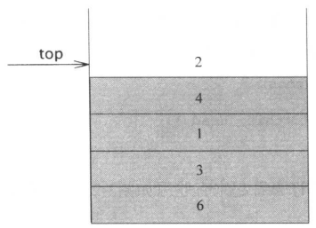

[中文版](stack_zh.md) | English

# Stack

[TOC]

## Principle

*Stack model*

## Implementation

- Based on list
- Based on vector

## Applications

1. Balanced symbols
2. Postfix expressions
3. Infix to postfix conversion
4. Function calls

## References

[1] Mark Allen Weiss. Data Structures and Algorithm Analysis in C++. 3ED
