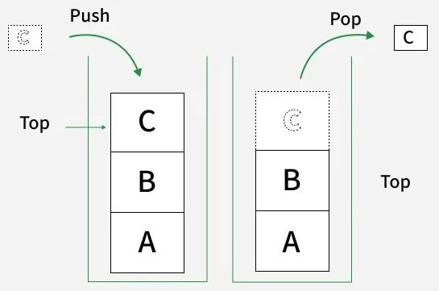
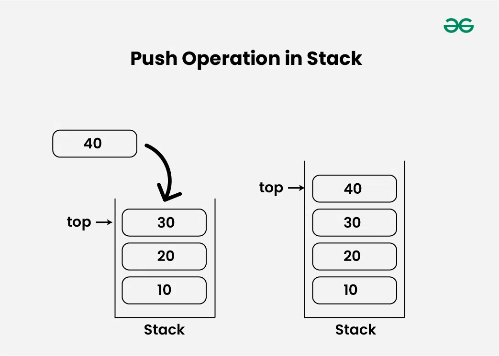
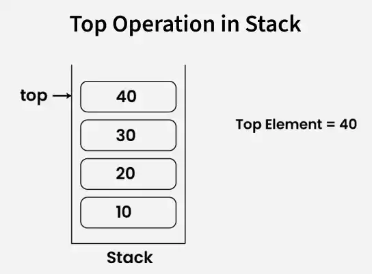
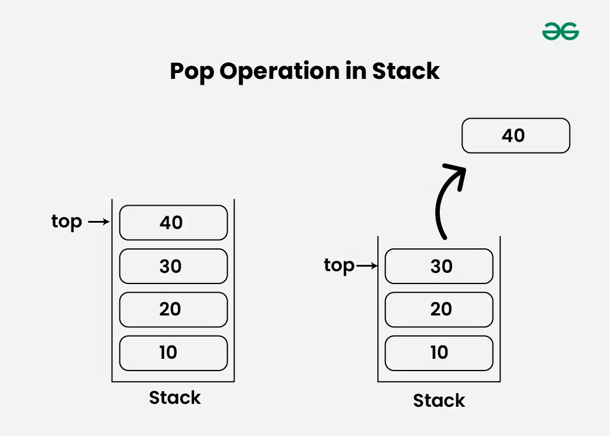

[中文版](stack_zh.md) | English

# Stack

[TOC]


A stack is a linear data structure that follows the principle of **Last In First Out (LIFO)**. This means the last element inserted inside the stack is removed first.



## Types

### Fixed Size Stack

A **fixed-size stack** has a predefined capacity. Once it becomes full, no more elements can be added (this causes overflow). If the stack is empty and we try to remove an element, it causes underflow. Typically implemented using a static array.

### Dynamic Size Stack

A **dynamic size stack** can grow and shrink automatically as needed. If the stack is full, its capacity expands to allow more elements. As elements are removed, memory usage can shrink as well.


## Operation

Stack define:

```c++
// Define the maximim capacity of the stack
#define MAX_STACK_SIZE 100

// Define a structure for the stack
typedef struct 
{
    int arr[MAX_STACK_SIZE];  
    int top;        
} Stack;
```

### Push

Add an element to the top of a stack.

Example:



Implement:

```c++
void push(Stack *stack, int value) 
{
    if (is_full(stack)) 
    {
        // ⚠️ Stack overflow condition
        return;
    }
    stack->arr[++stack->top] = value;
}
```

Complexity:

| Scenario     | Time Complexity | Space Complexity |
| :----------- | :-------------- | :--------------- |
| Best Case    | $O(1)$          | $O(1)$           |
| Average Case | $O(1)$          | $O(1)$           |
| Worst Case   | $O(1)$          | $O(1)$           |

### Top

Returns the element at the top of the stack without removing it.

Example:



Implement:

```c++
// Function to top the top element of the stack
int top(Stack *stack) 
{
    if (is_empty(stack)) 
    {
        // ⚠️ Stack is empty condition
        return -1;
    }
    return stack->arr[stack->top];
}
```

Complexity:

| Scenario     | Time Complexity | Space Complexity |
| :----------- | :-------------- | :--------------- |
| Best Case    | $O(1)$          | $O(1)$           |
| Average Case | $O(1)$          | $O(1)$           |
| Worst Case   | $O(1)$          | $O(1)$           |

### Pop

Remove an element from the top of a stack.

Example:



Implement:

```c++
// Function to pop an element from the stack
int pop(Stack *stack)
 {
    if (is_empty(stack)) 
    {
        // ⚠️ Stack underflow condition
        return -1;
    }

    int popped = stack->arr[stack->top];
    stack->top--;
    return popped;
}
```

Complexity:

| Scenario     | Time Complexity | Space Complexity |
| :----------- | :-------------- | :--------------- |
| Best Case    | $O(1)$          | $O(1)$           |
| Average Case | $O(1)$          | $O(1)$           |
| Worst Case   | $O(1)$          | $O(1)$           |

### IsEmpty

Check if the stack is empty.

Implement:

```c++
// Function to check if the stack is empty
bool is_empty(Stack *stack) 
{
    return stack->top == -1;  
}
```

Complexity:

| Scenario     | Time Complexity | Space Complexity |
| :----------- | :-------------- | :--------------- |
| Best Case    | $O(1)$          | $O(1)$           |
| Average Case | $O(1)$          | $O(1)$           |
| Worst Case   | $O(1)$          | $O(1)$           |

### IsFull

Check if the stack is full.

Implement:

```c++
// Function to check if the stack is full
bool is_full(Stack *stack) 
{
    return stack->top >= MAX_STACK_SIZE - 1;  
}
```

Complexity:

| Scenario     | Time Complexity | Space Complexity |
| :----------- | :-------------- | :--------------- |
| Best Case    | $O(1)$          | $O(1)$           |
| Average Case | $O(1)$          | $O(1)$           |
| Worst Case   | $O(1)$          | $O(1)$           |


## Stack In C++ STL

Adapter exposing stack semantics.

| Member  | Complexity | Notes                                                        |
| :------ | :--------- | ------------------------------------------------------------ |
| emplace | $O(1)$     | (C++11) Constructs and pushes an element onto the top of the stack. |
| empty   | $O(1)$     | Checks whether the container is empty.                       |
| pop     | $O(1)$     | Removes the top element.                                     |
| push    | $O(1)$     | Pushes an element onto the top of the stack.                 |
| size    | $O(1)$     | Returns the number of elements in the container.             |
| swap    | $O(1)$     | (C++11) Swaps the contents of two containers.                |
| top     | $O(1)$     | Returns a reference to the top element.                      |

Example:

```c++
#include <iostream>
#include <stack>
#include <list>

int main()
{
    std::list<int> values{1, 2, 3};

    std::stack<int> s1;                          // create container
    std::stack<int> s2(s1);                      // initialize from another container
    std::stack<int, std::list<int> > s3(values); // initialize with specified underlying container
    std::stack<int, std::list<int> > s4{values}; // initialize with specified underlying container and initializer list
    std::stack<int, std::list<int> > s5(values, 
                        values.get_allocator()); // initialize with specified underlying container and allocator
    std::stack<int, std::list<int> > s6(s3, 
                        values.get_allocator()); // initialize with specified container and allocator

    s1.emplace(4);           // s1: [4]

    bool ret1 = s1.empty();  // ret1: false

    s1.pop();                // s1: []

    s1.push(5);              // s1: [5]

    size_t ret2 = s1.size(); // ret2: 1

    s1.swap(s2);             // s1: [], s2: [5]

    int& ret3 = s1.top();    // s1: [], ret3: undefined value
}
```


## References

[1] Mark Allen Weiss. Data Structures and Algorithm Analysis in C++. 3ED

[2] [Introduction to Stack Data Structure](https://www.geeksforgeeks.org/dsa/introduction-to-stack-data-structure-and-algorithm-tutorials/)

[3] [Stack in C++ STL](https://www.geeksforgeeks.org/cpp/stack-in-cpp-stl/)
