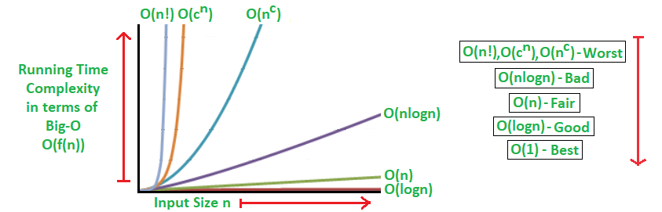
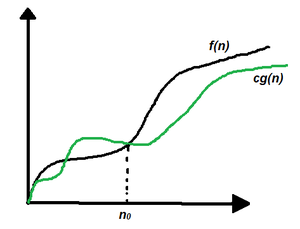
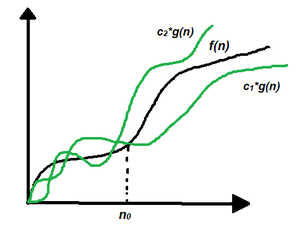
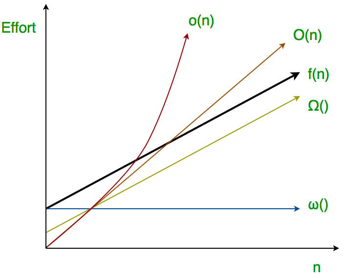
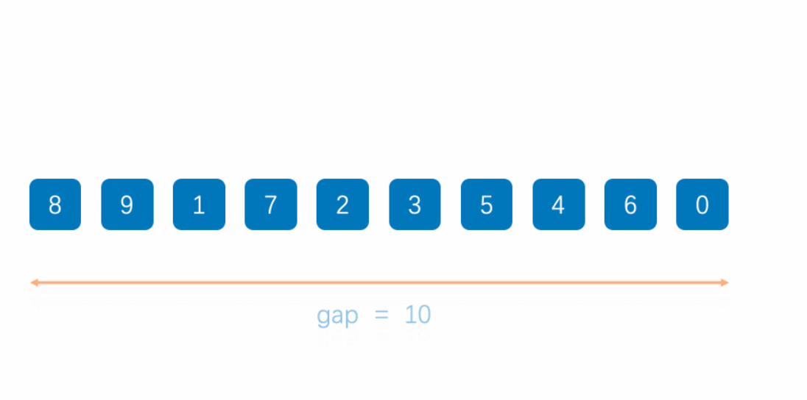
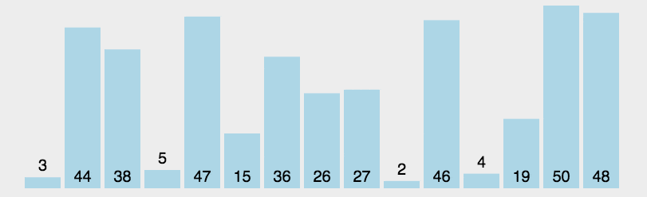
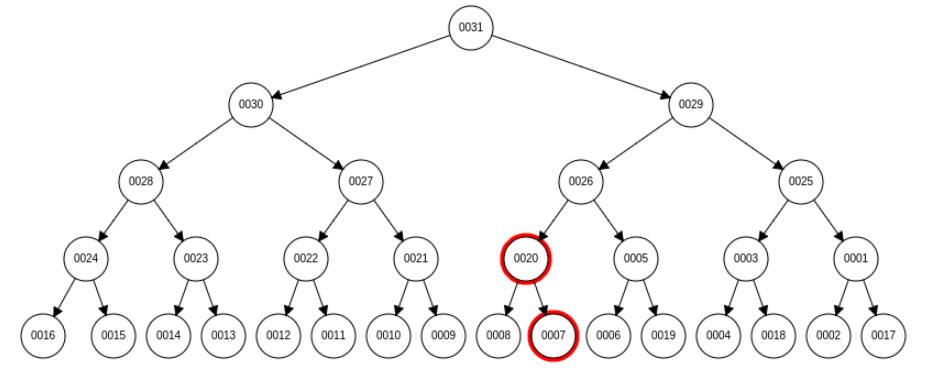
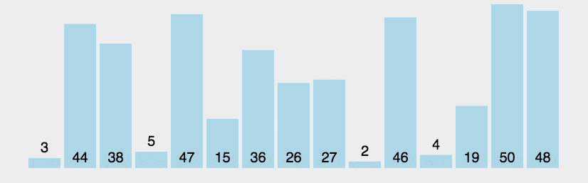
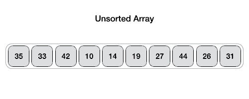
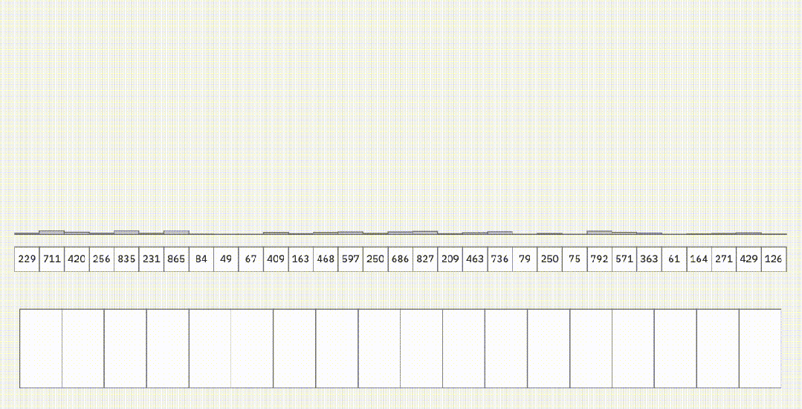

# Algorithm Summary

[TOC]

## Complexity Analysis

**Complexity analysis** is defined as a technique to characterise the time taken by an algorithm with respect to input size (independent of the machine, language, and compiler). It is used for evaluating the variations of execution time on different algorithms.

### Asymptotic Notation

1. Big O Notation

   

   Big-O notation represents the upper bound of the running time of an algorithm. Therefore, it gives the worst-case complexity of an algorithm.

2. Omega Notation

   

   Omega notation represents the lower bound of the running time of an algorithm. Thus, it provides the best-case complexity of an algorithm.

3. Theta Notation

   

   Theta notation encloses the function from above and below. Since it represents the upper and lower bounds of the running time of an algorithm, it is used for analyzing the average-case complexity of an algorithm.

4. Little o asymptotic notation

   

   “Little-ο” (ο()) notation is used to describe an upper bound that cannot be tight. 

5. Little ω asymptotic notation

### Metric

1. Time Complexity

   The **time complexity** of an algorithm is defined as the amount of time taken by an algorithm to run as a function of the length of the input.

2. Space Complexity

   The amount of memory required by the algorithm to solve a given problem is called the space complexity of the algorithm.

3. Auxiliary Space

   The temporary space needed for the use of an algorithm is referred to as auxiliary space.

## Algorithm

### Sort Algorithm

There is a summary of sorting algorithms:

| Sort Algorithm | Average Case   | Best Case      | Worst Case     | Space Complexity | Stability |
| -------------- | -------------- | -------------- | -------------- | ---------------- | --------- |
| Insertion Sort | $O(n^2)$       | $O(n)$         | $O(n^2)$       | $O(1)$           | Stable    |
| Shell Sort     | $O(n^{1.3})$   | $O(n)$         | $O(n^2)$       | $O(1)$           | Unstable  |
| Selection Sort | $O(n^2)$       | $O(n^2)$       | $O(n^2)$       | $O(1)$           | Unstable  |
| Heap Sort      | $O(n \log  n)$ | $O(n \log  n)$ | $O(n \log  n)$ | $O(1)$           | Unstable  |
| Bubble Sort    | $O(n^2)$       | $O(n)$         | $O(n^2)$       | $O(1)$           | Stable    |
| Quick Sort     | $O(n \log  n)$ | $O(n \log  n)$ | $O(n^2)$       | $O(n \log  n)$   | Unstable  |
| Merge Sort     | $O(n \log  n)$ | $O(n \log  n)$ | $O(n \log  n)$ | $O(n)$           | Stable    |
| Radix Sort     | $O(d(r+n))$    | $O(d(n+rd))$   | $O(d(r+n))$    | $O(rd+n)$        | Stable    |
| Bucket Sort    | $O(n)$         | $O(n)$         | $O(n^2)$       | $O(n)$           | Stable    |

Insertion Sort:

Shell Sort:

Selection Sort:

Heap Sort:

Bubble Sort:

Quick Sort:

Merge Sort:

Bucket Sort:

### Search Algorithm

Comparison of search algorithm efficiency:

|    **Algorithm**     | **Best Case** | **Average Case** | **Worst Case** | **Space** |          **Requirement**          |
| :------------------: | :-----------: | :--------------: | :------------: | :-------: | :-------------------------------: |
|    Linear Search     |    $O(1)$     |      $O(N)$      |     $O(N)$     |  $O(1)$   |                 /                 |
|    Binary Search     |    $O(1)$     |   $O(\log N)$    |  $O(\log N)$   |  $O(1)$   | Sorted array needed $O(n \log n)$ |
|    Ternary Search    |    $O(1)$     |  $O(\log_3 N)$   | $O(\log_3 N)$  |  $O(1)$   |    Unimodal data $O(n \log n)$    |
|     Jump Search      |    $O(1)$     |  $O(\sqrt{N})$   | $O(\sqrt{N})$  |  $O(1)$   |            Sorted data            |
| Interpolation Search |    $O(1)$     | $O(\log \log N)$ |     $O(N)$     |  $O(1)$   |           Uniform data            |
|   Fibonacci Search   |    $O(1)$     |   $O(\log N)$    |  $O(\log N)$   |  $O(1)$   |            Sorted data            |
|  Exponential Search  |    $O(1)$     |   $O(\log N)$    |  $O(\log N)$   |  $O(1)$   |            Sorted data            |
|     Tree Search      |    $O(1)$     |   $O(\log N)$    |     $O(N)$     |  $O(n)$   |    Tree building $O(n \log n)$    |
|  Hash-Based Search   |    $O(1)$     |      $O(1)$      |     $O(n)$     |  $O(n)$   |    Hash table building $O(n)$     |

## Data Structures

### Data Structure Operation Complexity

|   Data structure   |   Access    |   Search    |  Insertion  |  Deletion   |
| :----------------: | :---------: | :---------: | :---------: | :---------: |
|       Array        |   $O(1)$    |   $O(N)$    |   $O(N)$    |   $O(N)$    |
|       Stack        |   $O(N)$    |   $O(N)$    |   $O(1)$    |   $O(1)$    |
|       Queue        |   $O(N)$    |   $O(N)$    |   $O(1)$    |   $O(1)$    |
| Singly Linked list |   $O(N)$    |   $O(N)$    |   $O(N)$    |   $O(N)$    |
| Doubly Linked List |   $O(N)$    |   $O(N)$    |   $O(1)$    |   $O(1)$    |
|     Hash Table     |   $O(N)$    |   $O(N)$    |   $O(N)$    |   $O(N)$    |
| Binary Search Tree |   $O(N)$    |   $O(N)$    |   $O(N)$    |   $O(N)$    |
|      AVL Tree      | $O(\log N)$ | $O(\log N)$ | $O(\log N)$ | $O(\log N)$ |
|    Binary Tree     |   $O(N)$    |   $O(N)$    |   $O(N)$    |   $O(N)$    |
|   Red Black Tree   | $O(\log N)$ | $O(\log N)$ | $O(log N)$  | $O(\log N)$ |

## References

[1] [EP144: The 9 Algorithms That Dominate Our World](https://blog.bytebytego.com/p/ep144-the-9-algorithms-that-dominate)

[2] [10 Key Data Structures We Use Every Day](https://blog.bytebytego.com/i/177690588/10-key-data-structures-we-use-every-day)

[3] [Complete Guide On Complexity Analysis - Data Structure and Algorithms Tutorial](https://www.geeksforgeeks.org/dsa/complete-guide-on-complexity-analysis/)