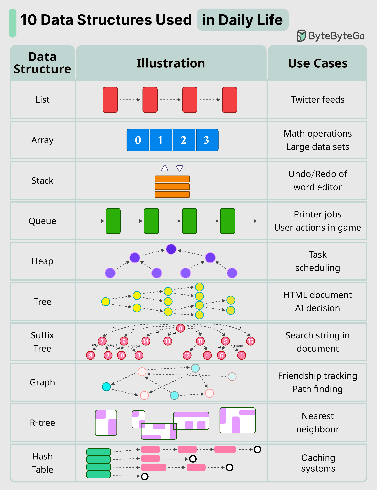

# Algorithm Summary

[TOC]

## Algorithm

## Data Structures

## References

[1] [EP144: The 9 Algorithms That Dominate Our World](https://blog.bytebytego.com/p/ep144-the-9-algorithms-that-dominate)

[2] [10 Key Data Structures We Use Every Day](https://blog.bytebytego.com/i/177690588/10-key-data-structures-we-use-every-day)