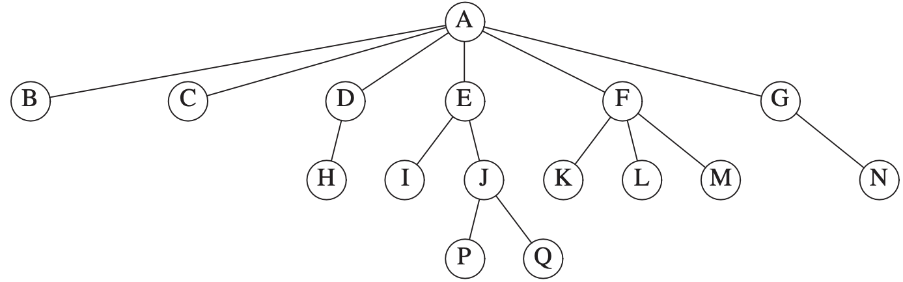
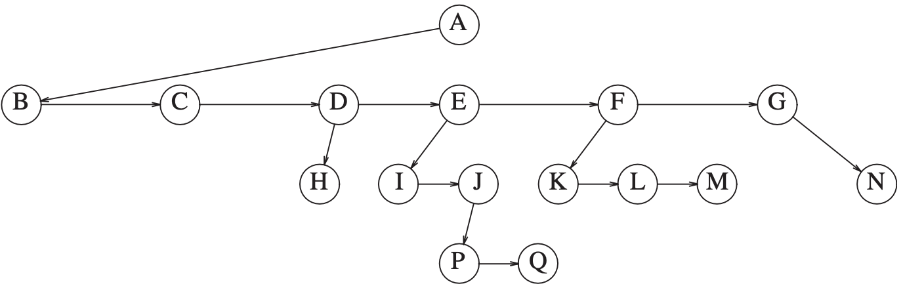

English | [中文版](tree_zh.md)

# Tree

[TOC]


A `tree` can be defined in several ways. One natural way to define a tree is recursively. A tree is a collection of nodes. The collection can be empty; otherwise, a tree consists of a distinguished node, $r$, called the `root`, and zero or more nonempty (sub)trees $T_1, T_2, ..., T_k$, each of whose roots are connected by a directed `edge` from $r$​.

The root of each subtree is said to be a `child` of $r$, and $r$ is the `parent` of each subtree root.



- `siblings`: Nodes with the same parent are **siblings** (K，L，M).
- `leaves`: Nodes with no children are known as **leaves** (B，C，H，I，P，Q，K，L，M，N).

If there is a path from $n_1$ to $n_2$, then $n_1$ is an **ancestor** of $n_2$ and $n_2$ is a **descendant** of $n_1$. If $n_1 \neq n_2$, then $n_1$ is a **proper ancestor** of $n_2$ and $n_2$ is a **proper descendant** of $n_1$.


## Implementation of  Trees



```c++
struct TreeNode
{
  Object   element;
  TreeNode *firstChild;
  TreeNode *nextSibling;
};
```


## Tree Traversals

In a `preorder traversal`, work at a node is performed before (pre) its children are processed. The running time is $O(N)$.

In a `postorder traversal`, the work at a node is performed after (post) its children are evaluated.

In a `inorder traversal`, the general strategy is to process the left subtree first, then perform processing at the current node, and finally process the right subtree.

In a `level-order traversal`, all nodes at depth $d$ are processed before any node at depth $d + 1$.


## Reference

[1] Mark Allen Weiss.Data Structures and Algorithm Analysis in C++.4ED
