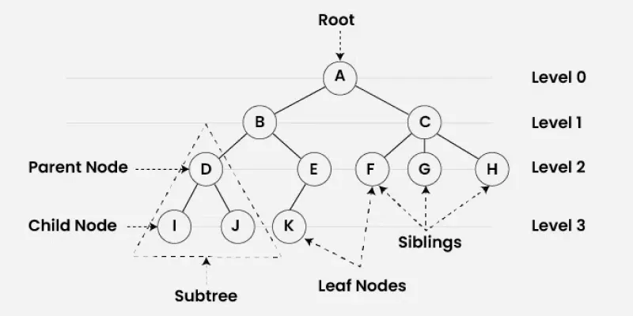
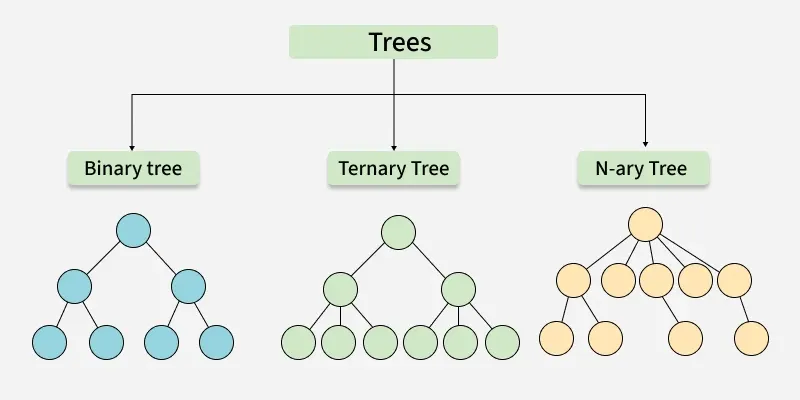
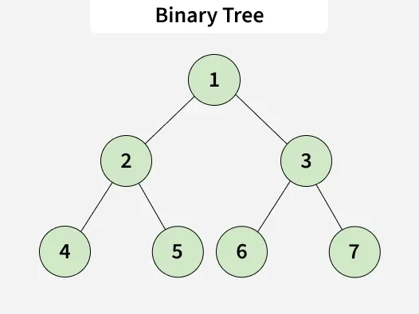
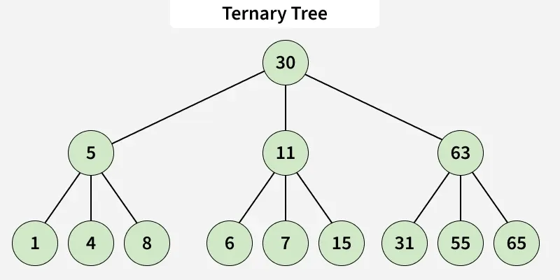
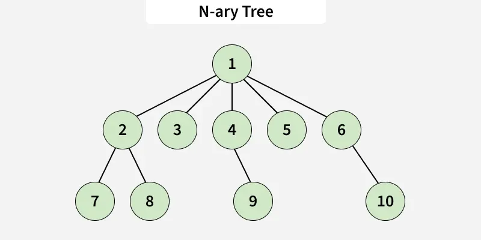
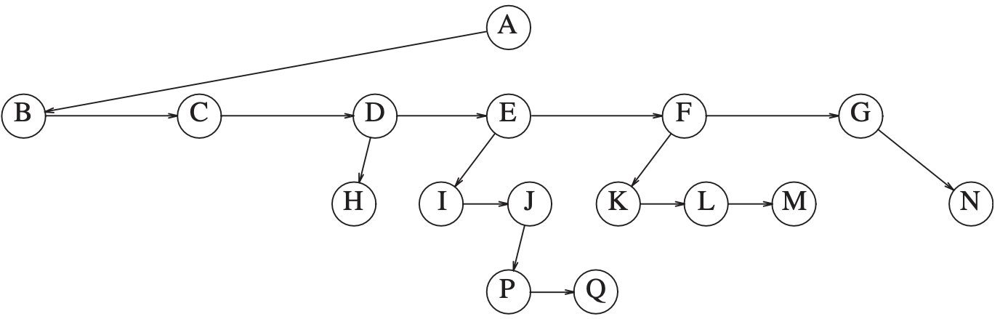

# Tree

[TOC]


A tree data structure is a non-linear data structure in which a collection of elements known as nodes are connected to each other via edges such that there exists exactly one path between any two nodes.

## Properties

A `tree` can be defined in several ways. One natural way to define a tree is recursively. A tree is a collection of nodes. The collection can be empty; otherwise, a tree consists of a distinguished node, $r$, called the `root`, and zero or more nonempty (sub)trees $T_1, T_2, ..., T_k$, each of whose roots are connected by a directed `edge` from $r$.



- **Parent Node:** A node that is an immediate predecessor of another node.
- **Child Node:** A node that is an immediate successor of another node.
- **Root Node:** The topmost node in a tree, which does not have a parent.
- **Leaf Node (External Node):** Nodes that do not have any children.
- **Ancestor:** Any node on the path from the root to a given node (excluding the node itself).
- **Descendant:** A node x is a descendant of another node y if y is an ancestor of x.
- **Sibling:** Nodes that share the same parent.
- **Level of a Node:** The number of edges in the path from the root to that node.
- **Internal Node:** A node with at least one child.
- **Neighbor of a Node:** The parent or children of a node.
- **Subtree:** A node and all its descendants form a subtree.

If there is a path from $n_1$ to $n_2$, then $n_1$ is an **ancestor** of $n_2$ and $n_2$ is a **descendant** of $n_1$. If $n_1 \neq n_2$, then $n_1$ is a **proper ancestor** of $n_2$ and $n_2$ is a **proper descendant** of $n_1$.


## Types



### Binary Tree



A binary tree is a tree data structure where each node has at most **two children**. These two children are usually referred to as the left child and the right child.

Types of Binary Tree:

- Binary Search Tree (BST) and its Variations
- Binary Indexed Tree
- Balanced Binary Tree

### Ternary Tree



A Ternary Tree is a tree data structure in which each node has at most **three** children. These three children are usually referred to as the left child, middle child, and right child.

Types of Ternary Tree:

- Ternary Search Tree
- Ternary Heap

### N-ary Tree



An N-ary tree is a generalization of a binary tree, such that each node can have at most N children.

Types of N-ary Tree:

- B-Tree
- B+Tree
- Trie (Prefix Tree)


## Implementation of  Trees



```c++
struct TreeNode
{
  Object   element;
  TreeNode *firstChild;
  TreeNode *nextSibling;
};
```


## Reference

[1] Thomas H.Cormen; Charles E.Leiserson; Ronald L. Rivest; Clifford Stein. Introduction to Algorithms . 3ED

[2] Mark Allen Weiss. Data Structures and Algorithm Analysis in C++ . 4ED

[3] [Types of Trees](https://www.geeksforgeeks.org/dsa/types-of-trees-in-data-structures/)
