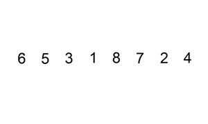
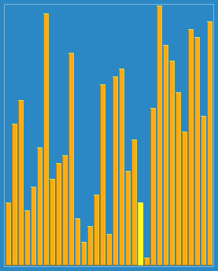
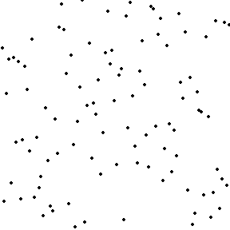
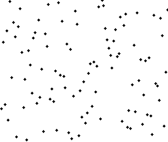
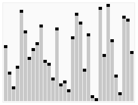
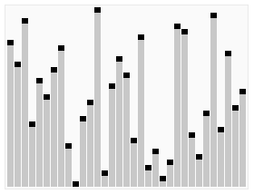
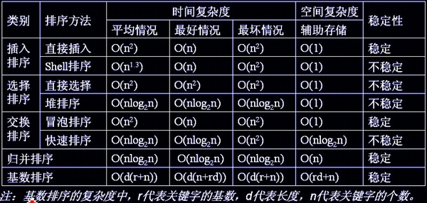

# 八大排序算法总结
排序算法可以分为内部排序和外部排序，内部排序是数据记录在内存中进行排序，而外部排序是因排序的数据很大，一次不能容纳全部的排序记录，在排序过程中需要访问外存。

常见的内部排序算法有：插入排序、希尔排序、选择排序、冒泡排序、归并排序、快速排序、堆排序、基数排序等。

本文将依次介绍上述八大排序算法。

## 算法一：插入排序


插入排序是一种最简单直观的排序算法，它的工作原理是通过构建有序序列，对于未排序数据，在已排序序列中从后向前扫描，找到相应位置并插入。
### 算法步骤：
1. 将第一待排序序列第一个元素看做一个有序序列，把第二个元素到最后一个元素当成是未排序序列。
2. 从头到尾依次扫描未排序序列，将扫描到的每个元素插入有序序列的适当位置。（如果待插入的元素与有序序列中的某个元素相等，则将待插入元素插入到相等元素的后面。）
### 代码实现
```c++
void insert_sort(int array[],unsignedint n)
{
    int i,j;
    int temp;
    for(i = 1;i < n;i++)
    {
        temp = array[i];
        for(j = i;j > 0&& array[j - 1] > temp;j--)
        {
            array[j]= array[j - 1];
        }
        array[j] = temp;
    }
}
```

## 算法二：希尔排序


希尔排序，也称递减增量排序算法，是插入排序的一种更高效的改进版本。但希尔排序是非稳定排序算法。

希尔排序是基于插入排序的以下两点性质而提出改进方法的：
- 插入排序在对几乎已经排好序的数据操作时， 效率高， 即可以达到线性排序的效率
- 但插入排序一般来说是低效的， 因为插入排序每次只能将数据移动一位
希尔排序的基本思想是：先将整个待排序的记录序列分割成为若干子序列分别进行直接插入排序，待整个序列中的记录“基本有序”时，再对全体记录进行依次直接插入排序。
### 算法步骤：
1. 选择一个增量序列t1，t2，…，tk，其中ti>tj，tk=1；
2. 按增量序列个数k，对序列进行k 趟排序；
3. 每趟排序，根据对应的增量ti，将待排序列分割成若干长度为m 的子序列，分别对各子表进行直接插入排序。仅增量因子为1 时，整个序列作为一个表来处理，表长度即为整个序列的长度。
### 代码实现:
```c++
#include<stdio.h>
#include<math.h>
 
#define MAXNUM 10
 
void main()
{
    void shellSort(int array[],int n,int t);                    //t为排序趟数
    int array[MAXNUM],i;
    for(i = 0;i < MAXNUM;i++)
        scanf("%d",&array[i]);
    shellSort(array,MAXNUM,int(log(MAXNUM + 1) / log(2)));      //排序趟数应为log2(n+1)的整数部分
    for(i = 0;i < MAXNUM;i++)
        printf("%d ",array[i]);
    printf("\n");
}
 
//根据当前增量进行插入排序
void shellInsert(int array[],int n,int dk)
{
    int i,j,temp;
    for(i = dk;i < n;i++)                                       //分别向每组的有序区域插入
    {
        temp = array[i];
        for(j = i-dk;(j >= i % dk) && array[j] > temp;j -= dk)  //比较与记录后移同时进行
            array[j + dk] = array[j];
        if(j != i - dk)
            array[j + dk] = temp;                               //插入
    }
}
 
//计算Hibbard增量
int dkHibbard(int t,int k)
{
    return int(pow(2,t - k + 1) - 1);
}
 
//希尔排序
void shellSort(int array[],int n,int t)
{
    void shellInsert(int array[],int n,int dk);
    int i;
    for(i = 1;i <= t;i++)
        shellInsert(array,n,dkHibbard(t,i));
}
 
//此写法便于理解，实际应用时应将上述三个函数写成一个函数。
```

## 算法三：选择排序


选择排序(Selection sort)也是一种简单直观的排序算法。
### 算法步骤
1. 首先在未排序序列中找到最小（大）元素，存放到排序序列的起始位置
2. 再从剩余未排序元素中继续寻找最小（大）元素，然后放到已排序序列的末尾。
3. 重复第二步，直到所有元素均排序完毕。
### 代码实现
```c++
void select_sort(int *a,int n)
{
    register int i,j,min,t;
    for(i = 0;i < n-1;i++)
    {
        min = i;            //查找最小值
        for(j = i + 1;j < n;j++)
            if(a[min] > a[j])
                min = j;    //交换
        if(min != i)
        {
            t = a[min];
            a[min] = a[i];
            a[i] = t;
        }
    }
}
```

## 算法四：冒泡排序


冒泡排序（Bubble Sort）也是一种简单直观的排序算法。它重复地走访过要排序的数列，一次比较两个元素，如果他们的顺序错误就把他们交换过来。走访数列的工作是重复地进行直到没有再需要交换，也就是说该数列已经排序完成。这个算法的名字由来是因为越小的元素会经由交换慢慢“浮”到数列的顶端。
### 算法步骤：
1. 比较相邻的元素。如果第一个比第二个大，就交换他们两个。
2. 对每一对相邻元素作同样的工作，从开始第一对到结尾的最后一对。这步做完后，最后的元素会是最大的数。
3. 针对所有的元素重复以上的步骤，除了最后一个。
4. 持续每次对越来越少的元素重复上面的步骤，直到没有任何一对数字需要比较。
### 代码实现
```c++
#include <stdio.h>
#define SIZE 8void bubble_sort(int a[], int n)
{
    int i, j, temp;
    for (j = 0;j < n - 1;j++)
        for (i = 0;i < n - 1 - j;i++)
        {
            if(a[i] > a[i + 1])
            {
                temp = a[i];
                a[i] = a[i + 1];
                a[i + 1] = temp;
            }
        }
}
 
int main()
{
    int number[SIZE] = {95, 45, 15, 78, 84, 51, 24, 12};
    int i;
    bubble_sort(number, SIZE);
    for (i = 0; i < SIZE; i++)
    {
        printf("%d", number[i]);
    }
    printf("\n");
}
```

## 算法五：归并排序

归并排序（Merge sort）是建立在归并操作上的一种有效的排序算法。该算法是采用分治法（Divide and Conquer）的一个非常典型的应用。
### 算法步骤：
1. 申请空间，使其大小为两个已经排序序列之和，该空间用来存放合并后的序列
2. 设定两个指针，最初位置分别为两个已经排序序列的起始位置
3. 比较两个指针所指向的元素，选择相对小的元素放入到合并空间，并移动指针到下一位置
4. 重复步骤3直到某一指针达到序列尾
5. 将另一序列剩下的所有元素直接复制到合并序列尾
### 代码实现:
```c++
#include <stdlib.h>
#include <stdio.h>
 
void Merge(int sourceArr[],int tempArr[], int startIndex, int midIndex, int endIndex)
{
    int i = startIndex, j=midIndex+1, k = startIndex;
    while(i != midIndex + 1 && j != endIndex + 1)
    {
        if(sourceArr[i] >= sourceArr[j])
            tempArr[k++] = sourceArr[j++];
        else
            tempArr[k++] = sourceArr[i++];
    }
    while(i != midIndex+1)
        tempArr[k++] = sourceArr[i++];
    while(j != endIndex+1)
        tempArr[k++] = sourceArr[j++];
    for(i = startIndex; i <= endIndex; i++)
        sourceArr[i] = tempArr[i];
}
 
//内部使用递归
void MergeSort(int sourceArr[], int tempArr[], int startIndex, int endIndex)
{
    int midIndex;
    if(startIndex < endIndex)
    {
        midIndex = (startIndex + endIndex) / 2;
        MergeSort(sourceArr, tempArr, startIndex, midIndex);
        MergeSort(sourceArr, tempArr, midIndex+1, endIndex);
        Merge(sourceArr, tempArr, startIndex, midIndex, endIndex);
    }
}
 
int main(int argc, char * argv[])
{
    int a[8] = {50, 10, 20, 30, 70, 40, 80, 60};
    int i, b[8];
    MergeSort(a, b, 0, 7);
    for(i=0; i<8; i++)
        printf("%d ", a[i]);
    printf("\n");
    return 0;
}
```

## 算法六：快速排序

快速排序是由东尼·霍尔所发展的一种排序算法。在平均状况下，排序 n 个项目要Ο(n log n)次比较。在最坏状况下则需要Ο(n2)次比较，但这种状况并不常见。事实上，快速排序通常明显比其他Ο(n log n) 算法更快，因为它的内部循环（inner loop）可以在大部分的架构上很有效率地被实现出来。
快速排序使用分治法（Divide and conquer）策略来把一个串行（list）分为两个子串行（sub-lists）。
### 算法步骤：
1. 从数列中挑出一个元素，称为 “基准”（pivot），
2. 重新排序数列，所有元素比基准值小的摆放在基准前面，所有元素比基准值大的摆在基准的后面（相同的数可以到任一边）。在这个分区退出之后，该基准就处于数列的中间位置。这个称为分区（partition）操作。
3. 递归地（recursive）把小于基准值元素的子数列和大于基准值元素的子数列排序。
递归的最底部情形，是数列的大小是零或一，也就是永远都已经被排序好了。虽然一直递归下去，但是这个算法总会退出，因为在每次的迭代（iteration）中，它至少会把一个元素摆到它最后的位置去。
### 代码实现:
```c++
void Qsort(int a[], int low, int high)
{
    if(low >= high)
    {
        return;
    }
    int first = low;
    int last = high;
    int key = a[first];     /*用字表的第一个记录作为枢轴*/
 
    while(first < last)
    {
        while(first < last && a[last] >= key)
        {
            --last;
        }
 
        a[first] = a[last]; /*将比第一个小的移到低端*/
 
        while(first < last && a[first] <= key)
        {
            ++first;
        }
         
        a[last] = a[first];    
        /*将比第一个大的移到高端*/
    }
    a[first] = key;         /*枢轴记录到位*/
    Qsort(a, low, first-1);
    Qsort(a, first+1, high);
}
```

## 算法七：堆排序


堆排序（Heapsort）是指利用堆这种数据结构所设计的一种排序算法。堆积是一个近似完全二叉树的结构，并同时满足堆积的性质：即子结点的键值或索引总是小于（或者大于）它的父节点。
堆排序的平均时间复杂度为Ο(nlogn)。
### 算法步骤：
1. 创建一个堆H[0..n-1]
2. 把堆首（最大值）和堆尾互换
3. 把堆的尺寸缩小1，并调用shift_down(0),目的是把新的数组顶端数据调整到相应位置
4. 重复步骤2，直到堆的尺寸为1
### 代码实现：
```c++
//array是待调整的堆数组，i是待调整的数组元素的位置，nlength是数组的长度
//本函数功能是：根据数组array构建大根堆
void HeapAdjust(int array[],int i,int nLength)
{
    int nChild;
    int nTemp;
    for(; 2 * i + 1 < nLength;i = nChild)
    {
        //子结点的位置=2*（父结点位置）+1
        nChild = 2 * i + 1;
        //得到子结点中较大的结点
        if(nChild < nLength - 1 && array[nChild + 1] > array[nChild]) ++nChild;
        //如果较大的子结点大于父结点那么把较大的子结点往上移动，替换它的父结点
        if(array[i] < array[nChild])
        {
            nTemp = array[i];
            array[i] = array[nChild];
            array[nChild] = nTemp; 
        }
        else break; //否则退出循环
    }
}
//堆排序算法
void HeapSort(int array[],int length)
{
    int i;
    //调整序列的前半部分元素，调整完之后第一个元素是序列的最大的元素
    //length/2-1是最后一个非叶节点，此处"/"为整除
    for(i = length / 2 - 1;i >= 0;--i)
    HeapAdjust(array,i,length);
    //从最后一个元素开始对序列进行调整，不断的缩小调整的范围直到第一个元素
    for(i = length - 1;i > 0;--i)
    {
        //把第一个元素和当前的最后一个元素交换，
        //保证当前的最后一个位置的元素都是在现在的这个序列之中最大的
        array[i] = array[0] ^ array[i];
        array[0] = array[0] ^ array[i];
        array[i] = array[0] ^ array[i];
        //不断缩小调整heap的范围，每一次调整完毕保证第一个元素是当前序列的最大值
        HeapAdjust(array,0,i);
    }
}
int main()
{
    int i;
    int num[]={9,8,7,6,5,4,3,2,1,0};
    HeapSort(num,sizeof(num)/sizeof(int));
    for(i = 0;i < sizeof(num) / sizeof(int);i++)
    {
        printf("%d ",num[i]);
    }
    printf("\nok\n");
    return 0;
}
```

## 算法八：基数排序
基数排序是一种非比较型整数排序算法，其原理是将整数按位数切割成不同的数字，然后按每个位数分别比较。由于整数也可以表达字符串（比如名字或日期）和特定格式的浮点数，所以基数排序也不是只能使用于整数。

说基数排序之前，我们简单介绍桶排序：

算法思想：是将阵列分到有限数量的桶子里。每个桶子再个别排序（有可能再使用别的排序算法或是以递回方式继续使用桶排序进行排序）。桶排序是鸽巢排序的一种归纳结果。当要被排序的阵列内的数值是均匀分配的时候，桶排序使用线性时间（Θ（n））。但桶排序并不是 比较排序，他不受到 O(n log n) 下限的影响。

简单来说，就是把数据分组，放在一个个的桶中，然后对每个桶里面的在进行排序。

例如要对大小为[1..1000]范围内的n个整数A[1..n]排序

首先，可以把桶设为大小为10的范围，具体而言，设集合B[1]存储[1..10]的整数，集合B[2]存储   (10..20]的整数，……集合B[i]存储(   (i-1)*10,   i*10]的整数，i   =   1,2,..100。总共有  100个桶。

然后，对A[1..n]从头到尾扫描一遍，把每个A[i]放入对应的桶B[j]中。  再对这100个桶中每个桶里的数字排序，这时可用冒泡，选择，乃至快排，一般来说任  何排序法都可以。

最后，依次输出每个桶里面的数字，且每个桶中的数字从小到大输出，这  样就得到所有数字排好序的一个序列了。

假设有n个数字，有m个桶，如果数字是平均分布的，则每个桶里面平均有n/m个数字。如果对每个桶中的数字采用快速排序，那么整个算法的复杂度是O(n   +   m   *   n/m*log(n/m))   =   O(n   +   nlogn   –   nlogm)

从上式看出，当m接近n的时候，桶排序复杂度接近O(n)

当然，以上复杂度的计算是基于输入的n个数字是平均分布这个假设的。这个假设是很强的  ，实际应用中效果并没有这么好。如果所有的数字都落在同一个桶中，那就退化成一般的排序了。

前面说的几大排序算法 ，大部分时间复杂度都是O（n2），也有部分排序算法时间复杂度是O(nlogn)。而桶式排序却能实现O（n）的时间复杂度。但桶排序的缺点是：
1. 首先是空间复杂度比较高，需要的额外开销大。排序有两个数组的空间开销，一个存放待排序数组，一个就是所谓的桶，比如待排序值是从0到m-1，那就需要m个桶，这个桶数组就要至少m个空间。
2. 其次待排序的元素都要在一定的范围内等等。
### 代码实现:
```c++
int maxbit(int data[], int n) //辅助函数，求数据的最大位数
{
    int d = 1; //保存最大的位数
    int p = 10;
    for(int i = 0; i < n; ++i)
    {
        while(data[i] >= p)
        {
            p *= 10;
            ++d;
        }
    }
    return d;
}
void radixsort(int data[], int n)                   //基数排序
{
    int d = maxbit(data, n);
    int *tmp = newint[n];
    int *count = newint[10];                        //计数器
    int i, j, k;
    int radix = 1;
    for(i = 1; i <= d; i++)                         //进行d次排序
    {
        for(j = 0; j < 10; j++)
            count[j] = 0;                           //每次分配前清空计数器
        for(j = 0; j < n; j++)
        {
            k = (data[j] / radix) % 10;             //统计每个桶中的记录数
            count[k]++;
        }
        for(j = 1; j < 10; j++)
            count[j] = count[j - 1] + count[j];     //将tmp中的位置依次分配给每个桶
        for(j = n - 1; j >= 0; j--)                 //将所有桶中记录依次收集到tmp中
        {
            k = (data[j] / radix) % 10;
            tmp[count[k] - 1] = data[j];
            count[k]--;
        }
        for(j = 0; j < n; j++)                      //将临时数组的内容复制到data中
            data[j] = tmp[j];
        radix = radix * 10;
    }
    delete[]tmp;
    delete[]count;
}
```

## 总结
各种排序的稳定性，时间复杂度、空间复杂度、稳定性总结如下图：

