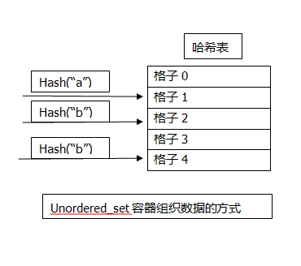

# 第五章 set的使用
## 摘要
set容器的使用
## 详情
### 容器类别
* set<T>容器保存T类型的对象，而且保存的对象是唯一的。
* multiset<T>容器和set<T>容器保存T类型对象的方式相同，但它可以保存重复的对象。
* unordered_set<T>容器保存T类型的对象，而且对象是唯一的。
* unordered_multiset<T>容器保存T类型对象的方式和unordered_set<T>相同，但它可以保存重复对象。

### 函数
|函数成员|说明|
|:--|:--|
|insert()|插入元素,总是成功执行|
|emplace()|在指定位置放置元素，总是成功|
|emplace_hint()|在指定放置小部分元素，总是成功|
|erase()|删除指定元素|
|clear()|清除所有元素|
|count()|返回指定键所对应的元素个数|
|equal_range()|遍历判断相等|
|lower_bound()|升序查找|
|upper_bound()|降序查找|
|find()|普通查找|

### unordered_set<T>容器
元素类型必须可以比较是否相等，因为这可以确定元素什么时候相等。元素是无序的；

### 保存指针
推荐使用定义在memory头文件中的owner_less<T>函数对象类型的实例来比较容器中的智能指针.

### 集合运算
1. set_union():并集运算；
2. set_intersection():交集运算；
3. set_difference():差运算；
4. set_symmetric_difference():
5. includes():包含运算；

总结
* set容器保存的对象用他们自己作为键。
* set容器存储的T类型对象是有序的，默认使用less<T>对对象排序。
* multiset<T>容器保存对象的方式和set相同，但对象并不是唯一的。
* 如果两个对象是相等的，那么他们在set或multiset中会被看成同一个元素。
* unordered_set<T>容器保存T类型的对象，并且他们是唯一的，他们的位置由对象的哈希值确定。
* unordered_multiset<T>容器中的对象位置也是由对象的哈希值确定的，但对象不需要是唯一的。
* 无序set容器用==operator来决定两个对象是否相等，因而T类型必须支持这个运算符
* 无序set容器中的对象通常保存在哈希表的格子中，用对象的哈希值可以确定对象在容器中的位置。
* 无序set容器的装载因子是每个格子平均的元素个数。
* 无序set容器在初始时会分配一些格子。当超过最大装载因子时，格子的个数会自动增加。
* STL定义了一些集合运算的算法。二元集合运算是交，并，差，对称，包含。