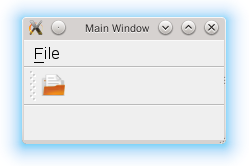

# 添加动作
Qt 使用QAction类作为动作。顾名思义，这个类就是代表了窗口的一个“动作”，这个动作可能显示在菜单，作为一个菜单项，当用户点击该菜单项，对用户的点击做出响应；也可能在工具栏，作为一个工具栏按钮，用户点击这个按钮就可以执行相应的操作。有一点值得注意：无论是出现在菜单栏还是工具栏，用户选择之后，所执行的动作应该都是一样的。因此，Qt 并没有专门的菜单项类，只是使用一个QAction类，抽象出公共的动作。当我们把QAction对象添加到菜单，就显示成一个菜单项，添加到工具栏，就显示成一个工具按钮。用户可以通过点击菜单项、点击工具栏按钮、点击快捷键来激活这个动作。

QAction包含了图标、菜单文字、快捷键、状态栏文字、浮动帮助等信息。当把一个QAction对象添加到程序中时，Qt 自己选择使用哪个属性来显示，无需我们关心。同时，Qt 能够保证把QAction对象添加到不同的菜单、工具栏时，显示内容是同步的。也就是说，如果我们在菜单中修改了QAction的图标，那么在工具栏上面这个QAction所对应的按钮的图标也会同步修改。

下面我们来看看如何在QMainWindow中使用QAction：
```c++
// !!! Qt 5
// ========== mainwindow.h
#ifndef MAINWINDOW_H
#define MAINWINDOW_H
 
#include <QMainWindow>
 
class MainWindow : public QMainWindow
{
    Q_OBJECT
public:
    MainWindow(QWidget *parent = 0);
    ~MainWindow();
 
private:
    void open();
 
    QAction *openAction;
};
 
#endif // MAINWINDOW_H
 
// ========== mainwindow.cpp
#include <QAction>
#include <QMenuBar>
#include <QMessageBox>
#include <QStatusBar>
#include <QToolBar>
 
#include "mainwindow.h"
 
MainWindow::MainWindow(QWidget *parent) :
    QMainWindow(parent)
{
    setWindowTitle(tr("Main Window"));
 
    openAction = new QAction(QIcon(":/images/doc-open"), tr("&Open..."), this);
    openAction->setShortcuts(QKeySequence::Open);
    openAction->setStatusTip(tr("Open an existing file"));
    connect(openAction, &QAction::triggered, this, &MainWindow::open);
 
    QMenu *file = menuBar()->addMenu(tr("&File"));
    file->addAction(openAction);
 
    QToolBar *toolBar = addToolBar(tr("&File"));
    toolBar->addAction(openAction);
 
    statusBar() ;
}
 
MainWindow::~MainWindow()
{
}
 
void MainWindow::open()
{
    QMessageBox::information(this, tr("Information"), tr("Open"));
}
```
上面的代码分别属于两个文件：mainwindow.h 和 mainwindow.cpp。为了让 MainWindow 运行起来，我们还需要修改 main() 函数如下：
```c++
int main(int argc, char *argv[])
{
    QApplication app(argc, argv);
 
    MainWindow win;
    win.show();
 
    return app.exec();
}
```
当我们编辑好文件，点击运行，可以看到MainWindow的运行结果：



这是一个相对完整的程序。首先，我们在MainWindow类中添加了一个私有函数open()和一个私有变量openAction。在 MainWindow 的构造函数中，第一行我们调用了setWindowTitle()，设置主窗口的标题。注意我们的文本使用tr()函数，这是一个用于 Qt 国际化的函数。在后续章节中我们可以看到，我们可以使用 Qt 提供的国际化工具，将tr()函数的字符串提取出来，进行国际化。由于所需进行国际化的文本应该被大多数人认识，所以，tr()函数里面一般会是英文文本。

然后，我们在堆上创建了openAction对象。在QAction构造函数，我们传入了一个图标、一个文本和 this 指针。我们将在后面的文章中解释 this 指针的含义。

图标我们使用了QIcon，传入值是一个字符串，这个字符串对应于 Qt 资源文件中的一段路径。Qt 资源文件的后缀名是 qrc。如果我们使用 Qt Creator，我们可以在新建文件中看到 Qt 资源文件。Qt 资源文件其实是一个 XML 描述的文件，表示 Qt 应用程序所需要的各个资源。我们可以使用普通文本编辑器打开这个文件：
```html
<RCC>
    <qresource prefix="/images">
        <file alias="doc-open">document-open.png</file>
    </qresource>
</RCC>
```
我们会在后面的章节中详细介绍 Qt 资源文件（注意，资源文件需要在 pro 文件中使用 RESOURCES 引入。）。这里只需要了解，QIcon的参数，以 : 开始，意味着从资源文件中查找资源。:/images/doc-open就是找到了这里的 document-open.png 这个文件。（我们使用的是 png 格式的图片，这是 Qt 内置支持的图片格式。其他格式的图片，比如 jpg、gif 则需要插件支持。这些插件实际已经随着 Qt 一同发布。）

QAction第二个参数中，文本值前面有一个 &，意味着这将成为一个快捷键。注意看截图中 File 的 F 有一个下划线。

下面一句，我们使用了setShortcut()函数，用于说明这个QAction的快捷键。Qt 的QKeySequence为我们定义了很多内置的快捷键，比如我们使用的 Open。你可以通过查阅 API 文档获得所有的快捷键列表。 这个与我们自己定义的有什么区别呢？简单来说，我们完全可以自己定义一个tr("Ctrl+O")来实现快捷键。原因在于，这是 Qt 跨平台性的体现。比如 PC 键盘和 Mac 键盘是不一样的，一些键在 PC 键盘上有，而 Mac 键盘上可能并不存在，或者反之。使用QKeySequence类来添加快捷键，会根据平台的不同来定义相应的快捷键。

setStatusTip()则实现了当用户鼠标滑过这个 action 时，会在主窗口下方的状态栏显示相应的提示。

后面的connect()函数，将这个QAction的triggered()信号与MainWindow类的open()函数连接起来。当用户点击了这个QAction时，会自动触发MainWindow的open()函数。这是我们之前已经了解过的。

下面的menuBar()、toolBar()和statusBar()三个是QMainWindow的函数，用于创建并返回菜单栏、工具栏和状态栏。我们可以从代码清楚地看出，我们向菜单栏添加了一个 File 菜单，并且把这个QAction对象添加到这个菜单；同时新增加了一个 File 工具栏，也把QAction对象添加到了这个工具栏。我们可以看到，在菜单中，这个对象被显示成一个菜单项，在工具栏变成了一个按钮。至于状态栏，则是出现在窗口最下方，用于显示动作对象的提示信息的。

至于open()函数中的内容，我们会在后文介绍。这里可以运行一下，你会看到，触发这个动作，程序会弹出一个提示框。

下面是 Qt 4 版本的程序，具体非常类似，这里不再赘述。
```c++
// !!! Qt 4
// ========== mainwindow.h
#ifndef MAINWINDOW_H
#define MAINWINDOW_H
 
#include <QMainWindow>
 
class MainWindow : public QMainWindow
{
    Q_OBJECT
public:
    MainWindow(QWidget *parent = 0);
    ~MainWindow();
 
private slots:
    void open();
 
private:
    QAction *openAction;
};
 
#endif // MAINWINDOW_H
 
// ========== mainwindow.cpp
#include <QAction>
#include <QMenuBar>
#include <QMessageBox>
#include <QToolBar>
 
#include "mainwindow.h"
 
MainWindow::MainWindow(QWidget *parent) :
    QMainWindow(parent)
{
    setWindowTitle(tr("Main Window"));
 
    openAction = new QAction(QIcon(":/images/doc-open"), tr("&Open..."), this);
    openAction->setShortcuts(QKeySequence::Open);
    openAction->setStatusTip(tr("Open an existing file"));
    connect(openAction, SIGNAL(triggered()), this, SLOT(open()));
 
    QMenu *file = menuBar()->addMenu(tr("&File"));
    file->addAction(openAction);
 
    QToolBar *toolBar = addToolBar(tr("&File"));
    toolBar->addAction(openAction);
 
    statusBar();
}
 
MainWindow::~MainWindow()
{
}
 
void MainWindow::open()
{
    QMessageBox::information(this, tr("Information"), tr("Open"));
}
```