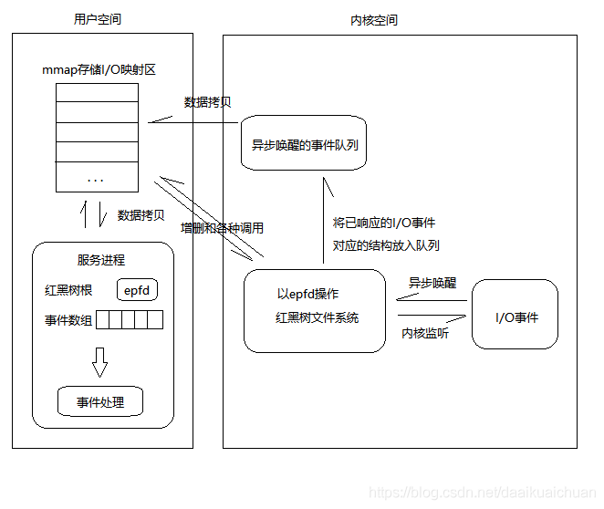
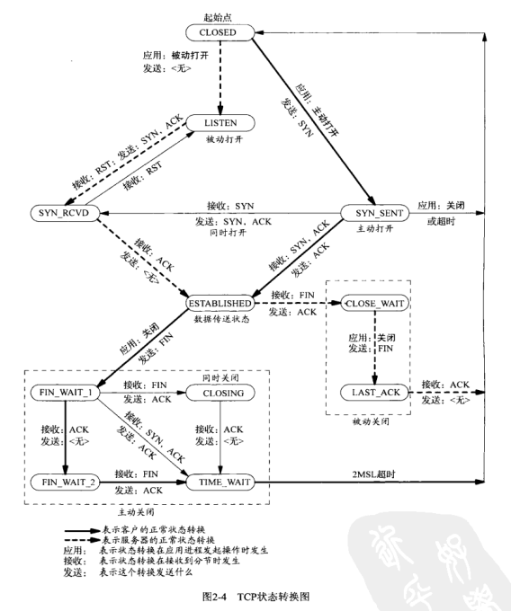
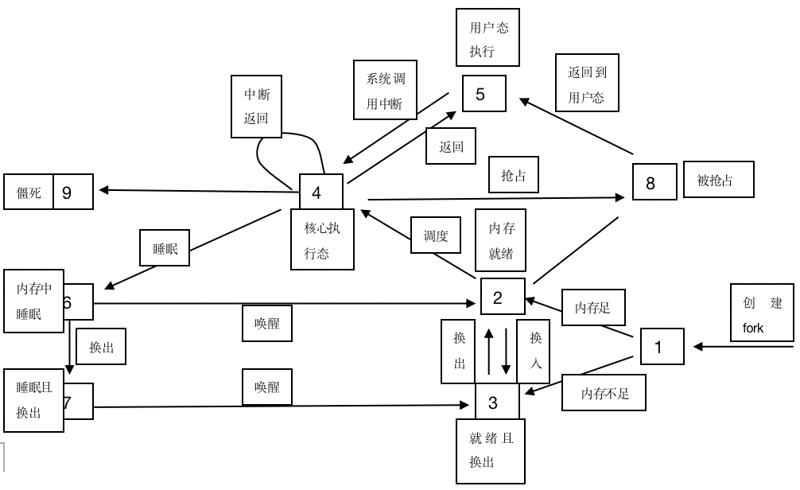

[TOC]

# 面试笔记


## 算法

1. 如何判断链表是否有环

   

## 系统

1. 简述进程，线程和协程以及它们的区别

   - 进程

     是系统进行资源分配和调度的一个独立单位，每个进程都有自己独立的内存空间，不同进程通过进程间通信来交流。比较heavy，上下文切换开销大，但是比线程稳定。

   - 线程

     是进程的一个实体，是cpu调度和分派的基本单位；比进程轻，不拥有系统资源，只拥有一些必要的运行时资源（如程序计数器，寄存器和栈）；拥有函数的入口和返回，可以与同一个进程内的其他线程共享进程的所有资源；线程间通信主要通过共享内存，上下文切换开销小，但是不够稳定。

   - 协程

     **是一种用户态的轻量级线程**，调度完全由用户控制。拥有自己的寄存器上下文和栈。协程调度切换时，将寄存器上下文和栈保存到其他地方，在切换回来时，恢复前面的寄存器上下文和栈；上下文切换基本没有开销。

   区别：

   - 进程-线程
     1. 调度：**线程作为调度和分配的基本单位，真正在处理机上运行的是线程，进程作为拥有资源的基本单位**
     2. 资源：进程是资源分配和拥有的单位，同一个进程中的所有线程共享进程资源
     3. 开销：在创建或撤消进程时，由于系统都要为之分配和回收资源，导致进程切换开销大，线程切换开销小
     4. 并发：进程之间运行互不影响，线程共享进程的系统资源，健壮性差

   - 线程-协程
     1. 开销：协程能保留上一次调用时的状态，每次过程重入都会恢复上一次的状态，协程的开销非常小。
     2. 并发：线程都是同步机制，协程都是异步机制，在协程中控制共享资源不需要加锁

2. epoll详解

   ```c
   int epoll_create(int size); // 创建epoll对象
   int epoll_ctl(int epfd, int op, int fd, struct epoll_event *event); // 添加套接字
   int epoll_wait(int epfd, struct epoll_event *events, int maxevents, int timeout); // 收集发生事件的连接
   ```

   调用`epoll_create`时:

   1. 在内核cache里建立了一个红黑树用于存储`epoll_ctl`传来的`socket`
   2. 在内核cache建立一个rdllist双向链表（就序列表），用于存储准备就绪的事件

   调用`epoll_wait`时：

   1. 检测rdllist里面有没有数据，有数据就返回，没有数据就sleep，等到timeout时间到后即使链表没有数据也返回

      

   epoll触发模式

   - LT（水平触发，默认模式）

     **只要有数据都会触发**，缓冲区剩余未读尽的数据会导致epoll_wait返回。

   - ET（边缘触发，高速模式）

     **只有数据到来才触发**，**不管缓存区中是否还有数据**，缓冲区剩余未读尽的数据不会导致epoll_wait返回

3. 可执行程序的结构

   - 文件头

     保存了程序的各个段的信息，操作系统加载程序的时候，首先要读取这个文件头，计算出各个段的大小

   - 堆

   - 栈

   - 代码段

     只读，编译结束后，大小就确定了，运行过程中不会被改变，可以包含常量数据

   - 数据段

     用于存放源代码中具有全局声明周期的变量

     - `.bss`

       存储未初始化的变量

     - `.data`

       存储具有非0初始值的变量

     - `.rodata`

       存储const修饰的变量

4. 如何提升memcpy的效率

   memcpy是c/c++的一个标准函数，原型为：`void *memcpy(void *dest, const void *src, szie_t n)`，用于从src拷贝n个字节到dest指向的内存起始位置

   有以下方法可以提升memcpy的效率：

   - 使用`neon`指令（仅限ARM Cortex-A系列处理器）
   - TODO

5. TCP状态转移图

   

6. 进程状态图

   


## 工具

### skynet

1. 定时器
2. actor模型
3. 集群
4. lua虚拟机
5. 负载均衡
6. 热更

## redis

1. 数据模型
2. 同步机制
3. 跳表的用途与缺陷


## 项目

1. 游戏服务器的架构是怎样的

   ```sequence
   Title:游戏时序图
   客户端->登陆服务器: 账号，加密密码
   登陆服务器->客户端: TOKEN
   客户端->网关: TOKEN
   网关->客户端: 验证通过，建立连接
   客户端->网关: MSG1
   网关->逻辑服务器1: 分发MSG1
   逻辑服务器1->DB服务器: 保存记录
   逻辑服务器1->网关: RSP1
   网关->客户端: RSP1
   客户端->网关: MSG2
   网关->逻辑服务器2: 分发MSG2
   逻辑服务器2->DB服务器: 保存记录
   逻辑服务器2->网关: RSP2
   网关->客户端: RSP2
   ```

   

2. 热更新的用途
   1. 上线需求（审核）
   2. 快节奏的版本迭代
   3. 节约网络资源

3. protobuf的底层实现

4. 使用UDP的理由
   1. 低延迟


## c++

1. 描述下c++中四种`cast`以及他们的使用场景

   - `static_cast`-静态转换

     用于各种隐式转化；在编译期间处理，无运行时类型检查来保证安全性。

     用于以下转换：

     - 基类与子类的指针或引用的上行转换(安全)和下行转换(不安全)
     - 基本数据类型之间的转换
     - 空指针转换为目标类型的空指针
     - 任何类型的表达式转化成void类型

   - `dynamic_cast`-动态转换

     只能用于含有虚函数的类；在运行期处理，带类型检查。

     用于以下转换：

     - 基类与子类的指针或引用的上行转换(安全)和下行转换(安全，带类型检查功能)
     - 交叉转换(`B:A, D:A; dynamic_cast<D>(B)`)

   - `reinterpret_cast`

     用于以下转换：

     - 指针与整数之间的转换

   - `const_cast`

     修改`const`和`volatile`属性

     用于以下转换：

     - 常量指针转非常量指针
     - 常量引用转非常量引用

2. 为什么要用`virtual destructor`？为什么没有`virtual constructor`?

   - 防止内存泄漏

3. 哪些函数不能是虚函数？

   - 构造函数：构造时，基类指针无法知道子类的具体类型
   - 内联成员函数：内联函数是在编译期展开，虚函数式运行时绑定
   - 静态成员函数：静态成员函数是编译期确定的，不支持多态
   - 友元函数：不属于类成员函数，不能被继承
   - 普通函数：普通函数无法被继承

4. 指针和引用的用途和区别

   - 指针是一个指向地址的变量，引用是地址的别名
   - 引用使用时无需解引用`(*)`，指针需要解引用
   - 引用只能在定义时被初始化一次，之后不可变；指针可以改变指向的地址
   - 引用不能为空，指针可以为空
   - `sizeof(引用)`：所指向对象的大小；`sizeof(指针)`：指针本身的大小
   - 指针可以有多级`(**指针)`，引用只能是一级
   - 指针需要分配内存区域，引用不需要
   - `++`,`--`等操作的意义不一样

5. `malloc/free`，`new/delete`的原理和区别

   - malloc

     ```c
     int* p = (int*)malloc(sizeof(int));
     ```

     从堆里面获得空间，实际占用的内存比申请的大，超出的空间用来记录对这块内存的管理信息。

   - free

     ```c
     free(p);
     ```

     释放空间时，先读取内存的管理信息，得到内存的实际大小，再释放它。

   - new

     ```c++
     int* p = new int(1);
     ```

     流程：`operator new()->malloc()->constructor function->ptr`

   - delete

     ```c++
     delete p;
     ```

     流程：`destructor function->operator delete()->free()`

   区别：

   1. malloc开辟空间类型大小需要手动计算，new由编译器自己计算
   2. malloc返回`void*`，需要强转为对应类型指针；new直接返回对应类型指针
   3. free和delete都不需要指定空间大小


## lua

1. lua数据类型

   - number
   - string
   - boolean
   - function
   - table
   - userdata
   - thread
   - nil

   

