# 软件需求分析

## 概述

### 必要性

软件开发人员精通计算机技术，但并不熟悉业务；用户精通业务，却不太懂计算机技术；因此对于同一个问题，技术人员与用户之间可能存在认知上的差异；所以，在进行软件开发之前需要对用户的需求进行分析，以准确把握用户的想法，努力使用户与技术人员之间的共识达成一致。

### 方法论

需求调研需要讲究方法，要在有限的时间内尽可能多的了解到用户的需要；

## 需求分类

需求分为以下两类：

1. 用户需求：直接来源于用户，由于用户对计算机系统认识不足，分析人员有义务帮助用户挖掘需求；

2. 系统需求

   由于自然语言在描述问题时容易发生歧义，需要一种更加严格的形式来对用户需求进行描述，系统需求描述往往比用户需求描述更具有技术特性；系统需求主要提供给开发者阅读，并作为开发人员设计系统的起点与依据；

   对系统需求进行分析时，以数据流为主干，对系统需求进行拆分：

   - 功能需求：详细描述软件系统对于数据流的处理功能，包括：特征，边界，输入输出，异常处理；
   - 数据需求：描述驱动软件系统运行的数据，以及数据之间的关联；
   - 其他需求：描述性能，安全，界面等要求；

## 需求描述

### 结构化分析建模

1. 功能层次模型

   - 树形连线结构：表示系统所具有的功能层级关系；
   - 矩形：表示系统中字系统或功能模块；

2. 数据流模型

   数据流图用于描述系统对数据的加工过程，为开发提供一种简洁的逻辑图形说明；

   数据流图的基本图形符号如表所示：

   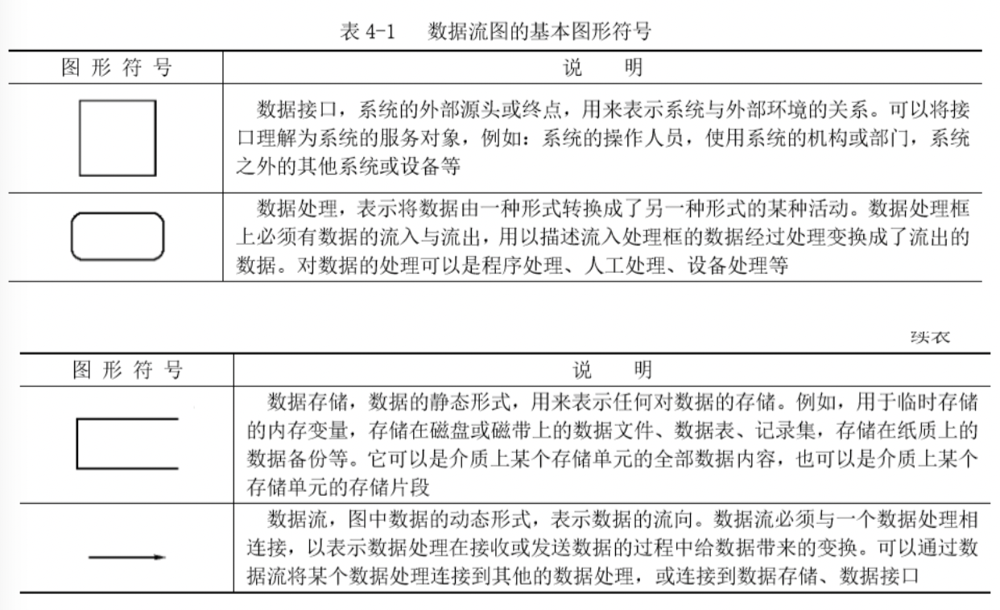

   数据流图的符号命名规则：

   | 符号     | 命令规则                                                     | 例                                         |
   | -------- | ------------------------------------------------------------ | ------------------------------------------ |
   | 数据接口 | 使用名词或名词短语命名；                                     | - 人事处 - 财务处                       |
   | 数据存储 | 使用名词或名词短语命名，当数据存储是存储介质上的某个存储单元的存储片段时，名称需要用到限定词； | “在职人员档案工资”                         |
   | 数据流   | 使用名词或名词短语命名，对于从数据存储中流入流出的数据流，在不发生名称混淆的前提下，可以省略名称； | 工资报表                                   |
   | 数据处理 | 使用“动词+名词 短语”的动宾结构来进行命名                     | - "2 产生工资数据" - "2.1 录入档案工资" |

   数据流图的数据字典是各类数据描述的集合，能够提供对数据的详细规格定义，并可用于验证数据，以发现系统在数据需求描述中是否出现遗漏；其一般要求为：

   - 对数据的定义应该是严密，精确，一致的，不能有二义性；

   - 需要对数据流图中的每一个被命名的数据元素进行定义；

   - 需要分类定义各种不同种类的数据元素，或采用类别代号加以区分；数据字典通常包括以下类型：

     | 数据字典类别 | 内容                                                         | 意义                                 |
     | ------------ | ------------------------------------------------------------ | ------------------------------------ |
     | 数据项       | - 数据项名 - 数据项含义说明 - 别名 - 数据类型 - 长度 - 取值范围 - 取值含义 - 与其他数据项的逻辑关系 | 数据项是不可再分的数据单位           |
     | 数据结构     | - 数据结构名 - 含义说明 - 组成方式：    `=` 表示数据组成    `+ .` 用于连接两个数据分量。    `[...|...]` 从若干数据分量中选择一个。    `m{...}n` 重复花括号内的数据，最少重复m次，最多重复n次。    `(...)` 圆括号内数据可有可无。 | 反应了数据之间的组合关系             |
     | 数据流       | - 数据流名 - 说明 - 数据流来源 - 数据流去向 - 组成 - 平均流量 - 高峰期流量 | 反应了数据结构在软件系统内传输的路径 |
     | 数据存储     | - 数据存储名 - 说明 - 编号 - 流入的数据流 - 流出的数据流 - 组成 - 数据量 - 存取方式 | 反应了数据结构停留或保存的地方       |

   例，工资管理系统系统数据流图及数据项：

   

   

   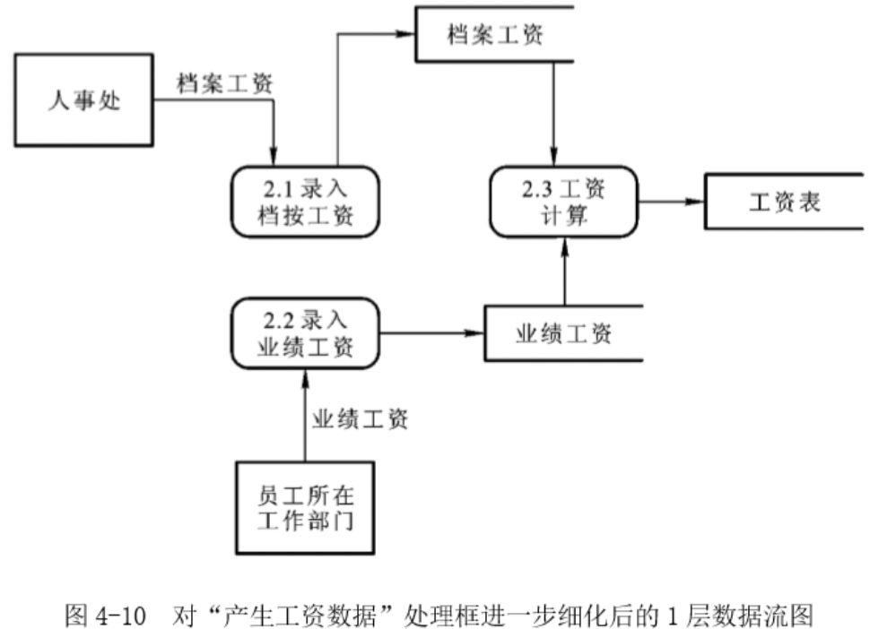

   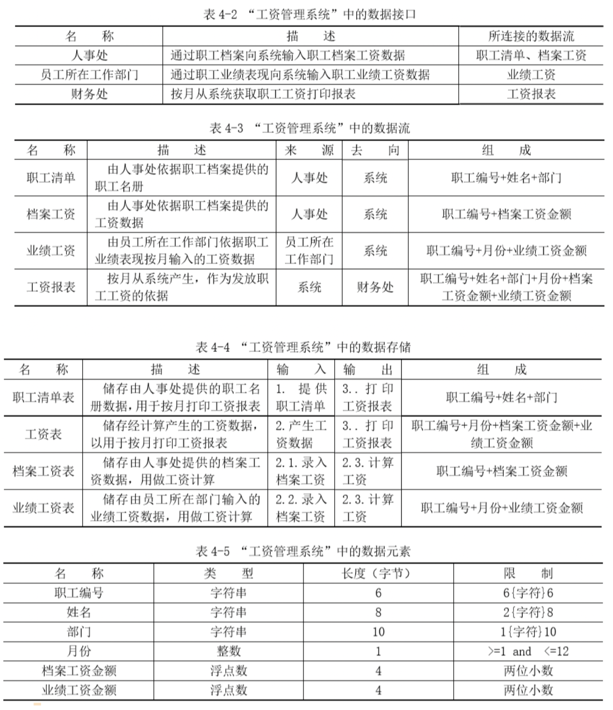

3. 数据关系模型（ER图

   以现实数据为建模数据，通过从现实数据中抽取数据实体，数据关系和数据属性，来建立数据库的概念模型；

   - 数据实体

     对应用领域中现实对象的数据抽象；

   - 数据关系

     指不同数据实体之间存在的联系，如图所示：

     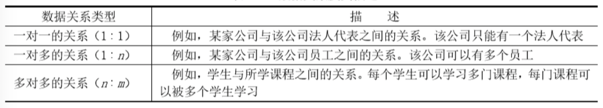

   - 数据属性

     数据属性是指在数据实体与数据关系上所具有的一些特征值；
     
     | 属性           | 标识            |
     | -------------- | --------------- |
     | 数据实体       | 矩形            |
     | 数据关系       | 菱形            |
     | 数据属性       | 椭圆形          |
     | 实体的关键属性 | 属性名称+下划线 |
     
     例，简化版数据关系图：
     
     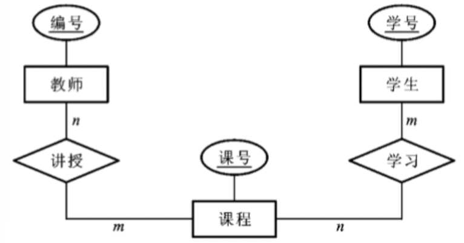
   
4. 系统状态模型

   通过系统的内部状态，外部事件为基本元素来描绘系统的工作流程，比较适合与描述一些依赖外部事件驱动的实时系统；

   状态模型中的图形符号：

   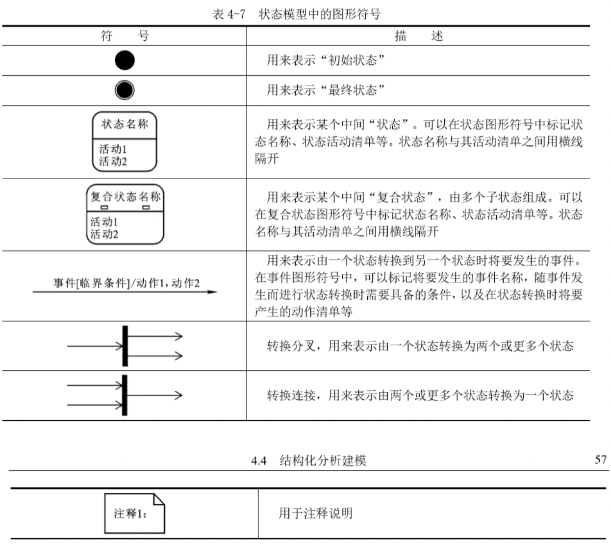

   例，全自动洗衣机的状态模型图：

   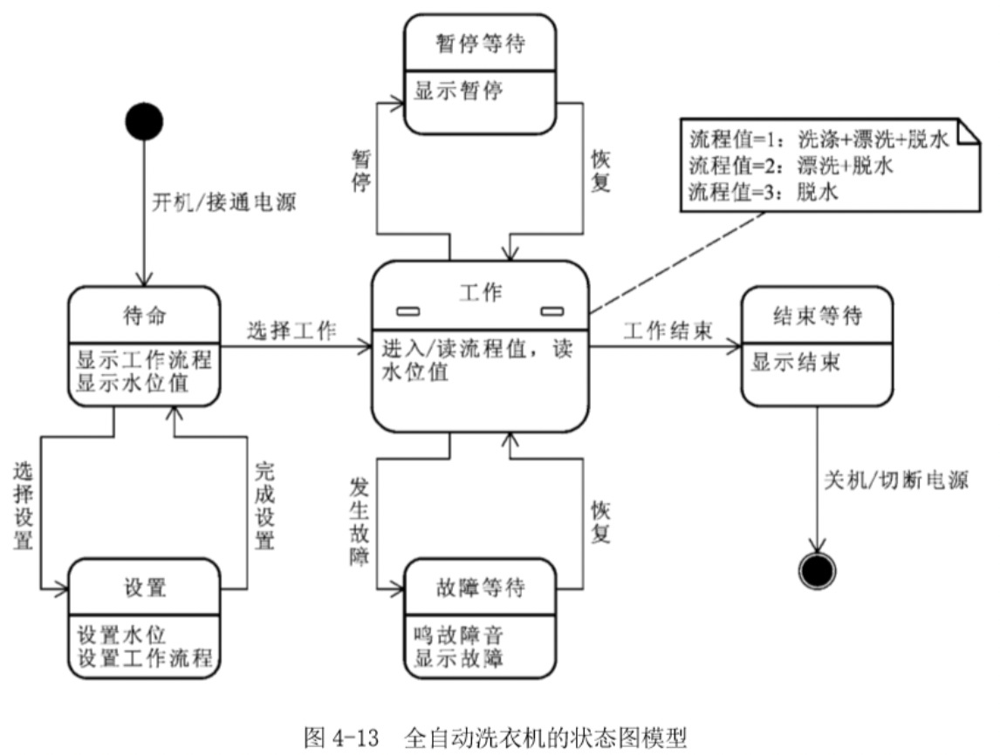

   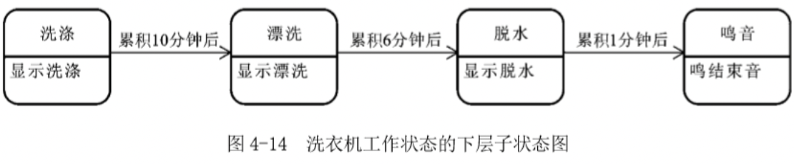

   

   

### 需求规格定义

TODO

## 需求分析过程

需求分析过程示意图：

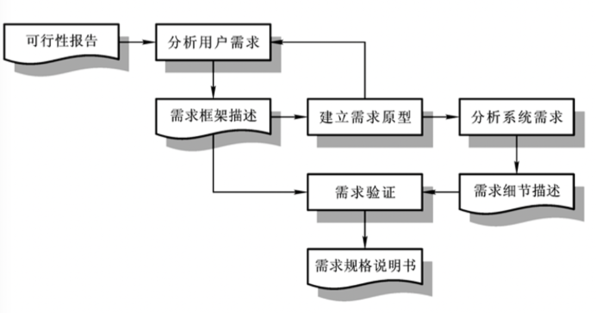

1. 分析需求之前需要进行可行性报告分析，这是所有需求分析的第一步；
2. 分析用户需求，拆分需求模块；
3. 将用户需求导入需求框架，根据需求框架建立需求原型或者直接将需求框架尽心需求验证；
4. 在需求原型中分离出系统需求；
5. 针对系统需求进行需求细节描述；
6. 需求验证通过就可以制定需求规格说明书。

## 获取用户需求

可以通过以下方式获取用户需求：

1. 研究用户

   尽量充分地和用户进行沟通，了解用户的意图；把用户进行分类，将某类用户作为一个抽象概念，看作系统的外部应用接口；

2. 从调查中获取用户需求

   用户调查是最基本的用户需求信息收集方法，用户需求信息来源是多方面的，为了保证用户需求的完整性，在需求分析过程中，分析人员需要调查各类能代表用户意愿的相关人员；常用的调查方法有以下几种：

   - 访谈用户：与用户进行面对面对话；
   - 开座谈会：需要同时对多个部门进行业务活动调查与商讨时，可以考虑开座谈会的方式，有利于节约调查时间；
   - 问卷调查：通过精心设计的调查表去调查用户对软件的看法；
   - 跟班作业：亲身参与用户的业务工作，直接体验业务情况；
   - 收集用户资料：收集各种用户信息（如报表，汇总，工资单等）。

3. 构造需求原型

   需求原型可以帮助用户更加完整的表达自己的需求，通过用户对Demo的不断评价来深度挖掘用户需求，并防止技术人员与用户之间出现认知偏差；

   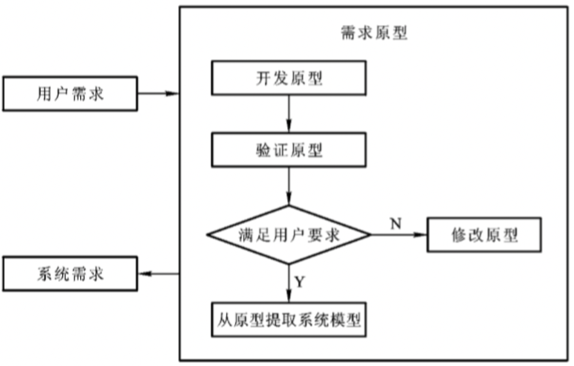

## 需求有效性验证

需求有效性验证是指对已经产生的需求结论所要进行的检查与评价，它是软件设计，实现的基础，同时也是用户对软件产品进行确认的基本依据。

### 需求验证内容

1. 有效性验证：用于确认每一项需求定义都能符合用户的实际需要；
2. 一致性验证：用于检查发现在需求文档中可能存在的需求冲突；
3. 完整性验证：用于检查发现用户确实需要的，但没有写入需求文档中一些功能，约束等；
4. 现实性验证：用于检查需求文档中所提出的功能，性能，安全等方面的需求；
5. 可检验性验证：用于判断需求文档中的各项需求是否有适合于用户操作的检测方法；

### 需求验证方法

1. 需求评审

   需求评审是传统的需求检查手段，采用专门评审小组的方式实施对需求文档的有效性评价；软件评审需要对以下问题进行专门的检查与评价：

   - 一致性
   - 完整性
   - 可检验性
   - 可读性
   - 可跟踪性
   - 可调节性

2. 需求原型评价

   需求原型主要用来提供给用户评价，以方便用户进行需求确认，还有利于发现用户的一些潜在需求；需求原型可以是进化型原型，若要使需求原型能够进化则一般需要满足以下条件：

   - 原型创建工具和目标系统创建工具应该尽量一致，以方便从原型到目标系统的无缝过渡。
   - 原型创建时必须考虑到软件的健壮性，可靠性，可维护性，以及工作性能等技术性要素，以保证原型质量标准和目标系统质量标准是一致的。

3. 基于CASE工具的需求一致性分析

   如果需求文档中的需求元素是用结构化或形式化语言描述的，则可以使用需求CASE工具来进行需求一致性分析，需求CASE工具的工作流程如下：
   
   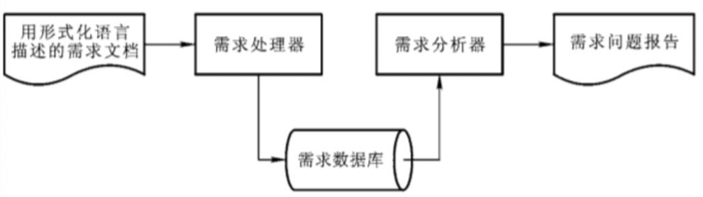
   
   

## 需求管理

### 控制变更

变更管理过程包括以下阶段：

- 变更描述：始于一个被识别的需求问题或一份明确的变更提议；
- 变更分析：评估被提议的变更产生的影响；
- 变更实现：执行变更，需求文档，系统设计和实现都要修改；

变更请求表：

### 版本控制

TODO

### 跟踪需求

TODO

### 跟踪状态

TODO

## 参考

## 文献

[1] SoftwareRequirementsAnalysisDocument

### 外链

- [软件工程之软件需求分析](https://www.cnblogs.com/youcong/p/9500873.html)
- [实战出真知：2步搭建用户画像，1步需求分析](http://www.woshipm.com/pd/4747222.html)
- [软件项目需求管理](http://www.51testing.com/html/31/n-845431-3.html)

