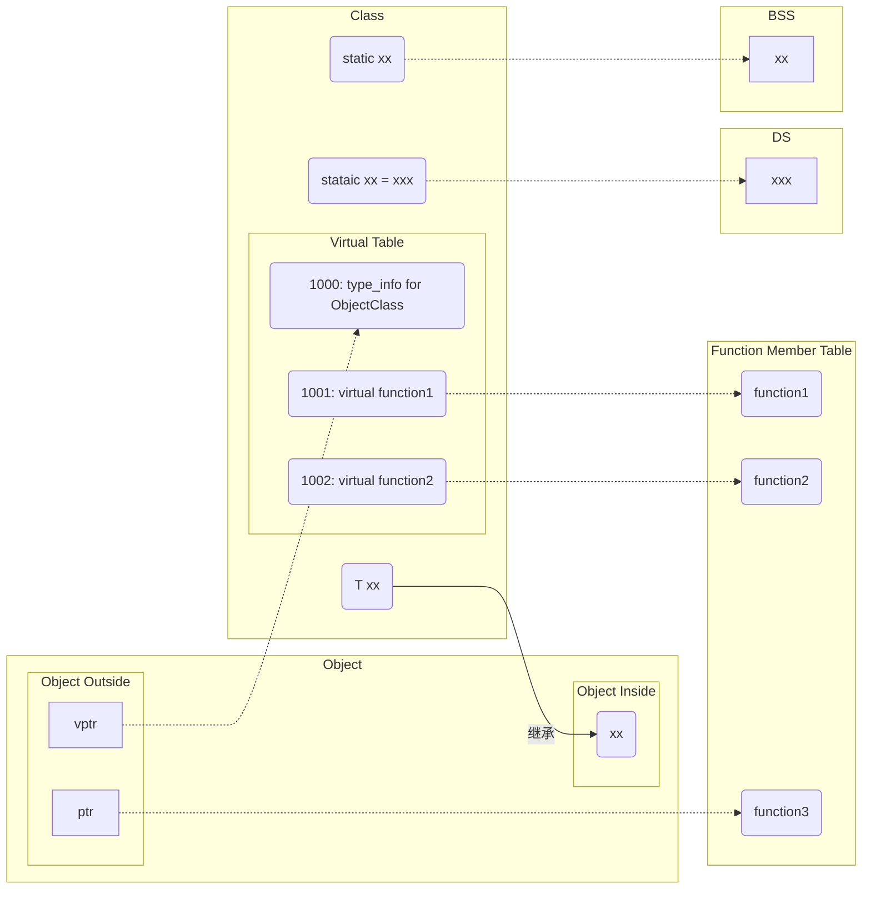

# C++对象

[TOC]

## 对象模型



- `type_info for ObjectClass` Class的类型，必定位于虚表的第一个索引，用来支持RTTI(Runtime Type Identification)；
- `class type` 一个字符串或者数字来表示class的类型；
- `BSS` (Block Start By Symbol)；
- `DS` (Data Segment)；
- `Virtual Table` 虚函数表；

### 数据成员布局

1. 静态成员变量存储在`data segment`，与`class object`无关；

2. 非静态成员都是**直接存放在每一个class object中**，所以只有经过class object(或者`*this`)才能进行存取；

3. 对一个非静态成员变量的存取操作，编译器需要把class object的地址加上data member的偏移量(offset)，例：

   ```c++
   &origin._y = 0.0;
   &origin + (&Point::_y - 1) // &Point::_y = offset + 1
   ```

4. C++标准要求：较晚出现（声明的）member在class object中有较高的位置，不一定得连续排列；

5. 取一个`static member`的地址，会得到**指向该数据类型的指针，而不是指向class member的指针**;

6. 使用虚函数会增加以下额外负担：

   - 导入虚表，用来存放声明的每一个虚函数，再加上首位的一个slots(为了支持RTTI);
   - 每个class object导入一个vptr, 提供执行期的链接，使得每一个class object都能找到虚函数表;
   - 加强constructor，使之能够为vptr设定初值，让其指向虚表;
   - 加强destructor，使之能够抹掉指向虚表的指针。

7. 为了保持与C语言的兼容性，vptr通常放在class object的后段；

8. 每一个class都有且仅有一个virtual table(虚表)，内含虚函数的地址，每个Object都有一个vptr(虚表指针)指向虚表所在；例：`ptr->normalize()`在内部转换为`(*ptr->vptr[1])(ptr)`；

9. 虚函数表中函数的顺序是按照声明顺序来的；

### 非静态成员函数

编译器内部将成员函数转化为非成员函数，其转化流程如下：

1. 添加this指针作为函数的第一个参数

   如果成员函数是const，那么this指针的类型为:`const className* const`；并且对每一个`nonstatic data member`的存取改经由this指针来存取；

2. 函数名处理

   (name mangling)，按`函数名称+参数链表+参数类型`的形式进行重新编码命名，使其成为一个独一无二的名称；

3. NRV优化

   (Name Return Value)，如果有返回值的话，添加一个引用类型的参数来代替返回值；

例：

```c++
Point setPoint(const Point& point);
```

转化为：

```c++
void setPoint_crefpoint(const Point* this, const Point& point, Point& __result);
```

### 静态成员函数

静态成员**没有this指针**，拥有以下特性：

- 不能够直接存取class中的`nonstatic members`;
- 不能被声明为`const`, `volatile`, `virtual`;
- 不需要经由`class object`才被调用，可以直接经由`classname::`的方式调用。

如果取一个静态成员函数的地址，获取的地址类型是`"nonmember函数指针"`而非`"class member function指针"`;

例，静态函数转化：

```c++
static int Point3d::object_count() { return _object_count; }
```

转化为：

```C++
int object_count__5Point3dSFV() { return _object_count_5Point3dSFV; }
```

例，获取静态成员函数地址：

```c++
&Point3d::object_count();
```

得到的类型是：

```c++
int(*)();
// 不是 int(Point3d::*)();
```

### 虚成员函数

1. 对一个虚成员函数取地址，所能获得的只是一个索引值；

   ```c++
   class Point {
   public:
       virtual ~Point();
       float x();
       float y();
       virtual float z();
   }
   
   &Point::~Point(); // 得到索引1
   &Point::z();      // 得到索引2
   &Point::x();      // 得到函数在内存中的地址
   
   // 通过函数指针调用z()
   float (Point::*pmf)() = &Point::z();
   Point* ptr;
   (ptr->*pmg)(); // 内部转换为 (*ptr->vptr[(int)pmf])(ptr);
   ```

### 内联函数

**内联函数只是建议请求编译器实行，真正决定内联还是看编译器本身；**通常编译器会计算`assignments`, `function calls`, `virtual function calls`等操作的次数的总和来决定是否内联。

一般处理`inline function`的两个阶段：

- 分析函数定义，以决定函数的`"instrinsic inline ability"`(本质的能力)；
- 真正的inline函数扩展操作是在调用的那点上。

内联函数对形式参数(Formal Arguments)的扩展，例：

```c++
inline int min(int i, int j) { return i < j ? i : j; }
inline int bar() {
    int minval;
    int val1 = 1024;
    int val2 = 2048;
    minval = min(val1, val2);     // 转化为 minval = val1 < val2 ? val1 : val2;
    minval = min(1024, 2048);     // 转化为 minval = 1024;
    minval = min(foo(), bar()+1); // 转化为 int t1,t2; minval = (t1=foo()), (t2=bar()+1), t1<t2?t1:t2;
    return minval;
}
```

内联函数对局部变量(Local Variables)的扩展，例：

```c++
inline int min(int i, int j) {
    int minval = i < j ? i : j;
    return minval;
}
inline int bar() {
    int minval;
    int val1 = 1024;
    int val2 = 2048;
    minval = min(val1, val2);     // 转化为
                                  // int __min_lv_minval;
                                  // int minval = (__min_lv_minval = val1 < val2 ? val1 : val2), __min_lv_minval);
  
    return minval;
}
```

**如果一个inline函数参数带有副作用或者进行多重调用或者函数内部有多个局部变量，这样都会产生临时对象，产生大量的扩展代码，使得程序大小爆增；**例：

```c++
int minval = min(val1, val2) + min(foo(), foo() + 1);
```

扩展为：

```c++
// 为局部变量产生的临时对象
int __min_lv_minval_00, __min_lv_minval_01;
// 为放置副作用产生的临时变量
int t1, t2;
int minval = (__min_lv_minval_00 = val1 < val2 ? val1 : val2),
        __min_lv_minval_00)
        +
        ((__min_lv_minval_01=(t1=foo()), (t2=bar()+1),
        t1<t2?t1:t2),__min_lv_minval_00);
```

### 对象空间大小

`class object`的内存大小计算公式为：$N + P + V$

- N `nonstatic data members`的内存大小；
- P  为内存对齐(alignment，将数值调整到某数的倍数；在32位计算机上，通常alignment为4bytes(32位)，以使`bus`的“运输量”达到最高效率)而填充的空间；
- V  为支持`virtual`而由内部产生的任何额外负担(`overhead`)。

一个空类的大小通常为1，是因为编译器为其安插了一个char，以便这个类的任意两个object能够在内存中配置独一无二的地址。

例：

```c++
class ZooAnimal {
public:
    ZooAnimal();
    virtual ~ZooAnimal();
    // ...
    virtual void rotate();

protected:
    int loc;
    String name;
};

class Bear : public ZooAnimal {
public:
    Bear();
    ~Bear();
    // ...
    void rotate();
    virtual void dance();
    // ...
protected:
    enum Dances { ... };

    Dances dances_known;
    int cell_block;
};

Bear b( "Yogi" );
Bear *pb = &b;
Bear &rb = *pb;
```


## 构造与析构

### new和delete运算符

1. **操作符new的过程就是：先配置内存，再调用构造函数（内置类型直接赋值）。（如果配置内存失败，内存还是需要释放的）**
2. **操作符delete的过程就是：先调用析构函数（内置类型没有这一步），再释放内存（）。**

例，new操作：

```c++
Point3d *origin = new Point3d;
```

可以拆分为以下步骤：

```c++
Point3d *origin;
if(origin = __new(sizeof(Point3d)))
    try {
        origin->Point3d::Point3d(origin);
    }
    catch(...) {
        __delete(origin)
        throw;
    }
}
```

例，delete操作：

```c++
delete origin;
```

可以拆分为以下步骤：

```c++
if(origin != 0) {
    Point3d::~Point3d(origin);
    __delete(origin);
}
```

### placement new

Placement Operator new是一个预先定义好的重载的new运算符，原型如下：

```c++
void* operator new(size_t, void* p) { return p; }
```

例：

```c++
Point2w* ptw2 = new(arena) Point2w;
```

可以转化为：

```c++
Point2w* ptw2 = (Point2w*) arena;
ptw2->~Point2w();
if(ptw2 != 0) ptw2->Point2w::Point2w();
```

一般而言，Placement Operator new不支持多态，如果derived class比base class大的多，那么derived class的构造函数将会导致严重的破坏；

### 默认构造函数

1. 任何类如果没有定义默认的构造函数，编译器**不一定**会合成默认构造函数，只有当它认为你需要时，才给你合成；
2. 编译器合成出来的默认构造函数**不一定**会显式设置每一个数据成员的默认值；

以下为需要合成默认构造函数的情况：

1. 类成员中有成员是类对象，并且该成员的类含有默认构造函数；

   ```c++
   class Foo { public: Foo(), Foo( int ) ... };
   class Bar { public: Foo foo; char *str; };
   void foo_bar()
   {
       Bar bar; // Bar::foo必须在此处初始化
       if (str) {}
       ...
   }
   ```
   
2. 基类带有默认构造函数；

   ```c++
   TODO
   ```

3. 带有虚函数的类；

   ```c++
   class Widget {
   public:
       virtual void flip() = 0;
       ...
   };
   void flip( const Widget& widget ) { widget.flip(); }
   class Bell : public Widget{};
   class Whistle : public Widget{};
   void foo()
   {
       Bell b;
       Whistle w;
       flip( b );
       flip( w );
   }
   ```

4. 存在虚基类(有直接虚拟基类或继承链上有虚基类)；

   ```c++
   class X { public: int i; }
   class A : public virtual X { public: int j; };
   class B : public virtual X { public: double d; };
   class C : public A, public B { public: int k; };
   void foo( const A* pa ) { pa->i = 1024; }
   main()
   {
       foo( new A );
       foo( new C );
   }
   ```

### 复制构造函数

以下情况会出现默认构造函数：

1. 显式对对象进行初始化;
2. 当对象被当作参数交给某个函数;
3. 当函数返回一个非引用的类对象;

如果一个类没有提供任何的复制构造函数，那么该类内部以默认成员逐一初始化(default memberwise initialization)的方法来复制构造；

有以下几种情况不展现位逐次拷贝(bitwise copy semantics)：

1. 类中含有成员类对象，并且此类对象含有默认构造函数;
2. 基类带有拷贝构造函数;
3. 类中存在虚函数;
4. 存在虚基类（有直接虚拟基类或继承链上有虚基类）。

### 默认构造函数参数

如如果一个类的构造函数有一个或一个以上的默认参数值，例：

```c++
class complex {
    complex(double = 0.0, double = 0.0);
}
```

那么当我们写下`complex array[10];`时，编译器最终需要调用：

```c++
vec_nex(&array, sizeof(complex), 10, &complex::complex, 0);
```

### 成员初始化列表

以下几种情况必须使用成员初始化列表(initialization list)：

1. 当初始化一个`reference member`时；
2. 当初始化一个`const member`时；
3. 当调用一个base class的`constructor`，而它拥有一组参数时；
4. 当调用一个member class的`constructor`，而它拥有一组参数时。

**注意：list中的项目顺序是由class中的members声明顺序决定的，不是由`initialization list`中的排序顺序决定的。**

### 内存对齐

TODO

### 继承

派生类和基类的类型转换关系：


例，多重继承的内存布局如下：

```c++
class Base1 {
public:
    Base1();
    virtual ~Base1();
    virtual void speakClearly();
    virtual Base1 *clone() const;
protected:
    float data_Base1;
};

class Base2 {
public:
    Base2();
    virtual ~Base2();
    virtual void mumble();
    virtual Base2 *clone() const;
protected:
    float data_Base2;
};

class Derived : public Base1, public Base2 {
public:
    Derived();
    virtual ~Derived();
    virtual Derived *clone() const;
protected:
    float data_Derived;
};
```


例，虚继承的内存布局如下：

```c++
class Point2d {
public:
    Point2d(float x = 0.0, float y = 0.0);
    virtual ~Point2d();
    virtual void mumble();
    virtual float z();
protected:
    float _x, _y;
};

class Point3d : public virtual Point2d {
public:
    Point3d(float x = 0.0, float y = 0.0, float z = 0.0);
    ~Point3d();
    float z();
protected:
    float _z;
}
```


### 多态

c++以下列方法支持多态：

1. 经由一组隐式的转化操作；
2. 经由`virtual function`机制；
3. 经由`dynamic_cast`和`typeid`运算符。


## 类型转换

### 类型强制转换函数

| 类型强制转换函数 | 说明                                                         | 用途                                                         |
| ---------------- | ------------------------------------------------------------ | ------------------------------------------------------------ |
| static_cast      | 静态转换，用于各种隐式转化；在编译期间处理，无运行时类型检查来保证安全性 | + 基类与子类的指针或引用的上行转换(安全)和下行转换(不安全)<br>+ 基本数据类型之间的转换<br>+ 空指针转换为目标类型的空指针<br>+ 任何类型的表达式转化成void类型 |
| dynamic_cast     | 动态转换，只能用于含有虚函数的类；在运行期处理，带类型检查   | + 基类与子类的指针或引用的上行转换(安全)和下行转换(安全，带类型检查功能)<br>+ 交叉转换(`B:A, D:A; dynamic_cast<D>(B)`) |
| reinterpret_cast |                                                              | + 指针与整数之间的转换                                       |
| const_cast       | 修改`const`和`volatile`属性                                  | + 常量指针转非常量指针<br>+ 常量引用转非常量引用             |

### 函数转换效率

1. 对于`nonmember`, `static member`, `nonstatic member`函数都是转化为一样的形式，所以三者的效率完全一样；
2. inline函数经过优化后效率由了极大地提升；


## 模版

TODO


## 其它

### NRV优化

编译器NRV(Named Return Value)优化：将按值返回函数转化为按引用返回的函数；

例：

```c++
X bar()
{
    X xx;
    // ...处理xx
    return xx;
}
```

转化为

```c++
void
bar( X &__result )
{
    // default constructor被调用
    // c++伪代码
    __result.X::X();
    // ...直接处理 __result
    return;
}
```

### 临时对象

临时对象的销毁操作位于，**对完整表达式（full-expression）求值过程中的最后一个步骤**；但是以下情况例外：

1. 凡事有表达式执行结果的临时性对象，应该保存到object的初始化操作完成为止；

   ```c++
   string proNameVersion = !verbose ? 0 : proName + progVersion;
   // 产生的临时对象本应该在 ?: 表达式求值之后立即销毁，但是 proNameVersion 初始化需要用到该临时对象，因此应该保存到object的初始化操作完成为止
   ```

2. 如果**一个临时性对象绑定于一个reference**，对象将残留，直到被初始化之reference的生命结束；

### RTTI

TODO


## 总结

1. new函数：先分配内存，再调用构造函数；delete函数：先调用析构函数，再释放内存；
2. 只有`nonstatic data member`是在object内部的，其他的都在外面
3. 每个类只要声明了`virtual function`就会存在一个虚表（多重继承和虚继承可能会有多个虚表），虚表保存了这个类`virtual function`的地址，这个类的每一个对象都有一个指向该虚表的指针(vptr)，vptr在`constructor`时被赋值。**每个声明virtual function的类都有一个虚表，它的每个实例都有一个指向虚表的指针**
4. 继承关系也可以被指定为`virtual`（共享），例：`class istream : virtual public ios { ... };`；在此情况下，基类不管在继承链中被派生多少次，它都永远只存在一个实例。
5. 虚拟继承会影响效率。
6. 一个`class object`的内存大小 = `nonstatic data member`的大小总和 + 由于`alignment`而填充的空间 + `virtual`产生的额外负担。
7. `cast`无法改变一个指针所指向的真正地址，只影响该地址的“解释方式”。
8. 用`base class object`给`drived class object`赋值，初始化或用类型转换将`base class`转化为`drived class`都是**非法的**；
9. 用`drived class object`给`base class object`赋值，初始化或用类型转换将`drived class object`转化为`base class object`是**可以的**；但是会发生切割。
10. `base class object pointer`**可以**指向`drived class object`；`drived class object point`**不可以**指向`base class object`，这是实现多态的基础条件。
11. 使用**类型转化**将`drived class object`转化为`base class object`**不会发生切割**；
12. explicit能够防止"单一参数的`constructor`"被当做一个`conversion`运算符。
13. 在编译器生成默认构造函数时，**不会**初始化类中的其他成员。
14. 一个`empty class object`的大小不为0，编译器会为其安插一个`char`，用来给这个类的任意两个`object`能够在内存中配置一个独一无二的地址；如果有`virtual function`，还会添加一个vptr来指向`virtual table`；
15. 一般越晚声明的`member`就在`class object`中越后（高）的位置，为了兼容c，`vptr`一般放在`class object`的后面。
16. `static member`放在`data segment`而**不在**`class object`中。
17. `virtual destructor`的作用是将基类的析构函数作为共享，防止内存泄漏。**不要把`virtual destructor`声明为`pure virtual destructor`。**
18. 在以下3种情况，编译器会调用复制构造函数：
    - 一个对象以值传递的方式传入函数体
    
    - 一个对象以值传递的方式从函数返回
    
    - 一个对象需要通过另一个对象进行初始化
    
19. `protected`继承会将`public`的member转化为`protected`

2. `private`继承会将public和protected的member转化为private
3. 面向对象的三大特征：多态(Polymorphism), 封装(Encapsulation)和继承(Inheritance)
4. 多态：同一操作作用于不同的对象，产生不同的结果。有以下分类：
   	- 编译时多态（重载）
   	- 运行时多态（虚函数）


## 参考

### 文献

TODO

### 外链

TODO
