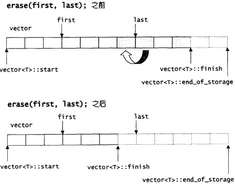
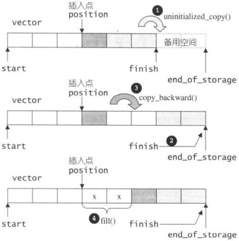
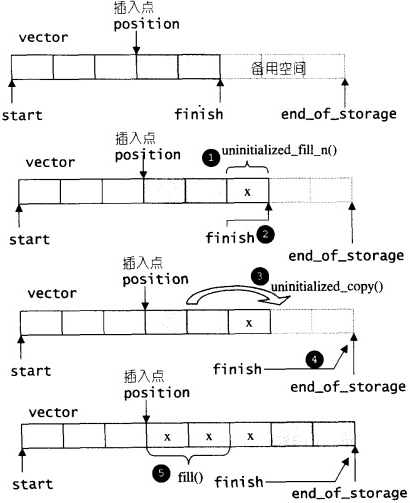
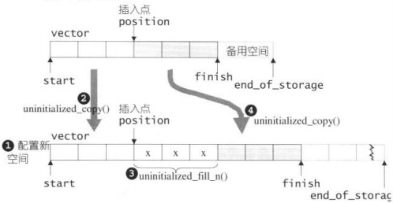
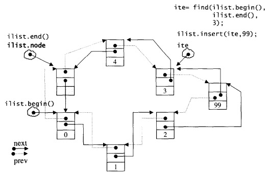
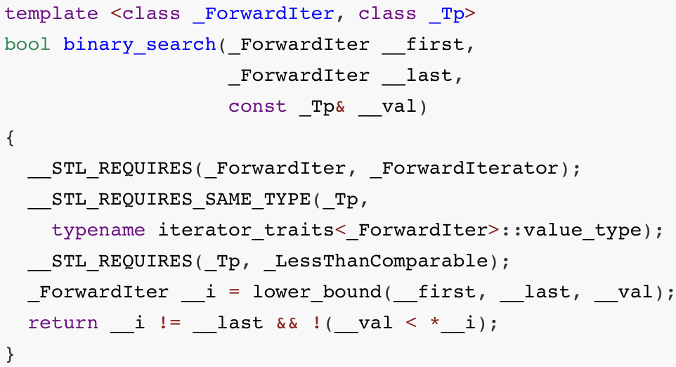
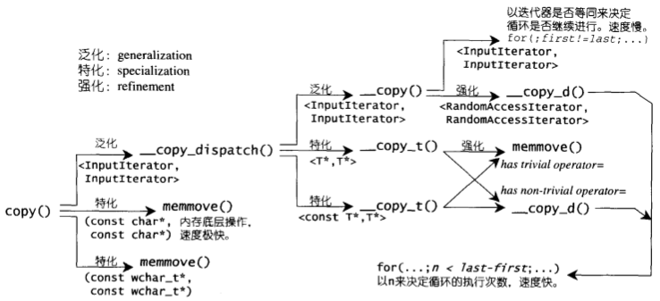
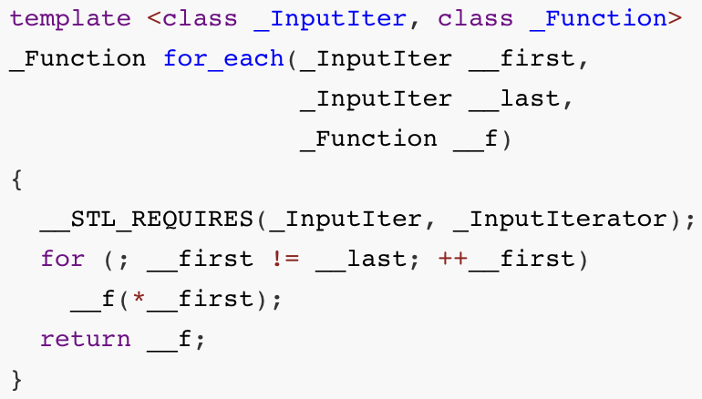

# STL

[TOC]


## vector

```c++
template <class _Tp, class _Alloc>
class _Vector_base {
...
protected:
  _Tp* _M_start;          // 头指针
  _Tp* _M_finish;					// 尾指针
  _Tp* _M_end_of_storage; // 分配的存储空间的尾部
}
```

### API

|函数|描述|示意图/代码|
|:--|:--|---|
|assign |对vector中的元素赋值 | |
|at |返回指定位置的元素 | |
|back |返回最后一个元素 | |
|begin |返回第一个元素的迭代器 | |
|capacity |返回vector所能容纳的元素数量(再不重新分配内存的情况下) | |
|clear |清空所有元素 | |
|empty |判断vector是否为空 | |
|end |返回最后一个元素的迭代器,此迭代器指向最后一个元素的下一个位置 | |
|erase |删除指定范围内的元素 | |
|front |返回第一个元素的引用 | |
|get_allocator |返回vector的内存分配器 | |
|insert |插入元素 |- `备用空间>新增元素个数`<br>+ `插入点后方元素个数>新增元素个数`<br>+ `插入点后方元素个数 ≤ 新增元素个数`<br>- `备用空间 < 新增元素个数` |
|max_size |返回vector所能容纳元素的最大数量(上限) | |
|pop_back |移除尾部元素 | |
|push_back |在尾部添加元素 | |
|rbegin |返回vector尾部的逆迭代器 | |
|rend |返回vector起始的逆迭代器 | |
|reserve |设置vector最小的元素容纳数量，为当前vector预留至少size个元素的空间 | |
|resize |改变vector元素数量的大小 | |
|size |返回vector元素数量的大小 | |
|swap |交换两个vector | |

### 适用场景

- 随机访问的情况，不适宜插入，删除等操作频繁的操作。

---


## list

```c++
// 双向链表节点
struct _List_node_base {
  _List_node_base* _M_next; // 指向下个节点
  _List_node_base* _M_prev;	// 指向上个节点
};
// list节点
template <class _Tp>
struct _List_node : public _List_node_base {
  _Tp _M_data;	// 节点存储的值
}
// list 基类
template <class _Tp, class _Alloc>
class _List_base
{
...
protected:
  // 只要一个指针，便可表示整个环状双向链表，空白节点  
  _List_node<_Tp>* _M_node;	
}
```

STL list是一个环状双向链表(double linked-list), 插入(insert)和拼接(splice)都不会造成原有list迭代器失效。

### API

|函数|描述|示意图/代码|
|:--|:--|---|
|assign |给list赋值 | |
|back |返回最后一个元素的引用 | |
|begin |返回指向第一个元素的迭代器 | |
|clear |清空链表 | |
|empty |如果list是空的则返回true | |
|end |返回末尾的迭代器 | |
|erase |删除迭代器所指向的节点 | |
|front |返回第一个元素的引用 | |
|get_allocator |返回list的配置器 | |
|insert |插入一个元素 | |
|max_size |返回list能容纳的最大元素数量 | |
|merge |合并 | |
|pop_back |移除尾节点 | |
|pop_front |移除头节点 | |
|push_back |插入一个元素，作为尾节点 | |
|push_front |插入一个元素，作为头节点 | |
|rbegin |返回指向第一个元素的逆向迭代器 | |
|remove |删除所有与指定值相等的元素 | |
|remove_if |按指定条件删除元素 | |
|rend |指向list末尾的逆向迭代器 | |
|resize |改变list的大小 | |
|reverse |翻转 | |
|size |返回list中的元素个数 | |
|sort |使用list自己的sort算法排序（STL的sort算法只接受`RamdonAccessIterator`） | |
|splice |拆分 | |
|swap |交换2个list | |
|unique |移除数值相同的连续元素，保持每个元素的唯一性 | |

---


## deque

```c++
// deque迭代器
template <class _Tp, class _Ref, class _Ptr>
struct _Deque_iterator {
  typedef _Tp** _Map_pointer;

  _Tp* _M_curr;         // 指向节点的当前元素
  _Tp* _M_first;        // 指向节点的头
  _Tp* _M_last;         // 指向节点的尾部（含备用空间）
  _Map_pointer _M_node; // 指向所在的map
  ...
};

template <class _Tp, class _Alloc>
class _Deque_base {
...
protected:
  _Tp** _M_map;	        // map
  size_t _Map_map_size; // map的节点数量大小
  iterator _M_start;    // 指向第一个缓冲区的第一个元素
  iterator _M_finish;   // 指向最后一个缓冲区的最后一个元素
  ...
};
```

### API

|函数|描述|示意图/代码|
|:--|:--|---|
|assign |设置双向队列的值 | |
|at |返回指定的元素 | |
|back |返回最后一个元素 | |
|begin |返回指向第一个元素的迭代器 | |
|clear |删除所有元素 | |
|empty |双向队列是否为空 | |
|end |返回指向尾部的迭代器 | |
|erase |删除指定范围的元素 | |
|front |返回第一个元素的引用 | |
|get_allocator |返回配置器 | |
|insert |插入元素 | |
|max_size |返回双向队列能容纳的最大元素个数 | |
|pop_back |移除尾部的元素 | |
|pop_front |移除头部的元素 | |
|push_back |在尾部加入元素 | |
|push_front |在头部加入元素 | |
|rbegin |返回指向尾部的逆向迭代器 | |
|rend |返回指向头部的逆向迭代器 | |
|resize |改变双向队列的大小 | |
|size |返回双向队列中元素的个数 | |
|swap |和另一个双向队列交换元素 | |

### 适用场景

- 对vector的插入和删除功能的补充。
- 不建议使用。


## set & multiset

set & multiset底层机制为RB-tree。

```c++
// RB-tree节点
struct _Rb_tree_node_base
{  
  ...
  _Color_type _M_color;	// 节点颜色，非红即黑
  _Base_ptr _M_parent;	// 父节点
  _Base_ptr _M_left;	  // 左节点（小）
  _Base_ptr _M_right;	  // 右节点（大）
};

// RB-tree迭代器
struct _Rb_tree_base_iterator
{
  ...
  typedef _Rb_tree_node_base::_Base_ptr _Base_ptr;
  _Base_ptr _M_node;
}

// RB-tree
template <class _Value>
struct _Rb_tree_node : public _Rb_tree_node_base
{
  _Value _M_value_field;					// 节点的值
};

template <class _Tp, class _Alloc>
struct _Rb_tree_base
{
protected:
  _Rb_tree_node<_Tp>* _M_header; 	// 头节点
  ...
}

template <class _Key, class _Value, class _KeyOfValue, class _Compare, class _Alloc = __STL_DEFAULT_ALLOCATOR(_Value) >
class _Rb_tree : protected _Rb_tree_base<_Value, _Alloc> {
protected:
  size_type _M_node_count; // 节点数量
  _Compare _M_key_compare; // 节点的键值比较函数
  ...
}
```

### API

|函数|描述|
|:--|:--|
|begin |返回指向第一个元素的迭代器 |
|clear |清除所有元素 |
|count |返回某个值元素的个数 |
|empty |如果集合为空，返回true |
|end |返回指向最后一个元素的迭代器 |
|equal_range |返回第一个>=关键字的迭代器和>关键字的迭代器 |
|erase |删除集合中的元素 |
|find |返回一个指向被查找到元素的迭代器 |
|get_allocator |返回集合的分配器 |
|insert |插入元素 |
|lower_bound |返回指向大于或等于某个值的第一个元素的迭代器 |
|key_comp |返回一个用于元素间比较的函数 |
|max_size |返回集合能容纳的元素的最大数 |
|rbegin |返回指向集合中最后一个元素的方向迭代器 |
|rend |返回指向集合中第一个元素有的反向迭代器 |
|size |集合中元素的数目 |
|swap |交换两个集合变量 |
|upper_bound |返回大于某个值元素的迭代器 |
|value_comp |返回一个用于比较元素间的值的函数 |

---


## map & multimap

map & multimap底层机制为RB-tree。

### API

|函数|描述|
|:--|:--|
|begin |返回指向map头部的迭代器 |
|clear |删除所有元素 |
|count |返回指定元素出现的次数 |
|empty |如果map为空则返回true |
|end |返回指向map末尾的迭代器 |
|equal_range |返回特殊条目的迭代器对 |
|erase |删除一个元素 |
|find |查找一个元素 |
|get_allocator |返回map的配置器 |
|insert |插入元素 |
|key_comp |返回比较元素key的函数 |
|lower_bound |返回键值>=给定元素的第一个位置 |
|max_size |返回可以容纳的最大元素个数 |
|rbegin |返回一个指向map尾部的逆向迭代器 |
|rend |返回一个指向map头部的逆向迭代器 |
|size |返回map中元素的个数 |
|swap |交换2个map |
|upper_bound |返回键值>给定元素的第一个位置 |
|value_comp |返回比较元素value的函数 |

---


## stack

### API

|函数|描述|
|:--|:--|
|empty |堆栈是否为空 |
|pop |移除栈顶元素 |
|push |在栈顶增加元素 |
|size |返回栈中元素数目 |
|top |返回栈顶元素 |

---


## queue

### API

|函数|描述|
|:--|:--|
|back |返回一个引用，指向最后一个元素 |
|empty |如果队列空则返回真 |
|front |返回第一个元素 |
|pop |删除第一个元素 |
|push |在末尾加入一个元素 |
|size |返回队列中元素的个数 |

---


## priority queues

### API

|函数|描述|
|:--|:--|
|empty |判断优先队列是否为空 |
|pop |删除第一个元素 |
|push |加入一个元素 |
|size |返回优先队列中拥有的元素个数 |
|top |返回优先队列中有最高优先级的元素 |

---


## 算法

|函数|描述|示意图/代码|
|:--|:--|---|
|binary_search|在已排序的范围内中二分查找元素value。||
|copy|将输入区间`[first,last)`内的元素复制到输出区间`[result,result+(last-first))`内。||
|for_each |遍历并操作指定范围内的元素 | |
|find |在序列中找某个值的第一个出现 | |
|lower_bound |二分查找(binary search)的一种版本，应用于有序区间；他会返回一个迭代器，指向第一个“不小于value”的元素。如果value大于`[first,last)`内的任何一个元素，则返回last | |
|max |取两个对象中的较大值 | |
|min |取两个对象中的较小值 | |
|mismatch |用来平行比较两个序列，指出两者之间的第一个不匹配点，返回一对迭代器，分别指向两个序列中的不匹配点 | |
| merge          | 将两个有序的集合合并起来，放置于另一段空间                   |                    |
| random_shuffle | 将`[first,last)`的元素次序随机重排                           |                            |
|reverse |将序列`[first,last)`的元素在原容器中颠倒重排 | |
|remove |移除`[first,last)`之中所有与value相等的元素 | |
|replace |将`[first,last)`区间内的所有old_value都以new_value取代 | |
|rotate |将`[first,middle)`内的元素和`[middle,last)`内的元素互换。middle所指的元素会成为容器的一个元素 | |
|search |在序列一`[first1,last1)`所涵盖的区间中，查找序列二`[first2,last2)`的首次出现点。如果序列一内不存在与序列二完全匹配的子序列，便返回迭代器last1 | |
|sort |排序；数据量大时采用Quick Sort，分段式递归排序；数据量小于某个门槛时，为避免Quick Sort的递归调用带来过大的额外负担，就改用Insertion Sort；如果递归层次过深，还会改用Heap Sort。 | |
|unique |移除(remove)重复的元素，事实上unique并不会改变`[first,last)`的元素个数，有一些残余数据会留下来 | |
|upper_bound |二分查找(binary search)法的一个版本，“查找可插入value的最后一个合适位置” | |

---


## Chrono

### Duration

#### 类型

```c++
typedef duration<boost::int_least64_t, nano> nanoseconds;
typedef duration<boost::int_least64_t, micro> microseconds;
typedef duration<boost::int_least64_t, milli> milliseconds;
typedef duration<boost::int_least64_t       > seconds;
typedef duration< boost::int_least32_t, ratio<60> > minutes;
typedef duration< boost::int_least32_t, ratio<3600> > hours;
```

#### 类型转换

- `duration_cast` 转换不同类型的时间单位；例：

  ```c++
  seconds s(30);
  auto m = duration_cast<minutes>(s);
  ```
  
- `floor` 与duration_cast相同，取下界，做截断处理；例:

  ```c++
  seconds s(3600 + 50);
  audo m = floor<minutes>(s);
  ```
  
- `ceil` 与duration_cast相同，取下界，做截断处理；例:

  ```c++
  seconds s(3600 + 50);
  audo m = ceil<minutes>(s);
  ```
  
- `round` 四舍五入操作；例子：

  ```c++
  seconds s(3600 + 50);
  audo m = round<minutes>(s);
  ```

### Clock

- `system_clock` 如实反映计算机世界里的实际时间的时钟

- `steady_clock` 稳定的时钟，不会因为系统时间调整而变化

- `high_resolution_clock` 高分辨率的时钟，但通常是前2者的typedef

- `process_real_cpu_clock` 进程执行的实际时间

- `process_user_cpu_clock` 用户cpu时间

- `process_system_cpu_clock` 系统cpu时间

- `thread_clock` 线程执行的实际时间

### TimePoint

```c++
auto tp1 = system_clock::now();
cout << tp1 << endl;

auto d = tp1.time_since_epoch();            // 获取自时间起点以来的时间长度
cout << duration_cast<hours>(d) << endl;    // 转换为小时
cout << duration_cast<day>(d) << endl;      // 转换为自定义的天

auto tp2 = tp1 + minutes(1);
cout << tp1 << endl;
```


## 参考

[1] [C++参考手册](https://zh.cppreference.com/w/%e9%a6%96%e9%a1%b5)
