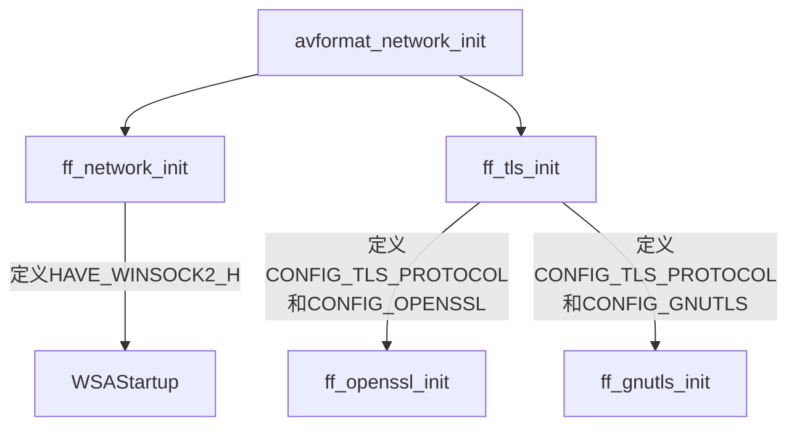

# FFmpeg源码分析-初始化系列函数

[TOC]

## avformat_network_init

- libavformat/utils.c
- libavformat/avformat.h

初始化网络

```mermaid
graph TD
A[avformat_network_init]-->B[ff_network_init]--定义HAVE_WINSOCK2_H-->B1[WSAStartup]
A[avformat_network_init]-->C[ff_tls_init]
C--定义CONFIG_TLS_PROTOCOL和CONFIG_OPENSSL-->C1.1[ff_openssl_init]
C--定义CONFIG_TLS_PROTOCOL和CONFIG_GNUTLS-->C1.2[ff_gnutls_init]

```

- ff_network_init: 初始化网络
- ff_tls_init: 初始化tls