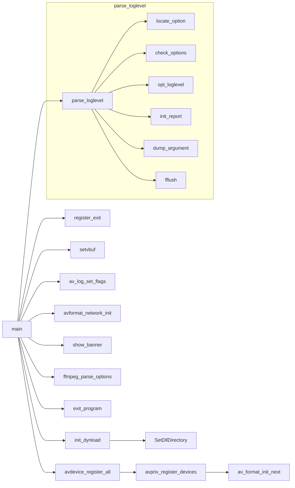

# FFmpeg源码分析-main函数

[TOC]

## main函数

- `fftools/ffmpeg.h`
- `fftools/ffmpeg.c`

- init_dynload: 初始化动态链接库加载地址

- resister_exit: 注册程序退出时的回调函数

- setvbuf: win32用到

- av_log_set_flags: 

- parse_loglevel: 

- av_format_init_next: 用链表存储注册的组件(编解码器...)

- avformat_network_init: 初始化网络

- show_banner: 打印ffmpeg的版本信息

- ffmpeg_parse_options: 解析输入选项

- exit_program: 调用前面resister_exit注册的程序退出时的回调函数

  

