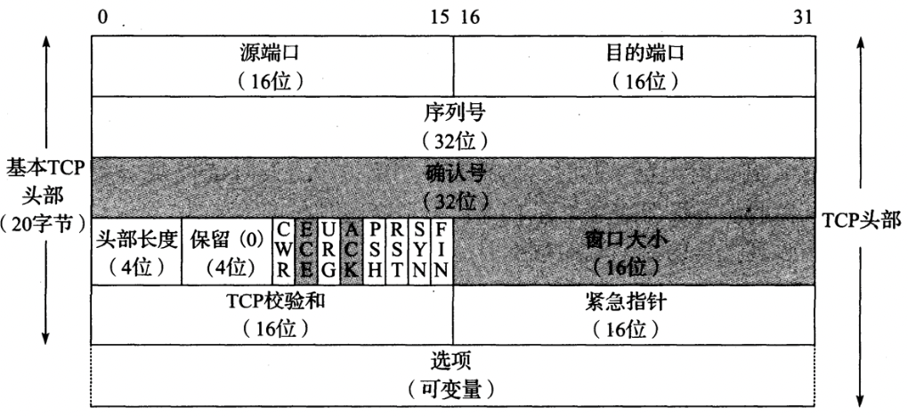
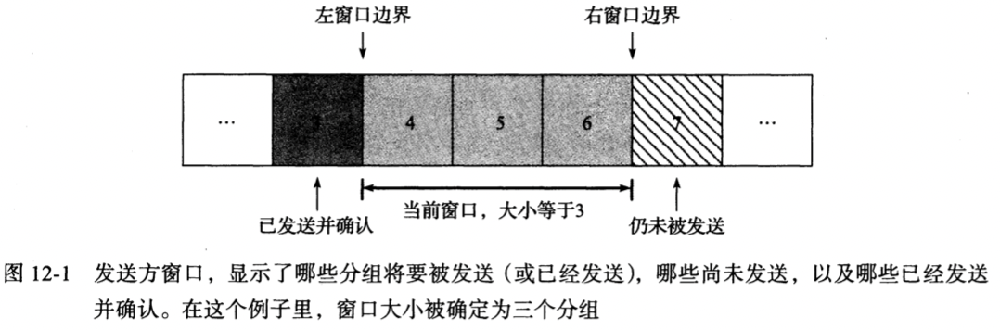
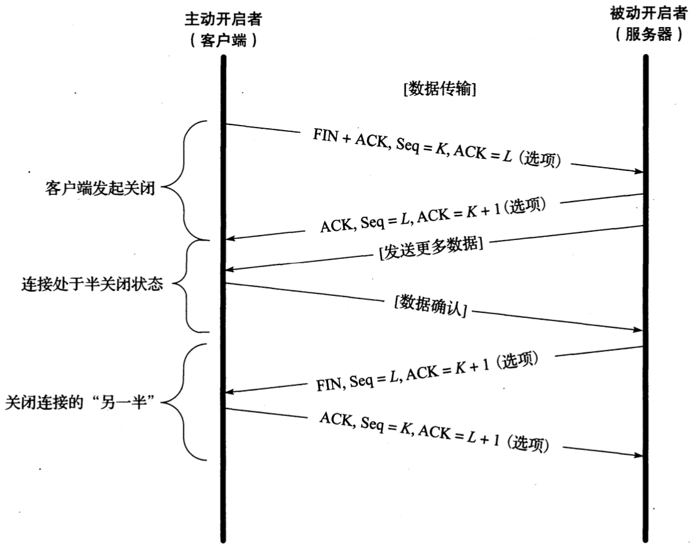
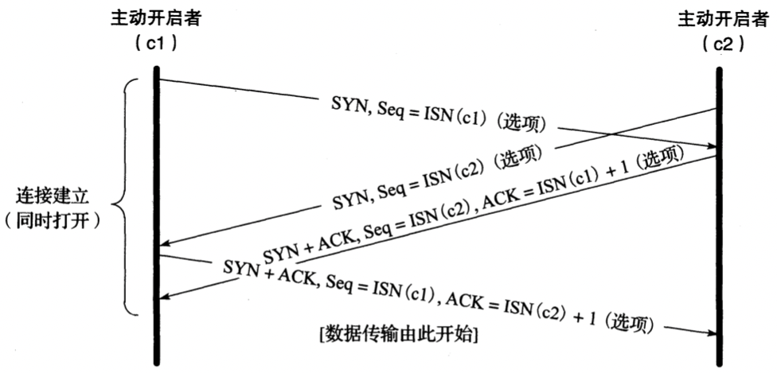
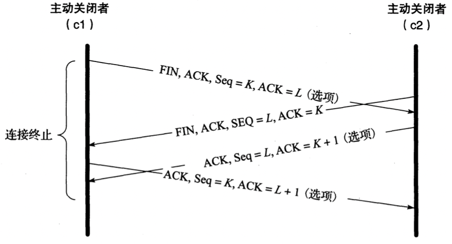
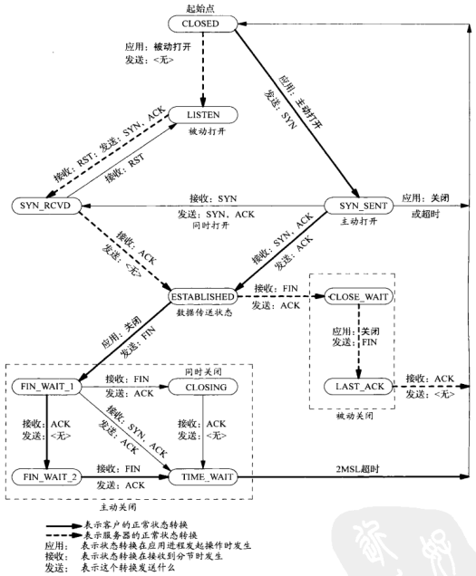

# TCP协议

[TOC]

## 术语

- ARQ(Automatic Repeat Request，自动重复请求)

- ACK(acknowledgment， 确认)

- RTT(round-trip-time estimation， 往返时间估计)

## 头部

- `源端口` 与IP头部中的源地址组合成一个端点(endpoint)，用于唯一标识发送方。

- `目的端口` 与IP头部中的目的地址组合成一个端点(endpoint)，用于唯一标识接收方。

- `序列号` Sequence Number，标识TCP发送端到TCP接收端的数据流的一个字节，该字节代表着包含该序列号的报文段的数据中的第一个字节。

- `确认号` Acknowledgment Number，发送方期待接收的下一个序列号。

- `头部长度` 定义了头部的长度，长度单位为字（32bit）；TCP头部被限制为60字节，不带选项的TCP头部大小为20字节。

- `保留字段`

- `CWR` 缩小拥塞窗口，发送方用来降低它的发送速率

- `ECE` ECN回显，发送方收到了一个更早的拥塞通告

- `URG` 紧急，让`紧急指针`生效，很少使用

- `ACK` 确认，让`确认号字段`生效，建立连接后启用

- `PSH` 推送

- `RST` 重置连接 

- `SYN` 初始化同步序号

- `FIN` 发送数据结束

- `窗口大小` 用来通告窗口大小（单位：字节数，最大65535字节），实现流量控制

- `TCP校验和` 强制性的，由发送方进行计算和保存，由接收方验证。

- `紧急指针` Urgent Pointer，只有当`URG`字段被设置时生效；

- `选项`(变长)

  | 种类 | 长度 | 名称           | 参考       | 描述与目的                       |
  | ---- | ---- | -------------- | ---------- | -------------------------------- |
  | 0    | 1    | EOL            | [RFC0793]  | 选项列表结束                     |
  | 1    | 1    | NOP            | [RFC0793]  | 无操作（用于填充）               |
  | 2    | 4    | MSS            | [RFC0793]  | 最大段大小                       |
  | 3    | 3    | WSOPT          | [RFC01323] | 窗口缩放因子（窗口左移量）       |
  | 4    | 2    | SACK-Permitted | [RFC02018] | 发送者支持SACK选项               |
  | 5    | 可变 | SACK           | [RFC02018] | SACK阻塞（接收到乱序数据）       |
  | 8    | 10   | TSOPT          | [RFC01323] | 时间戳选项                       |
  | 28   | 4    | UTO            | [RFC05482] | 用户超时（一段空闲时间后的终止） |
  | 29   | 可变 | TCP-AO         | [RFC05925] | 认证选项（使用多种算法）         |
  | 253  | 可变 | Experimental   | [RFC04727] | 保留供实验所用                   |
  | 254  | 可变 | Experimental   | [RFC04727] | 保留供实验所用                   |

  - MSS

    TCP协议所允许的从对方接收到的最大报文段，不包括TCP头部和IP头部。

  - SACK

    当收到乱序数据时，能提供一个SACK选项来描述这些乱序的数据，从而帮助对方有效的进行重传。

  - WSOPT

    该选项可以有效的改变TCP窗口数值，通过将窗口字段值左移来成比例的扩大窗口数值；窗口数值的扩大公式为：$65535 \times 2^{S}$​​​，其中S为比例因子，取值范围[0, 14]；窗口数值最大为$65536 \times 2^{14}$​，约等于1GB。

  - TSPOT

    时间戳选项要求发送方在每一个报文段中添加2个4字节的时间戳数值，接收方将会在确认中反映这些数值，允许发送方针对每一个接收到的ACK估算TCP连接的往返时间。

    防回绕序列号（Protection Against Wrapped Sequence numbers，PAWS），为接受者提供了避免接收旧报文段与判断报文段正确性的方法。

    TCP时间戳选项通过提供一个额外的32位有效序列号空间清除了具有相同序列号的报文段之间的二义性：

    | 时间 | 发送字节数 | 发送序列号 | 发送时间戳 | 接收                         |
    | ---- | ---------- | ---------- | ---------- | ---------------------------- |
    | A    | 0G:1G      | 0G:1G      | 1          | 完好                         |
    | B    | 1G:2G      | 1G:2G      | 2          | 完好，但一个报文段丢失并重传 |
    | C    | 2G:3G      | 2G:3G      | 3          | 完好                         |
    | D    | 3G:4G      | 3G:4G      | 4          | 完好                         |
    | E    | 4G:5G      | 0G:1G      | 5          | 完好                         |
    | F    | 5G:6G      | 1G:2G      | 6          | 完好，但重传的报文段重新出现 |

  - UTO

    该选项是一个相对较新的TCP的功能，用户超时数值（USER_TIMEOUT）指明了TCP发送者在确认对方未能成功接收数据之前愿意等待该数据ACK确认时间。USER_TIMEOUT的计算方法如下：

    `USER_TIMEOUT = min(U_LIMIT, max(ADV_UTO, REMOTE_UTO, L_LIMIT))`

    - `U_LIMIT` 本地系统对用户超时选项设定的数值**上边界**
    - `L_LIMIT` 本地系统对用户超时选项设定的数值**下边界**
    - `ADV_UTO` 本端告知远端通信方的用户超时选项数值
    - `REMOTE_UTO` 远端通信方告知的用户超时选项数值

  - TCP-AO

    (TCP Authentication Option，TCP-AO)，用于增强连接的安全性；使用一种加密散列算法以及TCP连接双方共同维护的一个秘密值来认证每一个报文段。

## 滑动窗口

## 连接的建立与终止

*一个普通TCP连接的建立与终止。通常，由客户端负责发起一个三次握手过程。在该过程中，客户端与服务器利用SYN报文段交换彼此的初始序列号（包括客户端的初始序列号和服务器的初始序列号）。在通信双方都发送了一个FIN数据包并收到来自对方的相应的确认数据包后，该连接终止*

### 半关闭

*在TCP半关闭操作中，连接的一个方向被关闭，而另一个方向仍在传输数据直到它被关闭为止；（很少有应用程序使用这一特性）*

### 同时打开与关闭

*在同时打开中交换的报文段。与正常的连接建立过程相比，需要增加一个报文段。数据报的SYN位将置位直到接收到一个ACK数据包为止*

*在同时关闭中交换的报文段。与正常关闭相似，指示报文段的顺序是交叉的*

## 状态转移

### TIME_WAIT状态

TIME_WAIT状态有2个存在的理由:

- 可靠地实现TCP全双工连接的终止；
- 允许老的重复分节在网络中消逝；

TIME_WAIT过多怎么处理？

### 时间等待错误

`时间等待错误（TIME-WAIT Assassination, TWA）` 如果在`TIME_WAIT`状态下接收到来自于这条连接的一些报文段，或是更加特殊的重置报文段，它将会被破坏；

## FIN_WAIT_2状态

TODO

## 参考

[1] Tcp/IP详解

