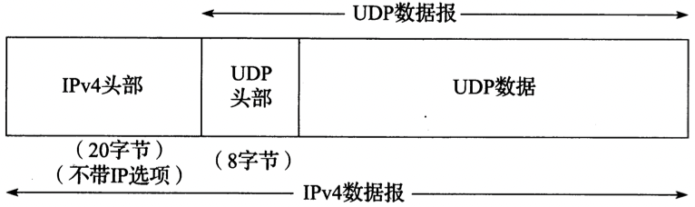
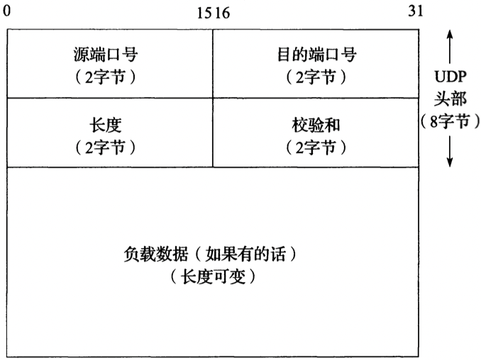
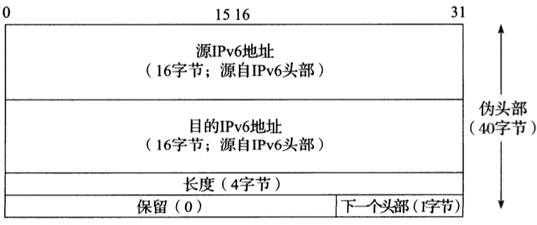
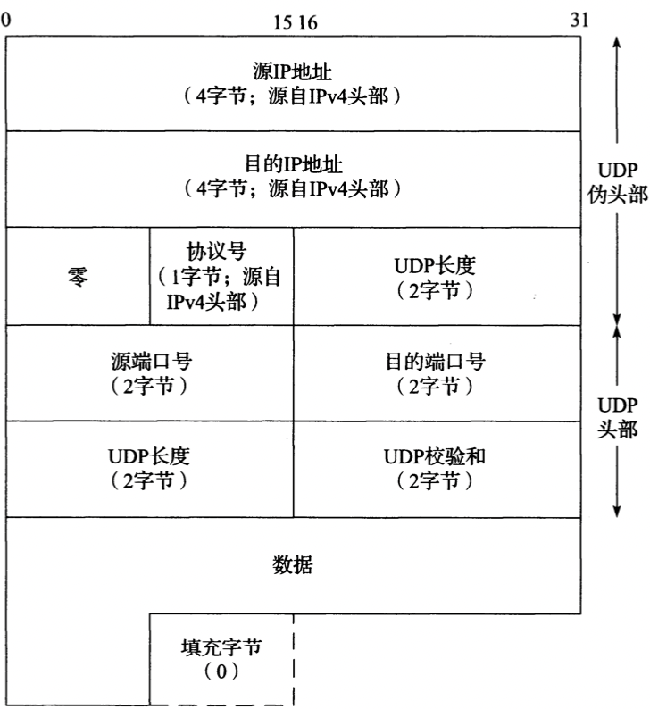

# UDP协议

[TOC]

## 数据报封装

### IPv4

### IPv6

TODO

## 头部

### IPv4

- `长度` 理论上数据报的最大长度为65535字节（8个字节给UDP头部）；

### IPv6

## 校验和

**注意：当一个UDP/IPV4数据报穿过一个NAT时，不仅IP层头部的校验和要被修改，而且UDP伪头部的校验和也必须被正确地修改，因为IP层的地址和`/`或UDP层的端口号可能会改变。**

## 参考

[1] [美] Kevin R. Fall, [美] W. Richard Stevens.Tcp/ip详解.3ED

