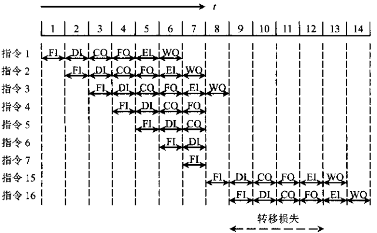
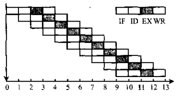
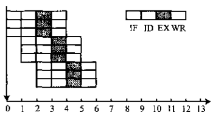
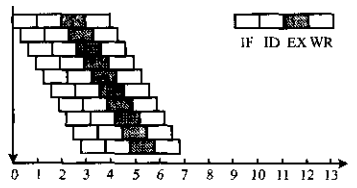
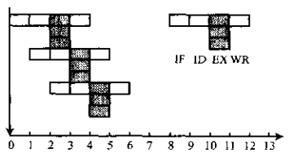

# 指令流水线模型

[TOC]

## 性能

三种对流水线工作的影响：

- `结构相关` 当指令在重叠执行过程中，不同指令争用同一功能部件产生资源冲突时产生。

- `数据相关` 流水线中各条指令因重叠操作，可能改变对操作数的读写访问顺序，从而导致数据相关冲突。

- `控制相关` 主要由转移指令引起，当转移发生时，将使流水线的连续流动收到破坏。

  

  *条件转移对指令流水操作的影响*

### 吞吐率（Throughput Rate）

`吞吐率` 单位时间内流水线所完成指令或输出结果的数量，吞吐率又有最大吞吐率和实际吞吐率之分。

`最大吞吐率` 流水线在连续流动达到稳定状态（流水线中各段都处于工作状态）后所获得的吞吐率；计算公式为：

$T_{pmax} = \frac{1}{\Delta t}$

- $m$ 流水段数量；
- $\Delta t$ 流水段平均执行时间；

`实际吞吐率` 流水线完成$n$条指令的实际吞吐率；计算公式为：

$T_p = \frac{n}{m \Delta t + (n - 1) \Delta t} = \frac{1}{\Delta t[1 + (m - 1) / n]} = \frac{T_{pmax}}{1 + (m - 1) / n}$

- $n$ 指令数量；
- $m$ 流水段数量；
- $\Delta t$ 流水段平均执行时间；

仅当$n \gg m$时，才会有$T_p \approx T_{pmax}$。

### 加速比（Speedup Ratio）

`加速比` $m$段流水线的速度与等功能的非流水线的速度之比。如果流水线各段时间均为$\Delta t$，则完成$n$条指令在$m$段流水线上共需$T = m \times \Delta t + (n - 1)\Delta t$时间。而在等效的非流水线上所需时间为$T' = nm\Delta t$。故加速比$S_p$为：

$S_p = \frac{nm\Delta t}{m\Delta t + (n - 1)\Delta t} = \frac{nm}{m + n - 1} = \frac{m}{1 + (m - 1)/n}$

可以看出，在$n \gg m$时，$S_p$接近于$m$，即当流水线各段时间相等时，其最大加速比等于流水线段数。

### 效率（Efficiency）

`效率` 流水线中各功能段的利用率，通常用流水线各段处于工作时间的时空区与流水线中各段总的时空区之比来衡量流水线的效率。用公式表示为：

$E = \frac{mn\Delta t}{m(m + n - 1)\Delta t} = \frac{n}{m + n - 1} = \frac{S_p}{m} = T_p\Delta t$

## 流水线多发技术

### 普通流水

`普通流水` 一个时钟周期出一个结果。

*普通流水示意图*

### 超标量流水

`超标量（Super Scalar）` 每个时钟周期内可同时并发多条独立指令，即以并行操作方式将两条或两条以上指令编译并执行。

*超标量流水示意图*

### 超流水线技术

`超流水线（Super pipe lining）技术` 将一些流水线寄存器插入到流水线段中，好比将流水线再分道。

*超流水线示意图。将原来的一个时钟周期分成三段，使超级流水线的处理器周期比一般流水线的处理器周期短，这样，在原来的时钟周期内，功能部件被使用三次，使流水线以3倍于原来时钟频率的速度运行。*

### 超长指令字技术

`超长指令字（VLIW）技术` 采用多条指令在多个处理部件中并行处理的体系结构，在一个时钟周期内能流出多条指令。

*超长指令字示意图*

## 参考

[1] 唐朔飞.计算机组成原理