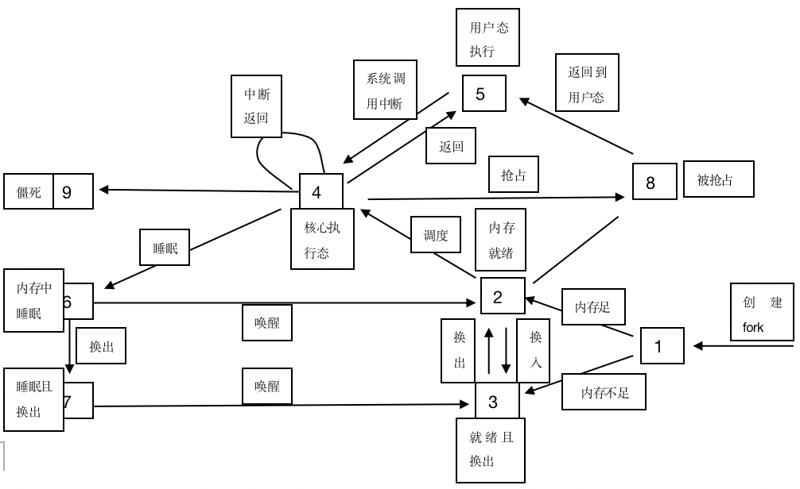

[TOC]
# 进程，线程和协程

## 进程

是系统进行资源分配和调度的一个独立单位，每个进程都有自己独立的内存空间，不同进程通过进程间通信来交流。比较heavy，上下文切换开销大，但是比线程稳定。

### 进程状态转移

## 线程

是进程的一个实体，是cpu调度和分派的基本单位；比进程轻，不拥有系统资源，只拥有一些必要的运行时资源（如程序计数器，寄存器和栈）；拥有函数的入口和返回，可以与同一个进程内的其他线程共享进程的所有资源；线程间通信主要通过共享内存，上下文切换开销小，但是不够稳定。

## 协程

**是一种用户态的轻量级线程**，调度完全由用户控制。拥有自己的寄存器上下文和栈。协程调度切换时，将寄存器上下文和栈保存到其他地方，在切换回来时，恢复前面的寄存器上下文和栈；上下文切换基本没有开销。

## 区别

| -    | 进程                                                         | 线程                                                 | 协程                                                         |
| ---- | ------------------------------------------------------------ | ---------------------------------------------------- | ------------------------------------------------------------ |
| 调度 | 独立运行                                                     | 作为调度和分配的基本单位，真正在处理机上运行的是线程 | 完全由用户自己控制                                           |
| 资源 | 拥有独立的资源                                               | 同一个进程中的所有线程智能共享进程资源               | 拥有自己的寄存器上下文和栈                                   |
| 开销 | 在创建或撤消进程时，由于系统都要为之分配和回收资源，导致进程切换开销大 | 切换开销小                                           | 协程能保留上一次调用时的状态，每次过程重入都会恢复上一次的状态，协程的开销非常小 |
| 并发 | 进程之间运行互不影响                                         | 线程共享进程的系统资源，健壮性差                     | 异步机制，在协程中控制共享资源不需要加锁，健壮性好           |

