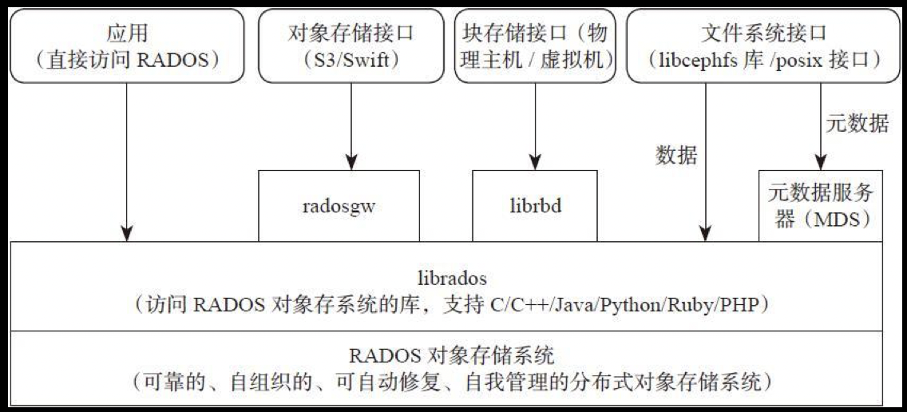
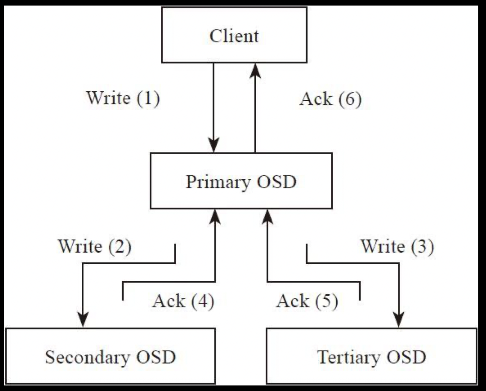

# ceph总结

## 基本架构

- RADOS(reliable, autonomous, distributed object store)对象存储系统
    一个可靠的，自组织的，可自动修复，自我管理的分布式对象存储系统。其内部包括ceph-osd后台服务进程和ceph-mon监控进程。
- librados库
    用于本地或者远程通过网络访问RADOS对象存储系统。
- 3种存储接口
    - 块存储接口
        通过librbd库提供了块存储了访问接口。它可以为虚拟机提供虚拟磁盘，或者通过内核映射为物理主机提供磁盘空间。
    - 对象存储接口
        RadosGW：与AWS的s3兼容，与OpenStack的Swift对象接口兼容;
    - 文件系统接口
        - 标准posix接口
        - libcephfs库提供的文件系统访问接口

## 对象存储

一个对象由以下部分组成：

- 对象标志（ID）,唯一标识一个对象。
- 对象的数据，其在本地文件系统中对应一个文件，对象的数据就保存在文件中。
- 对象的元数据，以key-value（键值对）的形式，可以保存在文件对应的扩展属性中。

### 存储池

- replicated类型
- Erasure Code类型

### 对象寻址过程

对象寻址过程指的是查找对象在集群中分布的位置信息，过程分为2步：

1. 对象到PG的映射。
2. PG到OSD列表映射。

## 数据读写过程

1. Client向该PG所在的主OSD发送写请求。
2. 主OSD接收到写请求后，同时向两个从OSD发送写副本的请求，并同时写入主OSD的本地存储中。
3. 主OSD接收到两个从OSD发送写成功的ACK应答，同时确认自己写成功，就像客户端返回写成功的ACK应答。

## 纠删码

将写入的数据分成N份原始数据块，通过这N份原始数据块计算出M份有效校验数据块，N+M份数据块可以分别保存在不同的设备或者节点中。可以允许最多M个数据块失效，通过N+M份中的任意N份数据，就还原出其他数据块。

