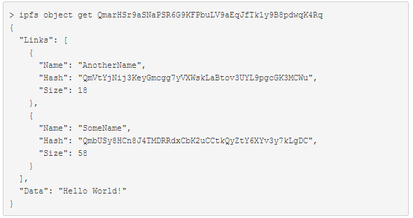

# merkle_dag

merkle data（有向无环图），是ipfs在Merkle tree的基础上开发的一个数据结构；支持：内容寻址，防篡改，防重复等功能。

## 源码

- [go-merkledag](https://github.com/hanjingo/go-merkledag/tree/he)
- [go-ipfs-blockstore](https://github.com/hanjingo/go-ipfs-blockstore)

## 结构定义

### ipfs对象定义

```go
// ipfs对象(对象可以是文件，也可以是目录)
type IpfsObject struct {
	Links []ObjectLink  // link集合
	Data  string		// 二进制数据，大小小于256kb
}

// ipfs对象引用
type ObjectLink struct {
	Name, Hash string // 对象名， hash
	Size       uint64 // 对象大小总和（所有子节点和自己的数据大小的和）
}
```

### block定义

```go
type Block interface { // block接口
	RawData() []byte
	Cid() cid.Cid
	String() string
	Loggable() map[string]interface{}
}
```

### Blockstore定义
定义了一个块存储接口，用来封装不同的缓存策略

```go

// 块存储器接口
type Blockstore interface {
	DeleteBlock(cid.Cid) error
	Has(cid.Cid) (bool, error)
	Get(cid.Cid) (blocks.Block, error)
	GetSize(cid.Cid) (int, error) // 返回cid指向的块的大小
	Put(blocks.Block) error
	PutMany([]blocks.Block) error
	AllKeysChan(ctx context.Context) (<-chan cid.Cid, error)
	HashOnRead(enabled bool)
}
```

### 协程追踪器

```go
// 协程追踪器，标识有多少个协程
type ProgressTracker struct { 
	Total int        // 协程数量
	lk    sync.Mutex // 互斥锁
}
```

### 基本数据存储器
存储了
```go
// ipfsObject的key
type Key struct {
	string
}

// ipfsObject数据容器,map结构
type MapDatastore struct {
	values map[Key][]byte // key:对象的唯一id, value:
}
```


## 内容寻址

每个父节点保存了子结点的一些信息（包含hash, name, size... ,具体见上面对于IpfsObject的定义），通过root节点，层层遍历下去，最终遍历到叶子，这样就可以把所有的节点和叶子遍历出来；而一旦某个叶子节点改变，就会造成root节点的改变。

所有的内容都通过它俄multihash校验和唯一标识，包括links。

### ipfs文件的添加

```txt
USAGE
  ipfs add <path>... - 添加目录或文件

可选参数
  ipfs add [--recursive | -r] [--quiet | -q] [--quieter | -Q] [--silent] [--progress | -p] [--trickle | -t] [--only-hash | -n] [--wrap-with-directory | -w] [--hidden | -H] [--chunker=<chunker> | -s] [--pin=false] [--raw-leaves] [--nocopy] [--fscache] [--] <path>...

ARGUMENTS

  <path>... - 文件路径

OPTION

  -r,         --recursive           bool   - 递归添加目录内容 Default: false.
  -q,         --quiet               bool   - 安静模式，执行过程中输出显示尽可能少的信息
  -Q,         --quieter             bool   - 更安静模式，仅输出最终的结果哈希值
  --silent                          bool   - 静默模式，不输出任何信息.
  -p,         --progress            bool   - 流式输出过程数据.
  -t,         --trickle             bool   - 使用trickle-dag格式进行有向图生成.
  -n,         --only-hash           bool   - 只计算hash，不写入内容到ipfs
  -w,         --wrap-with-directory bool   - 使用目录对象包装文件
  -H,         --hidden              bool   - 包含隐藏文件，仅在进行递归添加时有效
  -s,         --chunker             string - 使用的分块算法.
  --pin                             bool   - 添加时固定对象，默认值：true
  --raw-leaves                      bool   - 叶节点使用裸块. (experimental).
  --nocopy                          bool   - 使用filestore添加文件. (experimental).
  --fscache                         bool   - 为已有块检查filestore. (experimental).
```

其添加流程如下：

1. 将文件分割成多个block，每个block大小默认为256KB(可以通过配置调整)，数据块下面允许链接sub-block

下面是block生成代码：

```go
type BasicBlock struct {
 	cid  cid.Cid
    data []byte
}
   
// 根据数据创建block
func NewBlock(data []byte) *BasicBlock {
// TODO: fix assumptions
return &BasicBlock{data: data, cid: cid.NewCidV0(u.Hash(data))}
}
   
// 根据cid创建block
func NewBlockWithCid(data []byte, c cid.Cid) (*BasicBlock, error) {
    if u.Debug {
   		chkc, err := c.Prefix().Sum(data)
   		if err != nil {
   			return nil, err
   		}
   
   		if !chkc.Equals(c) { // 校验下cid是否ok
   			return nil, ErrWrongHash
   		}
   	}
   	return &BasicBlock{data: data, cid: c}, nil
}
```

2. 将block组合起来，构建成一个merkle dag，其root节点就是该文件的hash唯一标识

结构如图所示例:



生成的Merkle dag(有向无环图)如图所示:


### ipfs查询操作

ipfs使用以下命令来查询：
- `ipfs block get`：读取IPFS裸块
- `ipfs block put`：将输入数据存入IPFS块
- `ipfs block rm`：移除指定的IPFS块
- `ipfs block stat`：查询block的数据大小，不包含子块。
- `ipfs refs`：列出子块信息。
- `ipfs ls or ipfs object links`：显示所有的子块和块的大小。

ipfs的遍历的方式由`walkOption`决定,其源码如下：
```c++
type wlkOptions struct struct {
    SkipRoot     bool                             // 是否跳过root将
    Concurrency  int							  // 遍历协程数量
    ErrorHandler func(c cid.Cid, err error) error // 错误回调
}
```
当协程数量Concurrency为1时，执行串行遍历；

当协程数量Concurrency大于1时，执行并行遍历；

遍历的过程中使用`ProgressTracker`来标记启动的协程个数，防止启动过多的协程；

- 串行遍历
```go
// 串行遍历; getLinks:获得link的函数， root:root节点, depth:最大深度, visit:访问函数
func sequentialWalkDepth(ctx context.Context, getLinks GetLinks, root cid.Cid, depth int, visit func(cid.Cid, int) bool, options *walkOptions) error {
	if !(options.SkipRoot && depth == 0) {
		if !visit(root, depth) {
			return nil
		}
	}

	links, err := getLinks(ctx, root)
	if err != nil && options.ErrorHandler != nil {
		err = options.ErrorHandler(root, err)
	}
	if err != nil {
		return err
	}

	for _, lnk := range links {
		if err := sequentialWalkDepth(ctx, getLinks, lnk.Cid, depth+1, visit, options); err != nil {
			return err
		}
	}
	return nil
}  
```

- 并行遍历
```go
func parallelWalkDepth(ctx context.Context, getLinks GetLinks, root cid.Cid, visit func(cid.Cid, int) bool, options *walkOptions) error { // 并发遍历深度
	type cidDepth struct { // 标记cid深度
		cid   cid.Cid
		depth int
	}

	type linksDepth struct { // 标记路径深度
		links []*ipld.Link
		depth int
	}

	feed := make(chan cidDepth)  // 任务管道
	out := make(chan linksDepth) // 输出遍历到的路径的管道
	done := make(chan struct{})  // 标识遍历完成的信号管道

	var visitlk sync.Mutex
	var wg sync.WaitGroup

	errChan := make(chan error)
	fetchersCtx, cancel := context.WithCancel(ctx)
	defer wg.Wait()
	defer cancel()
	for i := 0; i < options.Concurrency; i++ {
		wg.Add(1)
		go func() {
			defer wg.Done()
			for cdepth := range feed { // 遍历任务管道
				ci := cdepth.cid
				depth := cdepth.depth

				var shouldVisit bool

				// bypass the root if needed
				if !(options.SkipRoot && depth == 0) {
					visitlk.Lock()
					shouldVisit = visit(ci, depth)
					visitlk.Unlock()
				} else {
					shouldVisit = true
				}

				if shouldVisit {
					links, err := getLinks(ctx, ci)
					if err != nil && options.ErrorHandler != nil {
						err = options.ErrorHandler(root, err)
					}
					if err != nil {
						select {
						case errChan <- err:
						case <-fetchersCtx.Done():
						}
						return
					}

					outLinks := linksDepth{
						links: links,
						depth: depth + 1, // 深度+1
					}

					select {
					case out <- outLinks:
					case <-fetchersCtx.Done():
						return
					}
				}
				select {
				case done <- struct{}{}:
				case <-fetchersCtx.Done():
				}
			}
		}()
	}
	defer close(feed)

	send := feed
	var todoQueue []cidDepth // 待处理队列
	var inProgress int

	next := cidDepth{ // root节点
		cid:   root,
		depth: 0,
	}

	for {
		select {
		case send <- next:
			inProgress++
			if len(todoQueue) > 0 {
				next = todoQueue[0] // 指向下一个待处理的路径
				todoQueue = todoQueue[1:]
			} else {
				next = cidDepth{}
				send = nil
			}
		case <-done:
			inProgress--
			if inProgress == 0 && !next.cid.Defined() {
				return nil
			}
		case linksDepth := <-out:
			for _, lnk := range linksDepth.links { // 遍历路径
				cd := cidDepth{
					cid:   lnk.Cid,
					depth: linksDepth.depth,
				}

				if !next.cid.Defined() {
					next = cd
					send = feed
				} else {
					todoQueue = append(todoQueue, cd)
				}
			}
		case err := <-errChan:
			return err

		case <-ctx.Done():
			return ctx.Err()
		}
	}
}
```

### ipfs拼接操作

ipfs可以把子块拼接起来，组成一个完整的文件。其命令如下：

`ipfs cat hash1 hash2 ... > 文件名`


### ipfs修改操作
ipfs插入/删除节点会影响root节点的hash

## 防篡改


## 去重


## 链接

- [IPFS - 内容寻址的版本化点对点文件系统(草稿3) 翻译](https://www.jianshu.com/p/24f989ec2aab)
- [IPFS协议层深入分析10---MerkleDAG](https://www.jianshu.com/p/26f2d5282552)
- [IPFS-For-Chinese](https://github.com/ChainBook/IPFS-For-Chinese)
- [Merkle Tree（默克尔树）算法解析](https://blog.csdn.net/pansaky/article/details/90239992)
- [Amazon's Dynamo](https://www.allthingsdistributed.com/2007/10/amazons_dynamo.html)

## 参考

