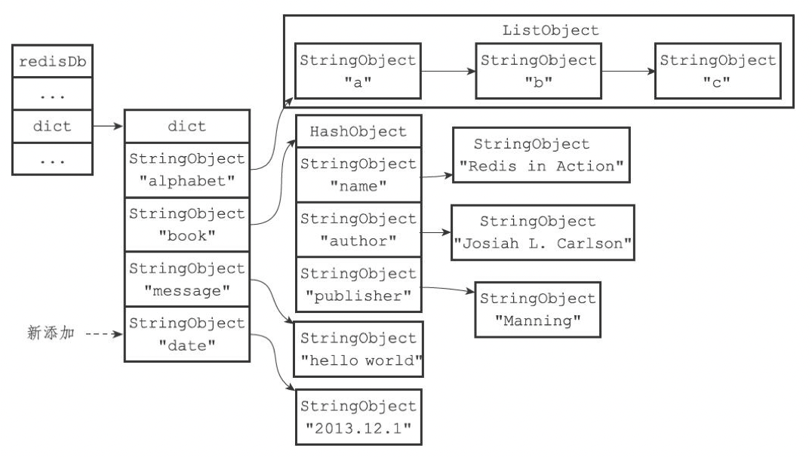

# Redis源码分析-数据库实现

[TOC]


## 定义

### redis服务器

```c
// redis服务器
struct redisServer {
    ...
    redisDb *db;                	/* 数据库数组 */
  	...
    int dbnum;                      /* 数据库个数，默认16个 */
    ...
    long long dirty;                /* 最后一次成功持久化后新增的修改数 */
    ...
    struct saveparam *saveparams;   /* 配置“save”的参数 <秒数> <修改数> */
    ...
    time_t lastsave;                /* 最后一次成功持久化的时间 */
    ...
    dict *pubsub_channels;  		/* 订阅的客户端字典：key:频道，value:客户端列表 */
    list *pubsub_patterns;  		/* 订阅关系列表 */
    ...
};
```

- `dbnum` 值由服务器配置的database选项决定

### redis客户端

```c
/** 
 * @brief redis客户端 */
typedef struct redisClient {
    ...
    redisDb *db;            /* 当前正在使用的数据库 */
  	...
} redisClient;
```

### redis数据库定义

```c
/**
 * @brief redis数据库
 */
typedef struct redisDb {
    dict *dict;                 /* 键空间，保存了数据库中所有的键值对 */
    dict *expires;              /* 键的过期字典，key：键，value：过期时间 */
    dict *blocking_keys;        /* Keys with clients waiting for data (BLPOP) */
    dict *ready_keys;           /* Blocked keys that received a PUSH */
    dict *watched_keys;         /* WATCHED keys for MULTI/EXEC CAS */
    struct evictionPoolEntry *eviction_pool;    /* Eviction pool of keys */
    int id;                     /* Database ID */
    long long avg_ttl;          /* Average TTL, just for stats */
} redisDb;
```


## 数据库切换

1. 默认情况下，Redis客户端的目标数据库为0号数据库，但客户端可以通过执行SELECT命令来切换目标数据库。
2. Redis没有可以返回客户端目标数据库的命令；最好先执行一个SELECT命令，显式地切换到指定的数据库，然后才执行别的命令。


## 数据库键空间

- 键空间的键也就是数据库的键，每个键都是一个字符串对象
- 键空间的值也就是数据库的值，每个值可以是字符串对象，列表对象，哈希表对象，集合对象和有序集合对象中的任意一种Redis对象。

例1，添加键值对：

```sh
redis>SET message "helloworld"
OK
redis>RPUSH alphabet "a""b""c"
(integer)3
redis>HSET bookname "RedisinAction"
(integer)
1redis>HSET bookauthor "JosiahL.Carlson"
(integer)
1redis>HSET bookpublisher "Manning"
(integer)1
```

数据库键空间结构如下：


例2，添加新键：

```sh
redis>SET date "2013.12.1"
OK
```

添加date键之后的键空间如下：



例3，删除键：

```sh
redis> DEL book
(integer) 1
```

删除book键之后的键空间：


例4，更新键：

```sh
redis> SET message "blah blah"
OK
```

使用SET命令更新message键之后的键空间：


例5，使用HSET更新键：

```sh
redis> HSET book page 320
(integer) 1
```

使用HSET命令更新page键之后的键空间：


例6，使用GET命令取值过程：


例7，使用LRANGE命令取值过程：


### 维护操作

当使用Redis命令对数据库进行读写时，服务器不仅会对键空间执行指定的读写操作，还会执行一些额外的维护操作，包括：

- 在读取一个键之后（读操作和写操作都要对键进行读取），服务器会根据键是否存在来更新服务器的键空间命中（hit）次数或键空间不命中（miss）次数，这两个值可以在`INFO stats`命令的`keyspace_hits`属性和`keyspace_misses`属性中查看。
- 在读取一个键之后，服务器会更新键的LRU时间，这个值可以用于计算键的闲置时间，使用OBJECT idletime命令可以查看键key的闲置时间。
- 如果服务器在读取一个键时发现该键已经过期，那么服务器会先删除这个过期键，然后才执行余下的其他操作。
- 如果有客户端使用WATCH命令监视了某个键，那么服务器对被监视的键进行修改之后，会将这个键标记为脏（dirty），从而让事务程序注意到这个键已经被修改过。
- 服务器每次修改一个键之后，都会对脏（dirty）键计数器的值+1，这个计数器会触发服务器的持久化以及复制操作。
- 如果服务器开启了数据库通知功能，那么在对键进行修改之后，服务器将按配置发送相应的数据库通知。

### 其他操作

- `FLUSHDB` 清空整个数据库（删除键空间中的所有键值对）。
- `RANDOMKEY` 随机返回数据库中某个键（随机返回键空间中的一个键）。
- `DBSIZE` 返回数据库键数量（返回键空间中包含的键值对的数量）。
- `EXISTS` TODO
- `RENAME` TODO
- `KEYS` TODO


## 设置生存时间或过期时间

- `EXPIRE <key> <ttl>`  将key的生存时间设置为ttl秒
- `PEXPIRE <key> <ttl>` 将key的生存时间设置为ttl毫秒
- `EXPIREAT <key> <timestamp>` 将key的过期时间设置为timestamp所指定的秒数时间戳
- `PEXPIREAT <key> <timestamp>` 将key的过期时间设置为timestamp所指定的毫秒数时间戳
- `TTL <key>` 返回key的剩余生存时间（单位：秒）
- `PTTL <key>` 返回key的剩余生存时间（单位：毫秒）
- `PERSIST <key>` 解除key的过期时间

### 过期时间

过期时间在源码中的位置：

```c
typedef struct redisDb {
    ...
    dict *expires;              /* 键的过期字典，key：键(指针)，value：过期时间(long long) */
    ...
} redisDb;
```

### 过期键的判定

通过以下步骤可以检查一个给定键是否过期：

1. 检查给定键是否存在于过期字典：如果存在，取得键的过期时间。
2. 检查当前UNIX时间戳是否大于键的过期时间：如果是的话，那么键已经过期；否则，键未过期。


## 过期键的删除策略

### 定时删除

（主动策略）在设置键的过期时间的同时，创建一个定时器（timer），让定时器在键的过期时间来临时，立即执行对键的删除操作。

### 惰性删除

（被动策略）放任键过期不管，但是每次从键空间中获取键时，都检查取得的键是否过期：如果过期，删除改键；如果未过期，返回该键。

### 定期删除

（主动策略）每隔一段时间，程序就对数据库进行一次检查，删除里面的过期键。

定期删除策略的难点：

1. 如果删除操作执行的太频繁，或者执行的时间太长，定期删除策略就会退化成定时删除策略，以至于将CPU时间过多的消耗在删除过期键上面。
2. 如果删除操作执行得太少，或者执行的时间太短，定期删除策略又会和惰性删除策略一样，出现浪费内存的情况。

### 删除策略对比

| 删除策略 | 优缺点           | 特性                          | 总结       |
| -------- | ---------------- | ----------------------------- | ---------- |
| 定时删除 | 节约内存         | 不分时段占用CPU资源，频度高   | 事件换空间 |
| 惰性删除 | 内存占用严重     | 延时执行，CPU利用率高         | 空间换时间 |
| 定期删除 | 内存定期随机清理 | 每秒花费固定的CPU资源维护内存 | 均衡       |


## Redis的过期删除策略

Redis服务实际使用的是惰性删除和定期删除两种策略配合；

**注意：在Redis中只有master节点有权限删除过期键；**

### Redis惰性删除策略的实现

```flow
cmd=>start: 所有读写数据库的命令；SET,LRANGE,SADD,HGET,KEYS等
ein=>operation: 调用expireIfNeeded函数
getExpire=>operation: 获得过期时间
is_exp_nil=>condition: 过期时间为<0?
is_loading=>condition: 正在从硬盘读数据？
set_now=>operation: 设置当前时间
is_master=>condition: 当前节点是master节点？
is_expire=>condition: 键是否过期？
propagateExpire=>operation: 广播过期键删除事件
notifyKeyspaceEvent=>operation: 通知键空间变更事件
dbDelete=>operation: 删除键
return0=>end: 返回0
returnexp=>end: 返回剩余的时长（ms）
return=>end: 返回

cmd->ein->getExpire->is_exp_nil
is_exp_nil(yes)->return0
is_exp_nil(no)->is_loading
is_loading(yes)->return0
is_loading(no)->set_now->is_master
is_master(no)->returnexp
is_master(yes)->is_expire
is_expire(no)->return0
is_expire(yes)->propagateExpire->notifyKeyspaceEvent->dbDelete->return
```

### Redis定期删除策略的实现

```flow
databasesCron=>start: Redis定期调用databasesCron
check=>condition: 过期机制是否启用&&当前节点是master节点
activeExpireCycle=>operation: 以“慢模式”启动activeExpireCycle
jump=>end: 跳过
isDbnTooMuch=>condition: 要扫描的数据库数量大于当前数据库个数？
resetDbn=>operation: 重新设置要扫描的数据库数量
dictGetRandomKey=>operation: 从过期字典中随机抽取key进行检查
calcTtl=>operation: 计算ttl时间
activeExpireCycleTryExpire=>operation: 调用activeExpireCycleTryExpire判断ttl并删除过期键
calcAvgTtl=>operation: 计算平均ttl时间
scanDb=>operation: 扫描数据库
is_finish=>condition: 过期键数量>ACTIVE_EXPIRE_CYCLE_LOOKUPS_PER_LOOP/4？
return=>end: 返回

databasesCron->check
check(no)->jump
check(yes)->activeExpireCycle->isDbnTooMuch
isDbnTooMuch(yes)->resetDbn->scanDb
isDbnTooMuch(no)->scanDb
scanDb->dictGetRandomKey->calcTtl->activeExpireCycleTryExpire->calcAvgTtl->is_finish
is_finish(no)->activeExpireCycle
is_finish(yes)->return
```

1. 函数`activeExpireCycle`每次运行时，都从数据库中取出`ACTIVE_EXPIRE_CYCLE_LOOKUPS_PER_LOOP`个随机键进行检查，并删除其中的过期键。
2. 局部静态变量`current_db`会记录数据库的检查进度，并在下一次函数调用时接着上一次的进行处理。


## AOF,RDB和复制功能对过期键的处理

### 生成RDB文件

1. 在创建RDB文件时，已过期的键不会被保存到新创建的的RDB文件中

### 载入RDB文件

1. 如果节点是master，在载入RDB文件时，会忽略过期键。
2. 如果节点是slave，在载入RDB文件时，文件中保存的所有键，不论是否过期，都会载入到数据库中。

### AOF文件写入

1. 在AOF模式运行时，如果某个键已经过期，但还没有被删除，AOF文件不会添加DEL命令。
2. 当过期键被删除后，会向AOF文件追加一条DEL命令。

### AOF重写

1. 在AOF重写的过程中，已过期的键不会被保存到重写后的AOF文件中。

### 复制

1. master节点在删除一个过期键之后，会显式地向所有slave发送一条DEL命令，告知slave删除这个过期键。
2. slave执行客户端的读命令时，碰到过期键不会将过期键删除，slave没有删除过期键的权限。


## 数据库通知

数据库通知分为以下2种：

- 键空间通知（key-space notification）

  通知某个键执行过的所有命令

- 键事件通知（key-event notification）

  通知执行过某个命令的所有键

订阅命令：

```sh
# 订阅键空间通知
SUBSCRIBE __keyspace@<数据库id>__:<键>
# 订阅键事件通知
SUBSCRIBE __keyevent@<数据库id>__:<命令>
```

### 源码实现

```c
/**
 * @brief 发送数据库通知
 * @param type 通知类型
 * @param event 事件名称
 * @param key 键
 * @param dbid 产生事件的数据库号码
 **/
void notifyKeyspaceEvent(int type, char *event, robj *key, int dbid) {
    sds chan;
    robj *chanobj, *eventobj;
    int len = -1;
    char buf[24];

    /* If notifications for this class of events are off, return ASAP. */
    if (!(server.notify_keyspace_events & type)) return;

    eventobj = createStringObject(event,strlen(event));

    /* __keyspace@<db>__:<key> <event> notifications. */
    if (server.notify_keyspace_events & REDIS_NOTIFY_KEYSPACE) { /* 键空间通知 */
        chan = sdsnewlen("__keyspace@",11);
        len = ll2string(buf,sizeof(buf),dbid);
        chan = sdscatlen(chan, buf, len);
        chan = sdscatlen(chan, "__:", 3);
        chan = sdscatsds(chan, key->ptr);
        chanobj = createObject(REDIS_STRING, chan);
        pubsubPublishMessage(chanobj, eventobj);
        decrRefCount(chanobj);
    }

    /* __keyevente@<db>__:<event> <key> notifications. */
    if (server.notify_keyspace_events & REDIS_NOTIFY_KEYEVENT) { /* 键事件通知 */
        chan = sdsnewlen("__keyevent@",11);
        if (len == -1) len = ll2string(buf,sizeof(buf),dbid);
        chan = sdscatlen(chan, buf, len);
        chan = sdscatlen(chan, "__:", 3);
        chan = sdscatsds(chan, eventobj->ptr);
        chanobj = createObject(REDIS_STRING, chan);
        pubsubPublishMessage(chanobj, key);
        decrRefCount(chanobj);
    }
    decrRefCount(eventobj);
}
```


## 优化技巧

- key不要过大，key过期删除时可能会造成比较严重的延迟

  

## 参考

### 文献

[1] 黄健宏.Redis设计与实现

### 外链

- [键空间通知（keyspace notification）](http://redisdoc.com/topic/notification.html)
- [redis过期数据删除策略](https://blog.csdn.net/qq_26417067/article/details/107753597)
